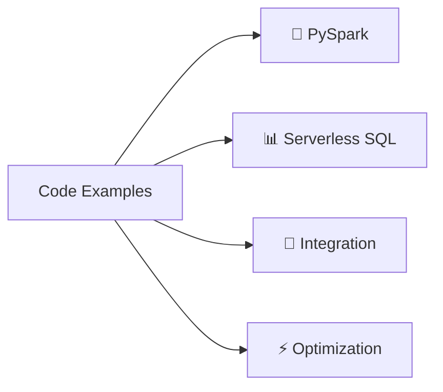
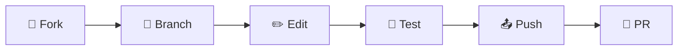
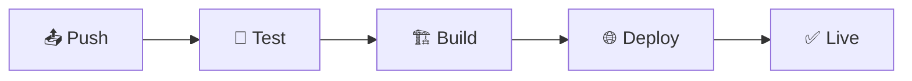

# 🚀 Azure Synapse Analytics Documentation

<div align="center">


### 📚 Comprehensive Technical Documentation for Azure Synapse Analytics
#### *Spark Delta Lakehouse • Serverless SQL • Best Practices • Code Examples*

---

[🏠 **Home**](#) • 
[🏗️ **Architecture**](./docs/architecture/README.md) • 
[💻 **Code Examples**](./docs/code-examples/README.md) • 
[📋 **Best Practices**](./docs/best-practices/README.md) • 
[🔧 **Troubleshooting**](./docs/troubleshooting/README.md)

</div>

---

## 📖 Overview

This repository contains comprehensive technical documentation for Azure Synapse Analytics, focusing primarily on Spark Delta Lakehouse and Serverless SQL capabilities. The documentation is designed for data engineers, data architects, and developers who are implementing or maintaining Azure Synapse Analytics solutions.

### ✨ Key Features

- 🏗️ **Detailed Architecture Patterns** - Complete architectural guidance
- 💡 **Best Practices** - Proven patterns and recommendations
- 📝 **Code Examples** - Ready-to-use code snippets
- 🔒 **Security Guidelines** - Comprehensive security documentation
- 📊 **Performance Optimization** - Tuning and optimization strategies
- 💰 **Cost Management** - Cost optimization techniques

---

## 🚀 Getting Started

### 👥 For Documentation Users

<div align="center">

| Role | Starting Point | Description |
|:----:|:--------------|:------------|
| 🏗️ **Architects** | [Architecture Documentation](./docs/architecture/README.md) | Understand overall architecture patterns |
| 💻 **Developers** | [Code Examples](./docs/code-examples/README.md) | Practical implementation guidance |
| ⚙️ **Operations** | [Best Practices](./docs/best-practices/README.md) | Optimization and maintenance recommendations |
| 🔒 **Security** | [Security Best Practices](./docs/best-practices/security.md) | Comprehensive security documentation |

</div>

### 🤝 For Documentation Contributors

#### 📋 Prerequisites

```yaml
Required Software:
  - Python: 3.8+
  - Git: Latest version
  - Node.js: 14+ (for markdown linting)
```

#### 📦 Installation

1. **Clone the repository:**

   ```bash
   # Clone the repository
   git clone https://github.com/fgarofalo56/csa-inabox-docs.git
   
   # Navigate to the project directory
   cd csa-inabox-docs
   ```

2. **Install required dependencies:**

   ```bash
   # Install Python dependencies
   pip install -r requirements.txt
   
   # Optional: Install markdown linter
   npm install -g markdownlint-cli
   ```

#### 🖥️ Serving Documentation Locally

To preview the documentation site locally:

```bash
python project-planning/tools/serve-docs.py
```

This will start the MkDocs development server and automatically open the site in your default browser at [http://localhost:8000](http://localhost:8000).

Alternatively, you can use MkDocs directly:

```bash
mkdocs serve
```

#### 📌 Managing Documentation Versions

This project uses `mike` for documentation versioning. The versioning tool script provides a convenient interface:

```bash
# Create a new version
python project-planning/tools/version-docs.py create <version> [--alias <alias>] [--title <title>]

# Add an alias to an existing version
python project-planning/tools/version-docs.py alias <version> <alias>

# List all versions
python project-planning/tools/version-docs.py list

# Delete a version
python project-planning/tools/version-docs.py delete <version>
```

Example:

```bash
python project-planning/tools/version-docs.py create 1.0.0 --alias latest --title "Version 1.0.0"
```

---

## 📚 Documentation Structure

<div align="center">

### 🗂️ The documentation is organized into the following key areas:

</div>

### 🏗️ [Architecture](./docs/architecture/README.md)

> **Detailed architectural guidance for implementing Azure Synapse Analytics**

| Component | Description | Link |
|:----------|:------------|:-----|
| 🏛️ **Delta Lakehouse** | Scalable Delta Lake-based data lakehouse architecture | [View Details](./docs/architecture/delta-lakehouse-overview.md) |
| ☁️ **Serverless SQL** | Architectural patterns for Serverless SQL pools | [View Details](./docs/serverless-sql/README.md) |

### 💡 [Best Practices](./docs/best-practices/README.md)

> **Guidance for optimal implementation and operation**

| Practice Area | Focus | Documentation |
|:-------------|:------|:--------------|
| ⚡ **Performance** | Query optimization, storage, resources | [📖 Guide](./docs/best-practices/performance-optimization.md) |
| 🔐 **Security** | Data protection and service security | [📖 Guide](./docs/best-practices/security.md) |
| 💰 **Cost Optimization** | Cost reduction strategies | [📖 Guide](./docs/best-practices/cost-optimization.md) |
| 📊 **Data Governance** | Governance framework | [📖 Guide](./docs/best-practices/data-governance.md) |

### 💻 [Code Examples](./docs/code-examples/README.md)

> **Practical code snippets and implementation patterns**



- 🐍 [**PySpark Examples**](./docs/code-examples/README.md#pyspark-examples) - Delta Lake operations
- 📊 [**Serverless SQL**](./docs/code-examples/README.md#serverless-sql-examples) - Query patterns
- 🔗 [**Integration Patterns**](./docs/code-examples/README.md#integration-examples) - Service integration
- ⚡ [**Performance Optimization**](./docs/code-examples/README.md#optimization-examples) - Tuning techniques

### 📖 [Reference Documentation](./docs/reference/README.md)

> **Technical reference material and specifications**

<details>
<summary><b>📚 Click to expand reference topics</b></summary>

- 🔌 [**API References**](./docs/reference/README.md#api-references)
- 📊 [**System Views & DMVs**](./docs/reference/README.md#system-views)
- 📝 [**Query Syntax Reference**](./docs/reference/README.md#query-syntax)
- ⚙️ [**Configuration Parameters**](./docs/reference/README.md#configuration-parameters)
- ⚠️ [**Limitations & Constraints**](./docs/reference/README.md#limitations)

</details>

### 🎨 [Diagrams](./docs/diagrams/README.md)

> **Visual documentation and architectural diagrams**

| Diagram Type | Description | Link |
|:------------|:------------|:-----|
| 🏗️ **Architecture** | System architecture diagrams | [View →](./docs/diagrams/README.md#architecture-diagrams) |
| 🔄 **Data Flow** | Data movement and transformation | [View →](./docs/diagrams/README.md#data-flow-diagrams) |
| ⚙️ **Process Flow** | Business process workflows | [View →](./docs/diagrams/README.md#process-flow-diagrams) |
| 🔗 **Integration** | Service integration patterns | [View →](./docs/diagrams/README.md#integration-patterns) |

---

## 🤝 Contributing

> **We welcome contributions to improve this documentation!**

<div align="center">

### 📜 Contribution Workflow



</div>

### 📋 Step-by-Step Guide

1. **🌱 Fork** the repository
2. **🎯 Create** a feature branch
   ```bash
   git checkout -b feature/your-feature-name
   ```
3. **✏️ Make** your changes
4. **🧪 Test** locally to verify your changes
5. **📤 Commit** with descriptive messages
6. **💮 Push** to your branch
7. **🔄 Create** a Pull Request

### 🎯 Setting Up Git Hooks for Quality Control

<div align="center">

**🔐 Automated Quality Assurance**

</div>

This project uses git hooks to ensure documentation quality:

```bash
# Enable git hooks
git config core.hooksPath .githooks
```

#### 🎯 Available Hooks

| Hook | Purpose | When |
|:-----|:--------|:-----|
| 📋 **Pre-commit** | Markdown linting | Before commit |
| 🧪 **Pre-push** | Link validation | Before push |

📖 Learn more: [Git Hooks Guide](./.githooks/README.md)

### 🎨 Style Guidelines

<div align="center">

| Guideline | Description | Example |
|:----------|:------------|:--------|
| 📝 **Markdown** | Follow best practices | Use markdownlint |
| 📏 **Headings** | Consistent structure | `# H1`, `## H2` |
| 🖼️ **Diagrams** | Visual documentation | Store in `/docs/diagrams` |
| 💻 **Code** | Syntax highlighting | \`\`\`python |
| 🔗 **References** | Verify claims | Include sources |

</div>

### 🧪 Markdown Linting

> **Automated formatting and quality checks**

#### 📦 Setup

```bash
# Install markdownlint CLI
npm install -g markdownlint-cli
```

#### 🎯 Running Linter

```bash
# Manual lint check
markdownlint '**/*.md' -c .markdownlint.json

# Auto-fix issues
markdownlint '**/*.md' -c .markdownlint.json --fix
```

#### ✅ Automatic Checking

Set up git hooks (see above) for automatic pre-commit validation.

#### 📏 Key Markdown Style Rules

| Rule | Do ✅ | Don't ❌ |
|:-----|:--------|:---------|
| **Bold** | `__text__` | `**text**` |
| **Code** | \`\`\`python | \`\`\` |
| **Lists** | Blank lines around | No spacing |
| **Headings** | One H1 per file | Multiple H1s |
| **HTML** | Add comments | Raw HTML |

#### 🤖 CI/CD Integration

<div align="center">

**🔄 Automated Quality Checks**

[]()
[]()

</div>

GitHub Actions automatically validates:
- 📋 Markdown formatting
- 🔗 Link integrity
- 📊 Code examples

#### 📁 Related Documentation

<div align="center">

| Document | Purpose | Link |
|:---------|:--------|:-----|
| 📅 **Planning** | Project roadmap | [View](./project-planning/PLANNING.md) |
| ✅ **Tasks** | Current work items | [View](./project-planning/TASK.md) |
| 📜 **Changelog** | Version history | [View](./project-planning/CHANGELOG.md) |
| 🤖 **AI Context** | Development context | [View](./.ai-context) |

</div>

---

## 🚀 Continuous Integration and Deployment

<div align="center">

### 🤖 Automated CI/CD Pipeline



</div>

### 🛠️ Features

| Feature | Description | Status |
|:--------|:------------|:-------|
| 📝 **Auto Deploy** | Push to main triggers deployment | ✅ Active |
| 📌 **Versioning** | Managed via `mike` tool | ✅ Active |
| 🌐 **GitHub Pages** | Automatic hosting | ✅ Active |

### 📁 Workflow Files

- 🚀 `.github/workflows/deploy-docs.yml` - Main deployment pipeline

---

## 🗂️ Project Organization

```text
Azure Synapse Analytics Documentation
├── docs/
│   ├── architecture/
│   │   ├── delta-lakehouse-overview.md
│   │   └── index.md
│   ├── best-practices/
│   │   ├── index.md
│   │   ├── performance-optimization.md
│   │   ├── security.md
│   │   ├── cost-optimization.md
│   │   └── data-governance.md
│   ├── code-examples/
│   │   └── index.md
│   ├── diagrams/
│   │   ├── delta-lakehouse-architecture.png
│   │   ├── index.md
│   │   ├── serverless-sql-architecture.png
│   │   └── shared-metadata-architecture.png
│   ├── reference/
│   │   ├── index.md
│   │   └── security.md
│   ├── serverless-sql/
│   │   └── index.md
│   └── shared-metadata/
│       └── index.md
├── assets/
│   ├── stylesheets/
│   │   └── extra.css
│   └── javascripts/
│       └── extra.js
├── overrides/
│   └── main.html
├── .github/
│   └── workflows/
│       └── deploy-docs.yml
├── .ai-context
├── .mike.yml
├── LICENSE
├── README.md
├── mkdocs.yml
├── requirements.txt
└── project-planning/
    ├── CHANGELOG.md
    ├── PLANNING.md
    ├── TASK.md
    └── tools/
        ├── serve-docs.py
        └── version-docs.py
```

---

## 🔗 Additional Resources

<div align="center">

### 🌐 External Documentation & Resources

| Resource | Description | Link |
|:---------|:------------|:-----|
| 📘 **Official Docs** | Microsoft Azure Synapse | [🔗 Visit](https://learn.microsoft.com/en-us/azure/synapse-analytics/) |
| 🏛️ **Delta Lake** | Delta Lake documentation | [🔗 Visit](https://docs.delta.io/latest/index.html) |
| 💰 **Pricing** | Cost calculator | [🔗 Visit](https://azure.microsoft.com/en-us/pricing/details/synapse-analytics/) |
| 📝 **Blog** | Latest updates & tips | [🔗 Visit](https://techcommunity.microsoft.com/t5/azure-synapse-analytics-blog/bg-p/AzureSynapseAnalyticsBlog) |

</div>

---

## 📅 Changelog

> **Track updates and improvements**

📖 View detailed version history: [**CHANGELOG**](./project-planning/CHANGELOG.md)

---

## 📜 License

<div align="center">

[](LICENSE)

**This documentation is licensed under the MIT License**

[View License](LICENSE) | [Terms](LICENSE#terms) | [Conditions](LICENSE#conditions)

</div>

---

<div align="center">

### 🌟 Star this repository if you find it helpful!

[](https://github.com/fgarofalo56/csa-inabox-docs)
[](https://github.com/fgarofalo56/csa-inabox-docs)
[](https://github.com/fgarofalo56/csa-inabox-docs)

---

**Made with ❤️ by the Azure Synapse Analytics Documentation Team**

</div>
