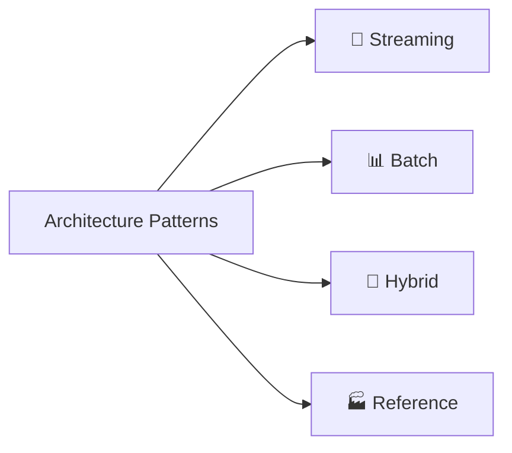
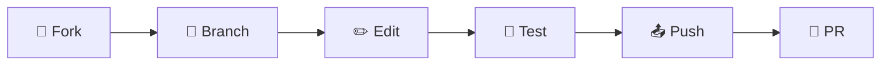
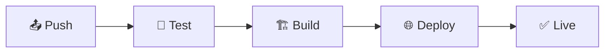

# 🌐 Cloud Scale Analytics Documentation

<div align="center">


### 📚 Comprehensive Documentation for Azure Cloud Scale Analytics
#### *Multi-Service Analytics • Architecture Patterns • Real-time Processing • Best Practices*

---

[🏠 **Home**](#) • 
[📖 **Overview**](./docs/01-overview/README.md) • 
[🛠️ **Services**](./docs/02-services/README.md) • 
[🏗️ **Architecture Patterns**](./docs/03-architecture-patterns/README.md) • 
[💡 **Best Practices**](./docs/05-best-practices/README.md)

</div>

---

## 📖 Overview

This repository contains comprehensive technical documentation for the complete Azure Cloud Scale Analytics ecosystem. Covering streaming services, analytics compute, storage solutions, and orchestration services, this documentation is designed for data engineers, data architects, solution architects, and developers implementing modern data platforms on Azure.

### ✨ Key Features

- 🌐 **Complete Analytics Ecosystem** - All Azure analytics services covered
- 🔄 **Streaming & Batch Processing** - Real-time and batch data patterns
- 🏗️ **Architecture Patterns** - Proven patterns (Lambda, Medallion, Data Mesh)
- 🛠️ **Service-Specific Guides** - Deep dive into each Azure service
- 💡 **Implementation Guidance** - Step-by-step tutorials and best practices
- 📊 **Performance Optimization** - Tuning strategies across services
- 🔒 **Enterprise Security** - Comprehensive security guidance
- 💰 **Cost Optimization** - Cost management across the platform

---

## 🚀 Getting Started

### 👥 For Documentation Users

<div align="center">

| Role | Starting Point | Description |
|:----:|:--------------|:------------|
| 🏗️ **Solution Architects** | [Architecture Patterns](./docs/03-architecture-patterns/README.md) | Complete architectural patterns and reference implementations |
| 🛠️ **Platform Engineers** | [Services Documentation](./docs/02-services/README.md) | Deep dive into each Azure analytics service |
| 💻 **Data Engineers** | [Implementation Guides](./docs/04-implementation-guides/README.md) | Step-by-step implementation tutorials |
| 📊 **Data Scientists** | [Analytics Compute Services](./docs/02-services/analytics-compute/README.md) | Synapse, Databricks, and HDInsight guidance |
| ⚙️ **Operations Teams** | [Best Practices](./docs/05-best-practices/README.md) | Operational excellence and optimization |
| 🔒 **Security Teams** | [Security Guide](./docs/10-security/README.md) | Comprehensive security and compliance |

</div>

### 🤝 For Documentation Contributors

#### 📋 Prerequisites

```yaml
Required Software:
  - Python: 3.8+
  - Git: Latest version
  - Node.js: 14+ (for markdown linting)
```

#### 📦 Installation

1. **Clone the repository:**

   ```bash
   # Clone the repository
   git clone https://github.com/fgarofalo56/csa-inabox-docs.git
   
   # Navigate to the project directory
   cd csa-inabox-docs
   ```

2. **Install required dependencies:**

   ```bash
   # Install Python dependencies
   pip install -r requirements.txt
   
   # Optional: Install markdown linter
   npm install -g markdownlint-cli
   ```

#### 🖥️ Serving Documentation Locally

To preview the documentation site locally:

```bash
python project_tracking/tools/serve-docs.py
```

This will start the MkDocs development server and automatically open the site in your default browser at [http://localhost:8000](http://localhost:8000).

Alternatively, you can use MkDocs directly:

```bash
mkdocs serve
```

#### 📌 Managing Documentation Versions

This project uses `mike` for documentation versioning. The versioning tool script provides a convenient interface:

```bash
# Create a new version
python project_tracking/tools/version-docs.py create <version> [--alias <alias>] [--title <title>]

# Add an alias to an existing version
python project_tracking/tools/version-docs.py alias <version> <alias>

# List all versions
python project_tracking/tools/version-docs.py list

# Delete a version
python project_tracking/tools/version-docs.py delete <version>
```

Example:

```bash
python project_tracking/tools/version-docs.py create 1.0.0 --alias latest --title "Version 1.0.0"
```

---

## 📚 Documentation Structure

<div align="center">

### 🗂️ The documentation is organized into comprehensive sections covering the entire Azure analytics ecosystem:

</div>

### 📖 [01 - Overview](./docs/01-overview/README.md)

> **Platform overview and service catalog**

| Component | Description | Link |
|:----------|:------------|:-----|
| 🌐 **Platform Overview** | Complete Azure analytics ecosystem introduction | [View Details](./docs/01-overview/README.md) |
| 📋 **Service Catalog** | Comprehensive catalog of all analytics services | [View Details](./docs/01-overview/service-catalog.md) |
| 🎯 **Service Selection** | Decision trees for choosing the right services | [View Details](./docs/01-overview/choosing-services.md) |

### 🛠️ [02 - Services](./docs/02-services/README.md)

> **Detailed documentation for each Azure analytics service**

| Service Category | Description | Link |
|:----------------|:------------|:-----|
| 💾 **Analytics Compute** | Synapse, Databricks, HDInsight | [View Details](./docs/02-services/analytics-compute/README.md) |
| 🔄 **Streaming Services** | Stream Analytics, Event Hubs, Event Grid | [View Details](./docs/02-services/streaming-services/README.md) |
| 🗃️ **Storage Services** | Data Lake Gen2, Cosmos DB, Azure SQL | [View Details](./docs/02-services/storage-services/README.md) |
| 🔧 **Orchestration** | Data Factory, Logic Apps | [View Details](./docs/02-services/orchestration-services/README.md) |

### 🏗️ [03 - Architecture Patterns](./docs/03-architecture-patterns/README.md)

> **Proven architectural patterns and reference implementations**


```mermaid
graph LR
    A[Architecture Patterns] --> B[🔄 Streaming]
    A --> C[📊 Batch]
    A --> D[🔄 Hybrid]
    A --> E[🏭 Reference]
```

| Pattern Category | Focus | Examples |
|:----------------|:------|:---------|
| 🔄 **Streaming Architectures** | Lambda, Kappa, Event Sourcing | [View Details](./docs/03-architecture-patterns/streaming-architectures/README.md) |
| 📊 **Batch Architectures** | Medallion, Data Mesh, Hub-Spoke | [View Details](./docs/03-architecture-patterns/batch-architectures/README.md) |
| 🔄 **Hybrid Architectures** | Lambda-Kappa, HTAP, Polyglot | [View Details](./docs/03-architecture-patterns/hybrid-architectures/README.md) |
| 🏭 **Reference Architectures** | Industry-specific solutions | [View Details](./docs/03-architecture-patterns/reference-architectures/README.md) |

### 🛠️ [04 - Implementation Guides](./docs/04-implementation-guides/README.md)

> **Step-by-step implementation guidance**

| Guide Type | Focus | Documentation |
|:-----------|:------|:--------------|
| 🎯 **End-to-End Solutions** | Complete solution implementations | [View Details](./docs/04-implementation-guides/end-to-end-solutions/README.md) |
| 🔗 **Integration Scenarios** | Service integration patterns | [View Details](./docs/04-implementation-guides/integration-scenarios/README.md) |
| 🔄 **Migration Guides** | Legacy to cloud migrations | [View Details](./docs/04-implementation-guides/migration-guides/README.md) |

### 💡 [05 - Best Practices](./docs/05-best-practices/README.md)

> **Operational excellence across all services**

| Practice Area | Focus | Coverage |
|:-------------|:------|:---------|
| 🛠️ **Service-Specific** | Per-service optimization | All major services |
| 🔒 **Cross-Cutting Concerns** | Security, Performance, Cost | Platform-wide |
| 🎯 **Operational Excellence** | Monitoring, DR, High Availability | Enterprise-ready |

---

## 🤝 Contributing

> **We welcome contributions to improve this documentation!**

<div align="center">

### 📜 Contribution Workflow


```mermaid
graph LR
    A[🌱 Fork] --> B[🎯 Branch]
    B --> C[✏️ Edit]
    C --> D[🧪 Test]
    D --> E[📤 Push]
    E --> F[🔄 PR]
```

</div>

### 📋 Step-by-Step Guide

1. **🌱 Fork** the repository
2. **🎯 Create** a feature branch
   ```bash
   git checkout -b feature/your-feature-name
   ```
3. **✏️ Make** your changes
4. **🧪 Test** locally to verify your changes
5. **📤 Commit** with descriptive messages
6. **💮 Push** to your branch
7. **🔄 Create** a Pull Request

### 🎯 Setting Up Git Hooks for Quality Control

<div align="center">

**🔐 Automated Quality Assurance**

</div>

This project uses git hooks to ensure documentation quality:

```bash
# Enable git hooks
git config core.hooksPath .githooks
```

#### 🎯 Available Hooks

| Hook | Purpose | When |
|:-----|:--------|:-----|
| 📋 **Pre-commit** | Markdown linting | Before commit |
| 🧪 **Pre-push** | Link validation | Before push |

📖 Learn more: [Git Hooks Guide](./.githooks/README.md)

### 🎨 Style Guidelines

<div align="center">

| Guideline | Description | Example |
|:----------|:------------|:--------|
| 📝 **Markdown** | Follow best practices | Use markdownlint |
| 📏 **Headings** | Consistent structure | `# H1`, `## H2` |
| 🖼️ **Diagrams** | Visual documentation | Store in `/docs/diagrams` |
| 💻 **Code** | Syntax highlighting | \`\`\`python |
| 🔗 **References** | Verify claims | Include sources |

</div>

### 🧪 Markdown Linting

> **Automated formatting and quality checks**

#### 📦 Setup

```bash
# Install markdownlint CLI
npm install -g markdownlint-cli
```

#### 🎯 Running Linter

```bash
# Manual lint check
markdownlint '**/*.md' -c .markdownlint.json

# Auto-fix issues
markdownlint '**/*.md' -c .markdownlint.json --fix
```

#### ✅ Automatic Checking

Set up git hooks (see above) for automatic pre-commit validation.

#### 📏 Key Markdown Style Rules

| Rule | Do ✅ | Don't ❌ |
|:-----|:--------|:---------|
| **Bold** | `__text__` | `**text**` |
| **Code** | \`\`\`python | \`\`\` |
| **Lists** | Blank lines around | No spacing |
| **Headings** | One H1 per file | Multiple H1s |
| **HTML** | Add comments | Raw HTML |

#### 🤖 CI/CD Integration

<div align="center">

**🔄 Automated Quality Checks**

[]()
[]()

</div>

GitHub Actions automatically validates:
- 📋 Markdown formatting
- 🔗 Link integrity
- 📊 Code examples

#### 📁 Related Documentation

<div align="center">

| Document | Purpose | Link |
|:---------|:--------|:-----|
| 📅 **Planning** | Project roadmap | [View](./project_tracking/planning/PLANNING.md) |
| ✅ **Tasks** | Current work items | [View](./project_tracking/planning/TASK.md) |
| 📜 **Changelog** | Version history | [View](./project_tracking/planning/CHANGELOG.md) |
| 🤖 **AI Context** | Development context | [View](./.ai-context) |

</div>

---

## 🚀 Continuous Integration and Deployment

<div align="center">

### 🤖 Automated CI/CD Pipeline


```mermaid
graph LR
    A[📤 Push] --> B[🧪 Test]
    B --> C[🏗️ Build]
    C --> D[🌐 Deploy]
    D --> E[✅ Live]
```

</div>

### 🛠️ Features

| Feature | Description | Status |
|:--------|:------------|:-------|
| 📝 **Auto Deploy** | Push to main triggers deployment | ✅ Active |
| 📌 **Versioning** | Managed via `mike` tool | ✅ Active |
| 🌐 **GitHub Pages** | Automatic hosting | ✅ Active |

### 📁 Workflow Files

- 🚀 `.github/workflows/deploy-docs.yml` - Main deployment pipeline

---

## 🗂️ Project Organization

```text
Azure Synapse Analytics Documentation
├── docs/
│   ├── architecture/
│   │   ├── delta-lakehouse-overview.md
│   │   └── index.md
│   ├── best-practices/
│   │   ├── index.md
│   │   ├── performance-optimization.md
│   │   ├── security.md
│   │   ├── cost-optimization.md
│   │   └── data-governance.md
│   ├── code-examples/
│   │   └── index.md
│   ├── diagrams/
│   │   ├── delta-lakehouse-architecture.png
│   │   ├── index.md
│   │   ├── serverless-sql-architecture.png
│   │   └── shared-metadata-architecture.png
│   ├── reference/
│   │   ├── index.md
│   │   └── security.md
│   ├── serverless-sql/
│   │   └── index.md
│   └── shared-metadata/
│       └── index.md
├── assets/
│   ├── stylesheets/
│   │   └── extra.css
│   └── javascripts/
│       └── extra.js
├── overrides/
│   └── main.html
├── .github/
│   └── workflows/
│       └── deploy-docs.yml
├── .ai-context
├── .mike.yml
├── LICENSE
├── README.md
├── mkdocs.yml
├── requirements.txt
└── project_tracking/
    ├── planning/
    │   ├── CHANGELOG.md
    │   ├── PLANNING.md
    │   └── TASK.md
    └── tools/
        ├── serve-docs.py
        └── version-docs.py
```

---

## 🔗 Additional Resources

<div align="center">

### 🌐 External Documentation & Resources

| Resource | Description | Link |
|:---------|:------------|:-----|
| 📘 **Official Docs** | Microsoft Azure Synapse | [🔗 Visit](https://learn.microsoft.com/en-us/azure/synapse-analytics/) |
| 🏛️ **Delta Lake** | Delta Lake documentation | [🔗 Visit](https://docs.delta.io/latest/index.html) |
| 💰 **Pricing** | Cost calculator | [🔗 Visit](https://azure.microsoft.com/en-us/pricing/details/synapse-analytics/) |
| 📝 **Blog** | Latest updates & tips | [🔗 Visit](https://techcommunity.microsoft.com/t5/azure-synapse-analytics-blog/bg-p/AzureSynapseAnalyticsBlog) |

</div>

---

## 📅 Changelog

> **Track updates and improvements**

📖 View detailed version history: [**CHANGELOG**](./project_tracking/planning/CHANGELOG.md)

---

## 📜 License

<div align="center">

[](LICENSE)

**This documentation is licensed under the MIT License**

[View License](LICENSE) | [Terms](LICENSE#terms) | [Conditions](LICENSE#conditions)

</div>

---

<div align="center">

### 🌟 Star this repository if you find it helpful!

[](https://github.com/fgarofalo56/csa-inabox-docs)
[](https://github.com/fgarofalo56/csa-inabox-docs)
[](https://github.com/fgarofalo56/csa-inabox-docs)

---

**Made with ❤️ by the Azure Synapse Analytics Documentation Team**

</div>
