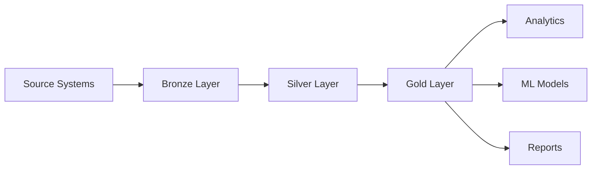

# Data Governance Best Practices

> **[Home](../../README.md)** | **[Best Practices](../index.md)** | **Data Governance**


Best practices for data governance in Cloud Scale Analytics.

---

## Overview

Effective data governance ensures:

- Data quality and consistency
- Regulatory compliance
- Data security and privacy
- Clear data ownership and accountability

For detailed guidance, see: **[Full Data Governance Guide](../../docs/05-best-practices/data-governance/README.md)**

---

## Key Practices

### 1. Data Classification

```python
# Azure Purview classification scan
from azure.purview.scanning import PurviewScanningClient

client = PurviewScanningClient(
    endpoint="https://purview.purview.azure.com",
    credential=credential
)

# Configure classification rules
scan_ruleset = {
    "name": "pii-scan",
    "kind": "AdlsGen2",
    "properties": {
        "scanRulesetName": "pii-ruleset",
        "collection": {"referenceName": "data-collection"}
    }
}
```

### 2. Data Lineage



### 3. Access Control

| Role | Bronze | Silver | Gold |
|------|--------|--------|------|
| Data Engineer | Read/Write | Read/Write | Read |
| Data Analyst | - | Read | Read |
| Data Scientist | - | Read | Read/Write |
| Business User | - | - | Read |

### 4. Data Quality Rules

```sql
-- Data quality checks
CREATE TABLE data_quality_rules (
    rule_id INT,
    table_name VARCHAR(100),
    column_name VARCHAR(100),
    rule_type VARCHAR(50),
    rule_expression VARCHAR(500),
    threshold DECIMAL(5,2)
);

-- Example rules
INSERT INTO data_quality_rules VALUES
(1, 'customers', 'email', 'NOT_NULL', 'email IS NOT NULL', 99.9),
(2, 'customers', 'email', 'FORMAT', 'email LIKE ''%@%.%''', 99.0),
(3, 'orders', 'amount', 'RANGE', 'amount BETWEEN 0 AND 1000000', 99.9);
```

---

## Governance Framework

### Data Stewardship

- Assign data stewards per domain
- Define data ownership policies
- Establish data quality SLAs
- Create data dictionaries

### Compliance

- GDPR data subject rights
- Data retention policies
- Audit logging requirements
- Cross-border data transfer rules

---

## Related Documentation

- [Azure Purview Integration](../../docs/04-implementation-guides/integration-scenarios/purview-synapse.md)
- [Data Lineage](../../docs/solutions/data-governance/lineage.md)

---

*Last Updated: January 2025*
