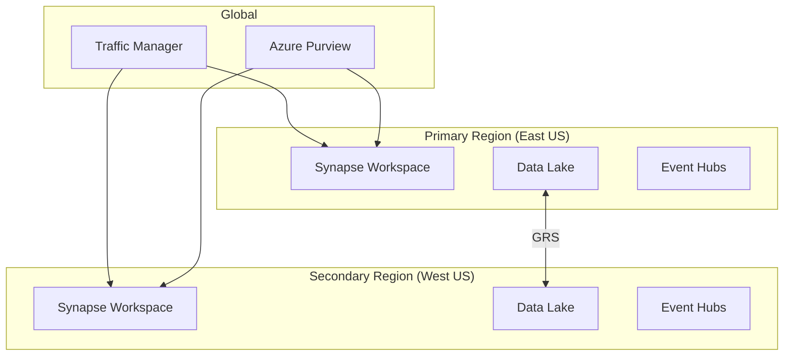

# Global Distribution Best Practices

> **[Home](../README.md)** | **[Best Practices](index.md)** | **Global Distribution**


Best practices for globally distributed analytics deployments.

---

## Multi-Region Architecture



---

## Key Considerations

### Data Residency

| Region | Regulations | Storage |
|--------|-------------|---------|
| EU | GDPR | EU-only storage |
| US | HIPAA, SOC2 | US regions |
| APAC | Local laws | Regional storage |

### Replication Strategies

```bash
# Configure GRS for Data Lake
az storage account create \
    --name datalakeprimary \
    --resource-group rg-analytics \
    --location eastus \
    --sku Standard_RAGRS \
    --kind StorageV2 \
    --hierarchical-namespace true

# Enable failover
az storage account failover \
    --name datalakeprimary \
    --resource-group rg-analytics \
    --failover-type planned
```

### Disaster Recovery

| Component | RPO | RTO | Strategy |
|-----------|-----|-----|----------|
| Data Lake | 15 min | 1 hour | GRS replication |
| Synapse Workspace | 24 hours | 4 hours | ARM template redeploy |
| Dedicated SQL Pool | 8 hours | 2 hours | Geo-backup restore |
| Spark Pools | N/A | 30 min | Recreate from templates |

---

## Implementation

### Cross-Region Query

```sql
-- Query across regions using linked servers
SELECT
    p.Region,
    p.ProductCategory,
    SUM(p.Revenue) AS TotalRevenue
FROM PrimaryRegion.Sales p
UNION ALL
SELECT
    s.Region,
    s.ProductCategory,
    SUM(s.Revenue)
FROM SecondaryRegion.Sales s
GROUP BY Region, ProductCategory;
```

### Global Data Catalog

```python
# Register multi-region assets in Purview
from azure.purview.catalog import PurviewCatalogClient

def register_global_asset(asset_name, regions):
    """Register asset across multiple regions."""

    for region in regions:
        entity = {
            "typeName": "azure_datalake_gen2_path",
            "attributes": {
                "name": asset_name,
                "qualifiedName": f"adls://{region}-storage/{asset_name}",
                "region": region
            }
        }
        client.entity.create_or_update({"entity": entity})
```

---

## Related Documentation

- [Network Architecture](network-security/README.md)
- [Disaster Recovery](../docs/04-implementation-guides/disaster-recovery/README.md)

---

*Last Updated: January 2025*
