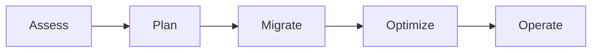

# Migration Strategies

> **[Home](../README.md)** | **[Best Practices](index.md)** | **Migration Strategies**


Best practices for migrating to Cloud Scale Analytics.

---

## Migration Approaches

| Approach | Use Case | Risk | Duration |
|----------|----------|------|----------|
| Lift & Shift | Quick migration, minimal changes | Low | Short |
| Re-platform | Optimize for cloud services | Medium | Medium |
| Re-architect | Full modernization | High | Long |

---

## Migration Phases



### Phase 1: Assessment

```python
# Database assessment script
def assess_database(connection_string):
    """Assess database for migration readiness."""

    assessment = {
        "size_gb": get_database_size(connection_string),
        "table_count": get_table_count(connection_string),
        "complexity_score": analyze_stored_procedures(connection_string),
        "compatibility_issues": check_compatibility(connection_string)
    }

    # Recommend target
    if assessment["size_gb"] < 100 and assessment["complexity_score"] < 50:
        assessment["recommendation"] = "Serverless SQL"
    elif assessment["size_gb"] < 1000:
        assessment["recommendation"] = "Dedicated SQL Pool (DW1000c)"
    else:
        assessment["recommendation"] = "Dedicated SQL Pool (DW3000c+)"

    return assessment
```

### Phase 2: Planning

**Migration Checklist:**

- [ ] Inventory all data sources
- [ ] Map source to target schemas
- [ ] Identify dependencies
- [ ] Plan downtime windows
- [ ] Create rollback procedures
- [ ] Define success criteria

### Phase 3: Migration

```bash
# Data Factory migration pipeline
az datafactory pipeline create \
    --factory-name adf-migration \
    --resource-group rg-analytics \
    --name migrate-sales-data \
    --definition '{
        "activities": [
            {
                "name": "CopyFromOnPrem",
                "type": "Copy",
                "inputs": [{"referenceName": "OnPremSQL", "type": "DatasetReference"}],
                "outputs": [{"referenceName": "DataLake", "type": "DatasetReference"}],
                "typeProperties": {
                    "source": {"type": "SqlSource"},
                    "sink": {"type": "ParquetSink"},
                    "enableStaging": true
                }
            }
        ]
    }'
```

### Phase 4: Validation

```sql
-- Data validation query
WITH SourceCounts AS (
    SELECT
        'Source' AS System,
        COUNT(*) AS RowCount,
        SUM(Amount) AS TotalAmount
    FROM SourceDatabase.dbo.Sales
),
TargetCounts AS (
    SELECT
        'Target' AS System,
        COUNT(*) AS RowCount,
        SUM(Amount) AS TotalAmount
    FROM OPENROWSET(
        BULK 'https://datalake.dfs.core.windows.net/sales/*.parquet',
        FORMAT = 'PARQUET'
    ) AS sales
)
SELECT * FROM SourceCounts
UNION ALL
SELECT * FROM TargetCounts;
```

---

## Common Migration Patterns

### On-Premises SQL Server to Synapse

1. Export to Parquet using ADF
2. Load to Data Lake bronze layer
3. Transform to silver/gold layers
4. Create views in Serverless SQL
5. Migrate heavy queries to Dedicated SQL

### Hadoop to Databricks

1. Migrate HDFS data to ADLS Gen2
2. Convert Hive metastore to Unity Catalog
3. Refactor Spark jobs for Databricks
4. Implement Delta Lake format

---

## Related Documentation

- [Data Factory Tutorials](../docs/tutorials/data-factory/README.md)
- [Synapse Setup](../docs/tutorials/synapse/01-environment-setup.md)

---

*Last Updated: January 2025*
