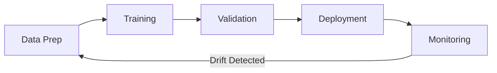

# ML Operations Best Practices

> **[Home](../../README.md)** | **[Best Practices](../index.md)** | **ML Operations**


Best practices for MLOps in Cloud Scale Analytics.

---

## MLOps Lifecycle



---

## Key Practices

### 1. Feature Store

```python
from databricks.feature_engineering import FeatureEngineeringClient

fe = FeatureEngineeringClient()

# Create feature table
fe.create_table(
    name="ml.features.customer_features",
    primary_keys=["customer_id"],
    df=customer_features_df,
    description="Customer features for churn prediction"
)

# Use features in training
training_set = fe.create_training_set(
    df=labels_df,
    feature_lookups=[
        FeatureLookup(
            table_name="ml.features.customer_features",
            lookup_key="customer_id"
        )
    ],
    label="churned"
)
```

### 2. Experiment Tracking

```python
import mlflow

mlflow.set_experiment("/Experiments/churn-prediction")

with mlflow.start_run():
    # Log parameters
    mlflow.log_params({
        "n_estimators": 100,
        "max_depth": 6,
        "learning_rate": 0.1
    })

    # Train model
    model = train_model(params)

    # Log metrics
    mlflow.log_metrics({
        "accuracy": 0.92,
        "f1": 0.89,
        "auc": 0.95
    })

    # Log model
    mlflow.sklearn.log_model(model, "model")
```

### 3. Model Registry

```python
from mlflow.tracking import MlflowClient

client = MlflowClient()

# Register model
mlflow.register_model(
    "runs:/abc123/model",
    "churn_prediction_model"
)

# Transition to production
client.transition_model_version_stage(
    name="churn_prediction_model",
    version=1,
    stage="Production"
)
```

### 4. Model Monitoring

```python
# Monitor for drift
from databricks.sdk import WorkspaceClient

w = WorkspaceClient()

monitor = w.quality_monitors.create(
    table_name="ml.inference.predictions",
    assets_dir="/ml/monitoring",
    output_schema_name="ml.monitoring",
    inference_log={
        "granularities": ["1 day"],
        "prediction_col": "prediction",
        "label_col": "actual"
    }
)
```

---

## CI/CD Pipeline

```yaml
stages:
  - stage: Test
    jobs:
      - job: UnitTests
        steps:
          - script: pytest tests/

  - stage: Train
    jobs:
      - job: TrainModel
        steps:
          - script: databricks jobs run-now --job-id $(JOB_ID)

  - stage: Deploy
    condition: succeeded()
    jobs:
      - deployment: DeployModel
        environment: production
        steps:
          - script: python deploy.py
```

---

## Related Documentation

- [ML Pipeline Solution](../../docs/solutions/ml-pipeline/README.md)
- [Feature Store Setup](../../docs/04-implementation-guides/databricks/feature-store-setup.md)

---

*Last Updated: January 2025*
