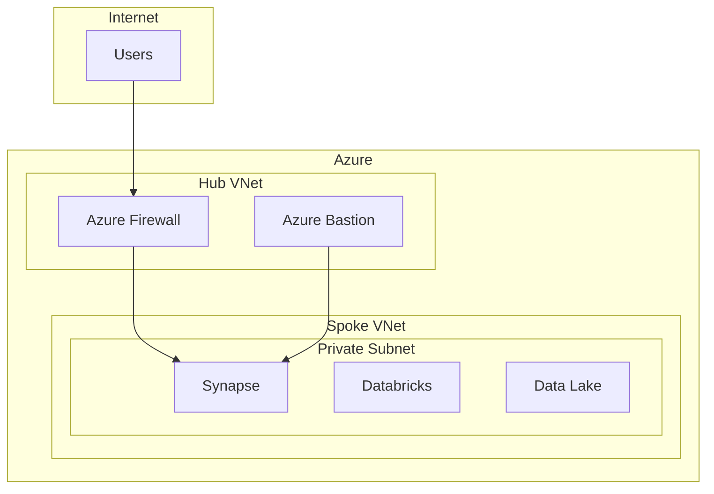

# Network Security Best Practices

> **[Home](../../README.md)** | **[Best Practices](../index.md)** | **Network Security**


Best practices for network security in Cloud Scale Analytics.

---

## Network Architecture



---

## Key Practices

### 1. Private Endpoints

```bash
# Create private endpoint for Data Lake
az network private-endpoint create \
    --name pe-datalake \
    --resource-group rg-networking \
    --vnet-name vnet-analytics \
    --subnet subnet-private \
    --private-connection-resource-id /subscriptions/.../storageAccounts/datalake \
    --group-id dfs \
    --connection-name datalake-connection
```

### 2. Network Security Groups

```bash
# Create NSG with analytics rules
az network nsg create \
    --name nsg-analytics \
    --resource-group rg-networking

# Allow Databricks control plane
az network nsg rule create \
    --nsg-name nsg-analytics \
    --name allow-databricks \
    --priority 100 \
    --direction Inbound \
    --source-address-prefixes AzureDatabricks \
    --destination-port-ranges 443 \
    --access Allow
```

### 3. Service Endpoints

```bash
# Enable service endpoints
az network vnet subnet update \
    --name subnet-analytics \
    --vnet-name vnet-analytics \
    --resource-group rg-networking \
    --service-endpoints Microsoft.Storage Microsoft.Sql Microsoft.KeyVault
```

### 4. DNS Configuration

```bash
# Create private DNS zone
az network private-dns zone create \
    --name privatelink.dfs.core.windows.net \
    --resource-group rg-networking

# Link to VNet
az network private-dns link vnet create \
    --name dfs-dns-link \
    --zone-name privatelink.dfs.core.windows.net \
    --resource-group rg-networking \
    --virtual-network vnet-analytics \
    --registration-enabled false
```

---

## Security Checklist

- [ ] All services use private endpoints
- [ ] Public access disabled
- [ ] NSG rules follow least privilege
- [ ] DNS properly configured
- [ ] Firewall rules reviewed
- [ ] VNet peering secured
- [ ] DDoS protection enabled

---

## Related Documentation

- [Security Best Practices](security/README.md)
- [Private Link Architecture](../../docs/architecture/private-link-architecture/README.md)

---

*Last Updated: January 2025*
