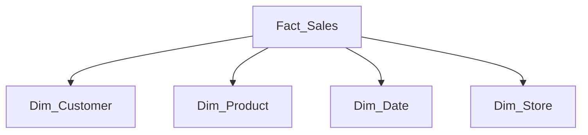

# Power BI Optimization Best Practices

> **[Home](../README.md)** | **[Best Practices](index.md)** | **Power BI Optimization**


Best practices for optimizing Power BI performance.

---

## Storage Mode Selection

| Mode | Use Case | Latency | Data Size |
|------|----------|---------|-----------|
| Import | Standard reporting | Low | < 1GB |
| DirectQuery | Real-time needs | Medium | Any |
| Composite | Mixed requirements | Variable | Any |
| Aggregations | Large datasets | Low | > 10GB |

---

## Query Optimization

### Enable Query Folding

```m
// Good: Query folding enabled
let
    Source = Sql.Database("server", "database"),
    Filtered = Table.SelectRows(Source, each [Date] >= #date(2024,1,1)),
    Selected = Table.SelectColumns(Filtered, {"ID", "Amount", "Date"})
in
    Selected

// Bad: Query folding broken
let
    Source = Sql.Database("server", "database"),
    AddedColumn = Table.AddColumn(Source, "Custom", each Text.Upper([Name]))
in
    AddedColumn
```

### Optimize DAX

```dax
// Efficient: Use variables
DEFINE
    VAR TotalSales = SUM(Sales[Amount])
    VAR TotalCost = SUM(Sales[Cost])
EVALUATE
    ROW("Profit", TotalSales - TotalCost, "Margin", DIVIDE(TotalSales - TotalCost, TotalSales))

// Avoid: Row-by-row iteration
// Bad: SUMX(Sales, Sales[Quantity] * Sales[Price])
// Good: SUM(Sales[Amount]) -- pre-calculated column
```

---

## Data Model Best Practices

### Star Schema Design



### Reduce Model Size

- Remove unused columns
- Use appropriate data types
- Avoid high-cardinality columns in filters
- Pre-aggregate where possible

---

## Aggregations

```sql
-- Create aggregation table
CREATE VIEW vw_SalesAggregated AS
SELECT
    DateKey,
    ProductCategoryKey,
    RegionKey,
    SUM(Amount) AS TotalAmount,
    COUNT(*) AS TransactionCount
FROM Sales
GROUP BY DateKey, ProductCategoryKey, RegionKey;
```

**Configure in Power BI:**
1. Import aggregation table
2. Set storage mode to Import
3. Configure aggregation mappings
4. Hide aggregation table

---

## Related Documentation

- [Power BI Troubleshooting](../troubleshooting/power-bi-troubleshooting.md)
- [Serverless SQL for Power BI](../docs/02-services/analytics-compute/azure-synapse/serverless-sql/README.md)

---

*Last Updated: January 2025*
