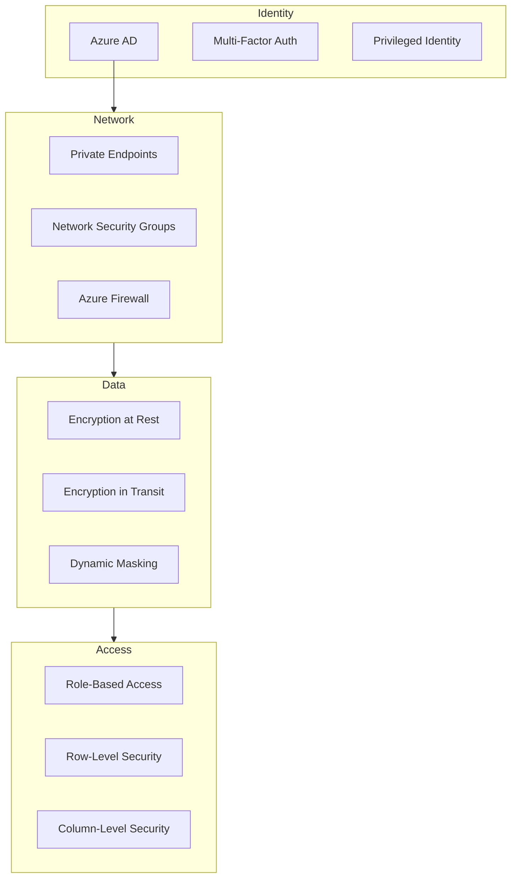

# Security Best Practices

> **[Home](../../README.md)** | **[Best Practices](../index.md)** | **Security**


Comprehensive security best practices for Cloud Scale Analytics.

---

## Security Layers



---

## Key Practices

### 1. Identity Management

```bash
# Use Managed Identity
az synapse workspace update \
    --name synapse-ws \
    --resource-group rg-analytics \
    --identity-type SystemAssigned

# Assign permissions
az role assignment create \
    --assignee-object-id $(az synapse workspace show --name synapse-ws --query identity.principalId -o tsv) \
    --role "Storage Blob Data Contributor" \
    --scope /subscriptions/.../storageAccounts/datalake
```

### 2. Data Encryption

```sql
-- Enable Transparent Data Encryption
ALTER DATABASE analytics SET ENCRYPTION ON;

-- Enable Column Encryption
CREATE COLUMN ENCRYPTION KEY CEK1
WITH VALUES (
    COLUMN_MASTER_KEY = CMK1,
    ALGORITHM = 'RSA_OAEP',
    ENCRYPTED_VALUE = 0x...
);

ALTER TABLE Customers
ALTER COLUMN SSN VARCHAR(11)
ENCRYPTED WITH (
    COLUMN_ENCRYPTION_KEY = CEK1,
    ENCRYPTION_TYPE = Deterministic,
    ALGORITHM = 'AEAD_AES_256_CBC_HMAC_SHA_256'
);
```

### 3. Row-Level Security

```sql
-- Create security predicate function
CREATE FUNCTION dbo.fn_SecurityPredicate(@Region VARCHAR(50))
RETURNS TABLE
WITH SCHEMABINDING
AS
RETURN SELECT 1 AS result
WHERE @Region = USER_NAME()
   OR USER_NAME() = 'admin';

-- Apply security policy
CREATE SECURITY POLICY RegionFilter
ADD FILTER PREDICATE dbo.fn_SecurityPredicate(Region)
ON dbo.Sales
WITH (STATE = ON);
```

### 4. Dynamic Data Masking

```sql
-- Apply masking to sensitive columns
ALTER TABLE Customers
ALTER COLUMN Email ADD MASKED WITH (FUNCTION = 'email()');

ALTER TABLE Customers
ALTER COLUMN Phone ADD MASKED WITH (FUNCTION = 'partial(0,"XXX-XXX-",4)');

ALTER TABLE Customers
ALTER COLUMN CreditCard ADD MASKED WITH (FUNCTION = 'partial(0,"XXXX-XXXX-XXXX-",4)');
```

---

## Security Checklist

### Infrastructure
- [ ] Private endpoints enabled
- [ ] Public access disabled
- [ ] NSG rules configured
- [ ] Azure Firewall deployed
- [ ] DDoS protection enabled

### Identity
- [ ] MFA enforced
- [ ] Conditional Access configured
- [ ] PIM for admin accounts
- [ ] Service principals use certificates

### Data
- [ ] Encryption at rest enabled
- [ ] TLS 1.2+ enforced
- [ ] Key Vault for secrets
- [ ] Backup encryption enabled

### Access
- [ ] RBAC implemented
- [ ] Least privilege principle
- [ ] Regular access reviews
- [ ] Audit logging enabled

---

## Related Documentation

- [Network Security](../network-security/README.md)
- [Security Monitoring](../../docs/solutions/azure-realtime-analytics/operations/security-monitoring.md)

---

*Last Updated: January 2025*
