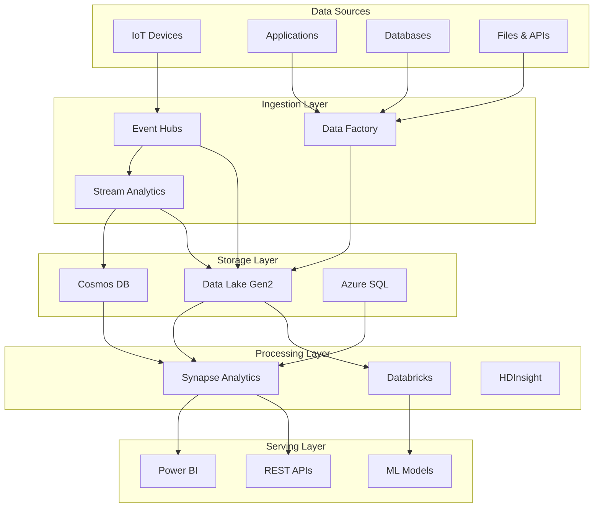

# 🌐 Cloud Scale Analytics Platform Overview

> __🏠 [Home](../README.md)__ | __📖 Cloud Scale Analytics Overview__

Comprehensive documentation for Azure Cloud Scale Analytics services, architectures, and implementation patterns.

---

## 🎯 What is Cloud Scale Analytics?

Cloud Scale Analytics (CSA) represents the complete Azure analytics ecosystem, providing a unified approach to:

- __Real-time data processing__ and streaming analytics
- __Batch data processing__ and data warehousing
- __Hybrid architectures__ combining batch and stream processing
- __Advanced analytics__ with machine learning integration
- __Data governance__ and compliance across all services

## 🏗️ Platform Architecture

## 📋 Service Categories

### 🔄 Streaming Services

Real-time data processing and event-driven architectures

| Service | Purpose | Best For |
|---------|---------|----------|
| __Azure Stream Analytics__ | Real-time stream processing | IoT analytics, real-time dashboards |
| __Event Hubs__ | Event streaming platform | High-throughput event ingestion |
| __Event Grid__ | Event routing service | Event-driven architectures |

### 💾 Analytics Compute Services  

Large-scale data processing and analytics

| Service | Purpose | Best For |
|---------|---------|----------|
| __Azure Synapse Analytics__ | Enterprise data warehousing | Unified analytics, big data |
| __Azure Databricks__ | Collaborative analytics platform | Data science, ML workflows |
| __HDInsight__ | Managed Hadoop/Spark clusters | Big data processing, legacy migration |

### 🗃️ Storage Services

Scalable data storage solutions

| Service | Purpose | Best For |
|---------|---------|----------|
| __Data Lake Storage Gen2__ | Hierarchical data lake | Big data analytics, data archiving |
| __Cosmos DB__ | Globally distributed NoSQL | Multi-model data, low-latency apps |
| __Azure SQL Database__ | Managed relational database | Transactional workloads, reporting |

### 🔧 Orchestration Services

Data movement and workflow automation

| Service | Purpose | Best For |
|---------|---------|----------|
| __Azure Data Factory__ | Data integration service | ETL/ELT pipelines, data movement |
| __Logic Apps__ | Workflow automation | Event-driven workflows, integrations |

## 🎯 Navigation Guide

### 🚀 Getting Started

- [__Service Catalog__](service-catalog.md) - Complete service overview with capabilities
- [__Architecture Patterns__](../03-architecture-patterns/README.md) - High-level design patterns
- [__Service Catalog__](service-catalog.md) - Decision trees for service selection
- [__Quick Start Guides__](../tutorials/README.md) - Service-specific getting started

### 📚 Deep Dive Sections

#### 🎯 [Services Documentation](../02-services/README.md)

Detailed documentation for each Azure analytics service

- Analytics Compute (Synapse, Databricks, HDInsight)
- Streaming Services (Stream Analytics, Event Hubs)
- Storage Services (Data Lake, Cosmos DB, SQL)
- Orchestration Services (Data Factory, Logic Apps)

#### 🏗️ [Architecture Patterns](../03-architecture-patterns/README.md)

Proven architectural patterns and reference implementations

- Streaming Architectures (Lambda, Kappa, Event Sourcing)
- Batch Architectures (Medallion, Data Mesh, Hub-Spoke)
- Hybrid Architectures (Lambda-Kappa, HTAP, Edge-Cloud)
- Reference Architectures (Industry-specific solutions)

#### 🛠️ [Implementation Guides](../tutorials/README.md)

Step-by-step implementation guidance

- End-to-end Solutions
- Integration Scenarios
- Migration Guides

#### 💡 [Best Practices](../05-best-practices/README.md)

Proven practices across all services

- Service-specific best practices
- Cross-cutting concerns (Security, Performance, Cost)
- Operational Excellence

## 🎨 Visual Elements

### 🔵 Architecture Complexity Levels

 __Basic__

- Single service implementations
- Straightforward architectures
- Clear documentation and examples

 __Intermediate__

- Multi-service integrations
- Complex data flows
- Advanced configuration required

 __Advanced__

- Enterprise-scale implementations
- Custom solutions and extensions
- Deep Azure expertise required

### 📊 Implementation Status

| Documentation Section | Status | Completeness |
|----------------------|--------|--------------|
| Services |  | 95% |
| Architecture Patterns |  | 90% |
| Implementation Guides |  | 75% |
| Best Practices |  | 85% |
| Code Examples |  | 70% |

## 🔄 Common Use Cases

### 📈 Real-time Analytics

Process and analyze streaming data for immediate insights

- IoT device telemetry processing
- Real-time fraud detection
- Live dashboard updates
- Anomaly detection and alerting

### 🏢 Enterprise Data Warehousing

Modern data warehousing with cloud-scale performance

- Dimensional modeling and star schemas
- Historical data analysis
- Business intelligence and reporting
- Self-service analytics

### 🔬 Advanced Analytics & ML

Data science and machine learning workflows

- Feature engineering and preparation
- Model training and deployment
- MLOps and model lifecycle management
- Predictive analytics

### 🌐 Data Integration & Migration

Move and transform data across systems

- Legacy system modernization
- Multi-cloud data integration
- Real-time data synchronization
- Batch data processing pipelines

## 🎯 Quick Links

### 🏃‍♂️ __Quick Start__

- [Azure Synapse Tutorials](../tutorials/synapse/README.md)
- [Stream Analytics Tutorials](../tutorials/stream-analytics/README.md)
- [Data Factory Tutorials](../tutorials/data-factory/README.md)
- [All Tutorials](../tutorials/README.md)

### 📖 __Popular Guides__

- [Architecture Patterns](../03-architecture-patterns/README.md)
- [Security Best Practices](../security/best-practices.md)
- [Cost Optimization](../05-best-practices/cost-optimization.md)
- [Performance Optimization](../05-best-practices/performance.md)

### 🛠️ __Implementation Examples__

- [Real-time Analytics Solution](../08-solutions/azure-realtime-analytics/README.md)
- [Code Examples](../06-code-examples/README.md)
- [Integration Examples](../06-code-examples/integration/README.md)
- [Delta Lake Examples](../06-code-examples/delta-lake/README.md)

## 📞 Getting Help

- __📚 Browse Documentation__: Use the navigation above to find specific topics
- __🔍 Search__: Use the search functionality to find relevant content quickly
- __💬 Community__: Join discussions and ask questions in our community forums
- __🐛 Issues__: Report documentation issues or suggest improvements

---

> __💡 Pro Tip__: Start with the [Service Catalog](service-catalog.md) to understand the full scope of Azure analytics services, then dive into specific [Architecture Patterns](../03-architecture-patterns/README.md) that match your use case.

*Last Updated: 2025-01-28*
*Version: 2.0*
