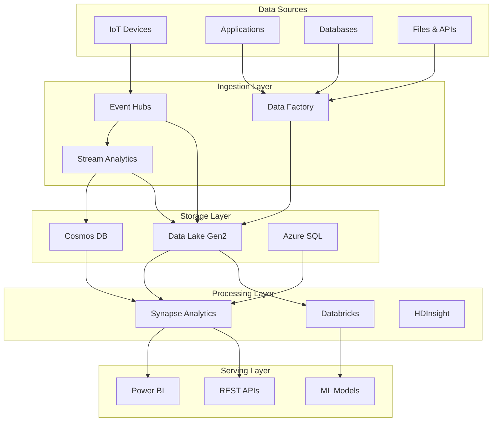

# 🌐 Cloud Scale Analytics Platform Overview

> **🏠 [Home](../../README.md)** | **📖 Cloud Scale Analytics Overview**

Comprehensive documentation for Azure Cloud Scale Analytics services, architectures, and implementation patterns.

---

## 🎯 What is Cloud Scale Analytics?

Cloud Scale Analytics (CSA) represents the complete Azure analytics ecosystem, providing a unified approach to:

- **Real-time data processing** and streaming analytics
- **Batch data processing** and data warehousing
- **Hybrid architectures** combining batch and stream processing
- **Advanced analytics** with machine learning integration
- **Data governance** and compliance across all services

## 🏗️ Platform Architecture

## 📋 Service Categories

### 🔄 Streaming Services
Real-time data processing and event-driven architectures

| Service | Purpose | Best For |
|---------|---------|----------|
| **Azure Stream Analytics** | Real-time stream processing | IoT analytics, real-time dashboards |
| **Event Hubs** | Event streaming platform | High-throughput event ingestion |
| **Event Grid** | Event routing service | Event-driven architectures |

### 💾 Analytics Compute Services  
Large-scale data processing and analytics

| Service | Purpose | Best For |
|---------|---------|----------|
| **Azure Synapse Analytics** | Enterprise data warehousing | Unified analytics, big data |
| **Azure Databricks** | Collaborative analytics platform | Data science, ML workflows |
| **HDInsight** | Managed Hadoop/Spark clusters | Big data processing, legacy migration |

### 🗃️ Storage Services
Scalable data storage solutions

| Service | Purpose | Best For |
|---------|---------|----------|
| **Data Lake Storage Gen2** | Hierarchical data lake | Big data analytics, data archiving |
| **Cosmos DB** | Globally distributed NoSQL | Multi-model data, low-latency apps |
| **Azure SQL Database** | Managed relational database | Transactional workloads, reporting |

### 🔧 Orchestration Services
Data movement and workflow automation

| Service | Purpose | Best For |
|---------|---------|----------|
| **Azure Data Factory** | Data integration service | ETL/ELT pipelines, data movement |
| **Logic Apps** | Workflow automation | Event-driven workflows, integrations |

## 🎯 Navigation Guide

### 🚀 Getting Started
- [**Service Catalog**](service-catalog.md) - Complete service overview with capabilities
- [**Architecture Patterns**](architecture-patterns.md) - High-level design patterns
- [**Choosing Services**](choosing-services.md) - Decision trees for service selection
- [**Quick Start Guides**](quick-start-guides/) - Service-specific getting started

### 📚 Deep Dive Sections

#### 🎯 [Services Documentation](../02-services/README.md)
Detailed documentation for each Azure analytics service
- Analytics Compute (Synapse, Databricks, HDInsight)
- Streaming Services (Stream Analytics, Event Hubs)
- Storage Services (Data Lake, Cosmos DB, SQL)
- Orchestration Services (Data Factory, Logic Apps)

#### 🏗️ [Architecture Patterns](../03-architecture-patterns/README.md)
Proven architectural patterns and reference implementations
- Streaming Architectures (Lambda, Kappa, Event Sourcing)
- Batch Architectures (Medallion, Data Mesh, Hub-Spoke)
- Hybrid Architectures (Lambda-Kappa, HTAP, Edge-Cloud)
- Reference Architectures (Industry-specific solutions)

#### 🛠️ [Implementation Guides](../04-implementation-guides/README.md)
Step-by-step implementation guidance
- End-to-end Solutions
- Integration Scenarios
- Migration Guides

#### 💡 [Best Practices](../05-best-practices/README.md)
Proven practices across all services
- Service-specific best practices
- Cross-cutting concerns (Security, Performance, Cost)
- Operational Excellence

## 🎨 Visual Elements

### 🔵 Architecture Complexity Levels

 **Basic**
- Single service implementations
- Straightforward architectures
- Clear documentation and examples

 **Intermediate** 
- Multi-service integrations
- Complex data flows
- Advanced configuration required

 **Advanced**
- Enterprise-scale implementations
- Custom solutions and extensions
- Deep Azure expertise required

### 📊 Implementation Status

| Documentation Section | Status | Completeness |
|----------------------|--------|--------------|
| Services |  | 95% |
| Architecture Patterns |  | 90% |
| Implementation Guides |  | 75% |
| Best Practices |  | 85% |
| Code Examples |  | 70% |

## 🔄 Common Use Cases

### 📈 Real-time Analytics
Process and analyze streaming data for immediate insights
- IoT device telemetry processing
- Real-time fraud detection
- Live dashboard updates
- Anomaly detection and alerting

### 🏢 Enterprise Data Warehousing
Modern data warehousing with cloud-scale performance
- Dimensional modeling and star schemas
- Historical data analysis
- Business intelligence and reporting
- Self-service analytics

### 🔬 Advanced Analytics & ML
Data science and machine learning workflows
- Feature engineering and preparation
- Model training and deployment
- MLOps and model lifecycle management
- Predictive analytics

### 🌐 Data Integration & Migration
Move and transform data across systems
- Legacy system modernization
- Multi-cloud data integration
- Real-time data synchronization
- Batch data processing pipelines

## 🎯 Quick Links

### 🏃‍♂️ **Quick Start**
- [Azure Synapse Quickstart](quick-start-guides/synapse-quickstart.md)
- [Stream Analytics Quickstart](quick-start-guides/stream-analytics-quickstart.md)
- [Databricks Quickstart](quick-start-guides/databricks-quickstart.md)
- [Data Factory Quickstart](quick-start-guides/data-factory-quickstart.md)

### 📖 **Popular Guides**
- [Medallion Architecture Implementation](../03-architecture-patterns/batch-architectures/medallion-architecture.md)
- [Real-time Dashboard Architecture](../03-architecture-patterns/streaming-architectures/lambda-architecture.md)
- [Data Lake Security Best Practices](../05-best-practices/cross-cutting-concerns/security/README.md)
- [Cost Optimization Strategies](../05-best-practices/cross-cutting-concerns/cost-optimization/README.md)

### 🛠️ **Implementation Examples**
- [Customer 360 Solution](../04-implementation-guides/end-to-end-solutions/customer-360/README.md)
- [Real-time Fraud Detection](../04-implementation-guides/end-to-end-solutions/fraud-detection/README.md)
- [IoT Analytics Pipeline](../04-implementation-guides/end-to-end-solutions/iot-analytics/README.md)
- [Modern Data Warehouse](../03-architecture-patterns/reference-architectures/enterprise-data-warehouse.md)

## 📞 Getting Help

- **📚 Browse Documentation**: Use the navigation above to find specific topics
- **🔍 Search**: Use the search functionality to find relevant content quickly
- **💬 Community**: Join discussions and ask questions in our community forums
- **🐛 Issues**: Report documentation issues or suggest improvements

---

> **💡 Pro Tip**: Start with the [Service Catalog](service-catalog.md) to understand the full scope of Azure analytics services, then dive into specific [Architecture Patterns](../03-architecture-patterns/README.md) that match your use case.

*Last Updated: 2025-01-28*
*Version: 2.0*