# 🏗️ Architecture Patterns Overview

> __🏠 [Home](../README.md)__ | __📖 [Overview](README.md)__ | __🏗️ Architecture Patterns__

High-level architectural patterns and decision framework for Cloud Scale Analytics implementations.

---

## 🎯 Purpose

This guide helps you understand and select the right architectural patterns for your Cloud Scale Analytics solution. Whether you're building real-time analytics, enterprise data warehousing, or hybrid solutions, choosing the right pattern is critical for success.

## 📊 Pattern Decision Flowchart

```mermaid
flowchart TD
    Start([🎯 Start: Choose Architecture Pattern])

    Start --> Q1{What is your<br/>primary data<br/>processing need?}

    Q1 -->|Real-time/Streaming| Q2{Do you need<br/>historical data<br/>processing too?}
    Q1 -->|Batch Analytics| Q3{What is your<br/>organizational<br/>structure?}
    Q1 -->|Mixed/Hybrid| Q4{What is your<br/>complexity<br/>tolerance?}

    Q2 -->|Yes, both layers| Lambda[⚡ Lambda Architecture]
    Q2 -->|No, stream only| Kappa[🌊 Kappa Architecture]

    Q3 -->|Centralized IT| HubSpoke[🌟 Hub & Spoke Model]
    Q3 -->|Decentralized domains| DataMesh[🕸️ Data Mesh]
    Q3 -->|Data quality focus| Medallion[🏛️ Medallion Architecture]

    Q4 -->|Can handle complexity| LambdaKappa[⚡🌊 Lambda-Kappa Hybrid]
    Q4 -->|Need simplicity| Q5{Primary workload?}

    Q5 -->|Analytics| Medallion
    Q5 -->|Transactions + Analytics| HTAP[🔄 HTAP Patterns]

    Lambda --> Review[📋 Review Pattern Details]
    Kappa --> Review
    HubSpoke --> Review
    DataMesh --> Review
    Medallion --> Review
    LambdaKappa --> Review
    HTAP --> Review

    Review --> Implement[🚀 Start Implementation]

    style Start fill:#e1f5fe
    style Lambda fill:#fff9c4
    style Kappa fill:#f3e5f5
    style HubSpoke fill:#e8f5e9
    style DataMesh fill:#fce4ec
    style Medallion fill:#fff3e0
    style LambdaKappa fill:#e0f2f1
    style HTAP fill:#f3e5f5
    style Review fill:#e8eaf6
    style Implement fill:#c8e6c9
```

## 🏗️ Pattern Categories

### 🔄 Streaming Architecture Patterns

Real-time data processing patterns for event-driven and streaming workloads.

| Pattern | Use Case | Complexity | Latency | Best For |
|---------|----------|------------|---------|----------|
| __Lambda Architecture__ | Real-time + historical analytics |  | Low (speed layer) + High (batch layer) | IoT analytics, real-time dashboards |
| __Kappa Architecture__ | Pure streaming workloads |  | Low | Event-driven systems, continuous processing |
| __Event Sourcing__ | Audit trails, temporal analysis |  | Low | Financial systems, compliance |
| __CQRS Pattern__ | High-performance read/write separation |  | Low | Scalable applications, complex business logic |

### 📊 Batch Architecture Patterns

Batch processing patterns for large-scale data transformation and analytics.

| Pattern | Use Case | Complexity | Data Quality | Best For |
|---------|----------|------------|--------------|----------|
| __Medallion Architecture__ | Data lake with quality layers |  | Progressive refinement | Data lakes, data quality focus |
| __Hub & Spoke Model__ | Centralized enterprise DW |  | High | Traditional enterprises, centralized governance |
| __Data Mesh__ | Domain-oriented decentralization |  | Domain-specific | Large enterprises, multiple business units |
| __Data Lakehouse__ | Unified batch and analytics |  | High | Modern data platforms, unified analytics |

### 🔀 Hybrid Architecture Patterns

Patterns combining multiple approaches for complex requirements.

| Pattern | Use Case | Complexity | Flexibility | Best For |
|---------|----------|------------|-------------|----------|
| __Lambda-Kappa Hybrid__ | Flexible batch and stream |  | Very High | Mixed workloads, phased modernization |
| __Polyglot Persistence__ | Multiple specialized databases |  | Very High | Microservices, diverse data types |
| __HTAP Patterns__ | Unified transactions and analytics |  | High | Real-time BI, operational analytics |
| __Edge-Cloud Hybrid__ | Distributed edge and cloud processing |  | High | IoT, distributed systems |

---

## 🎯 Pattern Selection Matrix

### By Data Characteristics

### By Business Requirements

| Requirement | Primary Pattern | Secondary Pattern | Key Services |
|-------------|----------------|-------------------|--------------|
| __Regulatory Compliance__ | Event Sourcing | Data Mesh | Event Hubs, Cosmos DB, Synapse |
| __Cost Optimization__ | Medallion Architecture | Serverless patterns | Synapse Serverless, Data Lake Gen2 |
| __Time to Market__ | Hub & Spoke | Medallion | Synapse Dedicated SQL, Data Factory |
| __Innovation/Flexibility__ | Data Mesh | Lambda-Kappa Hybrid | Multiple Synapse engines, Purview |
| __Operational Simplicity__ | Medallion Architecture | Kappa | Synapse Spark, Delta Lake |

---

## 📋 Detailed Pattern Comparison

### Streaming Patterns Deep Dive

#### Lambda Architecture

__Architecture Layers__:

__Key Characteristics__:

- __Dual Processing__: Separate batch and stream processing layers
- __Eventual Consistency__: Speed layer provides low-latency results, batch layer ensures accuracy
- __Complexity__: Higher operational complexity with two processing paths
- __Accuracy__: Batch layer corrects speed layer approximations

__When to Use__:

- Need both real-time insights and historical accuracy
- Can tolerate eventual consistency
- Have resources to maintain two processing pipelines
- Require comprehensive data analysis

#### Kappa Architecture

__Architecture Flow__:

__Key Characteristics__:

- __Single Pipeline__: Everything processed as streams
- __Reprocessing__: Can replay events for recalculation
- __Simplicity__: One processing paradigm to maintain
- __Consistency__: Uniform processing model

__When to Use__:

- Pure streaming use cases
- Need to reprocess historical data
- Want operational simplicity
- All data can be modeled as events

### Batch Patterns Deep Dive

#### Medallion Architecture

__Layer Structure__:

__Layer Responsibilities__:

| Layer | Purpose | Data Quality | Schema | Use Cases |
|-------|---------|--------------|--------|-----------|
| __Bronze__ | Raw data landing zone | As-is from source | Source schema | Data lineage, audit, reprocessing |
| __Silver__ | Cleaned and conformed data | Validated, deduplicated | Standardized schema | Data engineering, integration |
| __Gold__ | Business-ready aggregates | High quality, enriched | Business schema | BI, reporting, analytics |

__When to Use__:

- Building a data lake from scratch
- Need clear data quality progression
- Require data lineage and audit trails
- Multiple data sources with varying quality

---

## 🎯 Implementation Guidance

### Pattern Selection Decision Tree

### Starting Point Recommendations

#### For Beginners

__Recommended Pattern__: Medallion Architecture with Azure Synapse

__Rationale__:

- Clear, logical data progression (Bronze → Silver → Gold)
- Familiar SQL-based processing
- Strong data quality focus
- Excellent learning foundation
- Scalable as needs grow

__Key Services__:

- Azure Synapse Spark Pools
- Data Lake Storage Gen2
- Delta Lake format
- Azure Data Factory

#### For Intermediate Teams

__Recommended Pattern__: Lambda Architecture or Hub & Spoke

__Rationale__:

- Proven enterprise patterns
- Good balance of complexity and capability
- Extensive documentation and community support
- Production-ready at scale

__Key Services__:

- Azure Synapse (multiple engines)
- Stream Analytics
- Event Hubs
- Cosmos DB

#### For Advanced Organizations

__Recommended Pattern__: Data Mesh or Custom Hybrid

__Rationale__:

- Domain-driven architecture
- Maximum flexibility
- Innovation-focused
- Complex governance and coordination

__Key Services__:

- Multiple Synapse workspaces
- Azure Purview
- Data Factory
- Custom integration layers

---

## 🚀 Getting Started

### Implementation Roadmap

#### Phase 1: Foundation (Months 1-3)

1. __Pattern Selection__
   - Assess current state and requirements
   - Choose primary architectural pattern
   - Document decision rationale

2. __Infrastructure Setup__
   - Provision Azure resources
   - Configure security and networking
   - Set up development environments

3. __Pilot Implementation__
   - Build one end-to-end pipeline
   - Validate pattern choice
   - Document lessons learned

4. __Establish Governance__
   - Define data quality standards
   - Set up monitoring and alerting
   - Create operational runbooks

#### Phase 2: Expansion (Months 4-6)

1. __Scale Out__
   - Add additional data sources
   - Expand to more use cases
   - Optimize performance

2. __Advanced Features__
   - Implement streaming (if needed)
   - Add machine learning capabilities
   - Enable advanced analytics

3. __Production Hardening__
   - Implement disaster recovery
   - Add comprehensive monitoring
   - Establish SLAs

#### Phase 3: Optimization (Months 7-12)

1. __Performance Tuning__
   - Optimize based on usage patterns
   - Right-size resources
   - Implement caching strategies

2. __Advanced Governance__
   - Data lineage tracking
   - Advanced security controls
   - Compliance automation

3. __Innovation__
   - Explore emerging patterns
   - Implement advanced use cases
   - Continuous improvement

---

## 📚 Related Resources

### Pattern Documentation

- [Detailed Architecture Patterns](../03-architecture-patterns/README.md) - Complete pattern catalog
- [Service Selection Guide](choosing-services.md) - Choose the right Azure services
- [Reference Architectures](../03-architecture-patterns/reference-architectures/) - Industry-specific implementations

### Implementation Guides

- [Lambda Architecture Implementation](../08-solutions/azure-realtime-analytics/README.md)
- [Best Practices](../05-best-practices/README.md)
- [Synapse Tutorials](../tutorials/synapse/README.md)

### Diagrams and Visuals

- [Architecture Diagrams](../diagrams/architecture-diagrams.md)
- [Process Flowcharts](../diagrams/process-flowcharts.md)
- [Reference Visuals](../diagrams/README.md)

---

## 💡 Key Takeaways

> __Pattern Selection is Critical__: The right architectural pattern sets the foundation for success. Take time to understand your requirements before choosing.

> __Start Simple, Scale Smart__: Begin with simpler patterns like Medallion Architecture and evolve to more complex patterns as needs grow.

> __No One-Size-Fits-All__: Different workloads may require different patterns. Hybrid approaches are valid and often necessary.

> __Iterate and Improve__: Architectural patterns evolve with your organization. Regular reviews and adjustments are essential.

---

*Last Updated: 2025-01-28*
*Pattern Count: 20+*
*Coverage: Complete*
