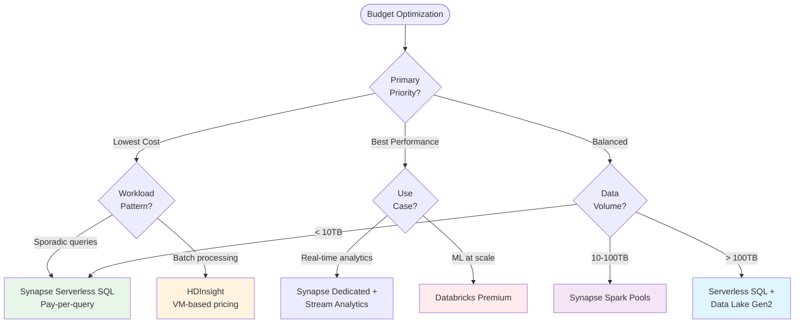

# 🎯 Service Selection Guide

> __🏠 [Home](../README.md)__ | __📖 [Overview](README.md)__ | __🎯 Choosing Services__


Comprehensive decision trees and guidance for selecting the right Azure services for your Cloud Scale Analytics solution.

---

## 🎯 Purpose

Choosing the right Azure services is critical for building successful analytics solutions. This guide provides decision trees, comparison matrices, and practical guidance to help you select the optimal services for your specific requirements.

## 🌳 Master Service Selection Decision Tree


---

## 🔄 Analytics Compute Service Selection

### Decision Matrix: Which Compute Engine?


### Detailed Comparison

| Feature | Synapse Dedicated SQL | Synapse Serverless SQL | Synapse Spark | Databricks | HDInsight |
|---------|----------------------|----------------------|--------------|-----------|-----------|
| __Primary Language__ | T-SQL | T-SQL | Python, Scala, Spark SQL | Python, Scala, R, SQL | Multiple |
| __Pricing Model__ | Reserved capacity | Pay-per-query | Pay-per-use | Compute + DBU | VM-based |
| __Best For__ | DW workloads | Ad-hoc queries | Data engineering | ML workflows | Migration |
| __Auto-scaling__ | Manual | Automatic | Automatic | Automatic | Manual |
| __Startup Time__ | Always on | Instant | 2-5 minutes | 5-10 minutes | 10-20 minutes |
| __ML Integration__ | Limited | None | Built-in | Advanced (MLflow) | Custom |
| __Cost (Small)__ |  |  |  |  |  |
| __Cost (Large)__ |  |  |  |  |  |

### Use Case to Service Mapping

#### Enterprise Data Warehousing

__Primary Service__: Synapse Dedicated SQL Pools

__Configuration Guidance__:

- __Small (<1TB)__: DW100c - DW500c
- __Medium (1-10TB)__: DW500c - DW1000c
- __Large (>10TB)__: DW1000c+ with partitioning

__Alternative__: Synapse Serverless SQL for cost-sensitive scenarios

#### Big Data Processing

__Primary Service__: Synapse Spark Pools or Azure Databricks

__Decision Criteria__:


#### Machine Learning Workloads

__Primary Service__: Azure Databricks

__When to Use__:

- Advanced ML workflows
- MLOps requirements
- Multi-language data science teams
- Collaborative notebook environment

__Alternative__: Synapse Spark Pools when:

- ML is secondary to analytics
- Need unified workspace
- Simpler ML requirements

---

## 🗄️ Storage Service Selection

### Storage Decision Tree

```mermaid
flowchart TD
    Start([Choose Storage Service])

    Start --> DataType{Data<br/>Structure?}

    DataType -->|Structured/Relational| Relational{Transactional<br/>or Analytical?}
    DataType -->|Semi-structured| SemiStructured{Access<br/>Pattern?}
    DataType -->|Unstructured/Files| Files{Analytics<br/>Workload?}

    Relational -->|Transactional (OLTP)| AzureSQL[Azure SQL Database]
    Relational -->|Analytical (OLAP)| SynapseDedicated[Synapse Dedicated SQL]

    SemiStructured -->|Key-value, document| Global{Global<br/>Distribution?}
    SemiStructured -->|Time-series| TimeSeriesDB[Data Explorer]

    Global -->|Yes| CosmosDB[Cosmos DB]
    Global -->|No| JsonChoice{Query<br/>Complexity?}

    JsonChoice -->|Simple| BlobStorage[Blob Storage]
    JsonChoice -->|Complex| CosmosDB

    Files -->|Yes, big data| ADLS[Data Lake Gen2]
    Files -->|No, general storage| BlobStorage

    style AzureSQL fill:#e8eaf6
    style SynapseDedicated fill:#fff3e0
    style CosmosDB fill:#f3e5f5
    style ADLS fill:#e8f5e9
    style BlobStorage fill:#e0f2f1
    style TimeSeriesDB fill:#fce4ec
```

### Storage Service Comparison

| Service | Data Model | Scale | Latency | ACID | Best Use Case |
|---------|-----------|-------|---------|------|---------------|
| __Data Lake Gen2__ | Hierarchical files | Unlimited | High | No (Delta Lake adds) | Big data analytics, data lakes |
| __Cosmos DB__ | Multi-model | Very high | Very low | Yes | Global apps, real-time |
| __Azure SQL__ | Relational | High | Low | Yes | Transactional apps |
| __Blob Storage__ | Object storage | Unlimited | Medium | No | General purpose, archives |
| __Data Explorer__ | Time-series | Very high | Very low | No | IoT, logs, telemetry |

### Storage Selection by Workload

#### Data Lake Foundation

__Recommended__: Data Lake Storage Gen2

__Key Features__:

- Hierarchical namespace for efficient data organization
- Fine-grained access control with ACLs
- Optimized for analytics workloads
- Native integration with Synapse and Databricks

__Configuration__:


#### Real-time Applications

__Recommended__: Cosmos DB

__When to Choose__:

- Global distribution required
- Low latency (<10ms) needed
- Multi-model data (document, graph, key-value)
- Elastic scale required

__API Selection__:

| API | Use Case | Best For |
|-----|----------|----------|
| __SQL (Core)__ | General purpose | JSON documents, flexible queries |
| __MongoDB__ | MongoDB compatibility | Migration from MongoDB |
| __Cassandra__ | Wide-column | Time-series, IoT data |
| __Gremlin__ | Graph data | Social networks, recommendations |
| __Table__ | Key-value | Simple lookups, high throughput |

---

## 🔄 Streaming Service Selection

### Streaming Service Decision Tree


### Streaming Service Comparison

| Service | Purpose | Throughput | Latency | Processing | Complexity |
|---------|---------|------------|---------|------------|------------|
| __Event Hubs__ | Event ingestion | Very High | Low | No |  |
| __Stream Analytics__ | Stream processing | Medium | Sub-second | SQL-based |  |
| __Event Grid__ | Event routing | High | Seconds | No |  |
| __Spark Streaming__ | Complex processing | Medium | Seconds | Code-based |  |

### Streaming Architecture Patterns

#### IoT Telemetry Processing

__Recommended Stack__:


__Services__:

- __Ingestion__: IoT Hub → Event Hubs
- __Processing__: Stream Analytics
- __Hot Storage__: Cosmos DB (real-time queries)
- __Cold Storage__: Data Lake Gen2 (historical analysis)

#### Event-Driven Microservices

__Recommended Stack__:


__Services__:

- __Event Routing__: Event Grid
- __Event Processing__: Azure Functions, Logic Apps
- __Event Store__: Event Hubs (if needed)
- __Analytics__: Stream Analytics (for aggregations)

---

## 🔧 Orchestration Service Selection

### Orchestration Decision Tree


### Orchestration Service Comparison

| Service | Primary Use | Complexity | Coding Required | Integration | Best For |
|---------|------------|------------|-----------------|-------------|----------|
| __Data Factory__ | Data integration |  | Optional | Excellent | ETL/ELT pipelines |
| __Logic Apps__ | Workflow automation |  | No | 300+ connectors | Business workflows |
| __Synapse Pipelines__ | Analytics orchestration |  | Optional | Native Synapse | Unified analytics |
| __Azure Functions__ | Event processing |  | Yes | Flexible | Custom logic |

---

## 💰 Cost Optimization Guidance

### Service Selection by Budget



### Cost Comparison Matrix

| Service | Pricing Model | Low Usage Cost | High Usage Cost | Cost Predictability |
|---------|--------------|----------------|-----------------|-------------------|
| __Synapse Serverless__ | Pay-per-query |  |  | Variable |
| __Synapse Dedicated__ | Reserved capacity |  |  | Predictable |
| __Databricks__ | Compute + DBU |  |  | Variable |
| __HDInsight__ | VM-based |  |  | Predictable |
| __Stream Analytics__ | Streaming Units |  |  | Predictable |

---

## 🎯 Quick Service Selector

### By Primary Use Case

| Use Case | Recommended Services | Alternative Option |
|----------|---------------------|-------------------|
| __Enterprise DW__ | Synapse Dedicated SQL | Synapse Serverless SQL |
| __Data Lake Analytics__ | Synapse Spark + Data Lake Gen2 | Databricks + Data Lake Gen2 |
| __Real-time Dashboards__ | Stream Analytics + Event Hubs + Power BI | Synapse Spark Streaming |
| __ML/AI Workloads__ | Databricks | Synapse Spark + Azure ML |
| __IoT Analytics__ | IoT Hub + Event Hubs + Stream Analytics | Event Hubs + Synapse |
| __Data Integration__ | Data Factory | Synapse Pipelines |
| __Operational Analytics__ | Cosmos DB + Synapse Link | Azure SQL + Change Feed |

### By Team Skills

| Team Primary Skills | Recommended Stack | Complexity |
|-------------------|------------------|-----------|
| __SQL Developers__ | Synapse SQL Pools + Data Factory |  |
| __Data Engineers__ | Synapse Spark + Data Lake Gen2 |  |
| __Data Scientists__ | Databricks + MLflow |  |
| __Full Stack Developers__ | Event Hubs + Functions + Cosmos DB |  |
| __Mixed Skills__ | Synapse Analytics (all engines) |  |

---

## 📋 Service Selection Checklist

### Before You Choose

- [ ] __Requirements Documented__
  - [ ] Data volume and growth projections
  - [ ] Latency requirements
  - [ ] Query patterns and concurrency
  - [ ] Budget constraints
  - [ ] Team skills and preferences

- [ ] __Architecture Defined__
  - [ ] Pattern selected (see [Architecture Patterns](architecture-patterns.md))
  - [ ] Data flow mapped
  - [ ] Integration points identified
  - [ ] Security requirements documented

- [ ] __POC Planned__
  - [ ] Representative data sample prepared
  - [ ] Key use cases identified for testing
  - [ ] Success criteria defined
  - [ ] Timeline established

### During POC

- [ ] __Performance Validated__
  - [ ] Query performance meets requirements
  - [ ] Data loading speed acceptable
  - [ ] Concurrent user testing completed
  - [ ] Scaling behavior verified

- [ ] __Costs Estimated__
  - [ ] Development costs projected
  - [ ] Production costs estimated
  - [ ] Cost optimization opportunities identified
  - [ ] Budget approval secured

- [ ] __Operations Assessed__
  - [ ] Monitoring and alerting configured
  - [ ] Backup and recovery tested
  - [ ] Security controls validated
  - [ ] Team trained on operations

### Post-Selection

- [ ] __Implementation Roadmap__
  - [ ] Phases defined
  - [ ] Dependencies mapped
  - [ ] Resource allocation confirmed
  - [ ] Timeline agreed

- [ ] __Success Metrics__
  - [ ] KPIs defined
  - [ ] Monitoring configured
  - [ ] Regular review scheduled
  - [ ] Optimization plan created

---

## 🔗 Related Resources

### Decision Support

- [Service Catalog](service-catalog.md) - Complete service overview
- [Architecture Patterns](architecture-patterns.md) - Pattern selection guidance
- [Best Practices](../05-best-practices/README.md) - Service-specific best practices

### Implementation Guides

- [Getting Started Tutorials](../tutorials/README.md)
- [Code Examples](../06-code-examples/README.md)
- [Reference Architectures](../03-architecture-patterns/reference-architectures/)

### Cost Management

- [Cost Optimization Guide](../05-best-practices/cost-optimization.md)
- [Performance Optimization](../05-best-practices/performance-optimization.md)

---

## 💡 Key Recommendations

> __Start with Serverless__: For new workloads with uncertain patterns, start with Synapse Serverless SQL to minimize costs while understanding requirements.

> __Plan for Growth__: Choose services that can scale with your needs. Start simple, but ensure your architecture can evolve.

> __Optimize for Your Team__: Select services that match your team's skills and preferences. The best technology is the one your team can effectively operate.

> __POC Before Committing__: Always validate your service selection with a proof of concept using representative data and workloads.

> __Monitor and Iterate__: Service selection isn't final. Regularly review usage patterns and costs, and adjust your architecture as needs evolve.

---

*Last Updated: 2025-01-28*
*Services Covered: 15+*
*Decision Trees: 8*
