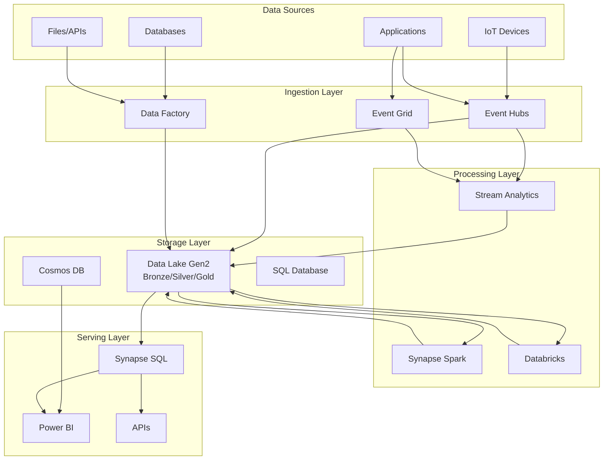

# 🔭 Azure Analytics Services Overview

> __🏠 [Home](../../README.md)__ | __📖 [Documentation](../../01-overview/README.md)__ | __🛠️ [Services](../README.md)__ | __🔭 Overview__

This overview provides a comprehensive guide to selecting and implementing Azure analytics services for your Cloud Scale Analytics (CSA) solutions.

---

## 🎯 Service Selection Guide

Choosing the right Azure analytics service depends on your specific use case, data volume, and organizational requirements.

### Decision Matrix

| Use Case | Primary Service | Alternatives |
|----------|-----------------|--------------|
| **Enterprise Data Warehouse** | Azure Synapse Dedicated SQL | Azure Databricks SQL Warehouse |
| **Ad-hoc Data Exploration** | Azure Synapse Serverless SQL | Azure Databricks |
| **Real-time Analytics** | Stream Analytics | Azure Databricks Structured Streaming |
| **Machine Learning at Scale** | Azure Databricks | Azure Synapse ML |
| **Event-Driven Architectures** | Event Grid + Event Hubs | Azure Functions |
| **Data Integration** | Azure Data Factory | Azure Synapse Pipelines |

---

## 📊 Service Categories

### Analytics Compute

Services for processing and analyzing large volumes of data:

| Service | Best For | Pricing Model |
|---------|----------|---------------|
| [Azure Synapse Analytics](../analytics-compute/azure-synapse/README.md) | Unified analytics, data warehousing | Compute + Storage |
| [Azure Databricks](../analytics-compute/azure-databricks/README.md) | Data science, ML, collaborative analytics | DBU-based |
| [Azure HDInsight](../analytics-compute/azure-hdinsight/README.md) | Open-source workloads (Hadoop, Spark, Kafka) | VM-based |

### Streaming Services

Services for real-time data ingestion and processing:

| Service | Best For | Throughput |
|---------|----------|------------|
| [Azure Event Hubs](../streaming-services/azure-event-hubs/README.md) | High-volume event ingestion | Millions of events/sec |
| [Azure Stream Analytics](../streaming-services/azure-stream-analytics/README.md) | Real-time analytics, windowed aggregations | 200 MB/sec |
| [Azure Event Grid](../streaming-services/azure-event-grid/README.md) | Event routing, serverless triggers | 10M events/sec |

### Storage Services

Services for persisting and managing data:

| Service | Best For | Data Model |
|---------|----------|------------|
| [Azure Data Lake Gen2](../storage-services/azure-data-lake-gen2/README.md) | Data lake, big data storage | Hierarchical file system |
| [Azure Cosmos DB](../storage-services/azure-cosmos-db/README.md) | Multi-model, globally distributed | Document, Graph, Key-value |
| [Azure SQL Database](../storage-services/azure-sql-database/README.md) | Relational workloads | Relational |

### Orchestration Services

Services for workflow orchestration and automation:

| Service | Best For | Integration |
|---------|----------|-------------|
| [Azure Data Factory](../orchestration-services/azure-data-factory/README.md) | ETL/ELT pipelines | 100+ connectors |
| [Azure Logic Apps](../orchestration-services/azure-logic-apps/README.md) | Business process automation | 400+ connectors |

---

## 🏗️ Reference Architecture

---

## 🚀 Getting Started

### For New Projects

1. **Define your requirements**: Data volume, latency, use cases
2. **Start with the medallion architecture**: Bronze (raw) → Silver (cleansed) → Gold (curated)
3. **Choose your primary compute**: Synapse for unified analytics, Databricks for ML-heavy workloads
4. **Implement governance early**: Unity Catalog or Azure Purview

### For Migrations

1. **Assess current state**: Data sources, transformations, reports
2. **Plan incremental migration**: Start with non-critical workloads
3. **Leverage compatibility**: T-SQL for SQL Server migrations, Spark for Hadoop
4. **Validate performance**: Benchmark against existing system

---

## 📚 Related Documentation

- [Architecture Patterns](../../03-architecture-patterns/README.md)
- [Implementation Guides](../../04-implementation-guides/README.md)
- [Best Practices](../../05-best-practices/README.md)
- [Service Catalog](../../01-overview/service-catalog.md)

---

*Last Updated: January 2025*
