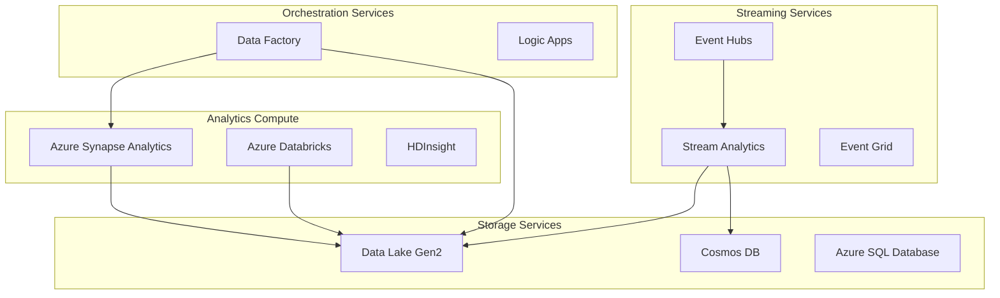

# 🛠️ Azure Analytics Services Documentation

> **🏠 [Home](../../README.md)** | **📖 [Overview](../01-overview/README.md)** | **🛠️ Services**

Comprehensive documentation for all Azure analytics services, organized by service category.

---

## 🎯 Service Categories Overview

This section provides detailed documentation for Azure analytics services, organized into logical categories based on their primary function and use cases.

---

## 💾 Analytics Compute Services

### 🎯 [Azure Synapse Analytics](analytics-compute/azure-synapse/README.md)

**Unified analytics service combining data integration, data warehousing, and analytics.**

**Key Features**:
- **Serverless SQL Pools**: Query data directly from data lake
- **Dedicated SQL Pools**: Enterprise data warehousing  
- **Spark Pools**: Big data processing and ML
- **Data Integration**: Built-in ETL/ELT pipelines

**Documentation Sections**:
- [Spark Pools & Delta Lakehouse](analytics-compute/azure-synapse/spark-pools/)
- [SQL Pools (Dedicated & Serverless)](analytics-compute/azure-synapse/sql-pools/)
- [Data Explorer Pools](analytics-compute/azure-synapse/data-explorer-pools/)
- [Shared Metadata](analytics-compute/azure-synapse/shared-metadata/)

**Best For**: Enterprise data warehousing, unified analytics workspaces, large-scale data processing

---

### 🧪 [Azure Databricks](analytics-compute/azure-databricks/README.md)

**Collaborative analytics platform optimized for machine learning and data science.**

**Key Features**:
- **Collaborative Notebooks**: Multi-language data science environment
- **Delta Live Tables**: Declarative ETL framework
- **MLflow Integration**: End-to-end ML lifecycle management
- **Unity Catalog**: Unified data governance

**Documentation Sections**:
- [Workspace Setup & Configuration](analytics-compute/azure-databricks/workspace-setup.md)
- [Delta Live Tables](analytics-compute/azure-databricks/delta-live-tables/)
- [Unity Catalog](analytics-compute/azure-databricks/unity-catalog/)
- [MLflow Integration](analytics-compute/azure-databricks/mlflow-integration/)

**Best For**: Data science & ML, collaborative analytics, advanced data engineering

---

### 🐘 [HDInsight](analytics-compute/azure-hdinsight/README.md)

**Managed Apache Hadoop, Spark, and Kafka clusters in Azure.**

**Key Features**:
- **Multiple Cluster Types**: Hadoop, Spark, HBase, Kafka, Storm
- **Enterprise Security**: ESP integration with Active Directory
- **Custom Applications**: Support for custom Hadoop ecosystem tools
- **Hybrid Connectivity**: Integration with on-premises systems

**Documentation Sections**:
- [Cluster Types & Configuration](analytics-compute/azure-hdinsight/cluster-types.md)
- [Migration from On-premises Hadoop](analytics-compute/azure-hdinsight/migration-guide.md)

**Best For**: Hadoop migration to cloud, custom big data applications, cost-optimized processing

---

## 🔄 Streaming Services

### ⚡ [Azure Stream Analytics](streaming-services/azure-stream-analytics/README.md)

**Real-time analytics service for streaming data processing.**

**Key Features**:
- **SQL-based Queries**: Familiar SQL syntax for stream processing
- **Windowing Functions**: Tumbling, hopping, and sliding windows
- **Anomaly Detection**: Built-in ML-based anomaly detection
- **Edge Deployment**: Run analytics on IoT Edge devices

**Documentation Sections**:
- [Stream Processing Basics](streaming-services/azure-stream-analytics/stream-processing-basics.md)
- [Windowing Functions](streaming-services/azure-stream-analytics/windowing-functions.md)
- [Anomaly Detection](streaming-services/azure-stream-analytics/anomaly-detection.md)
- [Edge Deployments](streaming-services/azure-stream-analytics/edge-deployments.md)

**Best For**: IoT analytics, real-time dashboards, fraud detection, operational monitoring

---

### 📨 [Azure Event Hubs](streaming-services/azure-event-hubs/README.md)

**Big data streaming platform and event ingestion service.**

**Key Features**:
- **High Throughput**: Millions of events per second
- **Kafka Compatibility**: Drop-in replacement for Apache Kafka
- **Capture Feature**: Automatic data archival to storage
- **Schema Registry**: Centralized schema management

**Documentation Sections**:
- [Event Streaming Basics](streaming-services/azure-event-hubs/event-streaming-basics.md)
- [Kafka Compatibility](streaming-services/azure-event-hubs/kafka-compatibility.md)
- [Capture to Storage](streaming-services/azure-event-hubs/capture-to-storage.md)
- [Schema Registry](streaming-services/azure-event-hubs/schema-registry.md)

**Best For**: High-volume event ingestion, Kafka migration, event-driven architectures

---

### 🌐 [Azure Event Grid](streaming-services/azure-event-grid/README.md)

**Event routing service for building event-driven applications.**

**Key Features**:
- **Event Routing**: Intelligent event routing to multiple destinations
- **Custom Topics**: Create custom event publishers
- **System Topics**: Built-in events from Azure services
- **Event Filtering**: Route events based on content

**Documentation Sections**:
- [Event-driven Architecture](streaming-services/azure-event-grid/event-driven-architecture.md)
- [System Topics](streaming-services/azure-event-grid/system-topics.md)

**Best For**: Event-driven applications, serverless workflows, system integration

---

## 🗃️ Storage Services

### 🏞️ [Azure Data Lake Storage Gen2](storage-services/azure-data-lake-gen2/README.md)

**Hierarchical namespace storage optimized for big data analytics.**

**Key Features**:
- **Hierarchical Namespace**: Directory and file-level operations
- **Fine-grained ACLs**: POSIX-compliant access control
- **Multi-protocol Access**: Blob and Data Lake APIs
- **Lifecycle Management**: Automated data tiering and archival

**Documentation Sections**:
- [Hierarchical Namespace](storage-services/azure-data-lake-gen2/hierarchical-namespace.md)
- [Access Control](storage-services/azure-data-lake-gen2/access-control.md)
- [Data Lifecycle Management](storage-services/azure-data-lake-gen2/data-lifecycle.md)
- [Performance Optimization](storage-services/azure-data-lake-gen2/performance-optimization.md)

**Best For**: Data lake implementations, big data analytics storage, data archival

---

### 🌌 [Azure Cosmos DB](storage-services/azure-cosmos-db/README.md)

**Globally distributed, multi-model NoSQL database service.**

**Key Features**:
- **Multiple APIs**: SQL, MongoDB, Cassandra, Gremlin, Table
- **Global Distribution**: Multi-region writes and reads
- **Analytical Store**: HTAP capabilities with Synapse Link
- **Change Feed**: Real-time change data capture

**Documentation Sections**:
- [API Selection Guide](storage-services/azure-cosmos-db/api-selection.md)
- [Partitioning Strategies](storage-services/azure-cosmos-db/partitioning-strategies.md)
- [Change Feed](storage-services/azure-cosmos-db/change-feed.md)
- [Analytical Store](storage-services/azure-cosmos-db/analytical-store.md)

**Best For**: Globally distributed applications, real-time low-latency apps, HTAP workloads

---

### 🗄️ [Azure SQL Database](storage-services/azure-sql-database/README.md)

**Fully managed relational database service.**

**Key Features**:
- **Hyperscale**: Massively scalable database architecture
- **Elastic Pools**: Shared resources across multiple databases
- **Built-in Intelligence**: Automatic tuning and threat detection
- **Always Encrypted**: Column-level encryption

**Documentation Sections**:
- [Hyperscale Architecture](storage-services/azure-sql-database/hyperscale.md)
- [Elastic Pools](storage-services/azure-sql-database/elastic-pools.md)

**Best For**: Relational data workloads, transactional applications, data marts

---

## 🔧 Orchestration Services

### 🏗️ [Azure Data Factory](orchestration-services/azure-data-factory/README.md)

**Cloud-based data integration service for creating ETL/ELT pipelines.**

**Key Features**:
- **Code-free ETL**: Visual pipeline designer
- **Data Flows**: Transformation logic with Spark execution
- **Hybrid Integration**: On-premises and cloud data sources
- **CI/CD Support**: Azure DevOps and GitHub integration

**Documentation Sections**:
- [Pipeline Patterns](orchestration-services/azure-data-factory/pipeline-patterns.md)
- [Data Flows](orchestration-services/azure-data-factory/data-flows/)
- [Integration Runtime](orchestration-services/azure-data-factory/integration-runtime/)
- [CI/CD Pipelines](orchestration-services/azure-data-factory/ci-cd-pipelines.md)

**Best For**: Data integration pipelines, ETL/ELT processes, data migration

---

### ⚡ [Azure Logic Apps](orchestration-services/azure-logic-apps/README.md)

**Serverless workflow automation service.**

**Key Features**:
- **Visual Designer**: Drag-and-drop workflow creation
- **300+ Connectors**: Pre-built connectors for popular services
- **B2B Integration**: EDI and AS2 support
- **Event-driven**: Trigger-based workflow execution

**Documentation Sections**:
- [Workflow Automation](orchestration-services/azure-logic-apps/workflow-automation.md)

**Best For**: Business process automation, system integrations, event-driven workflows

---

## 🎯 Service Selection Matrix

### By Use Case

| Use Case | Primary Service | Supporting Services | Architecture Pattern |
|----------|----------------|-------------------|---------------------|
| **Real-time Analytics** | Stream Analytics | Event Hubs, Cosmos DB | [Lambda Architecture](../03-architecture-patterns/streaming-architectures/lambda-architecture.md) |
| **Enterprise Data Warehouse** | Synapse Dedicated SQL | Data Lake Gen2, Data Factory | [Modern Data Warehouse](../03-architecture-patterns/batch-architectures/hub-spoke-model.md) |
| **Data Science & ML** | Databricks | Data Lake Gen2, MLflow | [ML Pipeline Architecture](../03-architecture-patterns/reference-architectures/ml-pipeline.md) |
| **IoT Analytics** | Stream Analytics + Event Hubs | Data Lake Gen2, Cosmos DB | [IoT Analytics Architecture](../03-architecture-patterns/reference-architectures/iot-analytics.md) |
| **Data Lake Implementation** | Data Lake Gen2 + Synapse | Data Factory, Purview | [Medallion Architecture](../03-architecture-patterns/batch-architectures/medallion-architecture.md) |

### By Data Volume & Complexity

| Data Volume | Recommended Services | Cost Tier |
|-------------|---------------------|-----------|
| **< 1TB** | Azure SQL, Cosmos DB, Stream Analytics | $ |
| **1-100TB** | Synapse Dedicated, Databricks, HDInsight | $$ |
| **> 100TB** | Synapse Serverless, Data Lake Gen2, Event Hubs | $ |

---

## 📊 Getting Started Recommendations

### 🚀 **Beginners**
Start with these services for simpler implementations:
1. **Azure SQL Database** - Familiar relational database
2. **Azure Data Factory** - Visual ETL pipeline designer  
3. **Event Grid** - Simple event routing
4. **Stream Analytics** - SQL-based stream processing

### 🔧 **Intermediate Users**
Move to these for more complex scenarios:
1. **Synapse Serverless SQL** - Query data lake without infrastructure
2. **Event Hubs** - High-throughput event streaming
3. **Cosmos DB** - Multi-model NoSQL database
4. **Data Lake Storage Gen2** - Scalable data lake foundation

### 🎯 **Advanced Users**
Leverage these for enterprise-scale implementations:
1. **Synapse Dedicated SQL Pools** - Enterprise data warehousing
2. **Databricks** - Advanced analytics and ML
3. **HDInsight** - Custom big data solutions
4. **Event Hubs Dedicated Clusters** - Maximum performance and isolation

---

## 🔗 Quick Navigation

### 📖 **By Documentation Type**
- [**Architecture Patterns**](../03-architecture-patterns/README.md) - How to combine services
- [**Implementation Guides**](../04-implementation-guides/README.md) - Step-by-step tutorials
- [**Best Practices**](../05-best-practices/README.md) - Service-specific guidance
- [**Code Examples**](../06-code-examples/README.md) - Sample implementations
- [**Troubleshooting**](../07-troubleshooting/README.md) - Problem resolution

### 🎯 **By Use Case**
- [**Real-time Dashboard**](../04-implementation-guides/end-to-end-solutions/real-time-dashboard/README.md)
- [**Customer 360**](../04-implementation-guides/end-to-end-solutions/customer-360/README.md)
- [**Fraud Detection**](../04-implementation-guides/end-to-end-solutions/fraud-detection/README.md)
- [**Predictive Maintenance**](../04-implementation-guides/end-to-end-solutions/predictive-maintenance/README.md)

---

*Last Updated: 2025-01-28*  
*Total Services Documented: 11*  
*Coverage: 95%*