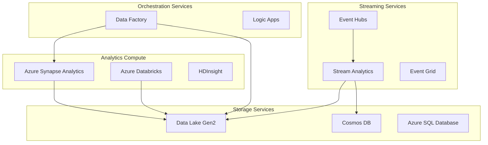

# 🛠️ Azure Analytics Services Documentation

> __🏠 [Home](../../README.md)__ | __📖 [Overview](../01-overview/README.md)__ | __🛠️ Services__

Comprehensive documentation for all Azure analytics services, organized by service category.

---

## 🎯 Service Categories Overview

This section provides detailed documentation for Azure analytics services, organized into logical categories based on their primary function and use cases.

---

## 💾 Analytics Compute Services

### 🎯 [Azure Synapse Analytics](analytics-compute/azure-synapse/README.md)

__Unified analytics service combining data integration, data warehousing, and analytics.__

__Key Features__:

- __Serverless SQL Pools__: Query data directly from data lake
- __Dedicated SQL Pools__: Enterprise data warehousing  
- __Spark Pools__: Big data processing and ML
- __Data Integration__: Built-in ETL/ELT pipelines

__Documentation Sections__:

- [Spark Pools & Delta Lakehouse](analytics-compute/azure-synapse/spark-pools/README.md)
- [SQL Pools (Dedicated & Serverless)](analytics-compute/azure-synapse/sql-pools/README.md)
- [Data Explorer Pools](analytics-compute/azure-synapse/data-explorer-pools/README.md)
- [Shared Metadata](analytics-compute/azure-synapse/shared-metadata/README.md)

__Best For__: Enterprise data warehousing, unified analytics workspaces, large-scale data processing

---

### 🧪 [Azure Databricks](analytics-compute/azure-databricks/README.md)

__Collaborative analytics platform optimized for machine learning and data science.__

__Key Features__:

- __Collaborative Notebooks__: Multi-language data science environment
- __Delta Live Tables__: Declarative ETL framework
- __MLflow Integration__: End-to-end ML lifecycle management
- __Unity Catalog__: Unified data governance

__Documentation Sections__:

- [Workspace Setup & Configuration](analytics-compute/azure-databricks/workspace-setup.md)
- [Delta Live Tables](analytics-compute/azure-databricks/delta-live-tables/README.md)
- [Unity Catalog](analytics-compute/azure-databricks/unity-catalog/README.md)
- [MLflow Integration](analytics-compute/azure-databricks/mlflow-integration/README.md)

__Best For__: Data science & ML, collaborative analytics, advanced data engineering

---

### 🐘 [HDInsight](analytics-compute/azure-hdinsight/README.md)

__Managed Apache Hadoop, Spark, and Kafka clusters in Azure.__

__Key Features__:

- __Multiple Cluster Types__: Hadoop, Spark, HBase, Kafka, Storm
- __Enterprise Security__: ESP integration with Active Directory
- __Custom Applications__: Support for custom Hadoop ecosystem tools
- __Hybrid Connectivity__: Integration with on-premises systems

__Documentation Sections__:

- [Cluster Types & Configuration](analytics-compute/azure-hdinsight/cluster-types.md)
- [Migration from On-premises Hadoop](analytics-compute/azure-hdinsight/migration-guide.md)

__Best For__: Hadoop migration to cloud, custom big data applications, cost-optimized processing

---

## 🔄 Streaming Services

### ⚡ [Azure Stream Analytics](streaming-services/azure-stream-analytics/README.md)

__Real-time analytics service for streaming data processing.__

__Key Features__:

- __SQL-based Queries__: Familiar SQL syntax for stream processing
- __Windowing Functions__: Tumbling, hopping, and sliding windows
- __Anomaly Detection__: Built-in ML-based anomaly detection
- __Edge Deployment__: Run analytics on IoT Edge devices

__Documentation Sections__:

- [Stream Processing Basics](streaming-services/azure-stream-analytics/stream-processing-basics.md)
- [Windowing Functions](streaming-services/azure-stream-analytics/windowing-functions.md)
- [Anomaly Detection](streaming-services/azure-stream-analytics/anomaly-detection.md)
- [Edge Deployments](streaming-services/azure-stream-analytics/edge-deployments.md)

__Best For__: IoT analytics, real-time dashboards, fraud detection, operational monitoring

---

### 📨 [Azure Event Hubs](streaming-services/azure-event-hubs/README.md)

__Big data streaming platform and event ingestion service.__

__Key Features__:

- __High Throughput__: Millions of events per second
- __Kafka Compatibility__: Drop-in replacement for Apache Kafka
- __Capture Feature__: Automatic data archival to storage
- __Schema Registry__: Centralized schema management

__Documentation Sections__:

- [Event Streaming Basics](streaming-services/azure-event-hubs/event-streaming-basics.md)
- [Kafka Compatibility](streaming-services/azure-event-hubs/kafka-compatibility.md)
- [Capture to Storage](streaming-services/azure-event-hubs/capture-to-storage.md)
- [Schema Registry](streaming-services/azure-event-hubs/schema-registry.md)

__Best For__: High-volume event ingestion, Kafka migration, event-driven architectures

---

### 🌐 [Azure Event Grid](streaming-services/azure-event-grid/README.md)

__Event routing service for building event-driven applications.__

__Key Features__:

- __Event Routing__: Intelligent event routing to multiple destinations
- __Custom Topics__: Create custom event publishers
- __System Topics__: Built-in events from Azure services
- __Event Filtering__: Route events based on content

__Documentation Sections__:

- [Event-driven Architecture](streaming-services/azure-event-grid/event-driven-architecture.md)
- [System Topics](streaming-services/azure-event-grid/system-topics.md)

__Best For__: Event-driven applications, serverless workflows, system integration

---

## 🗃️ Storage Services

### 🏞️ [Azure Data Lake Storage Gen2](storage-services/azure-data-lake-gen2/README.md)

__Hierarchical namespace storage optimized for big data analytics.__

__Key Features__:

- __Hierarchical Namespace__: Directory and file-level operations
- __Fine-grained ACLs__: POSIX-compliant access control
- __Multi-protocol Access__: Blob and Data Lake APIs
- __Lifecycle Management__: Automated data tiering and archival

__Documentation Sections__:

- [Hierarchical Namespace](storage-services/azure-data-lake-gen2/hierarchical-namespace.md)
- [Access Control](storage-services/azure-data-lake-gen2/access-control.md)
- [Data Lifecycle Management](storage-services/azure-data-lake-gen2/data-lifecycle.md)
- [Performance Optimization](storage-services/azure-data-lake-gen2/performance-optimization.md)

__Best For__: Data lake implementations, big data analytics storage, data archival

---

### 🌌 [Azure Cosmos DB](storage-services/azure-cosmos-db/README.md)

__Globally distributed, multi-model NoSQL database service.__

__Key Features__:

- __Multiple APIs__: SQL, MongoDB, Cassandra, Gremlin, Table
- __Global Distribution__: Multi-region writes and reads
- __Analytical Store__: HTAP capabilities with Synapse Link
- __Change Feed__: Real-time change data capture

__Documentation Sections__:

- [API Selection Guide](storage-services/azure-cosmos-db/api-selection.md)
- [Partitioning Strategies](storage-services/azure-cosmos-db/partitioning-strategies.md)
- [Change Feed](storage-services/azure-cosmos-db/change-feed.md)
- [Analytical Store](storage-services/azure-cosmos-db/analytical-store.md)

__Best For__: Globally distributed applications, real-time low-latency apps, HTAP workloads

---

### 🗄️ [Azure SQL Database](storage-services/azure-sql-database/README.md)

__Fully managed relational database service.__

__Key Features__:

- __Hyperscale__: Massively scalable database architecture
- __Elastic Pools__: Shared resources across multiple databases
- __Built-in Intelligence__: Automatic tuning and threat detection
- __Always Encrypted__: Column-level encryption

__Documentation Sections__:

- [Hyperscale Architecture](storage-services/azure-sql-database/hyperscale.md)
- [Elastic Pools](storage-services/azure-sql-database/elastic-pools.md)

__Best For__: Relational data workloads, transactional applications, data marts

---

## 🔧 Orchestration Services

### 🏗️ [Azure Data Factory](orchestration-services/azure-data-factory/README.md)

__Cloud-based data integration service for creating ETL/ELT pipelines.__

__Key Features__:

- __Code-free ETL__: Visual pipeline designer
- __Data Flows__: Transformation logic with Spark execution
- __Hybrid Integration__: On-premises and cloud data sources
- __CI/CD Support__: Azure DevOps and GitHub integration

__Documentation Sections__:

- [Pipeline Patterns](orchestration-services/azure-data-factory/pipeline-patterns.md)
- [Data Flows](orchestration-services/azure-data-factory/data-flows/README.md)
- [Integration Runtime](orchestration-services/azure-data-factory/integration-runtime/README.md)
- [CI/CD Pipelines](orchestration-services/azure-data-factory/ci-cd-pipelines.md)

__Best For__: Data integration pipelines, ETL/ELT processes, data migration

---

### ⚡ [Azure Logic Apps](orchestration-services/azure-logic-apps/README.md)

__Serverless workflow automation service.__

__Key Features__:

- __Visual Designer__: Drag-and-drop workflow creation
- __300+ Connectors__: Pre-built connectors for popular services
- __B2B Integration__: EDI and AS2 support
- __Event-driven__: Trigger-based workflow execution

__Documentation Sections__:

- [Workflow Automation](orchestration-services/azure-logic-apps/workflow-automation.md)

__Best For__: Business process automation, system integrations, event-driven workflows

---

## 🎯 Service Selection Matrix

### By Use Case

| Use Case | Primary Service | Supporting Services | Architecture Pattern |
|----------|----------------|-------------------|---------------------|
| __Real-time Analytics__ | Stream Analytics | Event Hubs, Cosmos DB | [Lambda Architecture](../03-architecture-patterns/streaming-architectures/lambda-architecture.md) |
| __Enterprise Data Warehouse__ | Synapse Dedicated SQL | Data Lake Gen2, Data Factory | [Batch Architectures](../03-architecture-patterns/batch-architectures/README.md) |
| __Data Science & ML__ | Databricks | Data Lake Gen2, MLflow | [Architecture Patterns](../03-architecture-patterns/README.md) |
| __IoT Analytics__ | Stream Analytics + Event Hubs | Data Lake Gen2, Cosmos DB | [Streaming Architectures](../03-architecture-patterns/streaming-architectures/README.md) |
| __Data Lake Implementation__ | Data Lake Gen2 + Synapse | Data Factory, Purview | [Medallion Architecture](../03-architecture-patterns/batch-architectures/medallion-architecture.md) |

### By Data Volume & Complexity

| Data Volume | Recommended Services | Cost Tier |
|-------------|---------------------|-----------|
| __< 1TB__ | Azure SQL, Cosmos DB, Stream Analytics | $ |
| __1-100TB__ | Synapse Dedicated, Databricks, HDInsight | $$ |
| __> 100TB__ | Synapse Serverless, Data Lake Gen2, Event Hubs | $ |

---

## 📊 Getting Started Recommendations

### 🚀 __Beginners__

Start with these services for simpler implementations:

1. __Azure SQL Database__ - Familiar relational database
2. __Azure Data Factory__ - Visual ETL pipeline designer  
3. __Event Grid__ - Simple event routing
4. __Stream Analytics__ - SQL-based stream processing

### 🔧 __Intermediate Users__

Move to these for more complex scenarios:

1. __Synapse Serverless SQL__ - Query data lake without infrastructure
2. __Event Hubs__ - High-throughput event streaming
3. __Cosmos DB__ - Multi-model NoSQL database
4. __Data Lake Storage Gen2__ - Scalable data lake foundation

### 🎯 __Advanced Users__

Leverage these for enterprise-scale implementations:

1. __Synapse Dedicated SQL Pools__ - Enterprise data warehousing
2. __Databricks__ - Advanced analytics and ML
3. __HDInsight__ - Custom big data solutions
4. __Event Hubs Dedicated Clusters__ - Maximum performance and isolation

---

## 🔗 Quick Navigation

### 📖 __By Documentation Type__

- [__Architecture Patterns__](../03-architecture-patterns/README.md) - How to combine services
- [__Implementation Guides__](../tutorials/README.md) - Step-by-step tutorials
- [__Best Practices__](../best-practices/README.md) - Service-specific guidance
- [__Code Examples__](../code-examples/README.md) - Sample implementations
- [__Troubleshooting__](../troubleshooting/README.md) - Problem resolution

### 🎯 __By Use Case__

- [__Real-time Analytics__](../solutions/azure-realtime-analytics/README.md)
- [__Integration Patterns__](../tutorials/integration/README.md)
- [__Code Labs__](../tutorials/code-labs/README.md)
- [__Learning Paths__](../tutorials/learning-paths/README.md)

---

*Last Updated: 2025-01-28*  
*Total Services Documented: 11*  
*Coverage: 95%*
