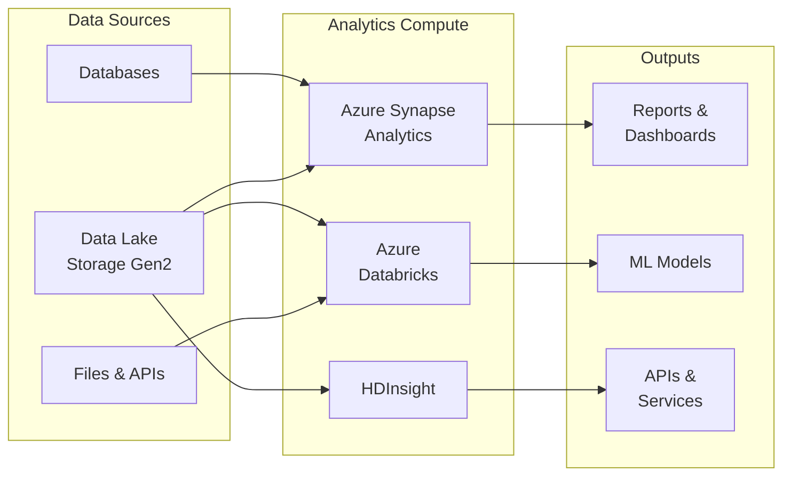
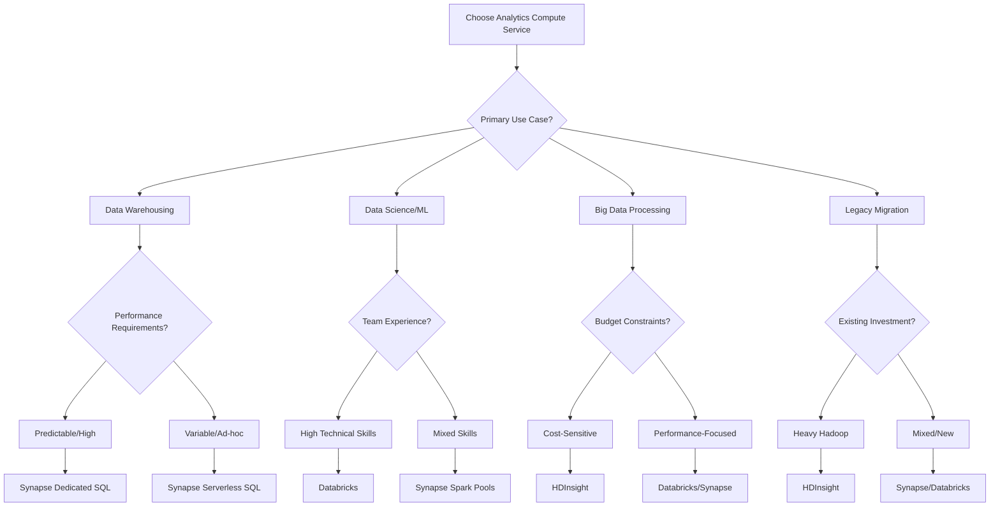

# 💾 Analytics Compute Services

> __🏠 [Home](../../../README.md)__ | __📖 [Overview](../../01-overview/README.md)__ | __🛠️ Services__ | __💾 Analytics Compute__

Large-scale data processing and analytics compute services for enterprise workloads.

---

## 🎯 Service Overview

Analytics compute services provide the processing power for large-scale data analytics, machine learning, and data warehousing workloads. These services handle everything from interactive queries to massive batch processing jobs.

---

## 🚀 Service Cards

### 🎯 Azure Synapse Analytics

__Unified analytics service combining data integration, data warehousing, and big data analytics.__

#### 🔥 Key Strengths

- __Unified Workspace__: Single environment for all analytics needs
- __Serverless & Dedicated Options__: Pay-per-query or reserved capacity
- __Native Integration__: Deep integration with Azure services
- __SQL Compatibility__: Familiar T-SQL syntax and tools

#### 📊 Core Components

- __[Spark Pools](azure-synapse/spark-pools/README.md)__ - Big data processing with Delta Lakehouse
- __[SQL Pools](azure-synapse/sql-pools/README.md)__ - Dedicated and serverless SQL processing
- __[Data Explorer Pools](azure-synapse/data-explorer-pools/README.md)__ - Time-series and log analytics
- __[Shared Metadata](azure-synapse/shared-metadata/README.md)__ - Unified catalog across engines

#### 🎯 Best For

- Enterprise data warehousing
- Unified analytics workspaces
- Self-service analytics
- Mixed SQL and Spark workloads

#### 💰 Pricing Model

- __Serverless__: Pay-per-query (TB processed)
- __Dedicated__: Reserved compute capacity (DWU)
- __Spark__: Pay-per-minute execution

__[📖 Full Documentation →](azure-synapse/README.md)__

---

### 🧪 Azure Databricks

__Collaborative analytics platform optimized for data science and machine learning workflows.__

#### 🔥 Key Strengths

- __Collaborative Environment__: Multi-user notebooks with real-time collaboration
- __Advanced ML Capabilities__: Native MLflow and AutoML integration
- __Delta Lake Optimization__: Built-in Delta Lake with performance optimizations
- __Multi-language Support__: Python, R, Scala, SQL in unified workspace

#### 📊 Core Components

- __[Workspace Setup](azure-databricks/workspace-setup.md)__ - Environment configuration
- __[Delta Live Tables](azure-databricks/delta-live-tables/README.md)__ - Declarative ETL framework
- __[Unity Catalog](azure-databricks/unity-catalog/README.md)__ - Unified data governance
- __[MLflow Integration](azure-databricks/mlflow-integration/README.md)__ - End-to-end ML lifecycle

#### 🎯 Best For

- Data science and machine learning
- Collaborative data engineering
- Advanced analytics and AI
- Delta Lake implementations

#### 💰 Pricing Model

- __Compute__: Standard VM pricing
- __DBU (Databricks Units)__: Additional charges for platform features
- __Premium Tier__: Advanced security and collaboration features

__[📖 Full Documentation →](azure-databricks/README.md)__

---

### 🐘 HDInsight

__Managed Apache Hadoop, Spark, and Kafka clusters with enterprise security.__

#### 🔥 Key Strengths

- __Open Source Ecosystem__: Full Hadoop ecosystem support
- __Cost Effective__: VM-based pricing for predictable costs
- __Enterprise Security__: Active Directory integration
- __Custom Applications__: Support for custom Hadoop tools and frameworks

#### 📊 Core Components

- __[Cluster Types](azure-hdinsight/cluster-types.md)__ - Hadoop, Spark, HBase, Kafka configurations
- __[Migration Guide](azure-hdinsight/migration-guide.md)__ - On-premises to cloud migration

#### 🎯 Best For

- Hadoop migration to cloud
- Custom big data applications
- Cost-optimized big data processing
- Legacy system modernization

#### 💰 Pricing Model

- __VM-based__: Pay for underlying virtual machines
- __No platform fees__: Only infrastructure costs
- __Reserved Instances__: Additional savings with commitments

__[📖 Full Documentation →](azure-hdinsight/README.md)__

---

## 📊 Service Comparison

### Feature Matrix

| Feature | Synapse Analytics | Databricks | HDInsight |
|---------|------------------|------------|-----------|
| __SQL Support__ | ✅ Native T-SQL | ✅ Spark SQL | ✅ Hive/Spark SQL |
| __Serverless Option__ | ✅ SQL Serverless | ❌ No | ❌ No |
| __ML Integration__ | ⚠️ Basic | ✅ Advanced MLflow | ⚠️ Custom setup |
| __Collaborative Notebooks__ | ✅ Yes | ✅ Advanced | ❌ Limited |
| __Delta Lake__ | ✅ Native | ✅ Optimized | ⚠️ Manual setup |
| __Auto-scaling__ | ✅ Yes | ✅ Yes | ✅ Yes |
| __Enterprise Security__ | ✅ AAD Integration | ✅ Unity Catalog | ✅ ESP |
| __Data Governance__ | ✅ Purview Integration | ✅ Unity Catalog | ⚠️ Manual |
| __Cost Predictability__ | ⚠️ Variable | ⚠️ DBU-based | ✅ VM-based |
| __Learning Curve__ | 🟡 Moderate | 🔴 Steep | 🟡 Moderate |

### Use Case Recommendations

#### 🏢 Enterprise Data Warehousing

__Primary__: Azure Synapse Analytics

- Dedicated SQL Pools for consistent performance
- Native T-SQL compatibility
- Integration with existing BI tools

#### 🔬 Data Science & Machine Learning

__Primary__: Azure Databricks

- Advanced ML capabilities with MLflow
- Collaborative notebook environment
- Optimized for iterative development

#### 💰 Cost-Optimized Big Data Processing

__Primary__: HDInsight

- VM-based pricing for predictability
- No platform fees
- Full control over cluster configuration

#### 🔄 Mixed Workloads (SQL + Spark)

__Primary__: Azure Synapse Analytics

- Unified workspace for all compute engines
- Shared metadata across SQL and Spark
- Single management interface

---

## 🎯 Selection Decision Tree

## 🚀 Getting Started Paths

### 🆕 New to Azure Analytics

1. __Start with__: Azure Synapse Analytics Serverless SQL Pools
2. __Why__: No infrastructure to manage, familiar SQL syntax
3. __Next Steps__: Explore Spark Pools for advanced processing
4. __Resources__: [Synapse Quick Start](azure-synapse/README.md#quick-start)

### 🧪 Data Science Team

1. __Start with__: Azure Databricks Community Edition trial
2. __Why__: Full-featured ML environment with collaboration
3. __Next Steps__: Set up Unity Catalog for governance
4. __Resources__: [Databricks Quick Start](azure-databricks/README.md#quick-start)

### 🏢 Existing Hadoop Investment

1. __Start with__: HDInsight assessment and migration planning
2. __Why__: Preserves existing investments and skills
3. __Next Steps__: Evaluate modernization to Synapse/Databricks
4. __Resources__: [HDInsight Migration Guide](azure-hdinsight/migration-guide.md)

### 💼 Enterprise Implementation

1. __Start with__: Architecture design sessions and POC
2. __Recommended__: Multi-service approach (Synapse + Databricks)
3. __Next Steps__: Governance and security implementation
4. __Resources__: [Enterprise Architecture Patterns](../../03-architecture-patterns/README.md)

---

## 📚 Additional Resources

### 🎓 __Learning Resources__

- [__Azure Analytics Fundamentals__](../../04-implementation-guides/README.md)
- [__Best Practices Guide__](../../05-best-practices/README.md)
- [__Architecture Patterns__](../../03-architecture-patterns/README.md)

### 🔧 __Implementation Guides__

- [__Data Lake Setup__](../../04-implementation-guides/integration-scenarios/README.md)
- [__Best Practices Guide__](../../05-best-practices/README.md)
- [__Architecture Patterns__](../../03-architecture-patterns/README.md)

### 📊 __Sample Implementations__

- [__Batch Architectures__](../../03-architecture-patterns/batch-architectures/README.md)
- [__Streaming Architectures__](../../03-architecture-patterns/streaming-architectures/README.md)
- [__Real-time Analytics__](../../solutions/azure-realtime-analytics/README.md)

---

*Last Updated: 2025-01-28*  
*Services Covered: 3*  
*Documentation Status: Complete*
