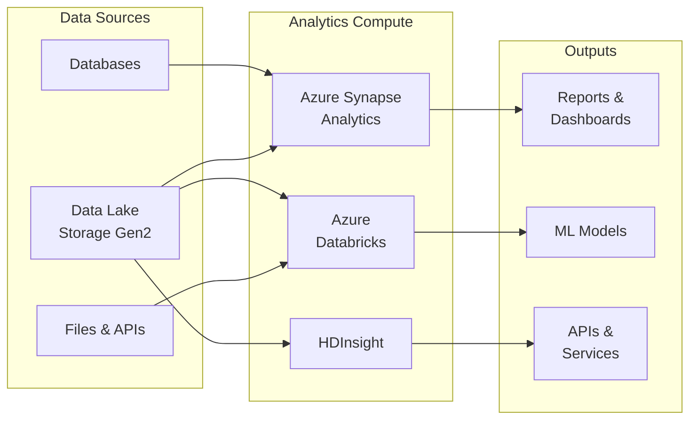
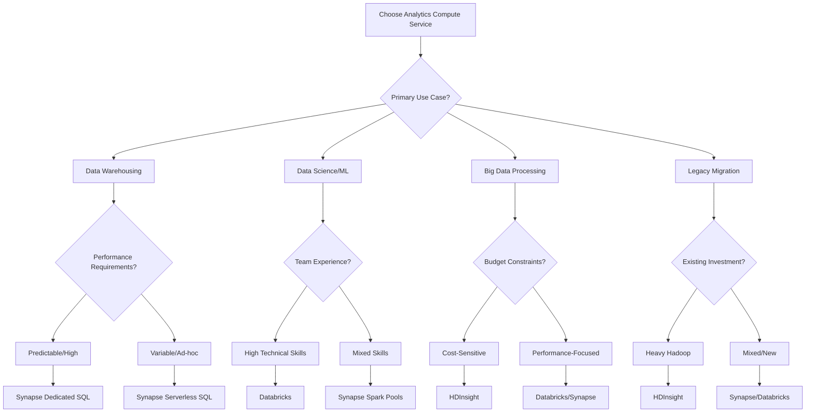

# 💾 Analytics Compute Services

> **🏠 [Home](../../../README.md)** | **📖 [Overview](../../01-overview/README.md)** | **🛠️ [Services](../README.md)** | **💾 Analytics Compute**

Large-scale data processing and analytics compute services for enterprise workloads.

---

## 🎯 Service Overview

Analytics compute services provide the processing power for large-scale data analytics, machine learning, and data warehousing workloads. These services handle everything from interactive queries to massive batch processing jobs.

---

## 🚀 Service Cards

### 🎯 Azure Synapse Analytics

**Unified analytics service combining data integration, data warehousing, and big data analytics.**

#### 🔥 Key Strengths
- **Unified Workspace**: Single environment for all analytics needs
- **Serverless & Dedicated Options**: Pay-per-query or reserved capacity
- **Native Integration**: Deep integration with Azure services
- **SQL Compatibility**: Familiar T-SQL syntax and tools

#### 📊 Core Components
- **[Spark Pools](azure-synapse/spark-pools/)** - Big data processing with Delta Lakehouse
- **[SQL Pools](azure-synapse/sql-pools/)** - Dedicated and serverless SQL processing
- **[Data Explorer Pools](azure-synapse/data-explorer-pools/)** - Time-series and log analytics
- **[Shared Metadata](azure-synapse/shared-metadata/)** - Unified catalog across engines

#### 🎯 Best For
- Enterprise data warehousing
- Unified analytics workspaces
- Self-service analytics
- Mixed SQL and Spark workloads

#### 💰 Pricing Model
- **Serverless**: Pay-per-query (TB processed)
- **Dedicated**: Reserved compute capacity (DWU)
- **Spark**: Pay-per-minute execution

**[📖 Full Documentation →](azure-synapse/README.md)**

---

### 🧪 Azure Databricks

**Collaborative analytics platform optimized for data science and machine learning workflows.**

#### 🔥 Key Strengths
- **Collaborative Environment**: Multi-user notebooks with real-time collaboration
- **Advanced ML Capabilities**: Native MLflow and AutoML integration
- **Delta Lake Optimization**: Built-in Delta Lake with performance optimizations
- **Multi-language Support**: Python, R, Scala, SQL in unified workspace

#### 📊 Core Components
- **[Workspace Setup](azure-databricks/workspace-setup.md)** - Environment configuration
- **[Delta Live Tables](azure-databricks/delta-live-tables/)** - Declarative ETL framework
- **[Unity Catalog](azure-databricks/unity-catalog/)** - Unified data governance
- **[MLflow Integration](azure-databricks/mlflow-integration/)** - End-to-end ML lifecycle

#### 🎯 Best For
- Data science and machine learning
- Collaborative data engineering
- Advanced analytics and AI
- Delta Lake implementations

#### 💰 Pricing Model
- **Compute**: Standard VM pricing
- **DBU (Databricks Units)**: Additional charges for platform features
- **Premium Tier**: Advanced security and collaboration features

**[📖 Full Documentation →](azure-databricks/README.md)**

---

### 🐘 HDInsight

**Managed Apache Hadoop, Spark, and Kafka clusters with enterprise security.**

#### 🔥 Key Strengths
- **Open Source Ecosystem**: Full Hadoop ecosystem support
- **Cost Effective**: VM-based pricing for predictable costs
- **Enterprise Security**: Active Directory integration
- **Custom Applications**: Support for custom Hadoop tools and frameworks

#### 📊 Core Components
- **[Cluster Types](azure-hdinsight/cluster-types.md)** - Hadoop, Spark, HBase, Kafka configurations
- **[Migration Guide](azure-hdinsight/migration-guide.md)** - On-premises to cloud migration

#### 🎯 Best For
- Hadoop migration to cloud
- Custom big data applications
- Cost-optimized big data processing
- Legacy system modernization

#### 💰 Pricing Model
- **VM-based**: Pay for underlying virtual machines
- **No platform fees**: Only infrastructure costs
- **Reserved Instances**: Additional savings with commitments

**[📖 Full Documentation →](azure-hdinsight/README.md)**

---

## 📊 Service Comparison

### Feature Matrix

| Feature | Synapse Analytics | Databricks | HDInsight |
|---------|------------------|------------|-----------|
| **SQL Support** | ✅ Native T-SQL | ✅ Spark SQL | ✅ Hive/Spark SQL |
| **Serverless Option** | ✅ SQL Serverless | ❌ No | ❌ No |
| **ML Integration** | ⚠️ Basic | ✅ Advanced MLflow | ⚠️ Custom setup |
| **Collaborative Notebooks** | ✅ Yes | ✅ Advanced | ❌ Limited |
| **Delta Lake** | ✅ Native | ✅ Optimized | ⚠️ Manual setup |
| **Auto-scaling** | ✅ Yes | ✅ Yes | ✅ Yes |
| **Enterprise Security** | ✅ AAD Integration | ✅ Unity Catalog | ✅ ESP |
| **Data Governance** | ✅ Purview Integration | ✅ Unity Catalog | ⚠️ Manual |
| **Cost Predictability** | ⚠️ Variable | ⚠️ DBU-based | ✅ VM-based |
| **Learning Curve** | 🟡 Moderate | 🔴 Steep | 🟡 Moderate |

### Use Case Recommendations

#### 🏢 Enterprise Data Warehousing
**Primary**: Azure Synapse Analytics
- Dedicated SQL Pools for consistent performance
- Native T-SQL compatibility
- Integration with existing BI tools

#### 🔬 Data Science & Machine Learning
**Primary**: Azure Databricks
- Advanced ML capabilities with MLflow
- Collaborative notebook environment
- Optimized for iterative development

#### 💰 Cost-Optimized Big Data Processing
**Primary**: HDInsight
- VM-based pricing for predictability
- No platform fees
- Full control over cluster configuration

#### 🔄 Mixed Workloads (SQL + Spark)
**Primary**: Azure Synapse Analytics
- Unified workspace for all compute engines
- Shared metadata across SQL and Spark
- Single management interface

---

## 🎯 Selection Decision Tree

## 🚀 Getting Started Paths

### 🆕 New to Azure Analytics
1. **Start with**: Azure Synapse Analytics Serverless SQL Pools
2. **Why**: No infrastructure to manage, familiar SQL syntax
3. **Next Steps**: Explore Spark Pools for advanced processing
4. **Resources**: [Synapse Quick Start](azure-synapse/README.md#quick-start)

### 🧪 Data Science Team
1. **Start with**: Azure Databricks Community Edition trial
2. **Why**: Full-featured ML environment with collaboration
3. **Next Steps**: Set up Unity Catalog for governance
4. **Resources**: [Databricks Quick Start](azure-databricks/README.md#quick-start)

### 🏢 Existing Hadoop Investment
1. **Start with**: HDInsight assessment and migration planning
2. **Why**: Preserves existing investments and skills
3. **Next Steps**: Evaluate modernization to Synapse/Databricks
4. **Resources**: [HDInsight Migration Guide](azure-hdinsight/migration-guide.md)

### 💼 Enterprise Implementation
1. **Start with**: Architecture design sessions and POC
2. **Recommended**: Multi-service approach (Synapse + Databricks)
3. **Next Steps**: Governance and security implementation
4. **Resources**: [Enterprise Architecture Patterns](../../03-architecture-patterns/README.md)

---

## 📚 Additional Resources

### 🎓 **Learning Resources**
- [**Azure Analytics Fundamentals**](../../04-implementation-guides/README.md)
- [**Best Practices Guide**](../../05-best-practices/README.md)
- [**Architecture Patterns**](../../03-architecture-patterns/README.md)

### 🔧 **Implementation Guides**
- [**Data Lake Setup**](../../04-implementation-guides/integration-scenarios/README.md)
- [**Security Configuration**](../../05-best-practices/cross-cutting-concerns/security/README.md)
- [**Performance Optimization**](../../05-best-practices/cross-cutting-concerns/performance/README.md)

### 📊 **Sample Implementations**
- [**Modern Data Warehouse**](../../03-architecture-patterns/reference-architectures/enterprise-data-warehouse.md)
- [**ML Pipeline Architecture**](../../03-architecture-patterns/reference-architectures/ml-pipeline.md)
- [**Real-time Analytics**](../../03-architecture-patterns/streaming-architectures/README.md)

---

*Last Updated: 2025-01-28*  
*Services Covered: 3*  
*Documentation Status: Complete*