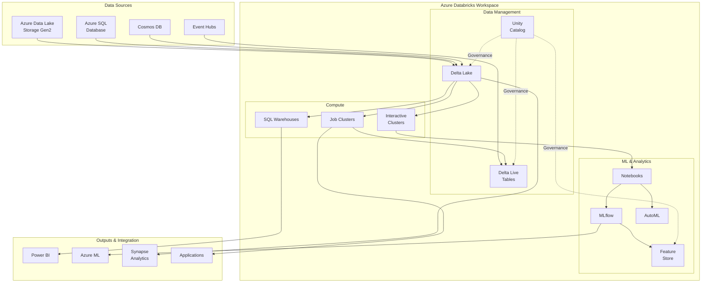
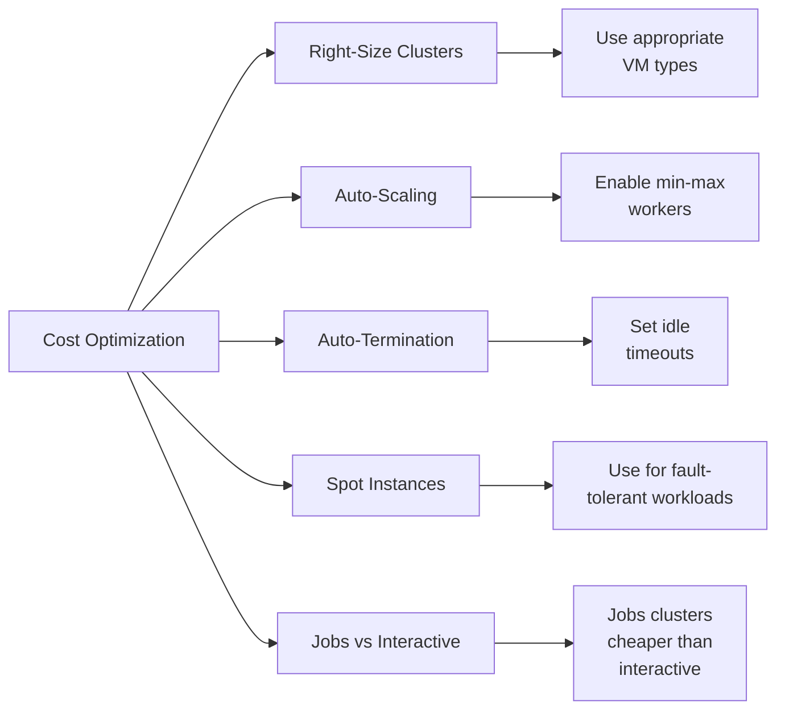
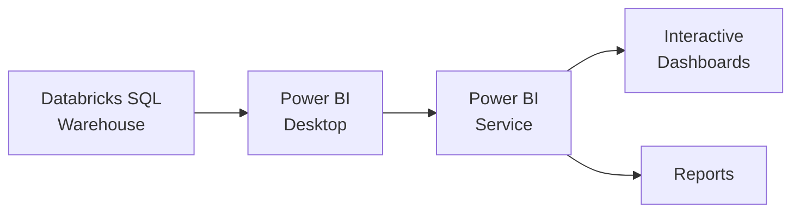
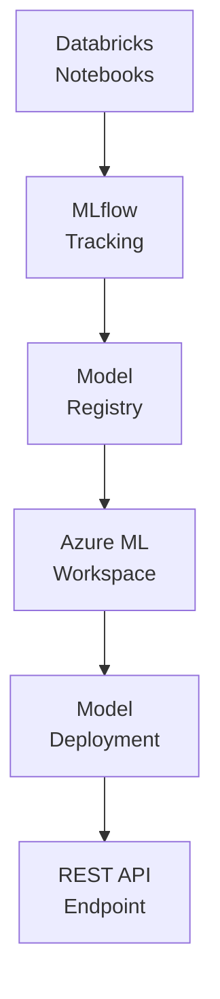

# 🧪 Azure Databricks

> **🏠 [Home](../../../README.md)** | **📖 [Overview](../../../01-overview/README.md)** | **🛠️ [Services](../../README.md)** | **💾 Analytics Compute** | **🧪 Azure Databricks**


Collaborative analytics platform optimized for data science, data engineering, and machine learning workflows on Azure.

---

## 🌟 Service Overview

Azure Databricks is a unified data analytics platform built on Apache Spark, designed to accelerate innovation by bringing together data science, engineering, and business teams. It provides an optimized environment for big data processing, machine learning, and collaborative analytics with deep integration into the Azure ecosystem.

### 🔥 Key Value Propositions

- **Collaborative Workspace**: Multi-user notebooks with real-time collaboration and version control
- **Advanced ML Capabilities**: Native MLflow integration, AutoML, and feature store
- **Delta Lake Optimization**: Built-in Delta Lake with enhanced performance optimizations
- **Multi-Language Support**: Python, R, Scala, SQL, and Java in unified workspace
- **Enterprise Security**: Unity Catalog for centralized governance and access control
- **Azure Native Integration**: Seamless connectivity with Azure services and data sources

---

## 🏗️ Architecture Overview



---

## 💰 Pricing Tiers & SKUs

### 🎯 Workspace Editions

| Edition | Use Case | Key Features | Pricing Premium |
|---------|----------|--------------|----------------|
| **Standard** | Development & Testing | Basic security, notebooks, clusters | Base DBU rate |
| **Premium** | Production Workloads | RBAC, audit logs, job ACLs | +75% DBU rate |
| **Enterprise** | Enterprise Governance | Unity Catalog, advanced security | Contact Sales |

### 💵 Pricing Components

Azure Databricks pricing consists of three components:

#### 1. Virtual Machine Costs

- Standard Azure VM pricing for compute nodes
- Varies by region, VM type, and size
- Examples:
  - **Standard_DS3_v2**: ~$0.27/hour (East US)
  - **Standard_E4s_v3**: ~$0.50/hour (East US)
  - **GPU Standard_NC6s_v3**: ~$3.06/hour (East US)

#### 2. Databricks Units (DBU)

Databricks Units are processing units billed per second of cluster uptime:

| Workload Type | Standard DBU/hour | Premium DBU/hour |
|---------------|-------------------|------------------|
| **Jobs Compute** | 0.15 | 0.30 |
| **All-Purpose Compute** | 0.40 | 0.75 |
| **Jobs Light Compute** | 0.07 | 0.10 |
| **SQL Compute (Serverless)** | 0.22 | 0.40 |
| **DLT Core** | 0.20 | 0.38 |
| **DLT Pro** | 0.25 | 0.54 |
| **DLT Advanced** | 0.30 | 0.60 |

#### 3. Storage Costs

- **Delta Lake Tables**: Azure Data Lake Storage Gen2 pricing
- **DBFS**: Included in workspace, backed by Azure Storage
- **Logs & Metrics**: Azure Monitor pricing

### 💡 Cost Optimization Strategies



**Best Practices**:

1. **Use Job Clusters** for scheduled workloads (50% cheaper DBU)
2. **Enable Auto-Termination** for interactive clusters (120 minutes recommended)
3. **Implement Auto-Scaling** to match workload demands
4. **Use Spot/Low-Priority VMs** for fault-tolerant batch jobs (up to 80% savings)
5. **Optimize Cluster Sizes** - start small and scale as needed
6. **Pool Idle Instances** for faster startup without idle costs
7. **Monitor DBU Usage** with cost management dashboards

---

## 🎯 When to Use Azure Databricks

### ✅ Ideal Use Cases

#### 🔬 Data Science & Machine Learning

**Why Databricks**:
- Collaborative notebook environment for data scientists
- Integrated MLflow for experiment tracking and model management
- AutoML for automated model training
- Feature store for feature engineering and reuse
- GPU support for deep learning workloads

**Example**: Building and deploying recommendation systems, fraud detection models, predictive maintenance solutions.

#### 🏗️ Advanced Data Engineering

**Why Databricks**:
- Delta Live Tables for declarative ETL pipelines
- Auto-optimize and auto-compaction for Delta Lake
- Advanced data quality checks and monitoring
- Multi-hop architectures (Bronze-Silver-Gold)

**Example**: Complex ETL/ELT pipelines, data lakehouse implementations, real-time data processing.

#### 📊 Unified Analytics Platform

**Why Databricks**:
- Single platform for batch, streaming, and interactive analytics
- SQL Analytics with BI tool integration
- Collaborative workspace across teams
- Unity Catalog for centralized governance

**Example**: Enterprise analytics platforms, self-service analytics, cross-functional data teams.

#### 🔄 Real-Time Data Processing

**Why Databricks**:
- Structured Streaming for real-time ETL
- Delta Lake for ACID transactions on streams
- Auto Loader for incremental data ingestion
- Low-latency processing with optimized Spark

**Example**: IoT data processing, clickstream analytics, real-time recommendations.

### ⚠️ Consider Alternatives When

| Scenario | Better Alternative | Reason |
|----------|-------------------|---------|
| **Simple SQL Analytics** | Azure Synapse Serverless SQL | Lower cost for ad-hoc queries |
| **Pure Data Warehousing** | Azure Synapse Dedicated SQL Pool | Optimized for BI workloads |
| **Low-Code ETL** | Azure Data Factory | Visual interface, easier for non-developers |
| **Small-Scale Processing** | Azure Functions, Logic Apps | More cost-effective for small workloads |
| **Real-Time Streaming Only** | Azure Stream Analytics | Purpose-built for streaming, simpler setup |

### 🆚 Databricks vs Synapse Analytics

| Feature | Azure Databricks | Azure Synapse Analytics |
|---------|------------------|------------------------|
| **Primary Focus** | Data Science & ML | Data Warehousing & Integration |
| **Collaboration** | Advanced notebooks | Basic notebooks |
| **ML Capabilities** | MLflow, AutoML, Feature Store | Basic ML integration |
| **SQL Performance** | Good (Photon engine) | Excellent (MPP architecture) |
| **Data Engineering** | Delta Live Tables | Pipelines & Data Flows |
| **Learning Curve** | Steep (Spark expertise) | Moderate (SQL knowledge) |
| **Cost Structure** | VM + DBU | DWU or per-query |
| **Best For** | Data science teams | BI & analytics teams |

---

## 🛠️ Core Components

### 📘 [Workspace Setup](workspace-setup.md)


Complete guide for creating and configuring Azure Databricks workspaces.

**Covers**:
- Workspace creation and networking
- Cluster configuration and pools
- Authentication and access control
- Integration with Azure services
- Best practices and security hardening

**[📖 Full Setup Guide →](workspace-setup.md)**

---

### 🌊 [Delta Live Tables](delta-live-tables/README.md)


Declarative framework for building reliable, maintainable, and testable data pipelines.

**Key Features**:
- Declarative pipeline definitions
- Automatic dependency management
- Built-in data quality checks
- Pipeline observability and monitoring
- Continuous and triggered execution modes

**[📖 Delta Live Tables Guide →](delta-live-tables/README.md)**

---

### 🗄️ [Unity Catalog](unity-catalog/README.md)


Unified governance solution for data and AI assets across Azure Databricks.

**Key Features**:
- Centralized metadata management
- Fine-grained access control
- Data lineage and discovery
- Cross-workspace governance
- Secure data sharing

**[📖 Unity Catalog Guide →](unity-catalog/README.md)**

---

### 🤖 [MLflow Integration](mlflow-integration/README.md)


End-to-end machine learning lifecycle management with MLflow.

**Key Features**:
- Experiment tracking and comparison
- Model registry and versioning
- Model deployment and serving
- Feature store integration
- AutoML capabilities

**[📖 MLflow Integration Guide →](mlflow-integration/README.md)**

---

## 🚀 Quick Start Guide

### 1️⃣ Create Databricks Workspace

```bash
# Set variables
RESOURCE_GROUP="rg-databricks-demo"
LOCATION="eastus"
WORKSPACE_NAME="dbx-demo-workspace"
MANAGED_RG="rg-databricks-managed"

# Create resource group
az group create \
  --name $RESOURCE_GROUP \
  --location $LOCATION

# Create Databricks workspace
az databricks workspace create \
  --resource-group $RESOURCE_GROUP \
  --name $WORKSPACE_NAME \
  --location $LOCATION \
  --sku premium \
  --managed-resource-group $MANAGED_RG
```

### 2️⃣ Create Your First Cluster

**Via Azure Portal**:

1. Navigate to your Databricks workspace
2. Click "Launch Workspace"
3. Go to **Compute** → **Create Cluster**
4. Configure cluster settings:

```yaml
Cluster Name: demo-cluster
Cluster Mode: Standard
Databricks Runtime: 13.3 LTS (Scala 2.12, Spark 3.4.1)
Autopilot: Enabled
Auto Termination: 120 minutes
Worker Type: Standard_DS3_v2
Workers: 2-8 (auto-scaling)
Driver Type: Standard_DS3_v2
```

5. Click **Create Cluster**

### 3️⃣ Create Your First Notebook

**Python Example** - Read and process Delta Lake data:

```python
# Import libraries
from pyspark.sql.functions import col, when, count
from delta.tables import DeltaTable

# Read data from Azure Data Lake
df = spark.read.format("delta") \
  .load("abfss://container@storage.dfs.core.windows.net/data/sales")

# Display sample data
display(df.limit(10))

# Perform transformations
transformed_df = df.filter(col("amount") > 100) \
  .withColumn("category",
    when(col("amount") < 500, "Small")
    .when(col("amount") < 2000, "Medium")
    .otherwise("Large"))

# Write to Delta Lake
transformed_df.write.format("delta") \
  .mode("overwrite") \
  .option("mergeSchema", "true") \
  .save("abfss://container@storage.dfs.core.windows.net/data/sales_categorized")

# Create Delta table
spark.sql("""
  CREATE TABLE IF NOT EXISTS sales_categorized
  USING DELTA
  LOCATION 'abfss://container@storage.dfs.core.windows.net/data/sales_categorized'
""")

# Query using SQL
%sql
SELECT category, COUNT(*) as count, SUM(amount) as total
FROM sales_categorized
GROUP BY category
ORDER BY total DESC
```

**SQL Example** - Query Delta tables:

```sql
-- Create database
CREATE DATABASE IF NOT EXISTS analytics;

-- Use database
USE analytics;

-- Query Delta table
SELECT
  product_category,
  DATE_TRUNC('month', order_date) as month,
  COUNT(DISTINCT customer_id) as unique_customers,
  SUM(amount) as total_revenue,
  AVG(amount) as avg_order_value
FROM sales_categorized
WHERE order_date >= '2024-01-01'
GROUP BY product_category, DATE_TRUNC('month', order_date)
ORDER BY month DESC, total_revenue DESC;
```

### 4️⃣ Schedule a Job

**Create automated job**:

1. Go to **Workflows** → **Jobs**
2. Click **Create Job**
3. Configure job:

```yaml
Job Name: daily-sales-processing
Task Type: Notebook
Notebook Path: /Users/your-email@domain.com/sales-processing
Cluster: New job cluster (cheaper than interactive)
Schedule:
  Type: Cron
  Expression: 0 2 * * * (2 AM daily)
  Timezone: UTC
Notifications:
  - On Success: team@company.com
  - On Failure: oncall@company.com
Retries: 2
```

4. Click **Create** and **Run Now** to test

---

## 🔧 Configuration & Management

### 🛡️ Security Best Practices

**Identity & Access**:
- Enable Azure AD integration for SSO
- Use Unity Catalog for fine-grained access control
- Implement least-privilege access principles
- Enable audit logging for compliance

**Network Security**:
- Deploy in VNet with Private Link
- Use Azure Private Endpoints for storage
- Configure NSG rules for cluster communication
- Enable firewall rules for workspace access

**Data Protection**:
- Enable encryption at rest and in transit
- Use customer-managed keys (CMK) for sensitive data
- Implement data masking for PII
- Regular security scans and compliance checks

**[📖 Detailed Security Guide →](../../../05-best-practices/README.md)**

### ⚡ Performance Optimization

**Cluster Configuration**:
- Use Photon engine for SQL workloads (2-3x faster)
- Enable Delta Cache for frequently accessed data
- Configure appropriate worker and driver sizes
- Use pools for faster cluster startup

**Code Optimization**:
- Partition data appropriately (date, region, category)
- Use broadcast joins for small tables
- Avoid wide transformations when possible
- Leverage Delta Lake optimizations (Z-ordering, optimize)

**Delta Lake Tuning**:

```python
# Optimize Delta table
spark.sql("OPTIMIZE sales_data ZORDER BY (date, customer_id)")

# Vacuum old files
spark.sql("VACUUM sales_data RETAIN 168 HOURS")  # 7 days

# Enable auto-optimize
spark.sql("""
  ALTER TABLE sales_data
  SET TBLPROPERTIES (
    delta.autoOptimize.optimizeWrite = true,
    delta.autoOptimize.autoCompact = true
  )
""")
```

**[📖 Performance Tuning Guide →](../../../05-best-practices/README.md)**

### 📊 Monitoring & Observability

**Built-in Monitoring**:
- Cluster metrics and utilization dashboards
- Job run history and performance metrics
- Query performance insights
- Cost tracking and optimization recommendations

**Integration with Azure Monitor**:

```python
# Configure diagnostic settings
from azure.mgmt.databricks import DatabricksClient
from azure.identity import DefaultAzureCredential

credential = DefaultAzureCredential()
databricks_client = DatabricksClient(credential, subscription_id)

# Enable diagnostic logging
diagnostic_settings = {
    "workspace_id": "/subscriptions/{sub}/resourceGroups/{rg}/providers/Microsoft.OperationalInsights/workspaces/{workspace}",
    "logs": [
        {"category": "jobs", "enabled": True},
        {"category": "clusters", "enabled": True},
        {"category": "notebook", "enabled": True}
    ],
    "metrics": [
        {"category": "AllMetrics", "enabled": True}
    ]
}
```

**[📖 Monitoring Guide →](../../../09-monitoring/README.md)**

---

## 🔗 Integration Patterns

### Power BI Integration

Direct connectivity for interactive analytics and reporting.



**Setup**:

1. Create SQL Warehouse in Databricks
2. Get connection string from "Connection Details"
3. Connect from Power BI using "Azure Databricks" connector
4. Select tables and create visualizations

### Azure Machine Learning Integration

Seamless MLOps with Azure ML.



**Example**:

```python
import mlflow
from mlflow.tracking import MlflowClient

# Configure MLflow to use Azure ML
mlflow.set_tracking_uri("azureml://workspace-id")

# Log model to Azure ML
with mlflow.start_run():
    mlflow.sklearn.log_model(model, "model")
    mlflow.log_param("algorithm", "random_forest")
    mlflow.log_metric("accuracy", 0.95)
```

### Azure Synapse Analytics Integration

Unified lakehouse with Synapse.

```python
# Read from Databricks Delta in Synapse
spark.sql("""
  CREATE DATABASE IF NOT EXISTS dbx_shared
  LOCATION 'abfss://container@storage.dfs.core.windows.net/delta'
""")

# Access Delta tables
df = spark.read.format("delta").table("dbx_shared.sales")
```

**[📖 Integration Examples →](../../../04-implementation-guides/integration-scenarios/README.md)**

---

## 📚 Learning Resources

### 🎓 Getting Started

- [**Databricks Quick Start**](../../../04-implementation-guides/README.md)
- [**Delta Lake Fundamentals**](../../../04-implementation-guides/README.md)
- [**Spark SQL Tutorial**](../../../04-implementation-guides/README.md)
- [**Machine Learning with Databricks**](../../../04-implementation-guides/README.md)

### 📖 Deep Dive Guides

- [**Architecture Patterns**](../../../03-architecture-patterns/README.md)
- [**Best Practices**](../../../05-best-practices/README.md)
- [**Code Examples**](../../../06-code-examples/README.md)
- [**Real-World Solutions**](../../../08-solutions/README.md)

### 🔧 Advanced Topics

- [**Delta Live Tables Advanced**](delta-live-tables/README.md)
- [**Unity Catalog Architecture**](unity-catalog/README.md)
- [**MLOps with MLflow**](mlflow-integration/README.md)
- [**Performance Tuning**](../../../05-best-practices/README.md)

---

## 🆘 Troubleshooting

### 🔍 Common Issues

**Cluster Startup Issues**:
- [**Cluster Won't Start**](../../../07-troubleshooting/README.md)
- [**Node Provisioning Errors**](../../../07-troubleshooting/README.md)
- [**Networking Problems**](../../../07-troubleshooting/README.md)

**Performance Problems**:
- [**Slow Queries**](../../../07-troubleshooting/README.md)
- [**Out of Memory Errors**](../../../07-troubleshooting/README.md)
- [**Shuffle Performance**](../../../07-troubleshooting/README.md)

**Data Issues**:
- [**Delta Lake Problems**](../../../07-troubleshooting/README.md)
- [**Data Quality Issues**](../../../07-troubleshooting/README.md)
- [**Schema Evolution**](../../../07-troubleshooting/README.md)

### 📞 Getting Help

- **Azure Support**: Official Microsoft support channels
- **Databricks Support**: Premium tier includes 24/7 support
- **Community Forums**: Databricks Community, Stack Overflow
- **Documentation**: Microsoft Learn and Databricks official docs
- **GitHub Issues**: Report documentation or sample issues

**[📖 Complete Troubleshooting Guide →](../../../07-troubleshooting/README.md)**

---

## 🎯 Next Steps

### 🚀 For Beginners

1. **[Complete Workspace Setup](workspace-setup.md)** - Get your environment ready
2. **[Try Delta Lake](delta-live-tables/README.md)** - Learn modern data engineering
3. **[Explore Notebooks](../../../04-implementation-guides/README.md)** - Hands-on coding

### 🏢 For Teams

1. **[Implement Unity Catalog](unity-catalog/README.md)** - Set up governance
2. **[Design Data Architecture](../../../03-architecture-patterns/batch-architectures/medallion-architecture.md)** - Plan your lakehouse
3. **[Establish MLOps](mlflow-integration/README.md)** - Production ML workflows

### 🔧 For Advanced Users

1. **[Optimize Performance](../../../05-best-practices/README.md)** - Tune for production
2. **[Implement CI/CD](../../../05-best-practices/README.md)** - Automate deployments
3. **[Build Solutions](../../../08-solutions/README.md)** - Enterprise patterns

---

## 💬 Feedback

Your feedback helps us improve this documentation. Please let us know:

- Was this page helpful?
- What could be improved?
- Are there any errors or unclear sections?

[Provide Feedback](https://github.com/fgarofalo56/csa-inabox-docs/issues/new?title=[Feedback]+Azure-Databricks)

---

*Last Updated: 2025-01-28*
*Service Version: General Availability*
*Documentation Status: Complete*
