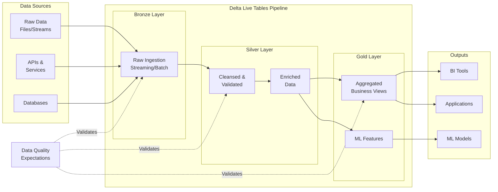
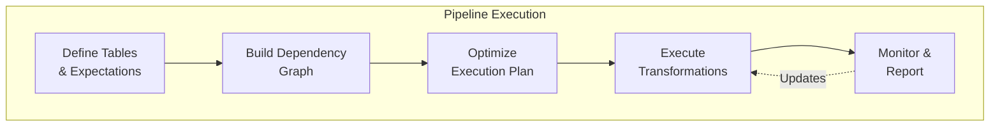
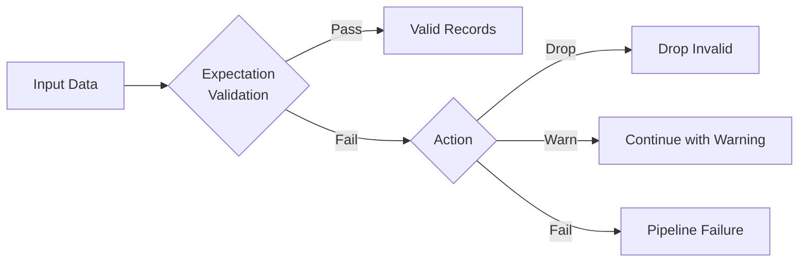

# 🌊 Delta Live Tables

> **🏠 [Home](../../../../../README.md)** | **📖 [Overview](../../../../01-overview/README.md)** | **🛠️ [Services](../../../README.md)** | **💾 Analytics Compute** | **🧪 [Azure Databricks](../README.md)** | **🌊 Delta Live Tables**


Declarative framework for building reliable, maintainable, and testable data pipelines with automatic dependency management and data quality controls.

---

## 🌟 Overview

Delta Live Tables (DLT) is a declarative ETL framework that simplifies data pipeline development and management. Instead of defining how to process data step-by-step, you declare what your data should look like, and DLT handles the execution, monitoring, and error handling automatically.

### 🔥 Key Benefits

- **Declarative Pipeline Definition**: Focus on business logic, not infrastructure
- **Automatic Dependency Management**: DLT manages execution order automatically
- **Built-in Data Quality**: Expectations and quality checks at every stage
- **Pipeline Observability**: Automatic lineage tracking and monitoring
- **Simplified Operations**: Continuous and triggered execution modes
- **Cost Optimization**: Automatic cluster management and scaling

---

## 🏗️ Architecture

### Pipeline Architecture



### Execution Model



---

## 📊 Core Concepts

### Tables Types

| Type | Purpose | Update Mode | Use Case |
|------|---------|-------------|----------|
| **Streaming Table** | Real-time processing | Append-only | Event streams, IoT data, logs |
| **Materialized View** | Transformed data | Incremental/Full | Business logic, aggregations |
| **View** | Non-materialized query | On-demand | Intermediate transformations |

### Data Quality Expectations



**Expectation Actions**:

- **Warn**: Log violations but continue
- **Drop**: Remove invalid records
- **Fail**: Stop pipeline execution

---

## 🚀 Getting Started

### Simple Pipeline Example

**Bronze Layer** - Raw data ingestion:

```python
import dlt
from pyspark.sql.functions import current_timestamp

@dlt.table(
    comment="Raw sales transactions from source system",
    table_properties={
        "quality": "bronze",
        "pipelines.autoOptimize.managed": "true"
    }
)
def sales_bronze():
    return (
        spark.readStream.format("cloudFiles")
        .option("cloudFiles.format", "json")
        .option("cloudFiles.schemaLocation", "/mnt/schemas/sales")
        .load("/mnt/raw/sales/")
        .withColumn("ingestion_time", current_timestamp())
    )
```

**Silver Layer** - Cleansed and validated:

```python
@dlt.table(
    comment="Cleansed sales transactions with quality checks"
)
@dlt.expect_or_drop("valid_amount", "amount > 0")
@dlt.expect_or_drop("valid_date", "transaction_date IS NOT NULL")
@dlt.expect("valid_customer", "customer_id IS NOT NULL")
def sales_silver():
    return (
        dlt.read_stream("sales_bronze")
        .select(
            "transaction_id",
            "customer_id",
            "product_id",
            "amount",
            "transaction_date"
        )
        .dropDuplicates(["transaction_id"])
    )
```

**Gold Layer** - Business aggregations:

```python
@dlt.table(
    comment="Daily sales summary by product"
)
def daily_sales_summary():
    return (
        dlt.read("sales_silver")
        .groupBy("product_id", "transaction_date")
        .agg(
            sum("amount").alias("total_sales"),
            count("transaction_id").alias("transaction_count"),
            avg("amount").alias("avg_transaction_value")
        )
    )
```

---

## 📝 Pipeline Development

### Complete Pipeline Example

**File**: `sales_pipeline.py`

```python
import dlt
from pyspark.sql.functions import *
from pyspark.sql.types import *

# ============================================================================
# BRONZE LAYER - Raw Data Ingestion
# ============================================================================

@dlt.table(
    name="transactions_bronze",
    comment="Raw transaction data from multiple sources",
    table_properties={
        "quality": "bronze",
        "pipelines.autoOptimize.managed": "true"
    }
)
def transactions_bronze():
    """Ingest raw transaction files using Auto Loader"""
    return (
        spark.readStream.format("cloudFiles")
        .option("cloudFiles.format", "json")
        .option("cloudFiles.schemaLocation", "/mnt/schemas/transactions")
        .option("cloudFiles.inferColumnTypes", "true")
        .option("cloudFiles.schemaEvolutionMode", "rescue")
        .load("/mnt/raw/transactions/")
        .withColumn("ingestion_timestamp", current_timestamp())
        .withColumn("source_file", input_file_name())
    )

@dlt.table(
    name="customers_bronze",
    comment="Raw customer master data"
)
def customers_bronze():
    """Ingest customer data from SQL database"""
    return (
        spark.read.format("jdbc")
        .option("url", "jdbc:sqlserver://...")
        .option("dbtable", "dbo.customers")
        .option("user", dbutils.secrets.get("db-scope", "username"))
        .option("password", dbutils.secrets.get("db-scope", "password"))
        .load()
        .withColumn("ingestion_timestamp", current_timestamp())
    )

# ============================================================================
# SILVER LAYER - Cleansed and Validated Data
# ============================================================================

@dlt.table(
    name="transactions_silver",
    comment="Validated and cleansed transactions"
)
@dlt.expect_or_drop("valid_transaction_id", "transaction_id IS NOT NULL")
@dlt.expect_or_drop("valid_amount", "amount > 0 AND amount < 1000000")
@dlt.expect_or_drop("valid_timestamp", "transaction_timestamp IS NOT NULL")
@dlt.expect("valid_customer", "customer_id IS NOT NULL")
@dlt.expect("reasonable_amount", "amount BETWEEN 0.01 AND 100000")
def transactions_silver():
    """
    Cleansed transactions with data quality checks
    - Remove duplicates
    - Validate business rules
    - Standardize formats
    """
    return (
        dlt.read_stream("transactions_bronze")
        .select(
            col("transaction_id"),
            col("customer_id"),
            col("product_id"),
            col("amount").cast("decimal(10,2)"),
            col("transaction_timestamp").cast("timestamp"),
            col("payment_method"),
            col("status"),
            col("ingestion_timestamp")
        )
        # Remove duplicates based on transaction_id
        .dropDuplicates(["transaction_id"])
        # Add derived columns
        .withColumn("transaction_date", to_date(col("transaction_timestamp")))
        .withColumn("transaction_hour", hour(col("transaction_timestamp")))
        .withColumn("amount_category",
            when(col("amount") < 10, "micro")
            .when(col("amount") < 100, "small")
            .when(col("amount") < 1000, "medium")
            .otherwise("large")
        )
    )

@dlt.table(
    name="customers_silver",
    comment="Validated customer master data"
)
@dlt.expect_or_drop("valid_customer_id", "customer_id IS NOT NULL")
@dlt.expect_or_drop("valid_email", "email RLIKE '^[A-Za-z0-9._%+-]+@[A-Za-z0-9.-]+\\.[A-Z|a-z]{2,}$'")
def customers_silver():
    """Cleansed customer data with PII handling"""
    return (
        dlt.read("customers_bronze")
        .select(
            col("customer_id"),
            col("first_name"),
            col("last_name"),
            col("email"),
            col("phone"),
            col("country"),
            col("created_date"),
            col("ingestion_timestamp")
        )
        .dropDuplicates(["customer_id"])
        # Standardize country codes
        .withColumn("country_code", upper(trim(col("country"))))
    )

# ============================================================================
# GOLD LAYER - Business-Ready Analytics
# ============================================================================

@dlt.table(
    name="customer_daily_summary",
    comment="Daily transaction summary per customer"
)
def customer_daily_summary():
    """Daily aggregated metrics per customer"""
    return (
        dlt.read("transactions_silver")
        .groupBy("customer_id", "transaction_date")
        .agg(
            count("transaction_id").alias("transaction_count"),
            sum("amount").alias("total_amount"),
            avg("amount").alias("avg_amount"),
            min("amount").alias("min_amount"),
            max("amount").alias("max_amount"),
            countDistinct("product_id").alias("unique_products")
        )
    )

@dlt.table(
    name="product_performance",
    comment="Product sales performance metrics"
)
def product_performance():
    """Hourly product performance metrics"""
    return (
        dlt.read("transactions_silver")
        .groupBy(
            "product_id",
            "transaction_date",
            "transaction_hour"
        )
        .agg(
            count("transaction_id").alias("sales_count"),
            sum("amount").alias("revenue"),
            countDistinct("customer_id").alias("unique_customers"),
            avg("amount").alias("avg_transaction_value")
        )
        .withColumn(
            "revenue_category",
            when(col("revenue") < 1000, "low")
            .when(col("revenue") < 10000, "medium")
            .otherwise("high")
        )
    )

@dlt.table(
    name="customer_360",
    comment="Comprehensive customer view with enriched data"
)
def customer_360():
    """360-degree customer view combining transactions and profile"""
    transactions = dlt.read("customer_daily_summary")
    customers = dlt.read("customers_silver")

    # Calculate lifetime metrics
    lifetime_metrics = (
        dlt.read("transactions_silver")
        .groupBy("customer_id")
        .agg(
            count("transaction_id").alias("lifetime_transactions"),
            sum("amount").alias("lifetime_value"),
            max("transaction_date").alias("last_transaction_date"),
            min("transaction_date").alias("first_transaction_date")
        )
    )

    # Join customer profile with metrics
    return (
        customers
        .join(lifetime_metrics, "customer_id", "left")
        .select(
            col("customer_id"),
            col("first_name"),
            col("last_name"),
            col("email"),
            col("country_code"),
            col("lifetime_transactions"),
            col("lifetime_value"),
            col("first_transaction_date"),
            col("last_transaction_date"),
            datediff(current_date(), col("last_transaction_date")).alias("days_since_last_purchase"),
            (col("lifetime_value") / col("lifetime_transactions")).alias("avg_order_value")
        )
        .withColumn(
            "customer_segment",
            when(col("lifetime_value") > 10000, "VIP")
            .when(col("lifetime_value") > 5000, "Premium")
            .when(col("lifetime_value") > 1000, "Standard")
            .otherwise("New")
        )
    )

# ============================================================================
# VIEWS - Intermediate Transformations
# ============================================================================

@dlt.view(
    comment="Transactions flagged for fraud review"
)
def suspicious_transactions():
    """Non-materialized view of potentially fraudulent transactions"""
    return (
        dlt.read("transactions_silver")
        .filter(
            (col("amount") > 10000) |
            (col("payment_method") == "unknown") |
            (col("amount_category") == "large")
        )
    )
```

### Data Quality Patterns

**Comprehensive Quality Checks**:

```python
@dlt.table(
    name="high_quality_data"
)
# Critical validations - drop invalid records
@dlt.expect_or_drop("not_null_key", "id IS NOT NULL")
@dlt.expect_or_drop("valid_range", "value BETWEEN 0 AND 100")
@dlt.expect_or_drop("valid_date", "event_date >= '2020-01-01'")

# Important validations - warn but continue
@dlt.expect("recommended_format", "email RLIKE '^[A-Za-z0-9._%+-]+@[A-Za-z0-9.-]+\\.[A-Z|a-z]{2,}$'")
@dlt.expect("data_freshness", "ingestion_time >= current_timestamp() - INTERVAL 1 DAY")

# Business rule validations - fail pipeline if violated
@dlt.expect_or_fail("critical_business_rule", "revenue > cost")
def high_quality_data():
    return dlt.read_stream("source_data")
```

**Custom Quality Checks**:

```python
from pyspark.sql.functions import col, count, when

@dlt.table(
    name="quality_metrics"
)
def quality_metrics():
    """Calculate data quality metrics"""
    df = dlt.read("transactions_silver")

    return df.agg(
        count("*").alias("total_records"),
        count(when(col("amount").isNull(), 1)).alias("null_amounts"),
        count(when(col("amount") < 0, 1)).alias("negative_amounts"),
        count(when(col("customer_id").isNull(), 1)).alias("missing_customers"),
        (count(when(col("amount").isNotNull(), 1)) / count("*") * 100).alias("amount_completeness_pct")
    )
```

---

## ⚙️ Pipeline Configuration

### Create Pipeline Settings

**Pipeline JSON Configuration**:

```json
{
  "id": "sales-analytics-pipeline",
  "name": "Sales Analytics Pipeline",
  "storage": "/mnt/dlt/sales_pipeline",
  "configuration": {
    "pipelines.trigger.interval": "5 minutes",
    "spark.databricks.delta.optimizeWrite.enabled": "true",
    "spark.databricks.delta.autoCompact.enabled": "true"
  },
  "clusters": [
    {
      "label": "default",
      "autoscale": {
        "min_workers": 2,
        "max_workers": 10,
        "mode": "ENHANCED"
      },
      "spark_conf": {
        "spark.sql.adaptive.enabled": "true"
      }
    }
  ],
  "libraries": [
    {
      "notebook": {
        "path": "/Repos/analytics/pipelines/sales_pipeline"
      }
    }
  ],
  "target": "sales_analytics",
  "continuous": false,
  "development": false,
  "photon": true,
  "channel": "CURRENT"
}
```

### Deployment Modes

| Mode | Update Frequency | Use Case | Cost |
|------|------------------|----------|------|
| **Triggered** | On-demand/Scheduled | Batch processing, nightly ETL | Lower (only when running) |
| **Continuous** | Real-time | Streaming data, low latency | Higher (always running) |

**Triggered Pipeline** (Batch):

```python
# Configure in settings
{
  "continuous": false,
  "trigger": {
    "cron": "0 2 * * *"  # Daily at 2 AM
  }
}
```

**Continuous Pipeline** (Streaming):

```python
# Configure in settings
{
  "continuous": true,
  "max_continuous_processing_time_minutes": 360
}
```

---

## 📊 Monitoring & Observability

### Pipeline Metrics

DLT automatically tracks:

- **Data Lineage**: Complete dependency graph
- **Data Quality**: Expectation pass/fail rates
- **Performance**: Processing time per table
- **Resource Usage**: Cluster utilization
- **Error Tracking**: Failed records and exceptions

### Access Pipeline Metrics

```python
# Query pipeline event logs
pipeline_id = "your-pipeline-id"

events = spark.read.format("delta").table(f"event_log('{pipeline_id}')")

# Analyze data quality
quality_metrics = events.filter("event_type = 'flow_progress'") \
    .select("timestamp", "origin.update_id", "details") \
    .orderBy("timestamp", ascending=False)

display(quality_metrics)
```

### Data Quality Dashboard

```sql
-- Create quality monitoring view
CREATE OR REPLACE VIEW pipeline_quality_summary AS
SELECT
  origin.update_id,
  timestamp,
  SUM(details.flow_progress.metrics.num_output_rows) as output_rows,
  SUM(details.flow_progress.data_quality.dropped_records) as dropped_records,
  (SUM(details.flow_progress.data_quality.dropped_records) /
   NULLIF(SUM(details.flow_progress.metrics.num_output_rows), 0) * 100) as drop_rate_pct
FROM event_log('pipeline-id')
WHERE event_type = 'flow_progress'
GROUP BY origin.update_id, timestamp
ORDER BY timestamp DESC;
```

---

## 🔧 Advanced Patterns

### Change Data Capture (CDC)

```python
@dlt.table(
    name="customers_cdc_silver",
    table_properties={
        "delta.enableChangeDataFeed": "true"
    }
)
@dlt.expect_all({
    "valid_operation": "operation IN ('INSERT', 'UPDATE', 'DELETE')",
    "valid_sequence": "sequence_number IS NOT NULL"
})
def customers_cdc_silver():
    """Process CDC events from source system"""
    return (
        dlt.read_stream("customers_cdc_bronze")
        .select(
            col("customer_id"),
            col("operation"),  # INSERT, UPDATE, DELETE
            col("sequence_number"),
            col("data.*")  # Unpack nested data fields
        )
    )

# Apply CDC to target table
dlt.apply_changes(
    target = "customers_current",
    source = "customers_cdc_silver",
    keys = ["customer_id"],
    sequence_by = "sequence_number",
    stored_as_scd_type = 2,  # Slowly Changing Dimension Type 2
    track_history_column_list = ["email", "phone", "address"]
)
```

### Slowly Changing Dimensions (SCD)

```python
# SCD Type 2 with apply_changes
dlt.apply_changes(
    target="dim_customers",
    source="customers_silver",
    keys=["customer_id"],
    sequence_by="updated_timestamp",
    stored_as_scd_type=2,
    track_history_column_list=["address", "status", "segment"],
    track_history_except_column_list=["updated_timestamp"]
)
```

### Data Retention Policies

```python
@dlt.table(
    name="transactions_with_retention",
    table_properties={
        "delta.logRetentionDuration": "30 days",
        "delta.deletedFileRetentionDuration": "7 days"
    }
)
def transactions_with_retention():
    return dlt.read_stream("transactions_bronze")
```

### Schema Evolution

```python
@dlt.table(
    name="flexible_schema",
    table_properties={
        "delta.minReaderVersion": "2",
        "delta.minWriterVersion": "5",
        "delta.columnMapping.mode": "name"
    }
)
def flexible_schema():
    """Table with automatic schema evolution support"""
    return (
        spark.readStream.format("cloudFiles")
        .option("cloudFiles.format", "json")
        .option("cloudFiles.schemaLocation", "/mnt/schemas/flexible")
        .option("cloudFiles.schemaEvolutionMode", "addNewColumns")
        .option("mergeSchema", "true")
        .load("/mnt/raw/flexible/")
    )
```

---

## 💰 Cost Optimization

### DLT Cluster Sizing

```python
# Development pipeline - smaller clusters
{
  "clusters": [{
    "label": "default",
    "num_workers": 2,
    "node_type_id": "Standard_DS3_v2"
  }],
  "development": true
}

# Production pipeline - auto-scaling
{
  "clusters": [{
    "label": "default",
    "autoscale": {
      "min_workers": 2,
      "max_workers": 20,
      "mode": "ENHANCED"
    },
    "node_type_id": "Standard_DS4_v2"
  }],
  "photon": true,
  "development": false
}
```

### Processing Optimization

```python
# Use incremental processing
@dlt.table(
    name="incremental_transactions"
)
def incremental_transactions():
    """Process only new data since last run"""
    return (
        spark.readStream.format("cloudFiles")
        .option("cloudFiles.format", "parquet")
        .option("cloudFiles.maxFilesPerTrigger", 1000)
        .load("/mnt/raw/transactions/")
    )

# Optimize writes
spark.conf.set("spark.databricks.delta.optimizeWrite.enabled", "true")
spark.conf.set("spark.databricks.delta.autoCompact.enabled", "true")
```

---

## 🆘 Troubleshooting

### Common Issues

**Issue**: Pipeline fails with "Table not found"

```python
# Solution: Check dependency order and table names
@dlt.table()
def dependent_table():
    # Use dlt.read() for correct dependency tracking
    return dlt.read("source_table")  # Not spark.read.table()
```

**Issue**: Data quality expectations failing unexpectedly

```python
# Debug expectations
@dlt.table()
@dlt.expect("test_expectation", "amount > 0")
def debug_table():
    df = dlt.read("source")
    # Preview failing records
    invalid_records = df.filter(~(col("amount") > 0))
    display(invalid_records.limit(100))
    return df
```

**Issue**: Pipeline running slow

```python
# Add partitioning and Z-ordering
@dlt.table(
    partition_cols=["transaction_date"],
    table_properties={
        "delta.autoOptimize.optimizeWrite": "true",
        "delta.autoOptimize.autoCompact": "true"
    }
)
def optimized_table():
    return dlt.read_stream("source")

# After creation, add Z-ordering
spark.sql("""
    OPTIMIZE optimized_table
    ZORDER BY (customer_id, product_id)
""")
```

### Diagnostic Queries

```sql
-- Check pipeline status
SELECT * FROM event_log('pipeline-id')
WHERE event_type = 'update_progress'
ORDER BY timestamp DESC
LIMIT 10;

-- Find failed expectations
SELECT
  details.flow_progress.metrics.dropped_records,
  details.flow_progress.data_quality
FROM event_log('pipeline-id')
WHERE event_type = 'flow_progress'
  AND details.flow_progress.data_quality.dropped_records > 0;

-- Analyze performance bottlenecks
SELECT
  origin.flow_name,
  AVG(details.flow_progress.metrics.duration_ms) as avg_duration_ms
FROM event_log('pipeline-id')
WHERE event_type = 'flow_progress'
GROUP BY origin.flow_name
ORDER BY avg_duration_ms DESC;
```

---

## 🎯 Best Practices

### Pipeline Design

1. **Layer Your Data**: Use Bronze-Silver-Gold pattern
2. **Single Responsibility**: One transformation per table
3. **Idempotent Operations**: Ensure pipelines can be re-run safely
4. **Schema Management**: Use schema evolution carefully
5. **Data Quality First**: Add expectations at every layer

### Performance Optimization

1. **Use Photon**: Enable for 2-3x performance improvement
2. **Partition Strategically**: By date or high-cardinality columns
3. **Optimize Cluster Size**: Start small, scale as needed
4. **Leverage Auto Loader**: For file ingestion
5. **Enable Auto-Optimize**: For Delta Lake tables

### Operational Excellence

1. **Version Control**: Store pipeline code in Git
2. **Environment Separation**: Dev, staging, production pipelines
3. **Monitoring**: Set up alerts for quality and performance
4. **Documentation**: Comment tables and expectations
5. **Testing**: Validate in development before production

---

## 📚 Related Resources

- [**Azure Databricks Overview**](../README.md)
- [**Delta Lake Best Practices**](../../../../05-best-practices/service-specific/databricks/delta-lake.md)
- [**Pipeline Monitoring**](../../../../09-monitoring/service-monitoring/databricks/dlt-monitoring.md)
- [**Cost Optimization**](../../../../05-best-practices/cross-cutting-concerns/cost-optimization/dlt-costs.md)

---

## 🎯 Next Steps

1. **[Set Up Unity Catalog](../unity-catalog/README.md)** - Add governance to pipelines
2. **[Implement Monitoring](../../../../09-monitoring/service-monitoring/databricks/README.md)** - Track pipeline health
3. **[Optimize Performance](../../../../05-best-practices/cross-cutting-concerns/performance/databricks-optimization.md)** - Tune for production

---

*Last Updated: 2025-01-28*
*Delta Live Tables Version: Current*
*Documentation Status: Complete*
