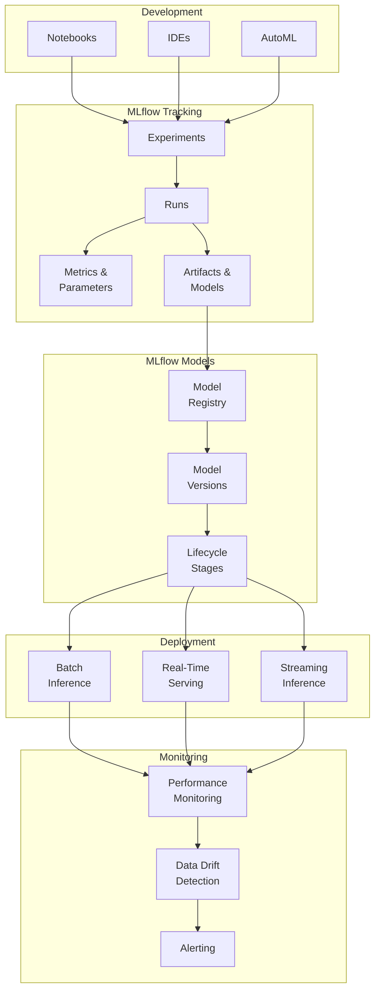
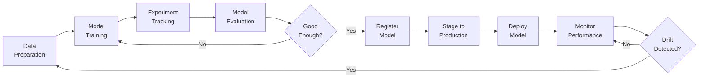

# 🤖 MLflow Integration

> **🏠 [Home](../../../../../README.md)** | **📖 [Overview](../../../../01-overview/README.md)** | **🛠️ [Services](../../../README.md)** | **💾 Analytics Compute** | **🧪 [Azure Databricks](../README.md)** | **🤖 MLflow Integration**


End-to-end machine learning lifecycle management with MLflow for experiment tracking, model registry, and deployment on Azure Databricks.

---

## 🌟 Overview

MLflow is an open-source platform for managing the complete machine learning lifecycle, including experimentation, reproducibility, deployment, and a central model registry. Azure Databricks provides a fully managed and integrated MLflow experience with enhanced security, scalability, and enterprise features.

### 🔥 Key Benefits

- **Experiment Tracking**: Log parameters, metrics, and artifacts automatically
- **Model Registry**: Centralized model management with versioning and lineage
- **Reproducibility**: Track code, data, and environment for every run
- **Deployment**: Deploy models to various endpoints (batch, real-time, streaming)
- **Collaboration**: Share experiments and models across teams
- **Integration**: Native integration with Azure ML and other Azure services

---

## 🏗️ Architecture

### MLflow Components



### ML Lifecycle with MLflow



---

## 🚀 Getting Started

### MLflow Tracking

#### Basic Experiment Tracking

```python
import mlflow
import mlflow.sklearn
from sklearn.ensemble import RandomForestClassifier
from sklearn.model_selection import train_test_split
from sklearn.metrics import accuracy_score, precision_score, recall_score

# Set experiment name
mlflow.set_experiment("/Users/data-scientist@company.com/customer-churn")

# Enable autologging (automatically logs parameters, metrics, and model)
mlflow.sklearn.autolog()

# Load data
df = spark.table("production.ml.customer_features").toPandas()
X = df.drop('churn', axis=1)
y = df['churn']

X_train, X_test, y_train, y_test = train_test_split(X, y, test_size=0.2, random_state=42)

# Start MLflow run
with mlflow.start_run(run_name="random-forest-baseline"):
    # Log parameters manually (if not using autolog)
    mlflow.log_param("test_size", 0.2)
    mlflow.log_param("random_state", 42)

    # Train model
    model = RandomForestClassifier(
        n_estimators=100,
        max_depth=10,
        random_state=42
    )
    model.fit(X_train, y_train)

    # Make predictions
    y_pred = model.predict(X_test)

    # Log metrics
    accuracy = accuracy_score(y_test, y_pred)
    precision = precision_score(y_test, y_pred)
    recall = recall_score(y_test, y_pred)

    mlflow.log_metric("accuracy", accuracy)
    mlflow.log_metric("precision", precision)
    mlflow.log_metric("recall", recall)

    # Log additional artifacts
    import matplotlib.pyplot as plt
    from sklearn.metrics import confusion_matrix, ConfusionMatrixDisplay

    cm = confusion_matrix(y_test, y_pred)
    disp = ConfusionMatrixDisplay(cm, display_labels=['Not Churned', 'Churned'])
    disp.plot()
    plt.savefig("confusion_matrix.png")
    mlflow.log_artifact("confusion_matrix.png")

    # Log feature importance
    import pandas as pd
    feature_importance = pd.DataFrame({
        'feature': X.columns,
        'importance': model.feature_importances_
    }).sort_values('importance', ascending=False)

    feature_importance.to_csv("feature_importance.csv", index=False)
    mlflow.log_artifact("feature_importance.csv")

    # Log model
    mlflow.sklearn.log_model(
        model,
        "model",
        registered_model_name="customer-churn-predictor"
    )

    print(f"Run ID: {mlflow.active_run().info.run_id}")
    print(f"Accuracy: {accuracy:.4f}")
```

#### Advanced Tracking with Custom Metrics

```python
import mlflow
import numpy as np
from sklearn.metrics import roc_auc_score, roc_curve
import matplotlib.pyplot as plt

with mlflow.start_run(run_name="advanced-metrics"):
    # ... training code ...

    # Log custom metrics over time (e.g., learning curves)
    for epoch in range(100):
        train_loss = model.train_loss_history[epoch]
        val_loss = model.val_loss_history[epoch]

        mlflow.log_metric("train_loss", train_loss, step=epoch)
        mlflow.log_metric("val_loss", val_loss, step=epoch)

    # Log probability predictions for AUC
    y_proba = model.predict_proba(X_test)[:, 1]
    auc = roc_auc_score(y_test, y_proba)
    mlflow.log_metric("auc", auc)

    # Log ROC curve
    fpr, tpr, thresholds = roc_curve(y_test, y_proba)
    plt.figure(figsize=(8, 6))
    plt.plot(fpr, tpr, label=f'ROC Curve (AUC = {auc:.4f})')
    plt.plot([0, 1], [0, 1], 'k--', label='Random')
    plt.xlabel('False Positive Rate')
    plt.ylabel('True Positive Rate')
    plt.title('ROC Curve')
    plt.legend()
    plt.savefig("roc_curve.png")
    mlflow.log_artifact("roc_curve.png")

    # Log dataset
    mlflow.log_input(
        mlflow.data.from_spark(
            spark.table("production.ml.customer_features"),
            table_name="production.ml.customer_features",
            version="v1.0"
        ),
        context="training"
    )
```

---

## 📦 Model Registry

### Register Models

```python
import mlflow
from mlflow.tracking import MlflowClient

client = MlflowClient()

# Option 1: Register during training
with mlflow.start_run():
    # ... training code ...
    mlflow.sklearn.log_model(
        model,
        "model",
        registered_model_name="customer-churn-predictor"
    )

# Option 2: Register existing run
run_id = "abc123xyz"
model_uri = f"runs:/{run_id}/model"

mlflow.register_model(
    model_uri=model_uri,
    name="customer-churn-predictor",
    tags={"team": "data-science", "algorithm": "random-forest"}
)

# Option 3: Register from artifact location
model_uri = "dbfs:/mnt/models/churn_model"
result = mlflow.register_model(model_uri, "customer-churn-predictor")

print(f"Model registered: {result.name}")
print(f"Version: {result.version}")
```

### Manage Model Versions

```python
from mlflow.tracking import MlflowClient

client = MlflowClient()
model_name = "customer-churn-predictor"

# List all versions
versions = client.search_model_versions(f"name='{model_name}'")
for v in versions:
    print(f"Version {v.version}: Stage={v.current_stage}, Run ID={v.run_id}")

# Get specific version
version = client.get_model_version(model_name, version=3)
print(f"Version 3 description: {version.description}")

# Update version description
client.update_model_version(
    name=model_name,
    version=3,
    description="Random Forest model with optimized hyperparameters. Accuracy: 0.92"
)

# Add tags to version
client.set_model_version_tag(
    name=model_name,
    version=3,
    key="validation_accuracy",
    value="0.92"
)

# Delete version (if not in production)
client.delete_model_version(
    name=model_name,
    version=1
)
```

### Model Stages & Lifecycle

```python
from mlflow.tracking import MlflowClient

client = MlflowClient()
model_name = "customer-churn-predictor"

# Transition to Staging
client.transition_model_version_stage(
    name=model_name,
    version=3,
    stage="Staging",
    archive_existing_versions=False
)

# Transition to Production (after validation)
client.transition_model_version_stage(
    name=model_name,
    version=3,
    stage="Production",
    archive_existing_versions=True  # Archive previous production models
)

# Archive old version
client.transition_model_version_stage(
    name=model_name,
    version=2,
    stage="Archived"
)

# Get current production model
production_versions = client.get_latest_versions(model_name, stages=["Production"])
if production_versions:
    prod_version = production_versions[0]
    print(f"Production model: Version {prod_version.version}")
```

---

## 🚀 Model Deployment

### Batch Inference

```python
import mlflow

# Load production model
model_name = "customer-churn-predictor"
model_uri = f"models:/{model_name}/Production"
model = mlflow.pyfunc.load_model(model_uri)

# Load data for scoring
input_data = spark.table("production.ml.customer_features_latest")

# Apply model as UDF
from pyspark.sql.functions import struct
from mlflow.pyfunc import spark_udf

predict_udf = spark_udf(
    spark,
    model_uri=model_uri,
    result_type="double"
)

# Score data
predictions = input_data.withColumn(
    "churn_probability",
    predict_udf(struct(*input_data.columns))
)

# Save predictions
predictions.write.format("delta").mode("overwrite").saveAsTable(
    "production.ml.churn_predictions"
)

display(predictions)
```

### Real-Time Model Serving

```python
# Create model serving endpoint
from databricks.sdk import WorkspaceClient
from databricks.sdk.service.serving import EndpointCoreConfigInput, ServedModelInput

w = WorkspaceClient()

# Create endpoint
endpoint_name = "churn-predictor-endpoint"

w.serving_endpoints.create(
    name=endpoint_name,
    config=EndpointCoreConfigInput(
        served_models=[
            ServedModelInput(
                model_name="customer-churn-predictor",
                model_version="3",
                workload_size="Small",
                scale_to_zero_enabled=True
            )
        ]
    )
)

# Wait for endpoint to be ready
import time
while True:
    endpoint = w.serving_endpoints.get(endpoint_name)
    if endpoint.state.ready == "READY":
        print(f"Endpoint {endpoint_name} is ready!")
        break
    time.sleep(30)
```

**Invoke endpoint**:

```python
import requests
import json

# Get endpoint URL
endpoint_url = f"https://{workspace_url}/serving-endpoints/{endpoint_name}/invocations"

# Prepare input
input_data = {
    "dataframe_records": [
        {
            "age": 35,
            "tenure": 24,
            "monthly_charges": 79.99,
            "total_charges": 1919.76
        }
    ]
}

# Get token
token = dbutils.notebook.entry_point.getDbutils().notebook().getContext().apiToken().get()

# Make prediction
headers = {
    "Authorization": f"Bearer {token}",
    "Content-Type": "application/json"
}

response = requests.post(endpoint_url, headers=headers, json=input_data)
predictions = response.json()

print(f"Prediction: {predictions}")
```

### Streaming Inference

```python
import mlflow

# Load model
model_uri = "models:/customer-churn-predictor/Production"
predict_udf = mlflow.pyfunc.spark_udf(spark, model_uri, result_type="double")

# Read streaming data
streaming_df = spark.readStream \
    .format("delta") \
    .table("production.streaming.customer_events")

# Apply model
predictions = streaming_df.withColumn(
    "churn_risk",
    predict_udf(struct(*feature_columns))
)

# Write predictions to Delta
query = predictions.writeStream \
    .format("delta") \
    .outputMode("append") \
    .option("checkpointLocation", "/mnt/checkpoints/churn_predictions") \
    .table("production.streaming.churn_predictions")

query.awaitTermination()
```

---

## 🤖 AutoML Integration

### Databricks AutoML

```python
from databricks import automl

# Prepare data
df = spark.table("production.ml.customer_features")

# Run AutoML
summary = automl.classify(
    dataset=df,
    target_col="churn",
    primary_metric="f1",
    timeout_minutes=30,
    max_trials=20
)

# Access best run
best_run = summary.best_trial

print(f"Best run ID: {best_run.mlflow_run_id}")
print(f"Best F1 score: {best_run.metrics['val_f1_score']}")

# Register best model
model_uri = f"runs:/{best_run.mlflow_run_id}/model"
mlflow.register_model(
    model_uri=model_uri,
    name="customer-churn-predictor-automl"
)
```

### Custom AutoML Pipeline

```python
import mlflow
from hyperopt import fmin, tpe, hp, STATUS_OK, Trials
from sklearn.ensemble import RandomForestClassifier
from sklearn.metrics import f1_score

# Define search space
search_space = {
    'n_estimators': hp.choice('n_estimators', [50, 100, 200, 300]),
    'max_depth': hp.choice('max_depth', [5, 10, 15, 20, None]),
    'min_samples_split': hp.uniform('min_samples_split', 0.01, 0.1),
    'min_samples_leaf': hp.uniform('min_samples_leaf', 0.01, 0.1)
}

# Objective function
def objective(params):
    with mlflow.start_run(nested=True):
        # Log parameters
        mlflow.log_params(params)

        # Train model
        model = RandomForestClassifier(**params, random_state=42)
        model.fit(X_train, y_train)

        # Evaluate
        y_pred = model.predict(X_test)
        f1 = f1_score(y_test, y_pred)

        # Log metrics
        mlflow.log_metric("f1_score", f1)

        # Log model
        mlflow.sklearn.log_model(model, "model")

        return {'loss': -f1, 'status': STATUS_OK}

# Run hyperparameter tuning
with mlflow.start_run(run_name="hyperparameter-tuning"):
    trials = Trials()
    best_params = fmin(
        fn=objective,
        space=search_space,
        algo=tpe.suggest,
        max_evals=50,
        trials=trials
    )

    print(f"Best parameters: {best_params}")
```

---

## 📊 Feature Store

### Create Feature Tables

```python
from databricks.feature_store import FeatureStoreClient

fs = FeatureStoreClient()

# Create feature table
customer_features = spark.table("production.ml.customer_features")

fs.create_table(
    name="production.ml.customer_feature_store",
    primary_keys=["customer_id"],
    df=customer_features,
    description="Customer behavioral features for churn prediction",
    tags={"team": "data-science", "domain": "customer-analytics"}
)
```

### Update Features

```python
from databricks.feature_store import FeatureStoreClient
from pyspark.sql.functions import col, avg, count, datediff, current_date

fs = FeatureStoreClient()

# Calculate new features
new_features = spark.table("production.sales.transactions") \
    .groupBy("customer_id") \
    .agg(
        count("transaction_id").alias("transaction_count_30d"),
        avg("amount").alias("avg_transaction_value_30d"),
        datediff(current_date(), max("transaction_date")).alias("days_since_last_purchase")
    )

# Write features
fs.write_table(
    name="production.ml.customer_feature_store",
    df=new_features,
    mode="merge"
)
```

### Train with Feature Store

```python
from databricks.feature_store import FeatureStoreClient, FeatureLookup

fs = FeatureStoreClient()

# Define feature lookups
feature_lookups = [
    FeatureLookup(
        table_name="production.ml.customer_feature_store",
        lookup_key="customer_id"
    ),
    FeatureLookup(
        table_name="production.ml.product_features",
        lookup_key="product_id"
    )
]

# Create training dataset
training_set = fs.create_training_set(
    df=spark.table("production.ml.labels"),
    feature_lookups=feature_lookups,
    label="churn",
    exclude_columns=["customer_id"]
)

# Load as pandas
training_df = training_set.load_df().toPandas()

# Train model
import mlflow.sklearn
from sklearn.ensemble import RandomForestClassifier

with mlflow.start_run():
    model = RandomForestClassifier()
    model.fit(training_df.drop("churn", axis=1), training_df["churn"])

    # Log model with feature store metadata
    fs.log_model(
        model=model,
        artifact_path="model",
        flavor=mlflow.sklearn,
        training_set=training_set,
        registered_model_name="churn-predictor-with-features"
    )
```

### Batch Scoring with Features

```python
from databricks.feature_store import FeatureStoreClient

fs = FeatureStoreClient()

# Load model
model_uri = "models:/churn-predictor-with-features/Production"

# Score using feature store
predictions = fs.score_batch(
    model_uri=model_uri,
    df=spark.table("production.ml.customers_to_score"),
    result_type="double"
)

display(predictions)
```

---

## 📈 Model Monitoring

### Track Model Performance

```python
import mlflow

# Log production metrics
with mlflow.start_run(run_name="production-monitoring"):
    # Calculate metrics on production data
    production_data = spark.table("production.ml.churn_predictions_last_30d")

    actual_churn = production_data.filter(col("actual_churn") == 1).count()
    predicted_churn = production_data.filter(col("churn_probability") > 0.5).count()

    mlflow.log_metric("actual_churn_rate", actual_churn / production_data.count())
    mlflow.log_metric("predicted_churn_rate", predicted_churn / production_data.count())

    # Log drift metrics
    from scipy.stats import ks_2samp

    training_data = spark.table("production.ml.training_data_snapshot")

    for column in numerical_columns:
        stat, p_value = ks_2samp(
            training_data.select(column).toPandas()[column],
            production_data.select(column).toPandas()[column]
        )
        mlflow.log_metric(f"drift_{column}_ks_statistic", stat)
        mlflow.log_metric(f"drift_{column}_p_value", p_value)
```

### Data Drift Detection

```python
from pyspark.sql.functions import col, mean, stddev

# Calculate statistics for training data
training_stats = spark.table("production.ml.training_data") \
    .select([
        mean(col(c)).alias(f"{c}_mean") for c in numerical_columns
    ] + [
        stddev(col(c)).alias(f"{c}_stddev") for c in numerical_columns
    ]).collect()[0]

# Calculate statistics for production data
production_stats = spark.table("production.ml.production_data_latest") \
    .select([
        mean(col(c)).alias(f"{c}_mean") for c in numerical_columns
    ] + [
        stddev(col(c)).alias(f"{c}_stddev") for c in numerical_columns
    ]).collect()[0]

# Detect drift
drift_detected = False
for column in numerical_columns:
    train_mean = training_stats[f"{column}_mean"]
    prod_mean = production_stats[f"{column}_mean"]

    # Simple threshold-based drift detection
    drift_pct = abs(prod_mean - train_mean) / train_mean * 100

    print(f"{column}: {drift_pct:.2f}% drift")

    if drift_pct > 10:  # 10% threshold
        drift_detected = True
        print(f"⚠️ Significant drift detected in {column}")

if drift_detected:
    # Trigger retraining
    dbutils.notebook.run("/path/to/retraining_notebook", timeout_seconds=3600)
```

---

## 🔧 Best Practices

### Experiment Organization

```python
# Use hierarchical experiment naming
mlflow.set_experiment("/teams/data-science/customer-churn/q1-2025")

# Tag runs for easy filtering
with mlflow.start_run():
    mlflow.set_tags({
        "team": "data-science",
        "project": "customer-churn",
        "model_type": "classification",
        "algorithm": "random-forest",
        "environment": "production"
    })

    # ... training code ...

# Search experiments
from mlflow.tracking import MlflowClient

client = MlflowClient()
experiments = client.search_experiments(
    filter_string="tags.project = 'customer-churn'"
)
```

### Model Versioning Strategy

```yaml
Version Naming Convention:
  - Major version: Significant algorithm change
  - Minor version: Hyperparameter tuning
  - Patch version: Bug fixes

Model Stages:
  - None: Initial registration
  - Staging: Under validation
  - Production: Live in production
  - Archived: Deprecated or superseded

Tags to Include:
  - algorithm: random-forest, xgboost, neural-network
  - accuracy: 0.92
  - training_date: 2025-01-28
  - data_version: v1.5
  - team: data-science
  - jira_ticket: ML-1234
```

### MLOps Workflow

```python
# 1. Development
with mlflow.start_run(experiment_id="dev-experiment"):
    # Train and log model
    mlflow.sklearn.log_model(model, "model")

# 2. Register to staging
run_id = mlflow.active_run().info.run_id
result = mlflow.register_model(f"runs:/{run_id}/model", "my-model")

client.transition_model_version_stage(
    name="my-model",
    version=result.version,
    stage="Staging"
)

# 3. Validate in staging
# Run validation tests...

# 4. Promote to production
if validation_passed:
    client.transition_model_version_stage(
        name="my-model",
        version=result.version,
        stage="Production",
        archive_existing_versions=True
    )

# 5. Monitor production performance
# Set up monitoring dashboards and alerts
```

---

## 🆘 Troubleshooting

### Common Issues

**Issue**: Model artifacts not loading

```python
# Solution: Check artifact location
import mlflow

run_id = "abc123xyz"
run = mlflow.get_run(run_id)
print(f"Artifact URI: {run.info.artifact_uri}")

# Verify artifacts exist
artifacts = mlflow.artifacts.list_artifacts(run_id)
for artifact in artifacts:
    print(f"  - {artifact.path}")
```

**Issue**: Model serving endpoint fails

```python
# Solution: Check endpoint logs
from databricks.sdk import WorkspaceClient

w = WorkspaceClient()
endpoint = w.serving_endpoints.get("endpoint-name")

print(f"State: {endpoint.state.ready}")
print(f"Config: {endpoint.state.config_update}")

# Get logs
logs = w.serving_endpoints.logs(name="endpoint-name", served_model_name="model-name")
for log in logs.logs:
    print(log)
```

**Issue**: Feature store lookup fails

```python
# Solution: Verify feature table exists and has correct schema
from databricks.feature_store import FeatureStoreClient

fs = FeatureStoreClient()

# Check feature table
feature_table = fs.get_table("catalog.schema.feature_table")
print(f"Primary keys: {feature_table.primary_keys}")
print(f"Features: {feature_table.features}")

# Verify lookup key exists in both tables
lookup_df = spark.table("catalog.schema.lookup_table")
feature_df = spark.table("catalog.schema.feature_table")

print(f"Lookup keys in lookup_df: {lookup_df.select('lookup_key').distinct().count()}")
print(f"Lookup keys in feature_df: {feature_df.select('lookup_key').distinct().count()}")
```

---

## 📚 Related Resources

- [**Azure Databricks Overview**](../README.md)
- [**Model Deployment Patterns**](../../../../03-architecture-patterns/ml-patterns/model-deployment.md)
- [**MLOps Best Practices**](../../../../05-best-practices/service-specific/databricks/mlops.md)
- [**Feature Engineering Guide**](../../../../04-implementation-guides/databricks/feature-engineering.md)

---

## 🎯 Next Steps

1. **[Set Up Feature Store](../../../../04-implementation-guides/databricks/feature-store-setup.md)** - Centralize features
2. **[Implement Model Monitoring](../../../../04-implementation-guides/databricks/model-monitoring.md)** - Track performance
3. **[Deploy Production Pipeline](../../../../04-implementation-guides/databricks/mlops-pipeline.md)** - Automate MLOps

---

*Last Updated: 2025-01-28*
*MLflow Version: 2.9+*
*Documentation Status: Complete*
