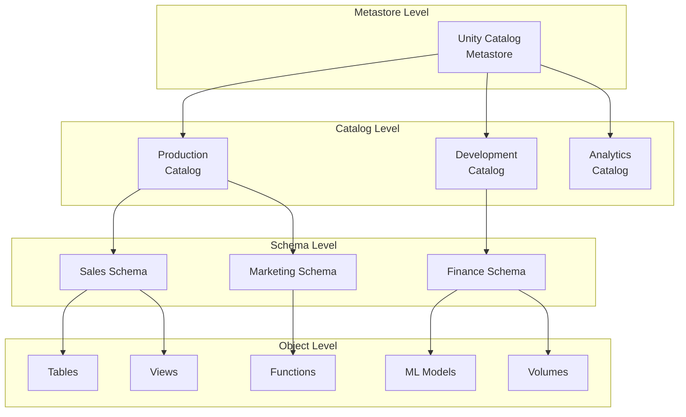
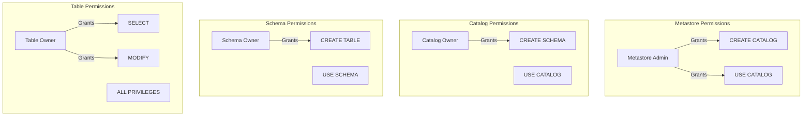

# 🗄️ Unity Catalog

> **🏠 [Home](../../../../../README.md)** | **📖 [Overview](../../../../01-overview/README.md)** | **🛠️ [Services](../../../README.md)** | **💾 Analytics Compute** | **🧪 [Azure Databricks](../README.md)** | **🗄️ Unity Catalog**


Unified governance solution for data and AI assets across Azure Databricks workspaces with centralized access control, audit logging, and data discovery.

---

## 🌟 Overview

Unity Catalog is a unified governance solution for all data and AI assets in Azure Databricks, including files, tables, machine learning models, and dashboards. It provides centralized access control, auditing, lineage, and data discovery across multiple workspaces.

### 🔥 Key Benefits

- **Centralized Governance**: Single source of truth for all data assets
- **Fine-Grained Access Control**: Row, column, and attribute-based permissions
- **Data Lineage**: Automatic tracking from source to consumption
- **Data Discovery**: Search and browse across all workspaces
- **Secure Data Sharing**: Share data across workspaces and organizations
- **Compliance**: Built-in audit logging and access tracking

---

## 🏗️ Architecture

### Unity Catalog Hierarchy



### Three-Level Namespace

```
metastore
  └── catalog                 # Environment or business unit
      └── schema              # Functional area or domain
          └── table/view      # Data asset
```

**Example**:
```sql
-- Three-level namespace
SELECT * FROM production.sales.customers;
--                 |        |      |
--              catalog  schema  table
```

---

## 🚀 Getting Started

### Prerequisites

```yaml
Requirements:
  - Azure Databricks Premium or Enterprise tier
  - Account Administrator role
  - Azure Active Directory integration
  - Storage account for metastore

Permissions:
  - Account Admin (for metastore creation)
  - Workspace Admin (for workspace assignment)
  - Metastore Admin (for governance setup)
```

### Create Unity Catalog Metastore

#### Step 1: Create Storage for Metastore

```bash
# Variables
RESOURCE_GROUP="rg-databricks-unity"
LOCATION="eastus"
STORAGE_ACCOUNT="saunitycatalog"
CONTAINER="metastore"

# Create storage account
az storage account create \
  --name $STORAGE_ACCOUNT \
  --resource-group $RESOURCE_GROUP \
  --location $LOCATION \
  --sku Standard_LRS \
  --kind StorageV2 \
  --enable-hierarchical-namespace true

# Create container
az storage container create \
  --name $CONTAINER \
  --account-name $STORAGE_ACCOUNT \
  --auth-mode login
```

#### Step 2: Create Service Principal

```bash
# Create service principal
SP=$(az ad sp create-for-rbac \
  --name "sp-unity-catalog" \
  --role "Storage Blob Data Contributor" \
  --scopes "/subscriptions/$SUBSCRIPTION_ID/resourceGroups/$RESOURCE_GROUP/providers/Microsoft.Storage/storageAccounts/$STORAGE_ACCOUNT")

# Extract credentials
APP_ID=$(echo $SP | jq -r '.appId')
CLIENT_SECRET=$(echo $SP | jq -r '.password')
TENANT_ID=$(echo $SP | jq -r '.tenant')

echo "Application ID: $APP_ID"
echo "Client Secret: $CLIENT_SECRET"
echo "Tenant ID: $TENANT_ID"
```

#### Step 3: Create Metastore (via Databricks UI)

1. Go to **Account Console** → **Data**
2. Click **Create Metastore**
3. Configure:

```yaml
Metastore Name: metastore-prod
Region: East US
Storage Location: abfss://metastore@saunitycatalog.dfs.core.windows.net/
Access Connector:
  Application ID: [from step 2]
  Directory ID: [tenant-id]
  Secret: [client-secret]
```

4. Click **Create**

#### Step 4: Assign Workspace to Metastore

```python
# Using Databricks SDK
from databricks.sdk import AccountClient
from databricks.sdk.service import catalog

# Initialize account client
account = AccountClient()

# Assign workspace to metastore
account.metastores.assign(
    workspace_id="workspace-id",
    metastore_id="metastore-id",
    default_catalog_name="production"
)
```

---

## 📊 Core Concepts

### Catalogs

Catalogs are the top-level container for organizing data assets, typically by environment or business unit.

```sql
-- Create catalog
CREATE CATALOG production
COMMENT 'Production data catalog';

-- Create development catalog
CREATE CATALOG development
COMMENT 'Development and testing catalog';

-- List catalogs
SHOW CATALOGS;

-- Set default catalog
USE CATALOG production;
```

### Schemas (Databases)

Schemas organize tables and views by functional area.

```sql
-- Create schema
CREATE SCHEMA production.sales
COMMENT 'Sales and revenue data'
LOCATION 'abfss://data@storage.dfs.core.windows.net/sales';

-- Create managed schema (Unity Catalog manages storage)
CREATE SCHEMA production.marketing;

-- List schemas
SHOW SCHEMAS IN production;

-- Use schema
USE production.sales;
```

### Tables

Unity Catalog supports both managed and external tables.

```sql
-- Managed table (UC manages storage)
CREATE TABLE production.sales.customers (
  customer_id BIGINT,
  name STRING,
  email STRING,
  country STRING,
  created_date DATE
)
USING DELTA
COMMENT 'Customer master data';

-- External table (you manage storage)
CREATE TABLE production.sales.transactions
USING DELTA
LOCATION 'abfss://data@storage.dfs.core.windows.net/transactions'
COMMENT 'Sales transactions';

-- Create table from query
CREATE TABLE production.sales.monthly_revenue AS
SELECT
  DATE_TRUNC('month', order_date) as month,
  SUM(amount) as revenue
FROM production.sales.transactions
GROUP BY DATE_TRUNC('month', order_date);
```

### Volumes

Volumes provide governed access to non-tabular data (files, images, models).

```sql
-- Create managed volume
CREATE VOLUME production.ml.model_artifacts
COMMENT 'ML model artifacts and weights';

-- Create external volume
CREATE EXTERNAL VOLUME production.ml.training_data
LOCATION 'abfss://ml@storage.dfs.core.windows.net/training';

-- List volumes
SHOW VOLUMES IN production.ml;
```

**Access volumes in Python**:

```python
# Write to volume
with open('/Volumes/production/ml/model_artifacts/model.pkl', 'wb') as f:
    pickle.dump(model, f)

# Read from volume
with open('/Volumes/production/ml/model_artifacts/model.pkl', 'rb') as f:
    loaded_model = pickle.load(f)

# List files in volume
dbutils.fs.ls('/Volumes/production/ml/model_artifacts/')
```

---

## 🔒 Access Control

### Permission Model



### Grant Permissions

```sql
-- Catalog-level permissions
GRANT USE CATALOG ON CATALOG production TO `data_analysts@company.com`;
GRANT CREATE SCHEMA ON CATALOG production TO `data_engineers@company.com`;

-- Schema-level permissions
GRANT USE SCHEMA ON SCHEMA production.sales TO `sales_team@company.com`;
GRANT CREATE TABLE ON SCHEMA production.sales TO `data_engineers@company.com`;

-- Table-level permissions
GRANT SELECT ON TABLE production.sales.customers TO `analysts@company.com`;
GRANT SELECT, MODIFY ON TABLE production.sales.transactions TO `data_engineers@company.com`;
GRANT ALL PRIVILEGES ON TABLE production.sales.revenue TO `finance_team@company.com`;

-- Grant to groups
GRANT SELECT ON SCHEMA production.sales TO `sales_analysts`;

-- View grants
SHOW GRANTS ON TABLE production.sales.customers;
```

### Row-Level Security

```sql
-- Create row filter function
CREATE FUNCTION production.sales.region_filter()
RETURN
  CASE
    WHEN IS_ACCOUNT_GROUP_MEMBER('emea_team') THEN region = 'EMEA'
    WHEN IS_ACCOUNT_GROUP_MEMBER('americas_team') THEN region = 'Americas'
    WHEN IS_ACCOUNT_GROUP_MEMBER('apac_team') THEN region = 'APAC'
    ELSE FALSE
  END;

-- Apply row filter to table
ALTER TABLE production.sales.transactions
SET ROW FILTER production.sales.region_filter ON (region);

-- Users will only see rows for their region
SELECT * FROM production.sales.transactions;
```

### Column-Level Security (Masking)

```sql
-- Create masking function for PII
CREATE FUNCTION production.sales.mask_email(email STRING)
RETURN CASE
  WHEN IS_ACCOUNT_GROUP_MEMBER('pii_access') THEN email
  ELSE CONCAT(LEFT(email, 3), '***@***.com')
END;

-- Apply column mask
ALTER TABLE production.sales.customers
ALTER COLUMN email SET MASK production.sales.mask_email;

-- Non-privileged users see masked data
SELECT email FROM production.sales.customers;
-- Returns: abc***@***.com

-- Privileged users see actual data
-- Returns: abc@example.com
```

### Dynamic Views for Security

```sql
-- Create dynamic view based on user context
CREATE VIEW production.sales.customers_by_region AS
SELECT
  customer_id,
  name,
  email,
  country,
  region
FROM production.sales.customers
WHERE
  -- Regional access
  CASE
    WHEN IS_ACCOUNT_GROUP_MEMBER('emea_team') THEN region = 'EMEA'
    WHEN IS_ACCOUNT_GROUP_MEMBER('americas_team') THEN region = 'Americas'
    WHEN IS_ACCOUNT_GROUP_MEMBER('global_team') THEN TRUE
    ELSE FALSE
  END;

-- Grant access to view
GRANT SELECT ON VIEW production.sales.customers_by_region TO `regional_teams`;
```

---

## 🔍 Data Discovery & Lineage

### Data Discovery

```sql
-- Search for tables
SHOW TABLES IN production LIKE '*customer*';

-- Search across catalogs
SELECT
  catalog_name,
  schema_name,
  table_name,
  table_type,
  comment
FROM system.information_schema.tables
WHERE table_name LIKE '%sales%';

-- Get table details
DESCRIBE TABLE EXTENDED production.sales.customers;

-- Get table properties
SHOW TBLPROPERTIES production.sales.customers;
```

### Data Lineage

Unity Catalog automatically tracks lineage:

```python
# Query lineage API
from databricks.sdk import WorkspaceClient

w = WorkspaceClient()

# Get table lineage
lineage = w.lineage.get_table_lineage(
    table_name="production.sales.monthly_revenue"
)

# Upstream dependencies
print("Upstream tables:")
for upstream in lineage.upstream_tables:
    print(f"  - {upstream.full_name}")

# Downstream consumers
print("Downstream tables:")
for downstream in lineage.downstream_tables:
    print(f"  - {downstream.full_name}")
```

**Lineage visualization** is available in Databricks UI:
- Navigate to **Data** → Select table → **Lineage** tab

---

## 🤝 Data Sharing

### Delta Sharing

Share data securely with external organizations.

#### Set Up as Provider

```sql
-- Create share
CREATE SHARE sales_analytics_share
COMMENT 'Quarterly sales data for partners';

-- Add tables to share
ALTER SHARE sales_analytics_share
ADD TABLE production.sales.quarterly_summary;

-- Create recipient
CREATE RECIPIENT partner_corp
COMMENT 'Partner Corporation';

-- Grant access
GRANT SELECT ON SHARE sales_analytics_share TO RECIPIENT partner_corp;

-- Generate activation link
-- (Done via UI or API)
```

#### Consume as Recipient

```python
# Configure Delta Sharing client
import delta_sharing

# Create profile file
profile = {
    "shareCredentialsVersion": 1,
    "endpoint": "https://sharing.databricks.com/delta-sharing/",
    "bearerToken": "activation-token"
}

# List available shares
client = delta_sharing.SharingClient(profile)
shares = client.list_all_tables()

# Read shared data
df = delta_sharing.load_as_spark("profile.share.schema.table")
display(df)
```

### Cross-Workspace Sharing

```sql
-- Create external location for sharing
CREATE EXTERNAL LOCATION shared_data
URL 'abfss://shared@storage.dfs.core.windows.net/'
WITH (STORAGE CREDENTIAL shared_credential);

-- Grant access to other workspace
GRANT READ FILES ON EXTERNAL LOCATION shared_data TO `workspace_b_service_principal`;

-- In workspace B, create table referencing shared location
CREATE TABLE workspace_b.shared.data
USING DELTA
LOCATION 'abfss://shared@storage.dfs.core.windows.net/data';
```

---

## 📊 Monitoring & Auditing

### Audit Logging

```sql
-- Query audit logs
SELECT
  event_time,
  user_identity.email,
  action_name,
  request_params.full_name_arg as object_name,
  response.status_code
FROM system.access.audit
WHERE action_name LIKE '%TABLE%'
  AND event_date >= CURRENT_DATE - 7
ORDER BY event_time DESC;

-- Track access patterns
SELECT
  request_params.full_name_arg as table_name,
  COUNT(*) as access_count,
  COUNT(DISTINCT user_identity.email) as unique_users
FROM system.access.audit
WHERE action_name = 'getTable'
  AND event_date >= CURRENT_DATE - 30
GROUP BY table_name
ORDER BY access_count DESC;

-- Monitor permission changes
SELECT
  event_time,
  user_identity.email as changed_by,
  action_name,
  request_params.securable_type,
  request_params.securable_full_name,
  request_params.principal
FROM system.access.audit
WHERE action_name IN ('createGrant', 'revokeGrant')
  AND event_date >= CURRENT_DATE - 7
ORDER BY event_time DESC;
```

### Compliance Reporting

```sql
-- PII access report
CREATE OR REPLACE VIEW governance.compliance.pii_access_report AS
SELECT
  DATE_TRUNC('day', event_time) as access_date,
  user_identity.email as user,
  request_params.full_name_arg as table_name,
  COUNT(*) as access_count
FROM system.access.audit
WHERE request_params.full_name_arg IN (
  SELECT CONCAT(catalog_name, '.', schema_name, '.', table_name)
  FROM system.information_schema.tables
  WHERE comment LIKE '%PII%'
)
GROUP BY access_date, user, table_name;

-- Grant permission report
CREATE OR REPLACE VIEW governance.compliance.permissions_summary AS
SELECT
  catalog_name,
  schema_name,
  table_name,
  grantee,
  privilege_type,
  grantor
FROM system.information_schema.table_privileges
ORDER BY catalog_name, schema_name, table_name;
```

---

## 🔧 Advanced Patterns

### Multi-Environment Strategy

```sql
-- Catalog per environment
CREATE CATALOG dev COMMENT 'Development environment';
CREATE CATALOG staging COMMENT 'Staging environment';
CREATE CATALOG prod COMMENT 'Production environment';

-- Consistent schema structure across environments
CREATE SCHEMA dev.sales;
CREATE SCHEMA staging.sales;
CREATE SCHEMA prod.sales;

-- Promote data across environments
CREATE TABLE staging.sales.customers AS
SELECT * FROM dev.sales.customers
WHERE validation_status = 'PASSED';

CREATE TABLE prod.sales.customers AS
SELECT * FROM staging.sales.customers
WHERE ready_for_prod = TRUE;
```

### Data Quality with Constraints

```sql
-- Add constraints to ensure data quality
ALTER TABLE production.sales.customers
ADD CONSTRAINT valid_email CHECK (email RLIKE '^[A-Za-z0-9._%+-]+@[A-Za-z0-9.-]+\\.[A-Z|a-z]{2,}$');

ALTER TABLE production.sales.transactions
ADD CONSTRAINT positive_amount CHECK (amount > 0);

ALTER TABLE production.sales.transactions
ADD CONSTRAINT valid_customer FOREIGN KEY (customer_id) REFERENCES production.sales.customers(customer_id);

-- View constraints
SHOW TBLPROPERTIES production.sales.customers;
```

### Lifecycle Management

```sql
-- Set table retention
ALTER TABLE production.sales.transactions
SET TBLPROPERTIES (
  'delta.logRetentionDuration' = '30 days',
  'delta.deletedFileRetentionDuration' = '7 days'
);

-- Implement data retention policy
CREATE OR REPLACE FUNCTION production.sales.cleanup_old_data()
RETURNS VOID
LANGUAGE SQL
AS $$
  DELETE FROM production.sales.transactions
  WHERE transaction_date < CURRENT_DATE - INTERVAL 7 YEARS;

  VACUUM production.sales.transactions RETAIN 168 HOURS;
$$;

-- Schedule cleanup job
CREATE JOB monthly_cleanup
SCHEDULE CRON '0 0 1 * *'
AS CALL production.sales.cleanup_old_data();
```

---

## 💰 Best Practices

### Organization Structure

```yaml
Recommended Catalog Structure:
  - production: Live production data
  - staging: Pre-production validation
  - development: Development and testing
  - analytics: Curated analytics datasets
  - sandbox: User experimentation

Schema Organization:
  - By business domain: sales, marketing, finance
  - By data source: salesforce, google_analytics, erp
  - By function: raw, processed, aggregated
```

### Security Best Practices

1. **Principle of Least Privilege**: Grant minimum required permissions
2. **Use Groups**: Manage permissions via AAD groups, not individual users
3. **Audit Regularly**: Review access logs and permissions quarterly
4. **Automate Provisioning**: Use CI/CD for permission management
5. **Encrypt Sensitive Data**: Use column masking for PII
6. **Implement Row-Level Security**: For multi-tenant scenarios

### Performance Optimization

```sql
-- Use Delta Lake optimizations
ALTER TABLE production.sales.transactions
SET TBLPROPERTIES (
  'delta.autoOptimize.optimizeWrite' = 'true',
  'delta.autoOptimize.autoCompact' = 'true'
);

-- Partition large tables
CREATE TABLE production.sales.transactions_partitioned (
  transaction_id BIGINT,
  customer_id BIGINT,
  amount DECIMAL(10,2),
  transaction_date DATE
)
USING DELTA
PARTITIONED BY (transaction_date);

-- Z-order for query performance
OPTIMIZE production.sales.transactions
ZORDER BY (customer_id, product_id);
```

---

## 🆘 Troubleshooting

### Common Issues

**Issue**: Cannot access table after metastore migration

```sql
-- Solution: Grant USE CATALOG permission
GRANT USE CATALOG ON CATALOG production TO `user@company.com`;
GRANT USE SCHEMA ON SCHEMA production.sales TO `user@company.com`;
GRANT SELECT ON TABLE production.sales.customers TO `user@company.com`;
```

**Issue**: External location access denied

```bash
# Solution: Verify storage credential permissions
az role assignment list \
  --assignee $APP_ID \
  --scope "/subscriptions/$SUBSCRIPTION_ID/resourceGroups/$RESOURCE_GROUP/providers/Microsoft.Storage/storageAccounts/$STORAGE_ACCOUNT"

# Add missing permission
az role assignment create \
  --assignee $APP_ID \
  --role "Storage Blob Data Contributor" \
  --scope "/subscriptions/$SUBSCRIPTION_ID/resourceGroups/$RESOURCE_GROUP/providers/Microsoft.Storage/storageAccounts/$STORAGE_ACCOUNT"
```

**Issue**: Table shows as "Not accessible"

```sql
-- Check table location
DESCRIBE EXTENDED production.sales.customers;

-- Verify external location permissions
SHOW GRANTS ON EXTERNAL LOCATION data_lake;

-- Re-grant access if needed
GRANT READ FILES, WRITE FILES ON EXTERNAL LOCATION data_lake TO `data_engineers`;
```

### Diagnostic Queries

```sql
-- Check current user's permissions
SHOW GRANTS ON CATALOG production;
SHOW GRANTS ON SCHEMA production.sales;
SHOW GRANTS ON TABLE production.sales.customers;

-- List all principals with access to a table
SELECT
  grantee,
  privilege_type,
  is_grantable
FROM system.information_schema.table_privileges
WHERE table_catalog = 'production'
  AND table_schema = 'sales'
  AND table_name = 'customers';

-- Find orphaned tables (no owner)
SELECT
  CONCAT(table_catalog, '.', table_schema, '.', table_name) as full_name
FROM system.information_schema.tables
WHERE table_owner IS NULL
  OR table_owner = '';
```

---

## 🎯 Migration Guide

### Migrating from Hive Metastore

```python
# Step 1: Sync existing tables to Unity Catalog
from databricks.sdk import WorkspaceClient

w = WorkspaceClient()

# List Hive tables
hive_tables = spark.sql("SHOW TABLES IN default").collect()

# Create corresponding Unity Catalog tables
for table in hive_tables:
    table_name = table.tableName

    # Create managed table in Unity Catalog
    spark.sql(f"""
        CREATE TABLE production.migrated.{table_name}
        AS SELECT * FROM default.{table_name}
    """)

    print(f"Migrated: {table_name}")

# Step 2: Update queries to use three-level namespace
# Old: SELECT * FROM table_name
# New: SELECT * FROM catalog.schema.table_name

# Step 3: Grant permissions
spark.sql("""
    GRANT SELECT ON SCHEMA production.migrated TO `users@company.com`
""")
```

---

## 📚 Related Resources

- [**Azure Databricks Overview**](../README.md)
- [**Delta Live Tables**](../delta-live-tables/README.md)
- [**Security Best Practices**](../../../../05-best-practices/cross-cutting-concerns/security/unity-catalog-security.md)
- [**Data Governance Patterns**](../../../../03-architecture-patterns/governance-patterns/README.md)

---

## 🎯 Next Steps

1. **[Set Up External Locations](../../../../04-implementation-guides/databricks/unity-catalog-external-locations.md)** - Configure data access
2. **[Implement Row-Level Security](../../../../04-implementation-guides/databricks/row-level-security.md)** - Fine-grained access
3. **[Configure Delta Sharing](../../../../04-implementation-guides/databricks/delta-sharing-setup.md)** - Share data externally

---

*Last Updated: 2025-01-28*
*Unity Catalog Version: Current*
*Documentation Status: Complete*
