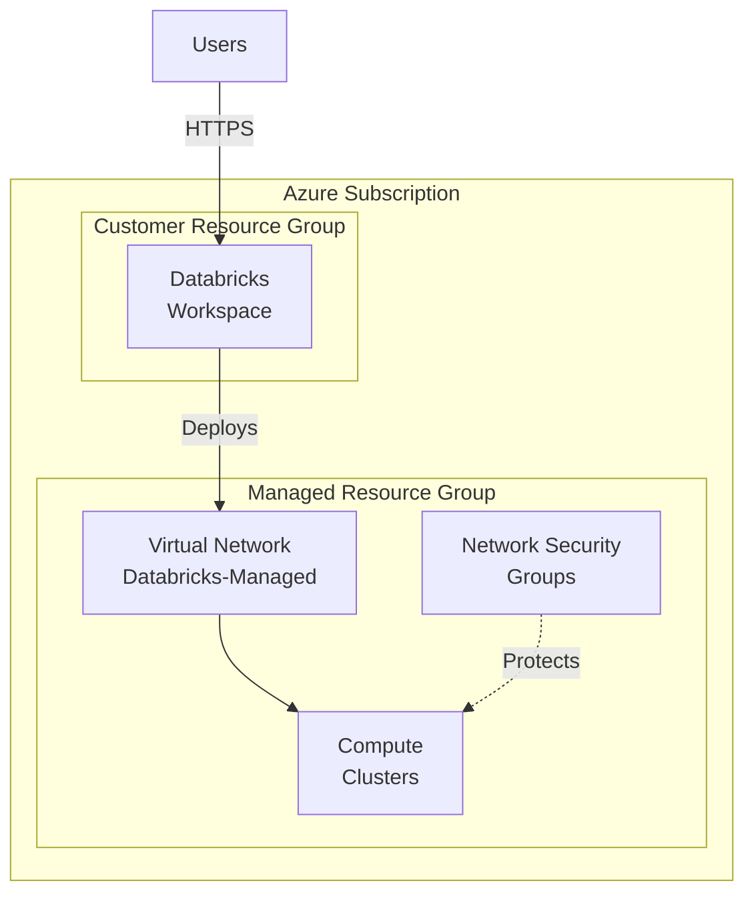
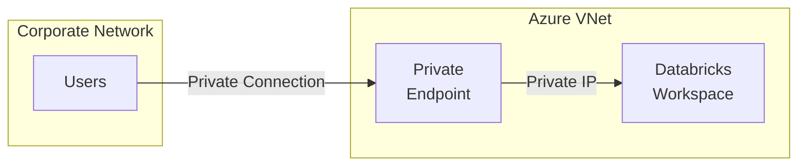

# 🏗️ Azure Databricks Workspace Setup

> **🏠 [Home](../../../../README.md)** | **📖 [Overview](../../../01-overview/README.md)** | **🛠️ [Services](../../README.md)** | **💾 Analytics Compute** | **🧪 [Azure Databricks](README.md)** | **🏗️ Workspace Setup**


Complete guide for creating, configuring, and securing Azure Databricks workspaces for production use.

---

## 📋 Table of Contents

- [Prerequisites](#prerequisites)
- [Workspace Creation](#workspace-creation)
- [Network Configuration](#network-configuration)
- [Storage Configuration](#storage-configuration)
- [Cluster Configuration](#cluster-configuration)
- [Security Setup](#security-setup)
- [Access Control](#access-control)
- [Integration Setup](#integration-setup)
- [Best Practices](#best-practices)
- [Troubleshooting](#troubleshooting)

---

## ✅ Prerequisites

### Required Azure Resources

- **Azure Subscription** with sufficient permissions
- **Resource Group** for Databricks workspace
- **Azure Active Directory** access for authentication
- **Network Resources** (optional): VNet, subnets, NSGs
- **Storage Account** (optional): For external data storage

### Required Permissions

| Resource | Role Required | Scope |
|----------|--------------|-------|
| **Subscription** | Contributor or Owner | Subscription level |
| **Resource Group** | Contributor | Resource group level |
| **Network** | Network Contributor | VNet level (if using VNet injection) |
| **Azure AD** | Application Administrator | For service principal creation |

### Tools & CLI

```bash
# Install Azure CLI
curl -sL https://aka.ms/InstallAzureCLIDeb | sudo bash

# Login to Azure
az login

# Install Databricks CLI
pip install databricks-cli

# Verify installation
databricks --version
```

---

## 🚀 Workspace Creation

### Method 1: Azure Portal (Recommended for First-Time Setup)

#### Step 1: Navigate to Azure Portal

1. Go to [Azure Portal](https://portal.azure.com)
2. Click **Create a resource**
3. Search for **Azure Databricks**
4. Click **Create**

#### Step 2: Configure Basics

```yaml
Subscription: [Your subscription]
Resource Group: rg-databricks-prod
Workspace Name: dbx-analytics-prod
Region: East US
Pricing Tier: Premium (recommended for production)
```

> **💡 Tip**: Use **Premium** tier for production workloads to get RBAC, audit logging, and Unity Catalog support.

#### Step 3: Configure Networking (Optional)

**Standard Deployment** (Simple):
- No VNet injection
- Databricks-managed networking
- Public IP addresses

**VNet Injection** (Enterprise):
- Deploy into your VNet
- Private IPs only
- Custom DNS and routing
- Network security controls

#### Step 4: Advanced Settings

```yaml
Tags:
  Environment: Production
  Department: Analytics
  CostCenter: CC-12345

Managed Resource Group:
  Name: rg-databricks-prod-managed
  Location: Same as workspace

Encryption:
  Enable Customer-Managed Keys: Yes (optional)
  Key Vault: kv-databricks-prod
```

#### Step 5: Review + Create

1. Review all settings
2. Click **Create**
3. Wait for deployment (5-10 minutes)

### Method 2: Azure CLI

```bash
# Set variables
SUBSCRIPTION_ID="your-subscription-id"
RESOURCE_GROUP="rg-databricks-prod"
LOCATION="eastus"
WORKSPACE_NAME="dbx-analytics-prod"
MANAGED_RG="rg-databricks-prod-managed"
PRICING_TIER="premium"

# Set subscription
az account set --subscription $SUBSCRIPTION_ID

# Create resource group
az group create \
  --name $RESOURCE_GROUP \
  --location $LOCATION \
  --tags Environment=Production Department=Analytics

# Create Databricks workspace
az databricks workspace create \
  --resource-group $RESOURCE_GROUP \
  --name $WORKSPACE_NAME \
  --location $LOCATION \
  --sku $PRICING_TIER \
  --managed-resource-group $MANAGED_RG \
  --tags Environment=Production Department=Analytics

# Get workspace details
az databricks workspace show \
  --resource-group $RESOURCE_GROUP \
  --name $WORKSPACE_NAME \
  --output table
```

### Method 3: ARM Template

**Template**: `azuredeploy.json`

```json
{
  "$schema": "https://schema.management.azure.com/schemas/2019-04-01/deploymentTemplate.json#",
  "contentVersion": "1.0.0.0",
  "parameters": {
    "workspaceName": {
      "type": "string",
      "metadata": {
        "description": "Name of the Azure Databricks workspace"
      }
    },
    "pricingTier": {
      "type": "string",
      "defaultValue": "premium",
      "allowedValues": ["standard", "premium"],
      "metadata": {
        "description": "Pricing tier for the workspace"
      }
    },
    "location": {
      "type": "string",
      "defaultValue": "[resourceGroup().location]",
      "metadata": {
        "description": "Location for all resources"
      }
    }
  },
  "variables": {
    "managedResourceGroupName": "[concat('databricks-rg-', parameters('workspaceName'), '-', uniqueString(parameters('workspaceName'), resourceGroup().id))]"
  },
  "resources": [
    {
      "type": "Microsoft.Databricks/workspaces",
      "apiVersion": "2023-02-01",
      "name": "[parameters('workspaceName')]",
      "location": "[parameters('location')]",
      "sku": {
        "name": "[parameters('pricingTier')]"
      },
      "properties": {
        "managedResourceGroupId": "[subscriptionResourceId('Microsoft.Resources/resourceGroups', variables('managedResourceGroupName'))]"
      }
    }
  ],
  "outputs": {
    "workspaceId": {
      "type": "string",
      "value": "[resourceId('Microsoft.Databricks/workspaces', parameters('workspaceName'))]"
    },
    "workspaceUrl": {
      "type": "string",
      "value": "[reference(resourceId('Microsoft.Databricks/workspaces', parameters('workspaceName'))).workspaceUrl]"
    }
  }
}
```

**Deploy**:

```bash
az deployment group create \
  --resource-group $RESOURCE_GROUP \
  --template-file azuredeploy.json \
  --parameters workspaceName=$WORKSPACE_NAME pricingTier=premium
```

---

## 🌐 Network Configuration

### Standard Deployment Architecture



### VNet Injection (Secure Cluster Connectivity)

#### Prerequisites for VNet Injection

```yaml
VNet Requirements:
  - Two subnets (public and private)
  - Minimum /26 CIDR per subnet (64 addresses)
  - No conflicting address spaces
  - NSG rules configured

NSG Requirements:
  - Allow Azure Databricks control plane communication
  - Allow inter-cluster communication
  - Allow access to Azure services
```

#### Create VNet and Subnets

```bash
# Create VNet
az network vnet create \
  --resource-group $RESOURCE_GROUP \
  --name vnet-databricks \
  --address-prefix 10.1.0.0/16 \
  --location $LOCATION

# Create public subnet
az network vnet subnet create \
  --resource-group $RESOURCE_GROUP \
  --vnet-name vnet-databricks \
  --name snet-databricks-public \
  --address-prefix 10.1.1.0/24

# Create private subnet
az network vnet subnet create \
  --resource-group $RESOURCE_GROUP \
  --vnet-name vnet-databricks \
  --name snet-databricks-private \
  --address-prefix 10.1.2.0/24
```

#### Configure Network Security Groups

```bash
# Create NSG for public subnet
az network nsg create \
  --resource-group $RESOURCE_GROUP \
  --name nsg-databricks-public

# Create NSG for private subnet
az network nsg create \
  --resource-group $RESOURCE_GROUP \
  --name nsg-databricks-private

# Associate NSGs with subnets
az network vnet subnet update \
  --resource-group $RESOURCE_GROUP \
  --vnet-name vnet-databricks \
  --name snet-databricks-public \
  --network-security-group nsg-databricks-public

az network vnet subnet update \
  --resource-group $RESOURCE_GROUP \
  --vnet-name vnet-databricks \
  --name snet-databricks-private \
  --network-security-group nsg-databricks-private
```

#### Required NSG Rules

```bash
# Allow Azure Databricks control plane (Control Plane to Cluster)
az network nsg rule create \
  --resource-group $RESOURCE_GROUP \
  --nsg-name nsg-databricks-public \
  --name Allow-Databricks-ControlPlane \
  --priority 100 \
  --direction Inbound \
  --access Allow \
  --protocol Tcp \
  --source-address-prefixes AzureDatabricks \
  --source-port-ranges '*' \
  --destination-address-prefixes '*' \
  --destination-port-ranges 22 443

# Allow inter-cluster communication
az network nsg rule create \
  --resource-group $RESOURCE_GROUP \
  --nsg-name nsg-databricks-public \
  --name Allow-Internal-Communication \
  --priority 110 \
  --direction Inbound \
  --access Allow \
  --protocol '*' \
  --source-address-prefixes VirtualNetwork \
  --source-port-ranges '*' \
  --destination-address-prefixes VirtualNetwork \
  --destination-port-ranges '*'
```

#### Deploy Workspace with VNet Injection

```bash
# Get VNet ID
VNET_ID=$(az network vnet show \
  --resource-group $RESOURCE_GROUP \
  --name vnet-databricks \
  --query id -o tsv)

# Get subnet IDs
PUBLIC_SUBNET_ID=$(az network vnet subnet show \
  --resource-group $RESOURCE_GROUP \
  --vnet-name vnet-databricks \
  --name snet-databricks-public \
  --query id -o tsv)

PRIVATE_SUBNET_ID=$(az network vnet subnet show \
  --resource-group $RESOURCE_GROUP \
  --vnet-name vnet-databricks \
  --name snet-databricks-private \
  --query id -o tsv)

# Create workspace with VNet injection
az databricks workspace create \
  --resource-group $RESOURCE_GROUP \
  --name $WORKSPACE_NAME \
  --location $LOCATION \
  --sku premium \
  --custom-virtual-network-id $VNET_ID \
  --custom-public-subnet-name snet-databricks-public \
  --custom-private-subnet-name snet-databricks-private \
  --no-public-ip
```

### Private Link Configuration



**Enable Private Link**:

```bash
# Create private endpoint
az network private-endpoint create \
  --name pe-databricks \
  --resource-group $RESOURCE_GROUP \
  --vnet-name vnet-databricks \
  --subnet snet-private-endpoints \
  --private-connection-resource-id $WORKSPACE_ID \
  --group-ids databricks_ui_api \
  --connection-name dbx-private-connection

# Create private DNS zone
az network private-dns zone create \
  --resource-group $RESOURCE_GROUP \
  --name privatelink.azuredatabricks.net

# Link DNS zone to VNet
az network private-dns link vnet create \
  --resource-group $RESOURCE_GROUP \
  --zone-name privatelink.azuredatabricks.net \
  --name databricks-dns-link \
  --virtual-network vnet-databricks \
  --registration-enabled false
```

---

## 💾 Storage Configuration

### Default Storage (DBFS)

Databricks File System (DBFS) is automatically provisioned with every workspace.

```python
# Access DBFS
dbutils.fs.ls("dbfs:/")

# Upload file to DBFS
dbutils.fs.cp("file:/tmp/data.csv", "dbfs:/FileStore/data.csv")

# List files
display(dbutils.fs.ls("dbfs:/FileStore/"))
```

> **⚠️ Warning**: DBFS is ephemeral and tied to workspace lifecycle. Use external storage for production data.

### External Storage - Azure Data Lake Storage Gen2

#### Create Storage Account

```bash
# Create storage account
az storage account create \
  --name sadatabricksprod \
  --resource-group $RESOURCE_GROUP \
  --location $LOCATION \
  --sku Standard_LRS \
  --kind StorageV2 \
  --enable-hierarchical-namespace true

# Create container
az storage container create \
  --name data \
  --account-name sadatabricksprod \
  --auth-mode login
```

#### Mount Storage to Databricks

**Option 1: Service Principal Authentication** (Recommended)

```python
# Create service principal
configs = {
  "fs.azure.account.auth.type": "OAuth",
  "fs.azure.account.oauth.provider.type": "org.apache.hadoop.fs.azurebfs.oauth2.ClientCredsTokenProvider",
  "fs.azure.account.oauth2.client.id": "<application-id>",
  "fs.azure.account.oauth2.client.secret": dbutils.secrets.get(scope="<scope-name>", key="<secret-key>"),
  "fs.azure.account.oauth2.client.endpoint": "https://login.microsoftonline.com/<tenant-id>/oauth2/token"
}

# Mount storage
dbutils.fs.mount(
  source = "abfss://data@sadatabricksprod.dfs.core.windows.net/",
  mount_point = "/mnt/data",
  extra_configs = configs
)

# Verify mount
display(dbutils.fs.ls("/mnt/data"))
```

**Option 2: Unity Catalog External Locations** (Recommended for Unity Catalog)

```sql
-- Create storage credential
CREATE STORAGE CREDENTIAL azure_storage_credential
WITH (
  AZURE_SERVICE_PRINCIPAL = 'application-id',
  AZURE_CLIENT_SECRET = 'client-secret',
  AZURE_TENANT_ID = 'tenant-id'
);

-- Create external location
CREATE EXTERNAL LOCATION data_lake
URL 'abfss://data@sadatabricksprod.dfs.core.windows.net/'
WITH (STORAGE CREDENTIAL azure_storage_credential);

-- Grant access
GRANT CREATE TABLE ON EXTERNAL LOCATION data_lake TO `data_engineers`;
```

---

## ⚙️ Cluster Configuration

### Cluster Types

| Type | Use Case | Cost | Lifetime | Best For |
|------|----------|------|----------|----------|
| **All-Purpose** | Interactive notebooks | Higher DBU | Manual termination | Development, exploration |
| **Job** | Scheduled workloads | Lower DBU | Job duration only | Production ETL, scheduled jobs |
| **SQL Warehouse** | SQL analytics | Medium DBU | Auto-scaling | BI tools, SQL queries |

### Create All-Purpose Cluster

**Via Portal**:

1. Navigate to **Compute** in Databricks workspace
2. Click **Create Cluster**
3. Configure:

```yaml
Cluster Name: interactive-cluster
Cluster Mode: Standard
Databricks Runtime: 13.3 LTS (Scala 2.12, Spark 3.4.1)
Use Photon Acceleration: Yes (for SQL workloads)
Autopilot Options:
  Enable autoscaling local storage: Yes
Auto Termination: 120 minutes
Worker Type: Standard_DS3_v2
Workers: Min 2, Max 8
Driver Type: Standard_DS3_v2
Advanced Options:
  Spot instances: 50% (for dev)
  Init scripts: /dbfs/init/install-packages.sh
```

**Via CLI**:

```bash
# Configure Databricks CLI
databricks configure --token

# Create cluster config JSON
cat > cluster-config.json <<EOF
{
  "cluster_name": "interactive-cluster",
  "spark_version": "13.3.x-scala2.12",
  "node_type_id": "Standard_DS3_v2",
  "driver_node_type_id": "Standard_DS3_v2",
  "autoscale": {
    "min_workers": 2,
    "max_workers": 8
  },
  "auto_termination_minutes": 120,
  "enable_elastic_disk": true,
  "runtime_engine": "PHOTON"
}
EOF

# Create cluster
databricks clusters create --json-file cluster-config.json
```

### Cluster Pools

Reduce cluster start time by maintaining a pool of idle instances.

```json
{
  "instance_pool_name": "general-purpose-pool",
  "min_idle_instances": 0,
  "max_capacity": 10,
  "node_type_id": "Standard_DS3_v2",
  "idle_instance_autotermination_minutes": 15,
  "preloaded_spark_versions": [
    "13.3.x-scala2.12"
  ]
}
```

**Benefits**:
- 80% faster cluster startup
- Cost-effective for frequent cluster creation
- Ideal for job workloads

---

## 🔒 Security Setup

### Azure Active Directory Integration

**Enable AAD Authentication**:

1. Navigate to workspace in Azure Portal
2. Go to **Authentication** settings
3. Enable **Azure Active Directory** SSO
4. Configure user/group assignments

**Assign Users**:

```bash
# Add user to workspace
az role assignment create \
  --assignee user@company.com \
  --role "Contributor" \
  --scope $WORKSPACE_ID
```

### Secrets Management with Azure Key Vault

#### Create Key Vault

```bash
# Create Key Vault
az keyvault create \
  --name kv-databricks-prod \
  --resource-group $RESOURCE_GROUP \
  --location $LOCATION \
  --enable-soft-delete true \
  --enable-purge-protection true

# Add secret
az keyvault secret set \
  --vault-name kv-databricks-prod \
  --name storage-account-key \
  --value "your-storage-account-key"
```

#### Configure Databricks Secret Scope

```python
# Create secret scope backed by Key Vault
# Note: This is done via UI at https://<databricks-instance>#secrets/createScope

# Use secret in notebook
storage_key = dbutils.secrets.get(scope="key-vault-scope", key="storage-account-key")

spark.conf.set(
  "fs.azure.account.key.sadatabricksprod.dfs.core.windows.net",
  storage_key
)
```

### Enable Audit Logging

```bash
# Create Log Analytics workspace
az monitor log-analytics workspace create \
  --resource-group $RESOURCE_GROUP \
  --workspace-name law-databricks

# Get workspace ID
LA_WORKSPACE_ID=$(az monitor log-analytics workspace show \
  --resource-group $RESOURCE_GROUP \
  --workspace-name law-databricks \
  --query id -o tsv)

# Configure diagnostic settings
az monitor diagnostic-settings create \
  --name databricks-audit-logs \
  --resource $WORKSPACE_ID \
  --workspace $LA_WORKSPACE_ID \
  --logs '[{"category": "dbfs","enabled": true},{"category": "clusters","enabled": true},{"category": "accounts","enabled": true},{"category": "jobs","enabled": true},{"category": "notebook","enabled": true},{"category": "ssh","enabled": true},{"category": "workspace","enabled": true}]'
```

---

## 👥 Access Control

### Workspace Access Levels

| Role | Permissions | Use Case |
|------|-------------|----------|
| **Admin** | Full control | Workspace administrators |
| **User** | Create clusters, notebooks | Data engineers, scientists |
| **Reader** | View-only access | Auditors, stakeholders |

### Table Access Control

```sql
-- Grant table permissions
GRANT SELECT ON TABLE sales_data TO `analysts@company.com`;

-- Grant schema permissions
GRANT USAGE ON SCHEMA analytics TO `data_engineers`;

-- Row-level security
CREATE ROW FILTER region_filter ON sales_data
FOR SELECT
WHEN user() = 'regional_manager@company.com'
THEN region = 'EMEA';
```

### Cluster Policies

Enforce organizational standards with cluster policies.

```json
{
  "cluster_type": {
    "type": "fixed",
    "value": "all-purpose"
  },
  "spark_version": {
    "type": "regex",
    "pattern": "13\\.3\\..*-scala2\\.12"
  },
  "node_type_id": {
    "type": "allowlist",
    "values": ["Standard_DS3_v2", "Standard_DS4_v2"]
  },
  "autotermination_minutes": {
    "type": "range",
    "minValue": 10,
    "maxValue": 180
  }
}
```

---

## 🔗 Integration Setup

### Power BI Integration

```python
# Create SQL endpoint for Power BI
from databricks.sdk import WorkspaceClient

w = WorkspaceClient()

# Create SQL warehouse
warehouse = w.warehouses.create(
    name="powerbi-warehouse",
    cluster_size="2X-Small",
    min_num_clusters=1,
    max_num_clusters=3,
    auto_stop_mins=20
)

# Get connection details
print(f"Server Hostname: {warehouse.jdbc_url}")
print(f"HTTP Path: {warehouse.http_path}")
```

**Connect from Power BI**:
1. Get Data → Azure → Azure Databricks
2. Enter Server Hostname and HTTP Path
3. Authenticate with Azure AD
4. Select tables and load

### Azure Data Factory Integration

```json
{
  "name": "DatabricksLinkedService",
  "type": "Microsoft.DataFactory/factories/linkedservices",
  "properties": {
    "type": "AzureDatabricks",
    "typeProperties": {
      "domain": "https://adb-123456789.12.azuredatabricks.net",
      "authentication": "MSI",
      "workspaceResourceId": "/subscriptions/{subscription}/resourceGroups/{rg}/providers/Microsoft.Databricks/workspaces/{workspace}",
      "existingClusterId": "{cluster-id}"
    }
  }
}
```

---

## ✅ Best Practices

### Resource Naming Conventions

```yaml
Workspace: dbx-{environment}-{region}-{workload}
Clusters: clstr-{purpose}-{size}
Notebooks: nb-{project}-{function}
Jobs: job-{frequency}-{workload}

Examples:
  - dbx-prod-eastus-analytics
  - clstr-etl-large
  - nb-sales-processing
  - job-daily-revenue-calc
```

### Cost Management

```python
# Set cluster auto-termination
spark.conf.set("spark.databricks.cluster.autoTermination.minutes", "30")

# Use spot instances for dev
{
  "azure_attributes": {
    "spot_bid_max_price": -1,
    "first_on_demand": 1,
    "availability": "SPOT_WITH_FALLBACK_AZURE"
  }
}

# Monitor costs
%sql
SELECT
  usage_date,
  SUM(usage_quantity * list_price) as daily_cost
FROM system.billing.usage
WHERE usage_date >= CURRENT_DATE - 30
GROUP BY usage_date
ORDER BY usage_date DESC
```

### Security Hardening

1. **Enable Private Link** for all workspaces
2. **Use Unity Catalog** for centralized governance
3. **Rotate secrets** regularly via Key Vault
4. **Enable audit logging** for compliance
5. **Implement RBAC** at all levels
6. **Use service principals** for automation
7. **Encrypt data** with customer-managed keys

---

## 🆘 Troubleshooting

### Common Setup Issues

**Issue**: Workspace creation fails with VNet injection

```bash
# Solution: Verify subnet delegation
az network vnet subnet update \
  --resource-group $RESOURCE_GROUP \
  --vnet-name vnet-databricks \
  --name snet-databricks-public \
  --delegations Microsoft.Databricks/workspaces
```

**Issue**: Cannot access workspace after creation

```bash
# Solution: Add firewall rule
az databricks workspace update \
  --resource-group $RESOURCE_GROUP \
  --name $WORKSPACE_NAME \
  --public-network-access Enabled
```

**Issue**: Cluster fails to start

```python
# Check cluster logs
cluster_id = "0123-456789-abc123"
logs = w.clusters.get(cluster_id=cluster_id)
print(logs.state_message)
```

### Diagnostic Queries

```sql
-- Check audit logs
SELECT timestamp, action_name, user_identity, response
FROM system.access.audit
WHERE action_name LIKE '%CLUSTER%'
ORDER BY timestamp DESC
LIMIT 100;

-- Monitor cluster utilization
SELECT
  cluster_id,
  AVG(cpu_utilization) as avg_cpu,
  AVG(memory_utilization) as avg_memory
FROM system.compute.clusters
WHERE timestamp >= CURRENT_TIMESTAMP - INTERVAL 1 DAY
GROUP BY cluster_id;
```

---

## 🎯 Next Steps

1. **[Configure Unity Catalog](unity-catalog/README.md)** - Set up centralized governance
2. **[Create Delta Live Tables Pipeline](delta-live-tables/README.md)** - Build ETL workflows
3. **[Set Up MLflow](mlflow-integration/README.md)** - Enable ML lifecycle management
4. **[Implement Security](../../../05-best-practices/cross-cutting-concerns/security/databricks-security.md)** - Harden your deployment

---

## 📚 Related Resources

- [**Azure Databricks Documentation**](https://docs.microsoft.com/azure/databricks/)
- [**Networking Best Practices**](../../../05-best-practices/cross-cutting-concerns/networking/databricks-networking.md)
- [**Security Hardening Guide**](../../../05-best-practices/cross-cutting-concerns/security/databricks-security.md)
- [**Cost Optimization**](../../../05-best-practices/cross-cutting-concerns/cost-optimization/databricks-costs.md)

---

*Last Updated: 2025-01-28*
*Databricks Runtime: 13.3 LTS*
*Documentation Status: Complete*
