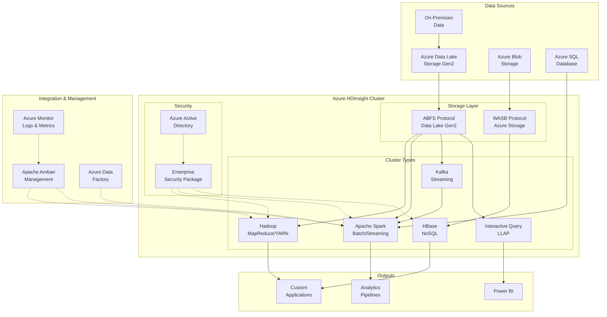
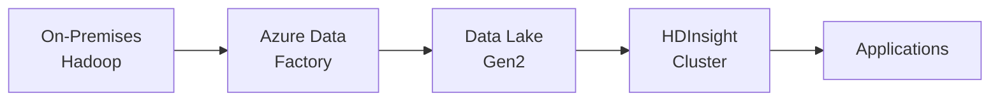
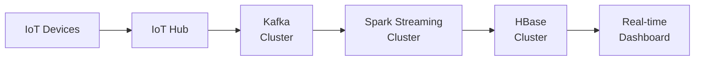
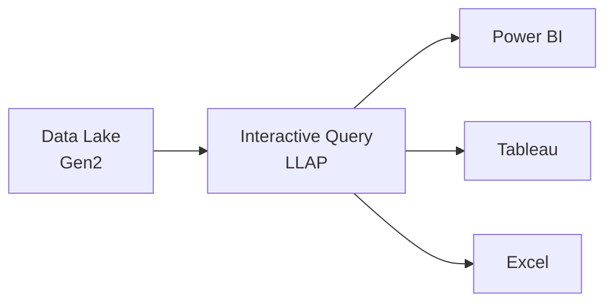
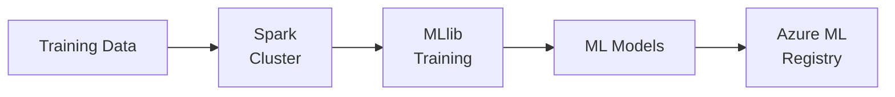

# 🐘 Azure HDInsight

> **🏠 [Home](../../../../README.md)** | **📖 [Overview](../../../01-overview/README.md)** | **🛠️ [Services](../../README.md)** | **💾 Analytics Compute** | **🐘 Azure HDInsight**


Fully managed cloud service for deploying and managing Apache Hadoop, Spark, HBase, Kafka, and other open-source big data frameworks with enterprise-grade security and reliability.

---

## 🌟 Service Overview

Azure HDInsight is a fully managed, cloud-based Apache Hadoop distribution that makes it easy, fast, and cost-effective to process massive amounts of data. Built on the proven Apache ecosystem, HDInsight provides enterprise-grade security, reliability, and scalability for big data workloads while maintaining compatibility with on-premises Hadoop investments.

### 🔥 Key Value Propositions

- **Open Source Ecosystem**: Full support for Apache Hadoop, Spark, HBase, Kafka, Storm, and Interactive Query
- **Enterprise Security**: Enterprise Security Package (ESP) with Active Directory integration
- **Cost Effective**: Pay only for compute resources when clusters are running
- **Hybrid Capability**: Seamless integration with on-premises Hadoop environments
- **Scalability**: Scale clusters up or down based on workload demands
- **No Infrastructure Management**: Focus on analytics, not infrastructure

### 🎯 When to Use HDInsight

**Primary Use Cases**:

- Migrating existing on-premises Hadoop workloads to Azure
- Running custom Apache applications and frameworks
- Cost-optimized big data processing for batch workloads
- Kafka-based streaming architectures
- HBase NoSQL database workloads
- Legacy Hadoop system modernization

**Consider Alternatives When**:

- Need serverless compute options → **Azure Synapse Analytics**
- Focus on advanced ML/data science → **Azure Databricks**
- Require unified analytics workspace → **Azure Synapse Analytics**
- Need managed Delta Lake capabilities → **Azure Databricks or Synapse**

---

## 🏗️ Architecture Overview



---

## 🛠️ Cluster Types

HDInsight supports multiple Apache ecosystem technologies, each optimized for specific workloads.

### 🗂️ [Hadoop Clusters](cluster-types.md#hadoop-clusters)


Traditional MapReduce and YARN-based batch processing.

**Key Features**:

- MapReduce 2.0 (MRv2) processing engine
- YARN resource management
- Hive for SQL-like queries
- Pig for data flow scripting
- Sqoop for database imports/exports

**Best For**: Batch ETL, data transformation, legacy Hadoop migrations

**[📖 Detailed Guide →](cluster-types.md#hadoop-clusters)**

---

### 🔥 [Spark Clusters](cluster-types.md#spark-clusters)


Unified analytics engine for batch and streaming processing.

**Key Features**:

- Apache Spark 3.x with Scala, Python, R, Java
- Spark SQL, Spark Streaming, MLlib, GraphX
- In-memory processing for fast analytics
- Delta Lake support for ACID transactions
- Integration with Jupyter and Zeppelin notebooks

**Best For**: Real-time analytics, machine learning, graph processing, iterative algorithms

**[📖 Detailed Guide →](cluster-types.md#spark-clusters)**

---

### 📊 [HBase Clusters](cluster-types.md#hbase-clusters)


Distributed, scalable NoSQL database for random real-time access.

**Key Features**:

- Column-family storage model
- Automatic sharding and replication
- Real-time read/write access
- Phoenix SQL layer for HBase
- Integration with Spark and Kafka

**Best For**: IoT sensor data, user profiles, time-series data, real-time lookups

**[📖 Detailed Guide →](cluster-types.md#hbase-clusters)**

---

### 📡 [Kafka Clusters](cluster-types.md#kafka-clusters)


Distributed streaming platform for building real-time data pipelines.

**Key Features**:

- Apache Kafka 2.x with Kafka Streams
- High-throughput message broker
- Durable message storage
- Stream processing capabilities
- Integration with Spark Structured Streaming

**Best For**: Event streaming, log aggregation, real-time pipelines, microservices messaging

**[📖 Detailed Guide →](cluster-types.md#kafka-clusters)**

---

### ⚡ [Interactive Query Clusters (LLAP)](cluster-types.md#interactive-query-clusters)


Hive LLAP (Low Latency Analytical Processing) for fast interactive queries.

**Key Features**:

- In-memory caching for sub-second queries
- Hive 3.x with ACID transactions
- Materialized views and query results caching
- BI tool integration (Power BI, Tableau)
- Concurrent query execution

**Best For**: Interactive BI, ad-hoc analytics, data exploration, self-service analytics

**[📖 Detailed Guide →](cluster-types.md#interactive-query-clusters)**

---

## 📊 Cluster Type Comparison

| Feature | Hadoop | Spark | HBase | Kafka | Interactive Query |
|---------|--------|-------|-------|-------|------------------|
| **Primary Use** | Batch ETL | Batch & Streaming | NoSQL Database | Event Streaming | Interactive SQL |
| **Processing Model** | MapReduce | In-Memory | Key-Value Store | Pub-Sub | SQL Queries |
| **Latency** | Minutes-Hours | Seconds-Minutes | Milliseconds | Milliseconds | Seconds |
| **Data Volume** | TB-PB | GB-TB | TB-PB | GB-TB | TB |
| **Query Language** | Hive SQL, Pig | SQL, Python, Scala | HBase API, Phoenix SQL | Kafka Streams | HiveQL |
| **ACID Support** | Limited | Delta Lake | Row-level | No | Yes (Hive 3.x) |
| **Real-time** | ❌ No | ✅ Yes | ✅ Yes | ✅ Yes | ⚠️ Near real-time |
| **ML Support** | Limited | ✅ MLlib | ❌ No | ❌ No | ❌ No |
| **Storage** | HDFS/ADLS | HDFS/ADLS | HBase/HDFS | Kafka Topics | HDFS/ADLS |
| **Typical Cluster Size** | 4-100+ nodes | 4-50 nodes | 3-100+ nodes | 3-20 nodes | 4-30 nodes |

---

## 💰 Pricing & Cost Management

### Pricing Model

HDInsight uses a **VM-based pricing model** with no platform fees.

**Cost Components**:

1. **Virtual Machine Costs**: Standard Azure VM pricing
2. **Storage Costs**: Azure Storage or Data Lake Gen2
3. **Networking Costs**: Egress and Virtual Network charges
4. **Support Costs**: Azure support plans (optional)

**No Platform Fees**: Unlike Databricks, HDInsight doesn't charge DBUs

### 💡 Cost Optimization Strategies

#### 1. Right-size Clusters

```bash
# Use appropriate VM sizes for workload
Head Nodes: D13 v2 (8 cores, 56 GB) - always on
Worker Nodes: D4 v2 (8 cores, 28 GB) - auto-scale
```

#### 2. Auto-scaling

Enable auto-scaling to adjust worker nodes based on demand:

```json
{
  "minInstanceCount": 3,
  "maxInstanceCount": 20,
  "recurrence": {
    "timeZone": "Eastern Standard Time",
    "schedule": [
      {
        "days": ["Monday", "Tuesday", "Wednesday", "Thursday", "Friday"],
        "timeAndCapacity": {
          "time": "08:00",
          "minInstanceCount": 10,
          "maxInstanceCount": 20
        }
      }
    ]
  }
}
```

#### 3. Cluster Lifecycle Management

- **Create clusters on-demand**: For batch workloads, create and delete clusters
- **Use Azure Data Factory**: Automate cluster creation/deletion
- **Idle timeout**: Configure auto-pause for development clusters

#### 4. Storage Optimization

- **Separate compute and storage**: Use Azure Data Lake Gen2
- **Storage tiering**: Move cold data to archive tier
- **Compression**: Enable compression for stored data

#### 5. Reserved Instances

Save up to 72% with Azure Reserved VM Instances for production clusters.

**[📖 Detailed Cost Guide →](../../../05-best-practices/cross-cutting-concerns/cost-optimization/hdinsight-cost-optimization.md)**

---

## 🚀 Quick Start Guide

### Prerequisites

- Azure subscription
- Azure CLI installed
- Resource group created

### 1️⃣ Create Storage Account

```bash
# Create storage account for cluster
az storage account create \
  --name hdinsightstorage \
  --resource-group rg-hdinsight-demo \
  --location eastus \
  --sku Standard_LRS \
  --enable-hierarchical-namespace true

# Create container
az storage container create \
  --name hdinsight-data \
  --account-name hdinsightstorage
```

### 2️⃣ Create Spark Cluster

```bash
# Create HDInsight Spark cluster
az hdinsight create \
  --name spark-cluster-demo \
  --resource-group rg-hdinsight-demo \
  --type Spark \
  --component-version Spark=3.1 \
  --cluster-tier Standard \
  --http-user admin \
  --http-password YourPassword123! \
  --ssh-user sshuser \
  --ssh-password YourSSHPassword123! \
  --storage-account hdinsightstorage \
  --storage-container hdinsight-data \
  --headnode-size Standard_D13_v2 \
  --workernode-count 3 \
  --workernode-size Standard_D4_v2 \
  --version 4.0 \
  --location eastus
```

### 3️⃣ Submit Spark Job

```bash
# Submit PySpark job
az hdinsight script-action execute \
  --cluster-name spark-cluster-demo \
  --name submit-spark-job \
  --resource-group rg-hdinsight-demo \
  --roles headnode \
  --script-uri https://yourstorage.blob.core.windows.net/scripts/spark-job.py
```

### 4️⃣ Access Cluster UIs

- **Ambari**: `https://spark-cluster-demo.azurehdinsight.net`
- **Jupyter Notebooks**: `https://spark-cluster-demo.azurehdinsight.net/jupyter`
- **Spark History Server**: `https://spark-cluster-demo.azurehdinsight.net/sparkhistory`

---

## 🔧 Configuration & Management

### Apache Ambari

HDInsight uses Apache Ambari for cluster management and monitoring.

**Key Capabilities**:

- Cluster configuration management
- Service start/stop/restart
- Performance metrics and alerts
- Configuration version control
- Custom service installation

**Access**: `https://<clustername>.azurehdinsight.net`

### Security Configuration

#### Enterprise Security Package (ESP)

Enable Active Directory integration for enterprise security:

```bash
az hdinsight create \
  --name secure-cluster \
  --esp \
  --cluster-admin-account admin@yourdomain.com \
  --cluster-users-group-dns hdi-users \
  --domain /subscriptions/.../resourceGroups/.../providers/Microsoft.AAD/domainServices/yourdomain.com \
  --ldaps-urls ldaps://yourdomain.com:636
```

**ESP Features**:

- Azure AD authentication
- Apache Ranger for authorization
- Apache Atlas for data governance
- Audit logging and compliance

#### Network Security

```bash
# Create cluster in virtual network
az hdinsight create \
  --vnet-name hdi-vnet \
  --subnet hdi-subnet \
  --no-wait
```

**[📖 Security Best Practices →](../../../05-best-practices/cross-cutting-concerns/security/hdinsight-security.md)**

### Monitoring & Logging

**Azure Monitor Integration**:

```bash
# Enable Azure Monitor logs
az hdinsight monitor enable \
  --name spark-cluster-demo \
  --resource-group rg-hdinsight-demo \
  --workspace /subscriptions/.../resourceGroups/.../providers/Microsoft.OperationalInsights/workspaces/hdi-workspace
```

**Key Metrics**:

- CPU and memory utilization
- YARN application metrics
- HDFS storage metrics
- Kafka broker metrics
- HBase region server metrics

**[📖 Monitoring Guide →](../../../09-monitoring/service-monitoring/hdinsight/README.md)**

---

## 🔗 Integration Patterns

### Azure Data Factory

Orchestrate HDInsight clusters with Data Factory pipelines:

```json
{
  "name": "SparkPipeline",
  "properties": {
    "activities": [
      {
        "name": "HDInsight Spark Activity",
        "type": "HDInsightSpark",
        "linkedServiceName": {
          "referenceName": "HDInsightLinkedService",
          "type": "LinkedServiceReference"
        },
        "typeProperties": {
          "rootPath": "adl://datalake.azuredatalakestore.net/scripts/",
          "entryFilePath": "spark-job.py",
          "sparkJobLinkedService": {
            "referenceName": "AzureStorageLinkedService",
            "type": "LinkedServiceReference"
          }
        }
      }
    ]
  }
}
```

### Power BI

Connect Power BI to Interactive Query clusters:

1. **Power BI Desktop** → Get Data → Azure HDInsight Spark
2. **Direct Query** mode for real-time dashboards
3. **Import** mode for cached reports

### Azure Machine Learning

Use HDInsight Spark for distributed model training:

```python
from azureml.core import Workspace, Dataset
from azureml.core.compute import HDInsightCompute

# Connect to workspace
ws = Workspace.from_config()

# Attach HDInsight cluster
hdi_compute = HDInsightCompute.attach(
    workspace=ws,
    name="spark-cluster",
    resource_id="/subscriptions/.../providers/Microsoft.HDInsight/clusters/spark-cluster-demo",
    username="admin",
    password="YourPassword123!"
)
```

**[📖 Integration Examples →](../../../04-implementation-guides/integration-scenarios/hdinsight-integrations.md)**

---

## 📚 Common Use Cases

### 1. Hadoop Migration from On-Premises

**Scenario**: Migrate existing on-premises Hadoop cluster to Azure

**Architecture**:



**Migration Steps**:

1. Assess on-premises cluster configuration
2. Create HDInsight cluster with matching configuration
3. Migrate data using Azure Data Box or Data Factory
4. Refactor scripts for cloud storage (ABFS protocol)
5. Test and validate workloads
6. Implement monitoring and security

**[📖 Migration Guide →](migration-guide.md)**

---

### 2. Real-Time Streaming Analytics

**Scenario**: Process IoT sensor data in real-time

**Architecture**:



**Implementation**:

- **Kafka**: Ingest streaming data
- **Spark Streaming**: Process and transform
- **HBase**: Store time-series data
- **Power BI**: Visualize real-time metrics

---

### 3. Interactive BI and Analytics

**Scenario**: Self-service analytics for business users

**Architecture**:



**Key Features**:

- Sub-second query performance with LLAP
- Concurrent user support
- Standard SQL interface
- BI tool integration

---

### 4. Machine Learning Pipelines

**Scenario**: Distributed model training on large datasets

**Architecture**:



**Capabilities**:

- Distributed training with MLlib
- Feature engineering at scale
- Model versioning with Azure ML
- Batch prediction pipelines

---

## 🆚 HDInsight vs. Alternatives

### When to Choose HDInsight

✅ **Choose HDInsight When**:

- Migrating on-premises Hadoop workloads
- Need open-source Apache ecosystem compatibility
- Require cost predictability (VM-based pricing)
- Custom Apache configurations required
- Hadoop expertise within team
- Hybrid cloud scenarios with on-premises integration

### When to Choose Alternatives

#### Choose Azure Synapse Analytics When:

- Need serverless compute options
- Unified workspace for SQL and Spark
- Integration with Power BI and Microsoft ecosystem
- Enterprise data warehousing focus

#### Choose Azure Databricks When:

- Data science and ML workloads
- Collaborative development environment
- Advanced Delta Lake capabilities
- MLflow and AutoML requirements
- Need notebook-centric workflows

**[📖 Detailed Comparison →](../README.md#service-comparison)**

**[📖 Migration Decision Guide →](migration-guide.md#decision-framework)**

---

## 🔍 Best Practices

### Cluster Design

1. **Separate Storage and Compute**: Use Azure Data Lake Gen2
2. **Right-size Node Types**: Match VM size to workload requirements
3. **Enable Auto-scaling**: Dynamic resource allocation
4. **Use Availability Zones**: For production high availability
5. **Implement Cluster Monitoring**: Azure Monitor integration

### Performance Optimization

1. **Data Partitioning**: Partition data by frequently queried columns
2. **Compression**: Enable compression (Snappy, Gzip)
3. **Caching**: Use Spark caching for iterative algorithms
4. **Resource Tuning**: Configure YARN and Spark memory settings
5. **Query Optimization**: Use Hive/Spark query optimization techniques

### Security

1. **Enable ESP**: For production clusters with sensitive data
2. **Network Isolation**: Deploy in virtual networks
3. **Encryption**: Enable encryption at rest and in transit
4. **Access Control**: Implement least privilege access
5. **Audit Logging**: Monitor all cluster access

**[📖 Best Practices Guide →](../../../05-best-practices/service-specific/hdinsight/README.md)**

---

## 🆘 Troubleshooting

### Common Issues

#### Cluster Creation Failures

**Problem**: Cluster fails to provision

**Solutions**:

- Verify resource quotas in subscription
- Check storage account accessibility
- Validate virtual network configuration
- Review service health status

#### Performance Issues

**Problem**: Slow job execution

**Solutions**:

- Increase worker node count
- Optimize data partitioning
- Review YARN resource allocation
- Check for data skew
- Enable compression

#### Connectivity Issues

**Problem**: Cannot access cluster endpoints

**Solutions**:

- Verify NSG rules
- Check firewall settings
- Validate DNS resolution
- Review private endpoint configuration

**[📖 Troubleshooting Guide →](../../../07-troubleshooting/service-troubleshooting/hdinsight/README.md)**

---

## 📖 Related Resources

### 📚 Documentation

- **[Cluster Types Detailed Guide](cluster-types.md)** - In-depth cluster configuration
- **[Migration Guide](migration-guide.md)** - On-premises to cloud migration
- **[Best Practices](../../../05-best-practices/service-specific/hdinsight/README.md)** - HDInsight optimization

### 🎓 Learning Paths

- **[HDInsight Quick Start](../../../tutorials/beginner/hdinsight-quickstart.md)** - Get started tutorial
- **[Spark on HDInsight](../../../tutorials/intermediate/hdinsight-spark.md)** - Spark cluster tutorial
- **[Kafka Streaming](../../../tutorials/advanced/hdinsight-kafka-streaming.md)** - Real-time streaming

### 🔧 Code Examples

- **[Spark Jobs](../../../06-code-examples/by-service/hdinsight/spark-jobs.md)** - Spark application examples
- **[Hive Queries](../../../06-code-examples/by-service/hdinsight/hive-queries.md)** - SQL query examples
- **[Kafka Producers](../../../06-code-examples/by-service/hdinsight/kafka-examples.md)** - Streaming examples

### 🏗️ Architecture Patterns

- **[Lambda Architecture](../../../03-architecture-patterns/streaming-architectures/lambda-architecture.md)** - Batch + streaming
- **[Kappa Architecture](../../../03-architecture-patterns/streaming-architectures/kappa-architecture.md)** - Streaming-first
- **[Hub-Spoke Model](../../../03-architecture-patterns/batch-architectures/hub-spoke-model.md)** - Enterprise data hub

---

## 🚧 Migration & Modernization

For organizations looking to migrate from HDInsight to modern alternatives, see our comprehensive migration guide:

**[📖 HDInsight Migration Guide →](migration-guide.md)**

Topics covered:

- Migration paths to Azure Synapse Analytics
- Migration paths to Azure Databricks
- Decision framework for modernization
- Migration tools and strategies
- Code and configuration refactoring
- Testing and validation approaches

---

*Last Updated: 2025-01-28*
*Service Version: HDInsight 4.0 (Hadoop 3.x, Spark 3.x)*
*Documentation Status: Complete*
