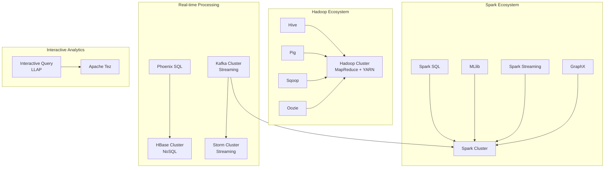
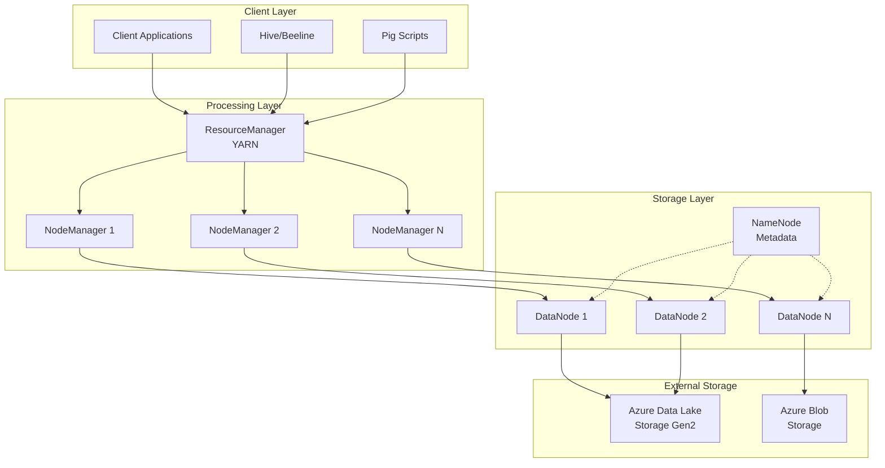
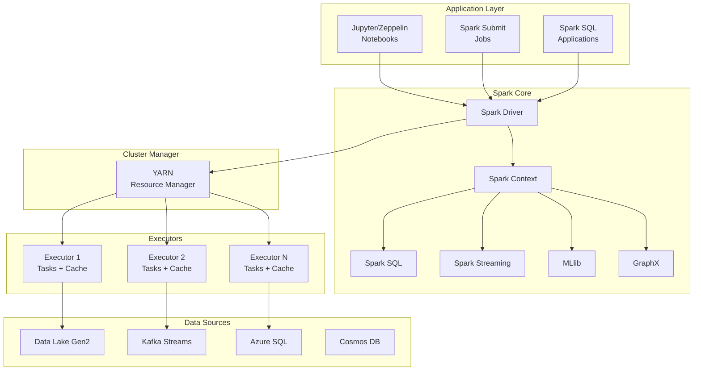
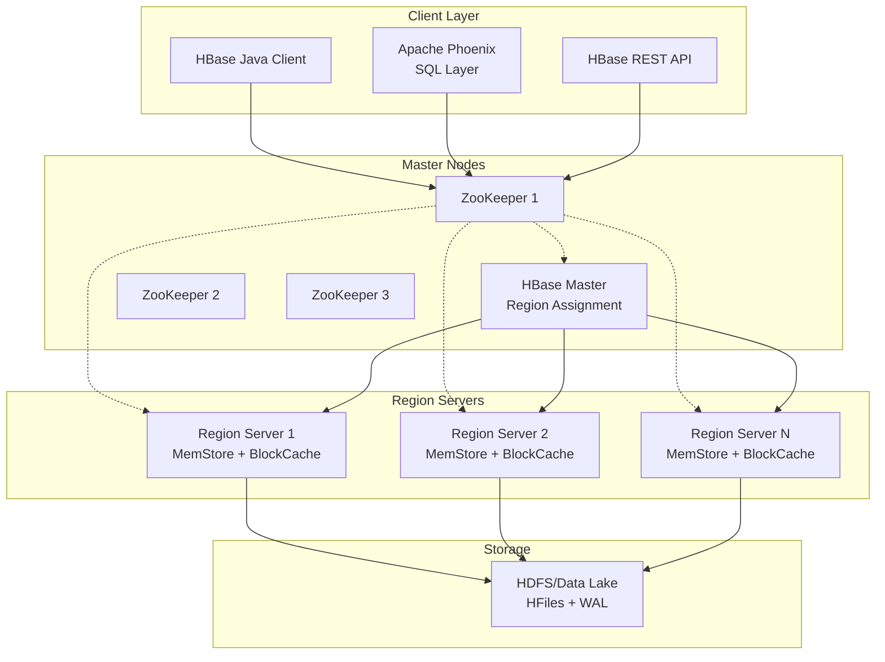
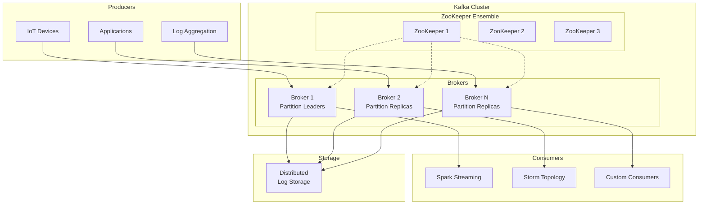
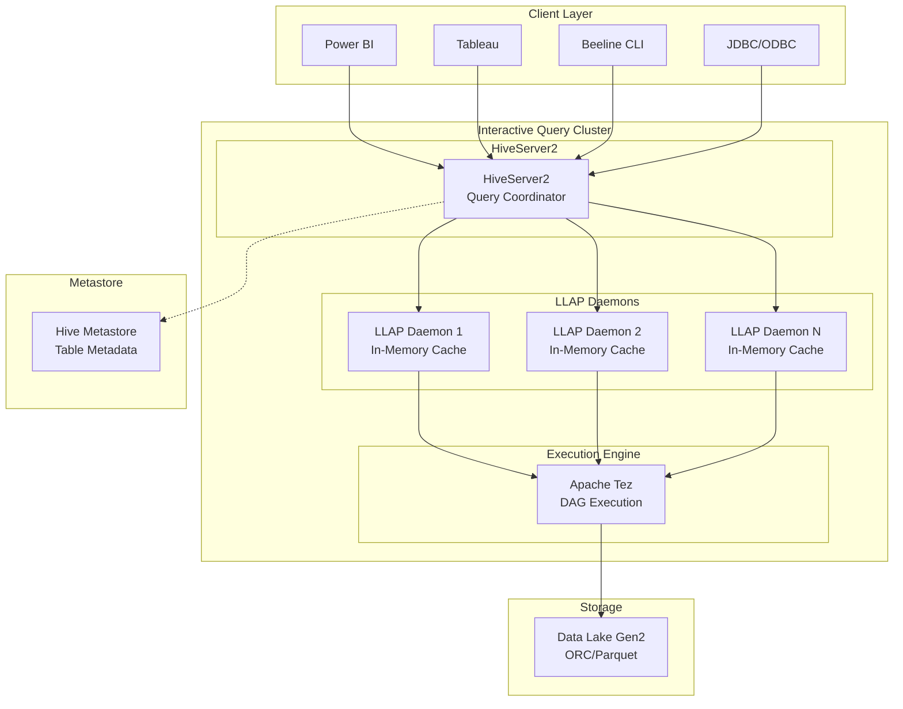

# 🎛️ HDInsight Cluster Types

> **🏠 [Home](../../../../README.md)** | **📖 [Overview](../../../01-overview/README.md)** | **🛠️ [Services](../../README.md)** | **💾 Analytics Compute** | **🐘 [Azure HDInsight](README.md)** | **🎛️ Cluster Types**


Comprehensive guide to Azure HDInsight cluster types, configurations, and best practices for each Apache ecosystem technology.

---

## 📋 Table of Contents

- [Cluster Type Overview](#cluster-type-overview)
- [Hadoop Clusters](#hadoop-clusters)
- [Spark Clusters](#spark-clusters)
- [HBase Clusters](#hbase-clusters)
- [Kafka Clusters](#kafka-clusters)
- [Interactive Query Clusters](#interactive-query-clusters)
- [Storm Clusters](#storm-clusters)
- [Cluster Sizing Guidelines](#cluster-sizing-guidelines)
- [Configuration Best Practices](#configuration-best-practices)

---

## 🎯 Cluster Type Overview

HDInsight supports multiple Apache ecosystem technologies, each optimized for specific big data workloads.

### Cluster Type Matrix

| Cluster Type | Primary Framework | Version | Key Use Cases | Typical Latency |
|--------------|------------------|---------|---------------|----------------|
| **Hadoop** | MapReduce 2.0, YARN | 3.1.1 | Batch ETL, data transformation | Hours |
| **Spark** | Apache Spark | 3.1.2 | Batch & streaming analytics, ML | Seconds-Minutes |
| **HBase** | Apache HBase | 2.1.6 | NoSQL database, real-time access | Milliseconds |
| **Kafka** | Apache Kafka | 2.4.1 | Event streaming, message broker | Milliseconds |
| **Interactive Query** | Hive LLAP | 3.1.0 | Interactive SQL, BI queries | Seconds |
| **Storm** | Apache Storm | 1.2.3 | Real-time stream processing | Milliseconds |

### Component Compatibility



---

## 🗂️ Hadoop Clusters


Traditional MapReduce-based clusters for batch processing and ETL workloads.

### Architecture



### Key Components

#### 1. YARN (Resource Management)

**ResourceManager**: Cluster resource allocation and scheduling

```xml
<!-- YARN Configuration Example -->
<configuration>
  <property>
    <name>yarn.resourcemanager.scheduler.class</name>
    <value>org.apache.hadoop.yarn.server.resourcemanager.scheduler.capacity.CapacityScheduler</value>
  </property>
  <property>
    <name>yarn.nodemanager.resource.memory-mb</name>
    <value>24576</value>
  </property>
  <property>
    <name>yarn.nodemanager.resource.cpu-vcores</name>
    <value>8</value>
  </property>
</configuration>
```

#### 2. MapReduce Framework

**Job Execution**: Distributed data processing with Map and Reduce phases

```java
// Example MapReduce Job Configuration
Configuration conf = new Configuration();
Job job = Job.getInstance(conf, "word count");
job.setJarByClass(WordCount.class);
job.setMapperClass(TokenizerMapper.class);
job.setCombinerClass(IntSumReducer.class);
job.setReducerClass(IntSumReducer.class);
job.setOutputKeyClass(Text.class);
job.setOutputValueClass(IntWritable.class);
FileInputFormat.addInputPath(job, new Path("wasbs://input/data"));
FileOutputFormat.setOutputPath(job, new Path("wasbs://output/results"));
```

#### 3. Hive (SQL Interface)

**Data Warehousing**: SQL-like queries on large datasets

```sql
-- Create external table on Data Lake
CREATE EXTERNAL TABLE sales (
    transaction_id STRING,
    product_id STRING,
    quantity INT,
    price DECIMAL(10,2),
    transaction_date DATE
)
STORED AS PARQUET
LOCATION 'abfs://data@datalake.dfs.core.windows.net/sales/'
TBLPROPERTIES ('parquet.compression'='SNAPPY');

-- Optimize with partitioning
ALTER TABLE sales ADD PARTITION (year=2024, month=01);

-- Query with performance optimizations
SET hive.vectorized.execution.enabled=true;
SET hive.optimize.ppd=true;

SELECT product_id, SUM(quantity * price) as revenue
FROM sales
WHERE transaction_date BETWEEN '2024-01-01' AND '2024-12-31'
GROUP BY product_id
ORDER BY revenue DESC
LIMIT 10;
```

### Configuration Recommendations

#### Cluster Sizing

| Workload Type | Head Nodes | Worker Nodes | Node Size | Storage |
|---------------|------------|--------------|-----------|---------|
| **Development** | 2x D4 v2 | 2-4x D4 v2 | 8 cores, 28 GB | Standard SSD |
| **Production (Small)** | 2x D13 v2 | 4-10x D13 v2 | 8 cores, 56 GB | Premium SSD |
| **Production (Large)** | 2x D14 v2 | 10-50x D14 v2 | 16 cores, 112 GB | Premium SSD |
| **High-memory ETL** | 2x E16 v3 | 10-30x E16 v3 | 16 cores, 128 GB | Premium SSD |

#### Performance Tuning

```bash
# MapReduce Performance Tuning
mapreduce.map.memory.mb=4096
mapreduce.reduce.memory.mb=8192
mapreduce.job.reduce.slowstart.completedmaps=0.8
mapreduce.task.io.sort.mb=512
mapreduce.map.speculative=true

# HDFS Replication
dfs.replication=3
dfs.blocksize=134217728  # 128MB blocks
```

### Best For

✅ **Ideal Use Cases**:
- Batch ETL pipelines
- Data transformation and cleansing
- Legacy Hadoop application migration
- Scheduled reporting workflows
- Compliance and audit data processing

❌ **Not Recommended For**:
- Real-time analytics (use Spark or Storm)
- Interactive queries (use Interactive Query/LLAP)
- NoSQL workloads (use HBase)
- ML/data science (use Spark)

---

## 🔥 Spark Clusters


Unified analytics engine supporting batch processing, streaming, machine learning, and graph processing.

### Architecture



### Key Components

#### 1. Spark SQL

**Structured Data Processing**: SQL queries and DataFrame operations

```python
# PySpark SQL Example
from pyspark.sql import SparkSession
from pyspark.sql.functions import col, sum, avg, window

spark = SparkSession.builder \
    .appName("Sales Analysis") \
    .getOrCreate()

# Read from Data Lake
df = spark.read \
    .format("parquet") \
    .option("mergeSchema", "true") \
    .load("abfs://data@datalake.dfs.core.windows.net/sales/")

# Register as temporary view
df.createOrReplaceTempView("sales")

# SQL Query
result = spark.sql("""
    SELECT
        product_category,
        DATE_TRUNC('month', transaction_date) as month,
        SUM(quantity * price) as revenue,
        COUNT(DISTINCT customer_id) as unique_customers
    FROM sales
    WHERE transaction_date >= '2024-01-01'
    GROUP BY product_category, DATE_TRUNC('month', transaction_date)
    ORDER BY month, revenue DESC
""")

# Write results back to Data Lake
result.write \
    .format("delta") \
    .mode("overwrite") \
    .partitionBy("month") \
    .save("abfs://data@datalake.dfs.core.windows.net/analytics/sales_summary/")
```

#### 2. Spark Streaming (Structured Streaming)

**Real-time Stream Processing**: Continuous data processing with micro-batches

```python
# Structured Streaming from Kafka
from pyspark.sql.functions import from_json, col, window
from pyspark.sql.types import StructType, StructField, StringType, DoubleType, TimestampType

# Define schema
schema = StructType([
    StructField("sensor_id", StringType()),
    StructField("temperature", DoubleType()),
    StructField("humidity", DoubleType()),
    StructField("timestamp", TimestampType())
])

# Read from Kafka
kafka_df = spark.readStream \
    .format("kafka") \
    .option("kafka.bootstrap.servers", "broker1:9092,broker2:9092") \
    .option("subscribe", "sensor-data") \
    .option("startingOffsets", "latest") \
    .load()

# Parse JSON and transform
sensor_data = kafka_df \
    .select(from_json(col("value").cast("string"), schema).alias("data")) \
    .select("data.*")

# Windowed aggregation
aggregated = sensor_data \
    .withWatermark("timestamp", "10 minutes") \
    .groupBy(
        col("sensor_id"),
        window(col("timestamp"), "5 minutes", "1 minute")
    ) \
    .agg(
        avg("temperature").alias("avg_temp"),
        avg("humidity").alias("avg_humidity")
    )

# Write to Delta Lake
query = aggregated.writeStream \
    .format("delta") \
    .outputMode("append") \
    .option("checkpointLocation", "/checkpoints/sensor_agg") \
    .start("abfs://data@datalake.dfs.core.windows.net/sensor_analytics/")

query.awaitTermination()
```

#### 3. MLlib (Machine Learning)

**Distributed Machine Learning**: Scalable ML algorithms

```python
# Machine Learning Pipeline Example
from pyspark.ml import Pipeline
from pyspark.ml.feature import VectorAssembler, StandardScaler, StringIndexer
from pyspark.ml.classification import RandomForestClassifier
from pyspark.ml.evaluation import BinaryClassificationEvaluator

# Load training data
data = spark.read.format("delta").load("/delta/customer_data")

# Feature engineering
categorical_cols = ["customer_segment", "region", "product_category"]
numeric_cols = ["total_purchases", "avg_order_value", "days_since_last_purchase"]

# String indexing for categorical variables
indexers = [StringIndexer(inputCol=col, outputCol=col+"_index")
            for col in categorical_cols]

# Vector assembler
assembler = VectorAssembler(
    inputCols=[col+"_index" for col in categorical_cols] + numeric_cols,
    outputCol="features_raw"
)

# Feature scaling
scaler = StandardScaler(inputCol="features_raw", outputCol="features")

# Random Forest Classifier
rf = RandomForestClassifier(
    featuresCol="features",
    labelCol="churn_label",
    numTrees=100,
    maxDepth=10,
    seed=42
)

# Create pipeline
pipeline = Pipeline(stages=indexers + [assembler, scaler, rf])

# Train-test split
train, test = data.randomSplit([0.8, 0.2], seed=42)

# Train model
model = pipeline.fit(train)

# Predictions
predictions = model.transform(test)

# Evaluate
evaluator = BinaryClassificationEvaluator(labelCol="churn_label", metricName="areaUnderROC")
auc = evaluator.evaluate(predictions)
print(f"AUC: {auc}")

# Save model
model.write().overwrite().save("/models/churn_prediction_v1")
```

#### 4. GraphX

**Graph Processing**: Distributed graph analytics

```scala
// Scala GraphX Example
import org.apache.spark.graphx._
import org.apache.spark.rdd.RDD

// Create vertices (users)
val users: RDD[(VertexId, String)] = sc.parallelize(Array(
  (1L, "Alice"),
  (2L, "Bob"),
  (3L, "Charlie"),
  (4L, "David")
))

// Create edges (relationships)
val relationships: RDD[Edge[String]] = sc.parallelize(Array(
  Edge(1L, 2L, "follows"),
  Edge(2L, 3L, "follows"),
  Edge(3L, 4L, "follows"),
  Edge(4L, 1L, "follows")
))

// Build graph
val graph = Graph(users, relationships)

// Calculate PageRank
val ranks = graph.pageRank(0.0001).vertices

// Join with user names
val ranksByUser = users.join(ranks).map {
  case (id, (username, rank)) => (username, rank)
}

// Display top users
ranksByUser.collect().sortBy(-_._2).foreach(println)
```

### Configuration Recommendations

#### Cluster Sizing

| Workload Type | Head Nodes | Worker Nodes | Node Size | Memory Config |
|---------------|------------|--------------|-----------|---------------|
| **Development** | 2x D4 v2 | 3-5x D4 v2 | 8 cores, 28 GB | 20 GB executor |
| **Data Engineering** | 2x D13 v2 | 5-20x D13 v2 | 8 cores, 56 GB | 40 GB executor |
| **ML Workloads** | 2x E16 v3 | 10-30x E16 v3 | 16 cores, 128 GB | 100 GB executor |
| **Streaming** | 2x D14 v2 | 10-40x D14 v2 | 16 cores, 112 GB | 80 GB executor |

#### Performance Tuning

```python
# Spark Configuration for HDInsight
spark_config = {
    # Executor configuration
    "spark.executor.instances": "20",
    "spark.executor.cores": "4",
    "spark.executor.memory": "20g",
    "spark.executor.memoryOverhead": "4g",

    # Driver configuration
    "spark.driver.memory": "8g",
    "spark.driver.cores": "4",

    # Shuffle optimization
    "spark.sql.shuffle.partitions": "200",
    "spark.shuffle.compress": "true",
    "spark.shuffle.spill.compress": "true",

    # Delta Lake optimization
    "spark.databricks.delta.optimizeWrite.enabled": "true",
    "spark.databricks.delta.autoCompact.enabled": "true",

    # Adaptive Query Execution
    "spark.sql.adaptive.enabled": "true",
    "spark.sql.adaptive.coalescePartitions.enabled": "true",

    # Serialization
    "spark.serializer": "org.apache.spark.serializer.KryoSerializer",

    # Caching
    "spark.sql.inMemoryColumnarStorage.compressed": "true",
    "spark.sql.inMemoryColumnarStorage.batchSize": "20000"
}

# Apply configuration
spark = SparkSession.builder \
    .appName("Optimized Spark Job") \
    .config(map=spark_config) \
    .getOrCreate()
```

### Auto-scaling Configuration

```json
{
  "autoscale": {
    "minWorkerCount": 5,
    "maxWorkerCount": 30,
    "recurrence": {
      "timeZone": "Pacific Standard Time",
      "schedule": [
        {
          "days": ["Monday", "Tuesday", "Wednesday", "Thursday", "Friday"],
          "timeAndCapacity": {
            "time": "08:00",
            "minWorkerCount": 15,
            "maxWorkerCount": 30
          }
        },
        {
          "days": ["Monday", "Tuesday", "Wednesday", "Thursday", "Friday"],
          "timeAndCapacity": {
            "time": "18:00",
            "minWorkerCount": 5,
            "maxWorkerCount": 10
          }
        }
      ]
    }
  }
}
```

### Best For

✅ **Ideal Use Cases**:
- Batch data processing and ETL
- Real-time stream processing
- Machine learning at scale
- Graph analytics
- Iterative algorithms
- Interactive data exploration

❌ **Not Recommended For**:
- Simple SQL queries (use Interactive Query/LLAP)
- Small datasets (<1 GB) - overhead not justified
- Sub-second latency requirements (use HBase)

---

## 📊 HBase Clusters


Distributed, column-family NoSQL database for real-time random read/write access to large datasets.

### Architecture



### Key Components

#### 1. HBase Native API

**Java Client**: Direct HBase API for high-performance access

```java
import org.apache.hadoop.hbase.HBaseConfiguration;
import org.apache.hadoop.hbase.TableName;
import org.apache.hadoop.hbase.client.*;
import org.apache.hadoop.hbase.util.Bytes;

// Configuration
Configuration config = HBaseConfiguration.create();
Connection connection = ConnectionFactory.createConnection(config);
Table table = connection.getTable(TableName.valueOf("sensor_data"));

// Put (Write) operation
Put put = new Put(Bytes.toBytes("sensor_001_20240115"));
put.addColumn(Bytes.toBytes("metrics"), Bytes.toBytes("temperature"), Bytes.toBytes("23.5"));
put.addColumn(Bytes.toBytes("metrics"), Bytes.toBytes("humidity"), Bytes.toBytes("65.2"));
put.addColumn(Bytes.toBytes("metadata"), Bytes.toBytes("location"), Bytes.toBytes("Building A"));
table.put(put);

// Get (Read) operation
Get get = new Get(Bytes.toBytes("sensor_001_20240115"));
Result result = table.get(get);
byte[] temp = result.getValue(Bytes.toBytes("metrics"), Bytes.toBytes("temperature"));
System.out.println("Temperature: " + Bytes.toString(temp));

// Scan operation with filter
Scan scan = new Scan();
scan.addFamily(Bytes.toBytes("metrics"));
scan.setStartRow(Bytes.toBytes("sensor_001_20240101"));
scan.setStopRow(Bytes.toBytes("sensor_001_20240131"));

ResultScanner scanner = table.getScanner(scan);
for (Result r : scanner) {
    System.out.println("Row: " + Bytes.toString(r.getRow()));
}

// Bulk load for large datasets
LoadIncrementalHFiles loader = new LoadIncrementalHFiles(config);
loader.doBulkLoad(hfilePath, admin, table, regionLocator);

table.close();
connection.close();
```

#### 2. Apache Phoenix (SQL Layer)

**SQL Interface**: Standard SQL queries on HBase tables

```sql
-- Create Phoenix table
CREATE TABLE IF NOT EXISTS sensor_data (
    sensor_id VARCHAR NOT NULL,
    timestamp BIGINT NOT NULL,
    temperature DOUBLE,
    humidity DOUBLE,
    location VARCHAR,
    CONSTRAINT pk PRIMARY KEY (sensor_id, timestamp)
) SALT_BUCKETS = 20;

-- Create secondary index
CREATE INDEX idx_location ON sensor_data(location);
CREATE INDEX idx_timestamp ON sensor_data(timestamp DESC);

-- Insert data
UPSERT INTO sensor_data VALUES ('sensor_001', 1705334400000, 23.5, 65.2, 'Building A');

-- Query with SQL
SELECT
    sensor_id,
    TO_DATE(timestamp) as reading_date,
    AVG(temperature) as avg_temp,
    MAX(temperature) as max_temp,
    MIN(temperature) as min_temp
FROM sensor_data
WHERE timestamp >= TO_NUMBER(TO_DATE('2024-01-01'))
  AND timestamp < TO_NUMBER(TO_DATE('2024-02-01'))
GROUP BY sensor_id, TO_DATE(timestamp)
ORDER BY reading_date;

-- Time-series query optimization
SELECT /*+ NO_CACHE */
    sensor_id,
    temperature,
    humidity
FROM sensor_data
WHERE timestamp >= CURRENT_TIME() - 3600000  -- Last hour
ORDER BY timestamp DESC
LIMIT 1000;
```

#### 3. Time-series Data Pattern

**Optimal Row Key Design**: For time-series workloads

```python
# Python HBase Client (HappyBase)
import happybase
from datetime import datetime
import struct

connection = happybase.Connection('hbase-cluster.azurehdinsight.net')
table = connection.table('iot_sensor_data')

def create_row_key(sensor_id, timestamp):
    """
    Optimal row key design for time-series data:
    - Reversed timestamp for most recent data access
    - Sensor ID prefix for distribution
    - Format: {sensor_id}_{reversed_timestamp}
    """
    # Reverse timestamp for most recent first
    max_timestamp = 9999999999999  # Max 13-digit timestamp
    reversed_ts = max_timestamp - int(timestamp.timestamp() * 1000)

    # Create salted row key for distribution
    salt = hash(sensor_id) % 20  # 20 salt buckets
    row_key = f"{salt:02d}:{sensor_id}:{reversed_ts:013d}"

    return row_key.encode()

# Write sensor reading
def write_sensor_data(sensor_id, temperature, humidity, location):
    timestamp = datetime.now()
    row_key = create_row_key(sensor_id, timestamp)

    table.put(row_key, {
        b'metrics:temperature': str(temperature).encode(),
        b'metrics:humidity': str(humidity).encode(),
        b'metadata:location': location.encode(),
        b'metadata:timestamp': str(int(timestamp.timestamp() * 1000)).encode()
    })

# Read recent data for sensor
def read_recent_data(sensor_id, limit=100):
    # Scan most recent entries
    prefix = f"{hash(sensor_id) % 20:02d}:{sensor_id}:".encode()

    results = []
    for key, data in table.scan(row_prefix=prefix, limit=limit):
        results.append({
            'timestamp': data[b'metadata:timestamp'].decode(),
            'temperature': float(data[b'metrics:temperature'].decode()),
            'humidity': float(data[b'metrics:humidity'].decode()),
            'location': data[b'metadata:location'].decode()
        })

    return results

# Batch write
def batch_write(sensor_readings):
    with table.batch(batch_size=1000) as batch:
        for reading in sensor_readings:
            row_key = create_row_key(reading['sensor_id'], reading['timestamp'])
            batch.put(row_key, {
                b'metrics:temperature': str(reading['temperature']).encode(),
                b'metrics:humidity': str(reading['humidity']).encode()
            })
```

### Configuration Recommendations

#### Cluster Sizing

| Workload Type | ZooKeeper Nodes | Region Servers | Node Size | Storage |
|---------------|----------------|----------------|-----------|---------|
| **Development** | 3x A2 v2 | 3-5x D4 v2 | 8 cores, 28 GB | Standard SSD |
| **Production (Small)** | 3x A4 v2 | 5-10x D13 v2 | 8 cores, 56 GB | Premium SSD |
| **Production (Large)** | 3x A8 v2 | 10-50x D14 v2 | 16 cores, 112 GB | Premium SSD |
| **High-throughput IoT** | 5x A8 v2 | 20-100x E16 v3 | 16 cores, 128 GB | Premium SSD |

#### Performance Tuning

```xml
<!-- HBase Site Configuration -->
<configuration>
  <!-- Region Server Configuration -->
  <property>
    <name>hbase.regionserver.handler.count</name>
    <value>200</value>
  </property>

  <property>
    <name>hbase.hregion.memstore.flush.size</name>
    <value>134217728</value> <!-- 128MB -->
  </property>

  <property>
    <name>hbase.hregion.max.filesize</name>
    <value>10737418240</value> <!-- 10GB -->
  </property>

  <!-- BlockCache Configuration -->
  <property>
    <name>hfile.block.cache.size</name>
    <value>0.4</value> <!-- 40% of heap for cache -->
  </property>

  <property>
    <name>hbase.bucketcache.size</name>
    <value>20480</value> <!-- 20GB off-heap cache -->
  </property>

  <!-- Compaction Tuning -->
  <property>
    <name>hbase.hstore.compaction.max</name>
    <value>10</value>
  </property>

  <property>
    <name>hbase.hstore.compactionThreshold</name>
    <value>3</value>
  </property>

  <!-- Write-ahead Log -->
  <property>
    <name>hbase.regionserver.hlog.blocksize</name>
    <value>134217728</value> <!-- 128MB -->
  </property>
</configuration>
```

### Best For

✅ **Ideal Use Cases**:
- IoT sensor data storage and retrieval
- User profile and session data
- Time-series metrics and logs
- Real-time random access requirements
- Write-heavy workloads with point lookups
- Sparse data with variable columns

❌ **Not Recommended For**:
- Complex SQL analytics (use Spark or Interactive Query)
- Small datasets (<100 GB)
- Primarily scan-heavy workloads
- ACID transactions across multiple rows

---

## 📡 Kafka Clusters


Distributed streaming platform for building real-time data pipelines and event-driven applications.

### Architecture



### Key Components

#### 1. Kafka Producers

**Message Publishing**: Send events to Kafka topics

```python
# Python Kafka Producer
from kafka import KafkaProducer
from kafka.errors import KafkaError
import json
from datetime import datetime

# Create producer with configuration
producer = KafkaProducer(
    bootstrap_servers=['broker1:9092', 'broker2:9092', 'broker3:9092'],
    value_serializer=lambda v: json.dumps(v).encode('utf-8'),
    compression_type='snappy',
    acks='all',  # Wait for all replicas
    retries=3,
    max_in_flight_requests_per_connection=1,  # Maintain order
    batch_size=16384,
    linger_ms=10,
    buffer_memory=33554432
)

# Send message
event = {
    'sensor_id': 'temp_sensor_001',
    'temperature': 23.5,
    'humidity': 65.2,
    'timestamp': datetime.now().isoformat(),
    'location': 'Building A, Floor 2'
}

try:
    # Asynchronous send
    future = producer.send('sensor-readings', value=event, key=b'sensor_001')

    # Wait for send to complete (synchronous)
    record_metadata = future.get(timeout=10)
    print(f"Sent to partition {record_metadata.partition} at offset {record_metadata.offset}")

except KafkaError as e:
    print(f"Failed to send message: {e}")

# Flush and close
producer.flush()
producer.close()
```

#### 2. Kafka Consumers

**Message Consumption**: Read and process events from topics

```python
# Python Kafka Consumer
from kafka import KafkaConsumer, TopicPartition
import json

# Create consumer with configuration
consumer = KafkaConsumer(
    'sensor-readings',
    bootstrap_servers=['broker1:9092', 'broker2:9092'],
    group_id='sensor-processor-group',
    auto_offset_reset='earliest',
    enable_auto_commit=True,
    auto_commit_interval_ms=5000,
    value_deserializer=lambda m: json.loads(m.decode('utf-8')),
    max_poll_records=500,
    session_timeout_ms=30000,
    consumer_timeout_ms=10000
)

# Process messages
try:
    for message in consumer:
        sensor_data = message.value

        # Process the event
        if sensor_data['temperature'] > 30:
            print(f"Alert: High temperature detected: {sensor_data}")
            send_alert(sensor_data)

        # Store in database
        store_reading(sensor_data)

        # Manual commit for at-least-once processing
        # consumer.commit()

except KeyboardInterrupt:
    print("Stopping consumer...")
finally:
    consumer.close()

# Consumer with manual partition assignment
def consume_specific_partitions():
    consumer = KafkaConsumer(
        bootstrap_servers=['broker1:9092'],
        value_deserializer=lambda m: json.loads(m.decode('utf-8'))
    )

    # Assign specific partitions
    partitions = [TopicPartition('sensor-readings', p) for p in range(0, 3)]
    consumer.assign(partitions)

    # Seek to specific offset
    for partition in partitions:
        consumer.seek(partition, 100)  # Start from offset 100

    for message in consumer:
        process_message(message)
```

#### 3. Kafka Streams

**Stream Processing**: Real-time data transformation and aggregation

```java
// Java Kafka Streams
import org.apache.kafka.streams.KafkaStreams;
import org.apache.kafka.streams.StreamsBuilder;
import org.apache.kafka.streams.StreamsConfig;
import org.apache.kafka.streams.kstream.*;
import java.time.Duration;
import java.util.Properties;

public class SensorStreamProcessor {
    public static void main(String[] args) {
        Properties config = new Properties();
        config.put(StreamsConfig.APPLICATION_ID_CONFIG, "sensor-stream-processor");
        config.put(StreamsConfig.BOOTSTRAP_SERVERS_CONFIG, "broker1:9092,broker2:9092");
        config.put(StreamsConfig.DEFAULT_KEY_SERDE_CLASS_CONFIG, Serdes.String().getClass());
        config.put(StreamsConfig.DEFAULT_VALUE_SERDE_CLASS_CONFIG, Serdes.String().getClass());

        StreamsBuilder builder = new StreamsBuilder();

        // Input stream
        KStream<String, SensorReading> sensorStream = builder.stream(
            "sensor-readings",
            Consumed.with(Serdes.String(), sensorReadingSerde())
        );

        // Filter high temperature readings
        KStream<String, SensorReading> highTemp = sensorStream.filter(
            (key, value) -> value.getTemperature() > 30.0
        );

        // Windowed aggregation
        KTable<Windowed<String>, Double> avgTempPerSensor = sensorStream
            .groupByKey()
            .windowedBy(TimeWindows.of(Duration.ofMinutes(5)).advanceBy(Duration.ofMinutes(1)))
            .aggregate(
                () -> new TemperatureAggregate(),
                (key, value, aggregate) -> {
                    aggregate.addReading(value.getTemperature());
                    return aggregate;
                },
                Materialized.with(Serdes.String(), temperatureAggregateSerde())
            )
            .mapValues(TemperatureAggregate::getAverage);

        // Write to output topics
        highTemp.to("high-temperature-alerts", Produced.with(Serdes.String(), sensorReadingSerde()));
        avgTempPerSensor.toStream().to("sensor-temperature-avg");

        // Start streaming
        KafkaStreams streams = new KafkaStreams(builder.build(), config);
        streams.start();

        // Graceful shutdown
        Runtime.getRuntime().addShutdownHook(new Thread(streams::close));
    }
}
```

### Configuration Recommendations

#### Cluster Sizing

| Workload Type | ZooKeeper Nodes | Broker Nodes | Node Size | Disk Type |
|---------------|----------------|--------------|-----------|-----------|
| **Development** | 3x A2 v2 | 3x D4 v2 | 8 cores, 28 GB | Standard SSD |
| **Production (Low)** | 3x A4 v2 | 4-6x D13 v2 | 8 cores, 56 GB | Premium SSD |
| **Production (Medium)** | 3x A8 v2 | 6-12x D14 v2 | 16 cores, 112 GB | Premium SSD |
| **Production (High)** | 5x A8 v2 | 12-30x D15 v2 | 20 cores, 140 GB | Premium SSD |

#### Performance Tuning

```properties
# Broker Configuration (server.properties)

# Network settings
num.network.threads=8
num.io.threads=16
socket.send.buffer.bytes=102400
socket.receive.buffer.bytes=102400
socket.request.max.bytes=104857600

# Log retention
log.retention.hours=168
log.retention.bytes=1073741824
log.segment.bytes=1073741824
log.retention.check.interval.ms=300000

# Replication
default.replication.factor=3
min.insync.replicas=2
unclean.leader.election.enable=false

# Performance
num.partitions=8
compression.type=snappy
log.flush.interval.messages=10000
log.flush.interval.ms=1000

# ZooKeeper
zookeeper.connection.timeout.ms=18000
zookeeper.session.timeout.ms=18000
```

### Topic Design Best Practices

```bash
# Create topic with optimal configuration
kafka-topics.sh --create \
  --bootstrap-server broker1:9092 \
  --topic sensor-readings \
  --partitions 20 \
  --replication-factor 3 \
  --config retention.ms=604800000 \
  --config segment.ms=86400000 \
  --config compression.type=snappy \
  --config min.insync.replicas=2 \
  --config max.message.bytes=1048576

# Monitor topic lag
kafka-consumer-groups.sh --bootstrap-server broker1:9092 \
  --group sensor-processor-group \
  --describe

# Increase partitions (for scaling)
kafka-topics.sh --alter \
  --bootstrap-server broker1:9092 \
  --topic sensor-readings \
  --partitions 30
```

### Best For

✅ **Ideal Use Cases**:
- Event streaming and real-time data pipelines
- Log aggregation and metrics collection
- Microservices messaging
- Change data capture (CDC)
- Real-time analytics and monitoring
- Decoupling systems with event-driven architecture

❌ **Not Recommended For**:
- Request-response communication patterns
- Large message payloads (>1 MB)
- Long-term data storage (use with Spark/HBase)
- Complex transformations (use Kafka Streams or Spark)

---

## ⚡ Interactive Query Clusters


Hive LLAP (Low Latency Analytical Processing) for fast, interactive SQL queries on large datasets.

### Architecture



### Key Features

#### 1. In-Memory Caching

**LLAP Caching**: Intelligent caching for repeated queries

```sql
-- Enable LLAP caching
SET hive.llap.io.enabled=true;
SET hive.llap.io.use.lrfu=true;
SET hive.llap.io.memory.mode=cache;

-- Create table optimized for LLAP
CREATE TABLE sales_summary (
    product_id STRING,
    product_category STRING,
    region STRING,
    total_sales DECIMAL(15,2),
    total_quantity BIGINT,
    avg_price DECIMAL(10,2),
    sale_date DATE
)
STORED AS ORC
LOCATION 'abfs://data@datalake.dfs.core.windows.net/sales_summary/'
TBLPROPERTIES (
    'orc.compress'='ZLIB',
    'orc.stripe.size'='67108864',
    'transactional'='true'
);

-- Materialized view for common aggregations
CREATE MATERIALIZED VIEW sales_by_region_mv
AS
SELECT
    region,
    product_category,
    DATE_TRUNC('month', sale_date) as month,
    SUM(total_sales) as monthly_sales,
    SUM(total_quantity) as monthly_quantity
FROM sales_summary
GROUP BY region, product_category, DATE_TRUNC('month', sale_date);

-- Query will use cached data and materialized view
SELECT
    region,
    SUM(monthly_sales) as total_sales
FROM sales_by_region_mv
WHERE month >= '2024-01-01'
GROUP BY region
ORDER BY total_sales DESC;
```

#### 2. ACID Transactions

**Hive 3.0 ACID**: Full ACID support for data warehousing

```sql
-- Enable ACID transactions
SET hive.support.concurrency=true;
SET hive.txn.manager=org.apache.hadoop.hive.ql.lockmgr.DbTxnManager;

-- Create transactional table
CREATE TABLE customer_orders (
    order_id BIGINT,
    customer_id STRING,
    product_id STRING,
    quantity INT,
    price DECIMAL(10,2),
    order_status STRING,
    order_date TIMESTAMP
)
CLUSTERED BY (customer_id) INTO 32 BUCKETS
STORED AS ORC
TBLPROPERTIES ('transactional'='true');

-- Insert with ACID
INSERT INTO customer_orders VALUES
    (1001, 'CUST001', 'PROD123', 5, 99.99, 'PENDING', CURRENT_TIMESTAMP);

-- Update operation
UPDATE customer_orders
SET order_status = 'SHIPPED'
WHERE order_id = 1001;

-- Delete operation
DELETE FROM customer_orders
WHERE order_status = 'CANCELLED'
  AND order_date < DATE_SUB(CURRENT_DATE, 90);

-- Merge (Upsert) operation
MERGE INTO customer_orders AS target
USING order_updates AS source
ON target.order_id = source.order_id
WHEN MATCHED THEN
    UPDATE SET order_status = source.order_status
WHEN NOT MATCHED THEN
    INSERT VALUES (source.order_id, source.customer_id, source.product_id,
                   source.quantity, source.price, source.order_status, source.order_date);
```

#### 3. Query Result Caching

**Result Set Caching**: Reuse query results for identical queries

```sql
-- Enable query result caching
SET hive.query.results.cache.enabled=true;
SET hive.query.results.cache.max.size=2147483648;  -- 2GB
SET hive.query.results.cache.max.entry.lifetime=86400000;  -- 24 hours

-- Expensive aggregation query (cached on first run)
SELECT
    product_category,
    COUNT(DISTINCT customer_id) as unique_customers,
    SUM(quantity * price) as total_revenue,
    AVG(quantity) as avg_quantity_per_order,
    PERCENTILE_APPROX(price, 0.5) as median_price
FROM customer_orders
WHERE order_date >= DATE_SUB(CURRENT_DATE, 365)
GROUP BY product_category
ORDER BY total_revenue DESC;

-- Subsequent identical query returns cached results instantly
```

### Configuration Recommendations

#### Cluster Sizing

| Workload Type | Head Nodes | Worker Nodes | Node Size | LLAP Memory |
|---------------|------------|--------------|-----------|-------------|
| **Development** | 2x D4 v2 | 3-5x D13 v2 | 8 cores, 56 GB | 32 GB |
| **Production (Small)** | 2x D13 v2 | 5-10x D14 v2 | 16 cores, 112 GB | 80 GB |
| **Production (Large)** | 2x D14 v2 | 10-20x E16 v3 | 16 cores, 128 GB | 100 GB |
| **BI Workloads** | 2x E16 v3 | 15-30x E32 v3 | 32 cores, 256 GB | 200 GB |

#### Performance Tuning

```xml
<!-- Hive Site Configuration for LLAP -->
<configuration>
  <!-- LLAP Configuration -->
  <property>
    <name>hive.llap.daemon.num.executors</name>
    <value>4</value>
  </property>

  <property>
    <name>hive.llap.io.memory.size</name>
    <value>85899345920</value> <!-- 80GB -->
  </property>

  <property>
    <name>hive.llap.daemon.memory.per.instance.mb</name>
    <value>102400</value> <!-- 100GB -->
  </property>

  <!-- Tez Optimization -->
  <property>
    <name>tez.am.resource.memory.mb</name>
    <value>4096</value>
  </property>

  <property>
    <name>tez.task.resource.memory.mb</name>
    <value>4096</value>
  </property>

  <!-- Vectorization -->
  <property>
    <name>hive.vectorized.execution.enabled</name>
    <value>true</value>
  </property>

  <property>
    <name>hive.vectorized.execution.reduce.enabled</name>
    <value>true</value>
  </property>

  <!-- Statistics and CBO -->
  <property>
    <name>hive.stats.autogather</name>
    <value>true</value>
  </property>

  <property>
    <name>hive.cbo.enable</name>
    <value>true</value>
  </property>

  <!-- Concurrency -->
  <property>
    <name>hive.server2.tez.sessions.per.default.queue</name>
    <value>4</value>
  </property>
</configuration>
```

### Best For

✅ **Ideal Use Cases**:
- Interactive BI and reporting
- Ad-hoc data exploration
- Self-service analytics
- Dashboard and visualization backends
- SQL-based data analysis
- Concurrent user queries

❌ **Not Recommended For**:
- Real-time streaming (use Spark Streaming or Storm)
- Machine learning workloads (use Spark)
- ETL batch processing (use Hadoop or Spark)
- Sub-second latency requirements (use HBase)

---

## 🌪️ Storm Clusters


Real-time distributed stream processing system for processing unbounded streams of data.

### Key Features

- **Guaranteed Message Processing**: At-least-once or exactly-once semantics
- **Horizontal Scalability**: Scale by adding nodes
- **Fault Tolerance**: Automatic failover and recovery
- **Low Latency**: Sub-second tuple processing
- **Integration**: Works with queues (Kafka, Event Hubs) and databases

### When to Use Storm vs. Alternatives

**Use Storm When**:
- Need guaranteed message processing
- Sub-second latency requirements
- Complex event processing (CEP)
- Legacy Storm topology migration

**Use Spark Streaming When**:
- Micro-batch processing is acceptable
- Need integration with Spark ecosystem (SQL, MLlib)
- Unified batch and streaming architecture

**Use Kafka Streams When**:
- Processing within Kafka ecosystem
- Lightweight stream processing needs
- Strong ordering guarantees required

> **📝 Note**: Microsoft recommends migrating Storm workloads to Spark Structured Streaming or Azure Stream Analytics for better integration with the Azure ecosystem.

---

## 📏 Cluster Sizing Guidelines

### General Sizing Principles

1. **Start Small, Scale Up**: Begin with minimum viable cluster and scale based on metrics
2. **Separate Development and Production**: Use smaller clusters for dev/test
3. **Monitor and Adjust**: Use Azure Monitor to track resource utilization
4. **Consider Auto-scaling**: Enable for variable workloads
5. **Storage Separation**: Use Azure Data Lake Gen2 for cost-effective storage scaling

### Node Type Selection

#### Head Nodes

| VM Size | Cores | RAM | Use Case | Estimated Cost/Month |
|---------|-------|-----|----------|---------------------|
| D4 v2 | 8 | 28 GB | Development | $280 |
| D13 v2 | 8 | 56 GB | Production (Standard) | $560 |
| D14 v2 | 16 | 112 GB | Production (Large) | $1,120 |
| E16 v3 | 16 | 128 GB | Memory-intensive | $960 |

#### Worker Nodes

| VM Size | Cores | RAM | Use Case | Workload Type |
|---------|-------|-----|----------|---------------|
| D4 v2 | 8 | 28 GB | Development | All cluster types |
| D13 v2 | 8 | 56 GB | Standard production | Hadoop, Spark, IQ |
| D14 v2 | 16 | 112 GB | Large production | Spark, Hadoop |
| E16 v3 | 16 | 128 GB | Memory-intensive | Spark ML, HBase |
| E32 v3 | 32 | 256 GB | Very large datasets | Spark, Interactive Query |

### Workload-Specific Recommendations

#### ETL Batch Processing (Hadoop/Spark)

```bash
# Small ETL (< 1 TB data)
Head Nodes: 2x D13 v2
Worker Nodes: 4-8x D13 v2 (auto-scale)

# Medium ETL (1-10 TB data)
Head Nodes: 2x D14 v2
Worker Nodes: 8-20x D14 v2 (auto-scale)

# Large ETL (> 10 TB data)
Head Nodes: 2x D14 v2
Worker Nodes: 20-50x D14 v2 or E16 v3 (auto-scale)
```

#### Real-time Streaming (Kafka + Spark)

```bash
# Low throughput (< 10K events/sec)
Kafka Brokers: 3x D4 v2
Spark Workers: 3-5x D13 v2

# Medium throughput (10K-100K events/sec)
Kafka Brokers: 4-6x D13 v2
Spark Workers: 5-15x D14 v2

# High throughput (> 100K events/sec)
Kafka Brokers: 6-12x D14 v2
Spark Workers: 15-30x E16 v3
```

#### NoSQL Database (HBase)

```bash
# Development
Region Servers: 3x D4 v2

# Production (< 1 TB data, < 1K ops/sec)
Region Servers: 5-10x D13 v2

# Production (> 1 TB data, > 1K ops/sec)
Region Servers: 10-50x D14 v2 or E16 v3

# High-throughput IoT
Region Servers: 20-100x E16 v3
```

---

## ⚙️ Configuration Best Practices

### Storage Configuration

```bash
# Use Azure Data Lake Gen2 for primary storage
az hdinsight create \
  --storage-account datalakestorage \
  --storage-account-key <key> \
  --storage-default-container <container> \
  --storage-default-filesystem <filesystem>

# Configure additional storage accounts
az hdinsight storage-account add \
  --cluster-name <cluster-name> \
  --storage-account secondarystorage \
  --storage-account-key <key>
```

### Security Configuration

```bash
# Create cluster with Enterprise Security Package
az hdinsight create \
  --esp \
  --cluster-admin-account admin@yourdomain.com \
  --cluster-users-group-dns "hdi-users" \
  --domain <domain-resource-id> \
  --ldaps-urls "ldaps://yourdomain.com:636"
```

### Monitoring Configuration

```bash
# Enable Azure Monitor integration
az hdinsight monitor enable \
  --name <cluster-name> \
  --resource-group <resource-group> \
  --workspace <workspace-resource-id>
```

### Cost Optimization

1. **Use Auto-scaling**: Configure load-based and schedule-based auto-scaling
2. **Enable Auto-pause**: For development clusters
3. **Right-size VMs**: Monitor utilization and adjust
4. **Use Spot VMs**: For non-critical worker nodes (up to 90% savings)
5. **Cluster Lifecycle**: Delete when not in use, recreate with scripts

---

## 📚 Related Resources

### Documentation

- **[HDInsight Overview](README.md)** - Service overview and introduction
- **[Migration Guide](migration-guide.md)** - Migration to Synapse or Databricks
- **[Best Practices](../../../05-best-practices/service-specific/hdinsight/README.md)** - Optimization guide

### Tutorials

- **[Hadoop Quick Start](../../../tutorials/beginner/hdinsight-hadoop.md)** - Get started with Hadoop
- **[Spark Tutorial](../../../tutorials/intermediate/hdinsight-spark.md)** - Spark cluster guide
- **[HBase Guide](../../../tutorials/advanced/hdinsight-hbase.md)** - NoSQL database tutorial
- **[Kafka Streaming](../../../tutorials/advanced/hdinsight-kafka.md)** - Event streaming guide

### Code Examples

- **[Spark Jobs](../../../06-code-examples/by-service/hdinsight/spark-examples.md)** - Spark code samples
- **[Hive Queries](../../../06-code-examples/by-service/hdinsight/hive-examples.md)** - SQL examples
- **[HBase Applications](../../../06-code-examples/by-service/hdinsight/hbase-examples.md)** - NoSQL code
- **[Kafka Examples](../../../06-code-examples/by-service/hdinsight/kafka-examples.md)** - Streaming code

---

*Last Updated: 2025-01-28*
*HDInsight Version: 4.0 (Hadoop 3.x, Spark 3.x, HBase 2.x, Kafka 2.x)*
*Documentation Status: Complete*
