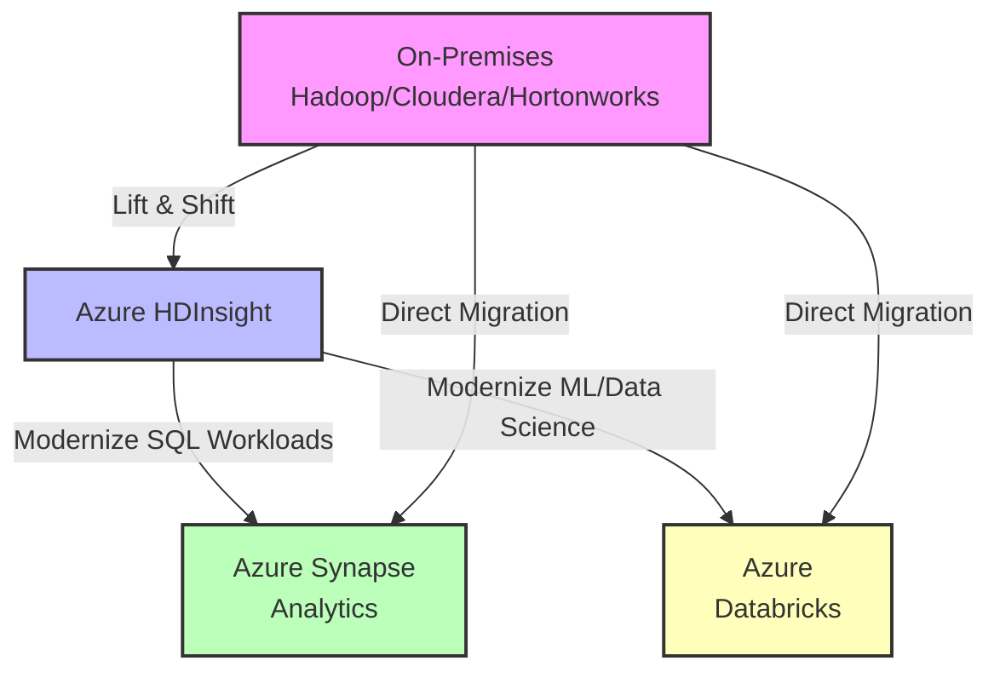
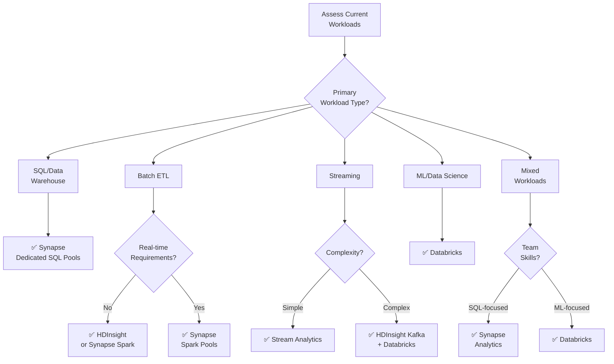
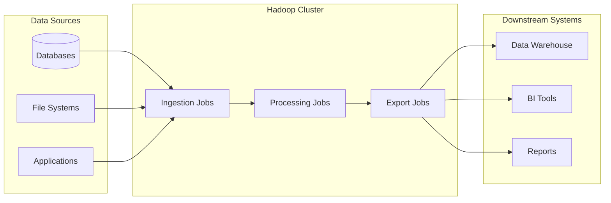

# 🔄 HDInsight Migration Guide

> **🏠 [Home](../../../../README.md)** | **📖 [Overview](../../../01-overview/README.md)** | **🛠️ [Services](../../README.md)** | **💾 Analytics Compute** | **🐘 [Azure HDInsight](README.md)** | **🔄 Migration Guide**


Comprehensive guide for migrating on-premises Hadoop workloads to Azure HDInsight, and modernizing to Azure Synapse Analytics or Azure Databricks.

---

## 📋 Table of Contents

- [Migration Overview](#migration-overview)
- [Decision Framework](#decision-framework)
- [On-Premises to HDInsight](#on-premises-to-hdinsight)
- [HDInsight to Azure Synapse Analytics](#hdinsight-to-azure-synapse-analytics)
- [HDInsight to Azure Databricks](#hdinsight-to-azure-databricks)
- [Migration Tools and Automation](#migration-tools-and-automation)
- [Testing and Validation](#testing-and-validation)
- [Best Practices and Lessons Learned](#best-practices-and-lessons-learned)

---

## 🎯 Migration Overview

Organizations migrate from on-premises Hadoop or HDInsight to modern analytics platforms for various reasons:

### Why Migrate?

#### From On-Premises Hadoop

✅ **Benefits**:
- **Reduce Infrastructure Costs**: Eliminate hardware maintenance and data center costs
- **Elastic Scalability**: Scale resources up/down based on demand
- **Managed Service**: Reduce operational overhead
- **Cloud-Native Integration**: Leverage Azure ecosystem (ML, AI, IoT)
- **Disaster Recovery**: Built-in high availability and backup
- **Modern Features**: Access latest Apache versions and features

#### From HDInsight to Modern Platforms

✅ **Benefits**:
- **Serverless Options**: Pay only for queries executed (Synapse Serverless)
- **Unified Workspace**: Single environment for SQL, Spark, and pipelines (Synapse)
- **Advanced ML/Data Science**: Better collaboration and MLflow integration (Databricks)
- **Better Performance**: Optimized compute engines and caching
- **Simplified Management**: Less configuration and tuning required
- **Enhanced Features**: Delta Lake, ACID transactions, time travel

### Migration Patterns



---

## 🧭 Decision Framework

### Migration Decision Tree



### Platform Comparison Matrix

| Criteria | HDInsight | Synapse Analytics | Databricks |
|----------|-----------|------------------|------------|
| **Cost Model** | VM-based (predictable) | Serverless + dedicated | VM + DBU (variable) |
| **SQL Support** | Hive SQL | Native T-SQL ✅ | Spark SQL |
| **Serverless** | ❌ No | ✅ Yes | ❌ No |
| **ML/Data Science** | Basic (MLlib) | Basic | Advanced (MLflow) ✅ |
| **Collaboration** | Limited | Good (Synapse Studio) | Excellent (Notebooks) ✅ |
| **Delta Lake** | Manual setup | Native support ✅ | Optimized ✅ |
| **Learning Curve** | Moderate | Moderate | Steep |
| **Azure Integration** | Good | Excellent ✅ | Good |
| **Governance** | Ranger + ESP | Purview integration ✅ | Unity Catalog ✅ |
| **Migration Effort** | Low (from Hadoop) | Medium | Medium-High |
| **BI Integration** | Good | Excellent (Power BI) ✅ | Good |

### When to Choose Each Platform

#### ✅ Choose HDInsight When

- Migrating from on-premises Hadoop with minimal changes
- Need cost predictability (VM-based pricing)
- Custom Apache configurations required
- Team has strong Hadoop/Spark expertise
- Hybrid cloud scenarios with on-premises integration
- Need specific Apache ecosystem tools (HBase, Kafka)

#### ✅ Choose Azure Synapse Analytics When

- Primary workload is SQL-based data warehousing
- Need unified environment for SQL and Spark
- Want serverless SQL query capabilities
- Strong Microsoft ecosystem (Power BI, Azure ML)
- Simplified management and less tuning required
- Enterprise data warehousing focus

#### ✅ Choose Azure Databricks When

- Data science and machine learning workloads
- Collaborative development environment needed
- Advanced Delta Lake capabilities required
- MLflow and AutoML features important
- Notebook-centric workflows preferred
- Team has Spark expertise

---

## 🚀 On-Premises to HDInsight

Lift-and-shift migration from on-premises Hadoop to Azure HDInsight.

### Pre-Migration Assessment

#### 1. Inventory Current Environment

```bash
# Document cluster configuration
- Hadoop version and distribution (Cloudera, Hortonworks, MapR)
- Node count and specifications
- Storage capacity and usage
- Network topology
- Security configuration (Kerberos, Ranger)
- Custom configurations and scripts

# Catalog workloads
- Batch jobs (Hive, Pig, MapReduce)
- Streaming jobs (Spark, Storm)
- Scheduled workflows (Oozie, Airflow)
- Custom applications
```

#### 2. Assess Data Volume and Types

```sql
-- Analyze data volumes
SELECT
    database_name,
    table_name,
    num_rows,
    total_size_mb,
    file_format,
    compression
FROM information_schema.tables
WHERE table_type = 'BASE TABLE';

-- Identify large tables for optimization
SELECT
    table_name,
    total_size_mb
FROM table_statistics
WHERE total_size_mb > 100000  -- > 100 GB
ORDER BY total_size_mb DESC;
```

#### 3. Identify Dependencies



### Migration Phases

#### Phase 1: Infrastructure Setup

```bash
# 1. Create Azure Resources
az group create --name rg-hadoop-migration --location eastus

# 2. Create Data Lake Storage Gen2
az storage account create \
  --name hadoopstorage \
  --resource-group rg-hadoop-migration \
  --location eastus \
  --sku Standard_LRS \
  --enable-hierarchical-namespace true \
  --enable-large-file-share

# 3. Create Virtual Network (for hybrid connectivity)
az network vnet create \
  --name hadoop-vnet \
  --resource-group rg-hadoop-migration \
  --address-prefix 10.0.0.0/16 \
  --subnet-name hadoop-subnet \
  --subnet-prefix 10.0.1.0/24

# 4. Configure VPN/ExpressRoute for hybrid connectivity
az network vpn-gateway create \
  --name hadoop-vpn-gateway \
  --resource-group rg-hadoop-migration \
  --vnet hadoop-vnet \
  --location eastus
```

#### Phase 2: Data Migration

**Option 1: Azure Data Box (for large datasets > 10 TB)**

```bash
# 1. Order Azure Data Box
az databox job create \
  --resource-group rg-hadoop-migration \
  --name hadoop-data-migration \
  --location eastus \
  --sku DataBox \
  --contact-name "Migration Team" \
  --email-list migration@company.com

# 2. Copy data to Data Box
hdfs dfs -get /data/warehouse /mnt/databox/warehouse/

# 3. Ship back to Azure
# Data automatically uploaded to specified storage account
```

**Option 2: DistCp (for smaller datasets < 10 TB)**

```bash
# Configure WASB/ABFS credentials
export HADOOP_CREDENTIAL_PROVIDERS=jceks://hdfs/user/hadoop/credentials.jceks

# Add Azure storage credentials
hadoop credential create fs.azure.account.key.hadoopstorage.dfs.core.windows.net \
  -provider ${HADOOP_CREDENTIAL_PROVIDERS} \
  -value <storage-account-key>

# Run DistCp to copy data
hadoop distcp \
  -m 100 \
  -update \
  -overwrite \
  hdfs:///data/warehouse \
  abfs://data@hadoopstorage.dfs.core.windows.net/warehouse/

# Monitor progress
yarn application -list
```

**Option 3: Azure Data Factory (for incremental migration)**

```json
{
  "name": "HadoopMigrationPipeline",
  "properties": {
    "activities": [
      {
        "name": "CopyFromHDFS",
        "type": "Copy",
        "inputs": [
          {
            "referenceName": "OnPremHDFSDataset",
            "type": "DatasetReference"
          }
        ],
        "outputs": [
          {
            "referenceName": "ADLSGen2Dataset",
            "type": "DatasetReference"
          }
        ],
        "typeProperties": {
          "source": {
            "type": "FileSystemSource",
            "recursive": true
          },
          "sink": {
            "type": "BlobSink"
          },
          "enableStaging": false,
          "parallelCopies": 32
        }
      }
    ]
  }
}
```

#### Phase 3: Create HDInsight Cluster

```bash
# Create HDInsight cluster matching on-prem configuration
az hdinsight create \
  --name hadoop-cluster-prod \
  --resource-group rg-hadoop-migration \
  --type Hadoop \
  --component-version Hadoop=3.1 \
  --cluster-tier Standard \
  --workernode-count 20 \
  --workernode-size Standard_D14_v2 \
  --headnode-size Standard_D13_v2 \
  --zookeepernode-size Standard_A4_v2 \
  --storage-account hadoopstorage \
  --storage-container data \
  --ssh-user sshuser \
  --ssh-password <password> \
  --location eastus \
  --vnet-name hadoop-vnet \
  --subnet hadoop-subnet

# Enable Enterprise Security Package (if using Kerberos)
az hdinsight create \
  --esp \
  --cluster-admin-account admin@company.com \
  --cluster-users-group-dns "hadoop-users" \
  --domain <domain-resource-id> \
  --ldaps-urls "ldaps://company.com:636"
```

#### Phase 4: Migrate Metadata

```bash
# Export Hive metastore from on-premises
mysqldump -u hive -p hive_metastore > hive_metastore_backup.sql

# Import to Azure SQL Database (HDInsight metastore)
mysql -h hdinsight-metastore.mysql.database.azure.com \
      -u sqladmin \
      -p hive_metastore < hive_metastore_backup.sql

# Validate table metadata
hive -e "SHOW DATABASES;"
hive -e "SHOW TABLES IN warehouse;"
hive -e "DESCRIBE FORMATTED warehouse.sales;"
```

#### Phase 5: Migrate Workloads

**Hive Scripts Migration**

```bash
# 1. Update storage paths in Hive scripts
sed -i 's|hdfs:///data/|abfs://data@hadoopstorage.dfs.core.windows.net/|g' *.hql

# 2. Update Hive configuration
cat > hive-site-additions.xml <<EOF
<configuration>
  <property>
    <name>fs.azure.account.key.hadoopstorage.dfs.core.windows.net</name>
    <value><storage-key></value>
  </property>
  <property>
    <name>hive.metastore.uris</name>
    <value>thrift://hdinsight-metastore.mysql.database.azure.com:9083</value>
  </property>
</configuration>
EOF

# 3. Test Hive queries
beeline -u "jdbc:hive2://hadoop-cluster-prod.azurehdinsight.net:443/;ssl=true;transportMode=http" \
        -n admin \
        -p <password> \
        -f sales_etl.hql
```

**Spark Jobs Migration**

```python
# Update Spark configuration for Azure storage
spark_conf = {
    "fs.azure.account.key.hadoopstorage.dfs.core.windows.net": "<storage-key>",
    "spark.hadoop.fs.defaultFS": "abfs://data@hadoopstorage.dfs.core.windows.net",
    "spark.sql.warehouse.dir": "abfs://data@hadoopstorage.dfs.core.windows.net/warehouse"
}

spark = SparkSession.builder \
    .appName("MigratedSparkJob") \
    .config(map=spark_conf) \
    .getOrCreate()

# Update data paths
input_path = "abfs://data@hadoopstorage.dfs.core.windows.net/raw/sales/"
output_path = "abfs://data@hadoopstorage.dfs.core.windows.net/processed/sales/"

df = spark.read.parquet(input_path)
df_processed = df.filter(col("amount") > 0)
df_processed.write.mode("overwrite").parquet(output_path)
```

**Oozie Workflows Migration**

```bash
# Option 1: Migrate to Azure Data Factory
# Convert Oozie workflows to ADF pipelines

# Option 2: Continue using Oozie on HDInsight
# Update workflow.xml with Azure storage paths
sed -i 's|${nameNode}/|abfs://data@hadoopstorage.dfs.core.windows.net/|g' workflow.xml

# Submit Oozie job
oozie job -oozie http://headnode0:11000/oozie \
  -config job.properties \
  -run
```

#### Phase 6: Migrate Scheduling

```bash
# Option 1: Azure Data Factory
# Create time-triggered pipelines

# Option 2: Azure Logic Apps
# For simpler scheduling needs

# Option 3: Azure Automation
# For complex orchestration

# Option 4: Continue with Oozie/Airflow on HDInsight
```

### Migration Validation

```bash
# 1. Data Validation
hdfs dfs -count -h abfs://data@hadoopstorage.dfs.core.windows.net/warehouse/
hdfs dfs -du -s -h abfs://data@hadoopstorage.dfs.core.windows.net/warehouse/

# 2. Metadata Validation
hive -e "SELECT COUNT(*) FROM warehouse.sales;" # Compare with on-prem

# 3. Performance Testing
hive -e "
SET hive.execution.engine=tez;
SET tez.am.resource.memory.mb=4096;
EXPLAIN SELECT * FROM warehouse.sales WHERE date > '2024-01-01';
"

# 4. Application Testing
spark-submit --class com.company.SalesETL \
  --master yarn \
  --deploy-mode cluster \
  sales-etl.jar

# 5. Compare execution times
# Log on-prem execution time vs HDInsight
```

---

## 🔄 HDInsight to Azure Synapse Analytics

Modernize SQL and data warehousing workloads to Azure Synapse Analytics.

### Migration Scenarios

#### Scenario 1: Hive Tables to Synapse Dedicated SQL Pools

**Assessment**

```sql
-- Analyze Hive table complexity
SHOW CREATE TABLE warehouse.sales;

-- Check table size and partitions
DESCRIBE EXTENDED warehouse.sales;

-- Identify complex data types that need transformation
DESCRIBE warehouse.sales;
```

**Migration Steps**

**Step 1: Export Data from Hive**

```sql
-- Create ORC/Parquet export for efficient transfer
SET hive.exec.compress.output=true;
SET parquet.compression=SNAPPY;

INSERT OVERWRITE DIRECTORY 'abfs://export@datalake.dfs.core.windows.net/sales/'
STORED AS PARQUET
SELECT
    transaction_id,
    customer_id,
    product_id,
    CAST(quantity AS INT) as quantity,
    CAST(price AS DECIMAL(10,2)) as price,
    CAST(transaction_date AS DATE) as transaction_date
FROM warehouse.sales;
```

**Step 2: Create Synapse SQL Pool Table**

```sql
-- Create target table in Synapse
CREATE TABLE dbo.sales
(
    transaction_id VARCHAR(50) NOT NULL,
    customer_id VARCHAR(50) NOT NULL,
    product_id VARCHAR(50),
    quantity INT,
    price DECIMAL(10,2),
    transaction_date DATE
)
WITH
(
    DISTRIBUTION = HASH(customer_id),
    CLUSTERED COLUMNSTORE INDEX,
    PARTITION (transaction_date RANGE RIGHT FOR VALUES
        ('2023-01-01', '2023-02-01', '2023-03-01', ..., '2024-12-01'))
);
```

**Step 3: Load Data Using COPY Statement**

```sql
-- Efficient bulk load from Data Lake
COPY INTO dbo.sales
FROM 'abfs://export@datalake.dfs.core.windows.net/sales/*.parquet'
WITH
(
    FILE_TYPE = 'PARQUET',
    CREDENTIAL = (IDENTITY = 'Managed Identity'),
    MAXERRORS = 0,
    COMPRESSION = 'SNAPPY'
);

-- Validate row count
SELECT COUNT(*) FROM dbo.sales;
```

**Step 4: Optimize Table**

```sql
-- Rebuild columnstore index
ALTER INDEX ALL ON dbo.sales REBUILD;

-- Update statistics
CREATE STATISTICS stat_customer_id ON dbo.sales(customer_id);
CREATE STATISTICS stat_transaction_date ON dbo.sales(transaction_date);
```

#### Scenario 2: Hive Queries to T-SQL

**Hive Query (Original)**

```sql
-- Complex Hive query
SET hive.execution.engine=tez;
SET hive.vectorized.execution.enabled=true;

WITH monthly_sales AS (
    SELECT
        product_category,
        DATE_FORMAT(transaction_date, 'yyyy-MM') as month,
        SUM(quantity * price) as revenue,
        COUNT(DISTINCT customer_id) as unique_customers
    FROM warehouse.sales
    WHERE transaction_date >= '2024-01-01'
    GROUP BY product_category, DATE_FORMAT(transaction_date, 'yyyy-MM')
)
SELECT
    product_category,
    month,
    revenue,
    unique_customers,
    revenue / unique_customers as avg_revenue_per_customer,
    SUM(revenue) OVER (PARTITION BY product_category ORDER BY month) as cumulative_revenue
FROM monthly_sales
ORDER BY product_category, month;
```

**Synapse T-SQL (Converted)**

```sql
-- Optimized T-SQL for Synapse
WITH monthly_sales AS (
    SELECT
        product_category,
        FORMAT(transaction_date, 'yyyy-MM') as month,
        SUM(quantity * price) as revenue,
        COUNT(DISTINCT customer_id) as unique_customers
    FROM dbo.sales
    WHERE transaction_date >= '2024-01-01'
    GROUP BY product_category, FORMAT(transaction_date, 'yyyy-MM')
)
SELECT
    product_category,
    month,
    revenue,
    unique_customers,
    revenue / NULLIF(unique_customers, 0) as avg_revenue_per_customer,
    SUM(revenue) OVER (
        PARTITION BY product_category
        ORDER BY month
        ROWS UNBOUNDED PRECEDING
    ) as cumulative_revenue
FROM monthly_sales
ORDER BY product_category, month
OPTION (LABEL = 'Monthly Sales Analysis');
```

#### Scenario 3: Spark ETL to Synapse Spark Pools

**HDInsight Spark Job (Original)**

```python
# HDInsight Spark configuration
spark = SparkSession.builder \
    .appName("SalesETL") \
    .config("spark.hadoop.fs.azure.account.key.storage.dfs.core.windows.net", key) \
    .getOrCreate()

# Read from storage
df_raw = spark.read.parquet("abfs://data@storage.dfs.core.windows.net/raw/sales/")

# Transform
df_cleaned = df_raw \
    .filter(col("quantity") > 0) \
    .filter(col("price") > 0) \
    .withColumn("revenue", col("quantity") * col("price")) \
    .withColumn("year_month", date_format(col("transaction_date"), "yyyy-MM"))

# Write to warehouse
df_cleaned.write \
    .mode("overwrite") \
    .partitionBy("year_month") \
    .parquet("abfs://data@storage.dfs.core.windows.net/warehouse/sales/")
```

**Synapse Spark Pool (Modernized)**

```python
# Synapse Spark configuration (simplified)
# Authentication handled by Synapse workspace

from pyspark.sql.functions import col, sum as _sum, date_format
from delta.tables import DeltaTable

# Read from Data Lake (no manual credential configuration needed)
df_raw = spark.read.parquet("abfss://data@storage.dfs.core.windows.net/raw/sales/")

# Transform
df_cleaned = df_raw \
    .filter((col("quantity") > 0) & (col("price") > 0)) \
    .withColumn("revenue", col("quantity") * col("price")) \
    .withColumn("year_month", date_format(col("transaction_date"), "yyyy-MM"))

# Write to Delta Lake for ACID transactions
df_cleaned.write \
    .format("delta") \
    .mode("overwrite") \
    .option("overwriteSchema", "true") \
    .partitionBy("year_month") \
    .save("abfss://data@storage.dfs.core.windows.net/warehouse/sales_delta/")

# Create table in shared metastore
spark.sql("""
    CREATE TABLE IF NOT EXISTS sales
    USING DELTA
    LOCATION 'abfss://data@storage.dfs.core.windows.net/warehouse/sales_delta/'
""")

# Optimize Delta table
spark.sql("OPTIMIZE sales")
spark.sql("VACUUM sales RETAIN 168 HOURS")
```

### Migration Automation Script

```python
# Python script to automate Hive to Synapse migration

import pyodbc
from pyhive import hive

class HiveToSynapseMigration:
    def __init__(self, hive_host, synapse_connection_string):
        self.hive_conn = hive.Connection(host=hive_host, port=10000)
        self.synapse_conn = pyodbc.connect(synapse_connection_string)

    def get_hive_tables(self, database):
        """Get list of tables from Hive"""
        cursor = self.hive_conn.cursor()
        cursor.execute(f"USE {database}")
        cursor.execute("SHOW TABLES")
        return [row[0] for row in cursor.fetchall()]

    def get_table_schema(self, database, table):
        """Get table schema from Hive"""
        cursor = self.hive_conn.cursor()
        cursor.execute(f"DESCRIBE {database}.{table}")
        schema = cursor.fetchall()
        return schema

    def convert_hive_type_to_synapse(self, hive_type):
        """Convert Hive data type to Synapse SQL type"""
        type_mapping = {
            'string': 'VARCHAR(4000)',
            'int': 'INT',
            'bigint': 'BIGINT',
            'double': 'FLOAT',
            'decimal': 'DECIMAL(18,2)',
            'date': 'DATE',
            'timestamp': 'DATETIME2',
            'boolean': 'BIT'
        }
        return type_mapping.get(hive_type.lower(), 'VARCHAR(4000)')

    def create_synapse_table(self, database, table, schema, distribution_column=None):
        """Create table in Synapse SQL Pool"""
        cursor = self.synapse_conn.cursor()

        # Generate CREATE TABLE statement
        columns = []
        for col_name, col_type, _ in schema:
            if col_name and not col_name.startswith('#'):  # Skip partition info
                synapse_type = self.convert_hive_type_to_synapse(col_type)
                columns.append(f"    {col_name} {synapse_type}")

        distribution = f"DISTRIBUTION = HASH({distribution_column})" if distribution_column else "DISTRIBUTION = ROUND_ROBIN"

        create_statement = f"""
        CREATE TABLE dbo.{table}
        (
        {','.join(columns)}
        )
        WITH
        (
            {distribution},
            CLUSTERED COLUMNSTORE INDEX
        );
        """

        cursor.execute(create_statement)
        self.synapse_conn.commit()
        print(f"Created table: dbo.{table}")

    def export_and_load_data(self, hive_database, hive_table, export_path):
        """Export data from Hive and load to Synapse"""

        # Export from Hive to Parquet
        export_query = f"""
        INSERT OVERWRITE DIRECTORY '{export_path}'
        STORED AS PARQUET
        SELECT * FROM {hive_database}.{hive_table}
        """

        hive_cursor = self.hive_conn.cursor()
        hive_cursor.execute(export_query)

        # Load into Synapse using COPY
        copy_statement = f"""
        COPY INTO dbo.{hive_table}
        FROM '{export_path}/*.parquet'
        WITH
        (
            FILE_TYPE = 'PARQUET',
            CREDENTIAL = (IDENTITY = 'Managed Identity'),
            MAXERRORS = 0
        );
        """

        synapse_cursor = self.synapse_conn.cursor()
        synapse_cursor.execute(copy_statement)
        self.synapse_conn.commit()

        print(f"Loaded data into dbo.{hive_table}")

    def migrate_database(self, hive_database, export_base_path):
        """Migrate entire Hive database to Synapse"""
        tables = self.get_hive_tables(hive_database)

        for table in tables:
            print(f"Migrating table: {hive_database}.{table}")

            # Get schema
            schema = self.get_table_schema(hive_database, table)

            # Create table in Synapse
            self.create_synapse_table(hive_database, table, schema)

            # Export and load data
            export_path = f"{export_base_path}/{table}"
            self.export_and_load_data(hive_database, table, export_path)

        print(f"Migration of database {hive_database} completed!")

# Usage
migration = HiveToSynapseMigration(
    hive_host='headnode0',
    synapse_connection_string='DRIVER={ODBC Driver 17 for SQL Server};SERVER=synapse.sql.azuresynapse.net;DATABASE=pool1;UID=sqladmin;PWD=password'
)

migration.migrate_database('warehouse', 'abfs://export@datalake.dfs.core.windows.net/migration/')
```

---

## 🚀 HDInsight to Azure Databricks

Modernize data science, ML, and advanced analytics workloads to Azure Databricks.

### Migration Scenarios

#### Scenario 1: Spark Jobs to Databricks

**HDInsight Spark (Original)**

```python
# HDInsight Spark job
from pyspark.sql import SparkSession
from pyspark.sql.functions import col, sum as _sum

# Manual configuration required
spark = SparkSession.builder \
    .appName("CustomerAnalytics") \
    .config("spark.hadoop.fs.azure.account.key.storage.dfs.core.windows.net", "<key>") \
    .config("spark.executor.memory", "8g") \
    .config("spark.executor.cores", "4") \
    .getOrCreate()

# Read data
df = spark.read.parquet("abfs://data@storage.dfs.core.windows.net/customers/")

# Process
result = df.groupBy("customer_segment") \
    .agg(_sum("revenue").alias("total_revenue"))

# Write
result.write.mode("overwrite").parquet("abfs://data@storage.dfs.core.windows.net/results/")
```

**Databricks (Modernized)**

```python
# Databricks notebook
# Simplified configuration - workspace handles authentication

from pyspark.sql.functions import col, sum as _sum
from delta.tables import DeltaTable

# Read from Delta Lake
df = spark.read.format("delta").load("/mnt/data/customers")

# Process with Delta Lake optimizations
result = df.groupBy("customer_segment") \
    .agg(_sum("revenue").alias("total_revenue"))

# Write to Delta Lake with ACID transactions
result.write \
    .format("delta") \
    .mode("overwrite") \
    .option("mergeSchema", "true") \
    .save("/mnt/data/results/customer_revenue")

# Optimize Delta table
spark.sql("OPTIMIZE delta.`/mnt/data/results/customer_revenue`")
spark.sql("VACUUM delta.`/mnt/data/results/customer_revenue` RETAIN 168 HOURS")
```

#### Scenario 2: Machine Learning Pipeline

**HDInsight Spark MLlib (Original)**

```python
from pyspark.ml import Pipeline
from pyspark.ml.feature import VectorAssembler, StandardScaler
from pyspark.ml.classification import LogisticRegression
from pyspark.ml.evaluation import BinaryClassificationEvaluator

# Load data
data = spark.read.parquet("abfs://data@storage.dfs.core.windows.net/training_data/")

# Feature engineering
assembler = VectorAssembler(
    inputCols=["age", "income", "total_purchases"],
    outputCol="features_raw"
)

scaler = StandardScaler(inputCol="features_raw", outputCol="features")

lr = LogisticRegression(featuresCol="features", labelCol="churn")

# Create pipeline
pipeline = Pipeline(stages=[assembler, scaler, lr])

# Train
train, test = data.randomSplit([0.8, 0.2], seed=42)
model = pipeline.fit(train)

# Evaluate
predictions = model.transform(test)
evaluator = BinaryClassificationEvaluator(labelCol="churn")
auc = evaluator.evaluate(predictions)

print(f"AUC: {auc}")

# Save model manually
model.write().overwrite().save("abfs://models@storage.dfs.core.windows.net/churn_model/")
```

**Databricks with MLflow (Modernized)**

```python
import mlflow
import mlflow.spark
from pyspark.ml import Pipeline
from pyspark.ml.feature import VectorAssembler, StandardScaler
from pyspark.ml.classification import LogisticRegression
from pyspark.ml.evaluation import BinaryClassificationEvaluator

# Enable MLflow autologging
mlflow.spark.autolog()

# Start MLflow run
with mlflow.start_run(run_name="churn_prediction_v1"):

    # Load data from Delta Lake
    data = spark.read.format("delta").load("/mnt/data/training_data")

    # Log parameters
    mlflow.log_param("data_version", "2024-01-15")
    mlflow.log_param("train_split", 0.8)

    # Feature engineering
    assembler = VectorAssembler(
        inputCols=["age", "income", "total_purchases"],
        outputCol="features_raw"
    )

    scaler = StandardScaler(inputCol="features_raw", outputCol="features")

    lr = LogisticRegression(
        featuresCol="features",
        labelCol="churn",
        maxIter=100,
        regParam=0.01
    )

    pipeline = Pipeline(stages=[assembler, scaler, lr])

    # Train
    train, test = data.randomSplit([0.8, 0.2], seed=42)
    model = pipeline.fit(train)

    # Evaluate
    predictions = model.transform(test)
    evaluator = BinaryClassificationEvaluator(labelCol="churn", metricName="areaUnderROC")
    auc = evaluator.evaluate(predictions)

    # Log metrics
    mlflow.log_metric("auc", auc)
    mlflow.log_metric("test_size", test.count())

    # Log model (automatic with autolog)
    print(f"Model logged to MLflow. AUC: {auc}")

# Register model
model_uri = f"runs:/{mlflow.active_run().info.run_id}/model"
mlflow.register_model(model_uri, "churn_prediction")
```

#### Scenario 3: Delta Live Tables Migration

**HDInsight Spark Batch ETL (Original)**

```python
# Manual batch ETL pipeline
from pyspark.sql.functions import col, current_timestamp, to_date

# Bronze layer - raw ingestion
df_bronze = spark.read \
    .format("json") \
    .load("abfs://landing@storage.dfs.core.windows.net/events/")

df_bronze.write \
    .format("delta") \
    .mode("append") \
    .save("/mnt/data/bronze/events")

# Silver layer - cleaning and transformation
df_silver = spark.read.format("delta").load("/mnt/data/bronze/events") \
    .filter(col("event_type").isNotNull()) \
    .filter(col("user_id").isNotNull()) \
    .withColumn("event_date", to_date(col("event_timestamp")))

df_silver.write \
    .format("delta") \
    .mode("overwrite") \
    .partitionBy("event_date") \
    .save("/mnt/data/silver/events")

# Gold layer - business aggregations
df_gold = spark.read.format("delta").load("/mnt/data/silver/events") \
    .groupBy("user_id", "event_date") \
    .agg(count("*").alias("event_count"))

df_gold.write \
    .format("delta") \
    .mode("overwrite") \
    .save("/mnt/data/gold/daily_user_activity")
```

**Databricks Delta Live Tables (Declarative)**

```python
# Delta Live Tables pipeline (declarative ETL)
import dlt
from pyspark.sql.functions import col, current_timestamp, to_date, count

# Bronze layer - streaming ingestion
@dlt.table(
    comment="Raw events from landing zone",
    table_properties={"quality": "bronze"}
)
def bronze_events():
    return (
        spark.readStream
        .format("cloudFiles")
        .option("cloudFiles.format", "json")
        .option("cloudFiles.schemaLocation", "/mnt/checkpoint/bronze")
        .load("abfs://landing@storage.dfs.core.windows.net/events/")
    )

# Silver layer - with expectations (data quality)
@dlt.table(
    comment="Cleaned and validated events",
    table_properties={"quality": "silver"}
)
@dlt.expect_or_drop("valid_event_type", "event_type IS NOT NULL")
@dlt.expect_or_drop("valid_user_id", "user_id IS NOT NULL")
@dlt.expect("valid_timestamp", "event_timestamp > '2020-01-01'")
def silver_events():
    return (
        dlt.read_stream("bronze_events")
        .withColumn("event_date", to_date(col("event_timestamp")))
        .select("event_id", "user_id", "event_type", "event_date", "event_timestamp")
    )

# Gold layer - business aggregations
@dlt.table(
    comment="Daily user activity aggregation",
    table_properties={"quality": "gold"}
)
def gold_daily_user_activity():
    return (
        dlt.read("silver_events")
        .groupBy("user_id", "event_date")
        .agg(count("*").alias("event_count"))
    )
```

### Unity Catalog Setup

```python
# Set up Unity Catalog for centralized governance

# Create catalog
spark.sql("CREATE CATALOG IF NOT EXISTS prod")

# Create schemas
spark.sql("CREATE SCHEMA IF NOT EXISTS prod.sales")
spark.sql("CREATE SCHEMA IF NOT EXISTS prod.marketing")
spark.sql("CREATE SCHEMA IF NOT EXISTS prod.ml_models")

# Grant permissions
spark.sql("""
    GRANT SELECT, MODIFY
    ON SCHEMA prod.sales
    TO `data-engineers@company.com`
""")

spark.sql("""
    GRANT SELECT
    ON SCHEMA prod.sales
    TO `analysts@company.com`
""")

# Register tables
spark.sql("""
    CREATE TABLE IF NOT EXISTS prod.sales.customers
    USING DELTA
    LOCATION '/mnt/data/customers'
    COMMENT 'Customer master data'
""")

# Add column-level metadata
spark.sql("""
    ALTER TABLE prod.sales.customers
    ALTER COLUMN email
    SET TAGS ('PII' = 'true', 'classification' = 'confidential')
""")
```

---

## 🛠️ Migration Tools and Automation

### Azure Data Factory

```json
{
  "name": "HDInsightMigrationPipeline",
  "properties": {
    "activities": [
      {
        "name": "ExportHiveTable",
        "type": "HDInsightHive",
        "linkedServiceName": {
          "referenceName": "HDInsightLinkedService",
          "type": "LinkedServiceReference"
        },
        "typeProperties": {
          "scriptPath": "scripts/export_table.hql",
          "defines": {
            "TableName": "sales",
            "ExportPath": "abfs://export@datalake.dfs.core.windows.net/sales/"
          }
        }
      },
      {
        "name": "LoadToSynapse",
        "type": "Copy",
        "dependsOn": [
          {
            "activity": "ExportHiveTable",
            "dependencyConditions": ["Succeeded"]
          }
        ],
        "inputs": [
          {
            "referenceName": "ParquetDataset",
            "type": "DatasetReference"
          }
        ],
        "outputs": [
          {
            "referenceName": "SynapseSQLDataset",
            "type": "DatasetReference"
          }
        ],
        "typeProperties": {
          "source": {
            "type": "ParquetSource"
          },
          "sink": {
            "type": "SqlDWSink",
            "writeBatchSize": 10000,
            "preCopyScript": "TRUNCATE TABLE dbo.sales"
          },
          "enableStaging": true,
          "stagingSettings": {
            "linkedServiceName": {
              "referenceName": "AzureBlobStorage",
              "type": "LinkedServiceReference"
            },
            "path": "staging"
          }
        }
      }
    ]
  }
}
```

### Terraform for Infrastructure

```hcl
# Terraform configuration for migration

# HDInsight Cluster
resource "azurerm_hdinsight_hadoop_cluster" "source" {
  name                = "source-hadoop-cluster"
  resource_group_name = azurerm_resource_group.migration.name
  location            = azurerm_resource_group.migration.location
  cluster_version     = "4.0"
  tier                = "Standard"

  component_version {
    hadoop = "3.1"
  }

  gateway {
    username = "admin"
    password = var.admin_password
  }

  storage_account {
    storage_container_id = azurerm_storage_container.data.id
    storage_account_key  = azurerm_storage_account.migration.primary_access_key
    is_default           = true
  }

  roles {
    head_node {
      vm_size  = "Standard_D13_V2"
      username = "sshuser"
      password = var.ssh_password
    }

    worker_node {
      vm_size               = "Standard_D14_V2"
      target_instance_count = 10
      username              = "sshuser"
      password              = var.ssh_password
    }

    zookeeper_node {
      vm_size  = "Standard_A4_V2"
      username = "sshuser"
      password = var.ssh_password
    }
  }
}

# Synapse Workspace
resource "azurerm_synapse_workspace" "target" {
  name                                 = "target-synapse-workspace"
  resource_group_name                  = azurerm_resource_group.migration.name
  location                             = azurerm_resource_group.migration.location
  storage_data_lake_gen2_filesystem_id = azurerm_storage_data_lake_gen2_filesystem.workspace.id
  sql_administrator_login              = "sqladmin"
  sql_administrator_login_password     = var.sql_admin_password

  identity {
    type = "SystemAssigned"
  }
}

# Synapse Spark Pool
resource "azurerm_synapse_spark_pool" "migration" {
  name                 = "migrationsparkpool"
  synapse_workspace_id = azurerm_synapse_workspace.target.id
  node_size_family     = "MemoryOptimized"
  node_size            = "Medium"
  node_count           = 3

  auto_scale {
    max_node_count = 10
    min_node_count = 3
  }

  auto_pause {
    delay_in_minutes = 15
  }
}
```

---

## ✅ Testing and Validation

### Data Validation

```python
# Automated data validation script

from pyspark.sql import SparkSession
from pyspark.sql.functions import count, sum as _sum, col

class DataValidator:
    def __init__(self, spark):
        self.spark = spark

    def compare_row_counts(self, source_path, target_path, table_name):
        """Compare row counts between source and target"""
        source_count = self.spark.read.parquet(source_path).count()
        target_count = self.spark.read.format("delta").load(target_path).count()

        match = source_count == target_count
        print(f"Table: {table_name}")
        print(f"  Source count: {source_count}")
        print(f"  Target count: {target_count}")
        print(f"  Match: {match}")

        return match

    def compare_aggregations(self, source_df, target_df, agg_column, group_columns):
        """Compare aggregations between source and target"""
        source_agg = source_df.groupBy(*group_columns).agg(_sum(agg_column).alias("total"))
        target_agg = target_df.groupBy(*group_columns).agg(_sum(agg_column).alias("total"))

        # Join and compare
        comparison = source_agg.alias("source").join(
            target_agg.alias("target"),
            group_columns,
            "outer"
        ).select(
            *group_columns,
            col("source.total").alias("source_total"),
            col("target.total").alias("target_total")
        ).withColumn("match", col("source_total") == col("target_total"))

        mismatches = comparison.filter(col("match") == False)

        if mismatches.count() == 0:
            print("All aggregations match!")
            return True
        else:
            print("Mismatches found:")
            mismatches.show()
            return False

    def validate_schema(self, source_df, target_df):
        """Validate schema compatibility"""
        source_schema = set(source_df.schema.fieldNames())
        target_schema = set(target_df.schema.fieldNames())

        missing_in_target = source_schema - target_schema
        extra_in_target = target_schema - source_schema

        if missing_in_target:
            print(f"Columns missing in target: {missing_in_target}")

        if extra_in_target:
            print(f"Extra columns in target: {extra_in_target}")

        return len(missing_in_target) == 0

# Usage
validator = DataValidator(spark)

# Validate sales table migration
source_df = spark.read.parquet("abfs://hdinsight@storage.dfs.core.windows.net/sales/")
target_df = spark.read.format("delta").load("abfs://synapse@storage.dfs.core.windows.net/sales/")

validator.compare_row_counts(
    "abfs://hdinsight@storage.dfs.core.windows.net/sales/",
    "abfs://synapse@storage.dfs.core.windows.net/sales/",
    "sales"
)

validator.validate_schema(source_df, target_df)

validator.compare_aggregations(
    source_df,
    target_df,
    "revenue",
    ["product_category", "region"]
)
```

### Performance Testing

```python
# Performance comparison script

import time
from datetime import datetime

def measure_query_performance(spark, query, platform_name):
    """Measure query execution time"""
    start_time = time.time()

    result = spark.sql(query)
    row_count = result.count()  # Action to trigger execution

    end_time = time.time()
    execution_time = end_time - start_time

    print(f"Platform: {platform_name}")
    print(f"  Rows returned: {row_count}")
    print(f"  Execution time: {execution_time:.2f} seconds")

    return {
        "platform": platform_name,
        "execution_time": execution_time,
        "row_count": row_count,
        "timestamp": datetime.now()
    }

# Test query
test_query = """
SELECT
    product_category,
    SUM(revenue) as total_revenue,
    COUNT(DISTINCT customer_id) as unique_customers
FROM sales
WHERE transaction_date >= '2024-01-01'
GROUP BY product_category
ORDER BY total_revenue DESC
"""

# Measure HDInsight performance
hdinsight_result = measure_query_performance(spark, test_query, "HDInsight")

# Measure Synapse performance
synapse_result = measure_query_performance(spark, test_query, "Synapse Spark Pool")

# Compare results
speedup = hdinsight_result["execution_time"] / synapse_result["execution_time"]
print(f"\nSpeedup: {speedup:.2f}x")
```

---

## 💡 Best Practices and Lessons Learned

### Migration Planning

1. **Start with Non-Critical Workloads**: Begin migration with dev/test environments
2. **Incremental Migration**: Migrate in phases, not all at once
3. **Parallel Run Period**: Run both systems in parallel for validation
4. **Document Everything**: Maintain detailed migration runbooks
5. **Training**: Invest in team training for new platforms

### Data Migration

1. **Use Efficient Formats**: Export to Parquet/ORC for faster transfers
2. **Partition Data**: Leverage partitioning during migration
3. **Validate Checksums**: Verify data integrity
4. **Incremental Loads**: For large datasets, use incremental migration
5. **Monitor Costs**: Track data transfer and storage costs

### Code Migration

1. **Refactor, Don't Copy-Paste**: Take opportunity to improve code
2. **Leverage Native Features**: Use platform-specific optimizations
3. **Update Dependencies**: Use latest library versions
4. **Implement Logging**: Add comprehensive logging and monitoring
5. **Version Control**: Track all code changes in Git

### Performance Optimization

1. **Right-size Resources**: Don't over-provision initially
2. **Monitor Metrics**: Use Azure Monitor for performance tracking
3. **Optimize Queries**: Refactor queries for new platform
4. **Cache Strategically**: Use caching features appropriately
5. **Auto-scaling**: Configure auto-scaling for variable workloads

### Security and Governance

1. **Implement RBAC**: Set up role-based access control
2. **Enable Encryption**: Encrypt data at rest and in transit
3. **Network Isolation**: Use private endpoints where possible
4. **Audit Logging**: Enable comprehensive audit logs
5. **Data Classification**: Tag sensitive data appropriately

### Cost Management

1. **Monitor Spending**: Set up budget alerts and cost tracking
2. **Use Reservations**: Purchase reserved instances for predictable workloads
3. **Optimize Storage**: Move cold data to archive tiers
4. **Auto-pause**: Configure auto-pause for development clusters
5. **Review Regularly**: Monthly cost reviews and optimization

---

## 📚 Related Resources

### Documentation

- **[HDInsight Overview](README.md)** - Complete HDInsight service overview
- **[Cluster Types Guide](cluster-types.md)** - Detailed cluster configurations
- **[Synapse Analytics](../azure-synapse/README.md)** - Synapse service documentation
- **[Databricks](../azure-databricks/README.md)** - Databricks service documentation

### Migration Tools

- **[Azure Data Box](https://azure.microsoft.com/services/databox/)** - Offline data transfer
- **[Azure Data Factory](https://azure.microsoft.com/services/data-factory/)** - Cloud ETL service
- **[DistCp](https://hadoop.apache.org/docs/current/hadoop-distcp/DistCp.html)** - Distributed copy tool

### Learning Resources

- **[Migration Workshop](../../../tutorials/advanced/hadoop-migration-workshop.md)** - Hands-on migration training
- **[Best Practices](../../../05-best-practices/service-specific/hdinsight/README.md)** - HDInsight optimization
- **[Code Examples](../../../06-code-examples/by-service/hdinsight/README.md)** - Migration code samples

---

*Last Updated: 2025-01-28*
*Migration Paths Covered: On-Premises → HDInsight, HDInsight → Synapse, HDInsight → Databricks*
*Documentation Status: Complete*
