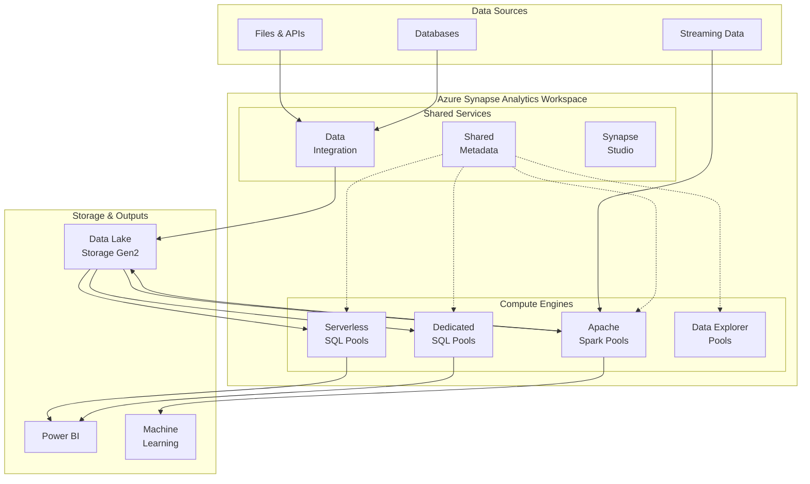
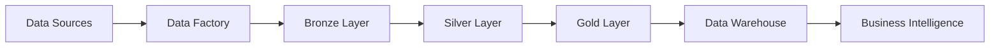
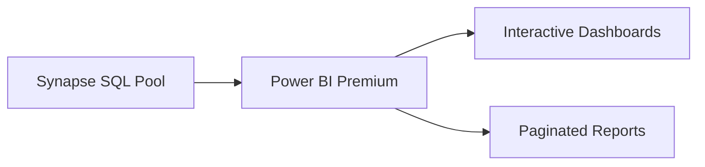
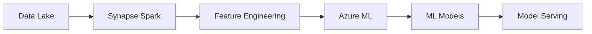

# 🎯 Azure Synapse Analytics

> __🏠 [Home](../../../../README.md)__ | __📖 [Overview](../../../01-overview/README.md)__ | __🛠️ [Services](../../README.md)__ | __💾 Analytics Compute__ | __🎯 Azure Synapse__


Unified analytics service that combines data integration, data warehousing, and big data analytics in a single workspace.

---

## 🌟 Service Overview

Azure Synapse Analytics is Microsoft's unified analytics platform that brings together data integration, data warehousing, and analytics in a single service. It provides multiple compute engines optimized for different workloads, all sharing a common metadata store and security model.

### 🔥 Key Value Propositions

- __Unified Workspace__: Single environment for all analytics needs
- __Multiple Compute Engines__: SQL, Spark, and Data Explorer in one platform
- __Serverless & Dedicated Options__: Pay-per-query or reserved capacity models
- __Deep Azure Integration__: Native connectivity with Azure services
- __Enterprise Security__: Advanced security and compliance features

---

## 🏗️ Architecture Overview



---

## 🛠️ Core Components

### ⚡ [Serverless SQL Pools](sql-pools/serverless-sql/README.md)


Query data directly in your data lake without infrastructure management.

__Key Features__:

- No infrastructure to manage
- Pay only for queries executed
- T-SQL support for data lake queries
- Automatic schema inference

__Best For__: Ad-hoc queries, data exploration, BI on data lake

__[📖 Detailed Guide →](sql-pools/serverless-sql/README.md)__

---

### 🏢 [Dedicated SQL Pools](sql-pools/dedicated-sql/README.md)


Enterprise-scale data warehousing with predictable performance.

__Key Features__:

- Dedicated compute resources
- Massively parallel processing (MPP)
- Enterprise-grade performance
- Advanced security features

__Best For__: Enterprise data warehousing, consistent high-performance workloads

__[📖 Detailed Guide →](sql-pools/dedicated-sql/README.md)__

---

### 🔥 [Apache Spark Pools](spark-pools/README.md)


Big data processing with Delta Lake and machine learning capabilities.

__Key Features__:

- Auto-scaling Spark clusters
- Native Delta Lake support
- Multi-language notebooks (Python, Scala, .NET, SQL)
- Integrated machine learning

__Components__:

- __[Delta Lakehouse Architecture](spark-pools/delta-lakehouse/README.md)__ - Modern lakehouse patterns
- __[Configuration & Tuning](spark-pools/configuration.md)__ - Optimize Spark performance
- __[Performance Tuning](spark-pools/performance-tuning.md)__ - Advanced optimization

__Best For__: Big data processing, data engineering, machine learning workflows

__[📖 Detailed Guide →](spark-pools/README.md)__

---

### 📊 [Data Explorer Pools](data-explorer-pools/)


Fast analytics on time-series and log data using KQL (Kusto Query Language).

__Key Features__:

- Sub-second query performance
- Time-series optimizations  
- Log analytics capabilities
- KQL query language

__Best For__: Time-series analytics, log analysis, IoT data processing

__[📖 Detailed Guide →](data-explorer-pools/README.md)__

---

### 🔗 [Shared Metadata](shared-metadata/README.md)


Unified metadata catalog shared across all compute engines.

__Key Features__:

- Cross-engine table sharing
- Automatic schema discovery
- Data lineage tracking
- Security policy inheritance

__Best For__: Data governance, cross-engine analytics, metadata management

__[📖 Detailed Guide →](shared-metadata/README.md)__

---

## 🎯 Common Use Cases

### 🏢 Enterprise Data Warehousing

Transform your organization with modern data warehousing capabilities.

__Architecture__: Dedicated SQL Pools + Data Lake Storage
__Pattern__: [Hub and Spoke Model](../../../03-architecture-patterns/batch-architectures/hub-spoke-model.md)



### 🔬 Advanced Analytics & Data Science

Enable data science teams with unified analytics platform.

__Architecture__: Spark Pools + Machine Learning + Delta Lake
__Pattern__: [Medallion Architecture](../../../03-architecture-patterns/batch-architectures/medallion-architecture.md)

### 🔍 Self-Service Analytics

Empower business users with self-service data exploration.

__Architecture__: Serverless SQL Pools + Power BI + Data Lake
__Pattern__: [Data Lake Analytics](../../../03-architecture-patterns/batch-architectures/data-lake-analytics.md)

### ⚡ Real-Time Analytics

Combine batch and streaming analytics in unified platform.

__Architecture__: Spark Pools + Stream Analytics + Delta Lake
__Pattern__: [Lambda Architecture](../../../03-architecture-patterns/streaming-architectures/lambda-architecture.md)

---

## 📊 Pricing Guide

### 💰 Cost Models

| Component | Pricing Model | Key Factors | Best For |
|-----------|---------------|-------------|----------|
| __Serverless SQL__ | Pay-per-TB processed | Data scanned, query complexity | Ad-hoc analytics |
| __Dedicated SQL__ | DWU hours | Performance level, uptime | Consistent workloads |
| __Spark Pools__ | Node hours | Node size, execution time | Variable workloads |
| __Data Explorer__ | Compute + markup | Cluster size, ingestion | Time-series analytics |

### 💡 Cost Optimization Tips

1. __Use Serverless for Exploration__: Start with serverless SQL for data discovery
2. __Auto-pause Spark Pools__: Enable auto-pause to avoid idle charges  
3. __Right-size Dedicated Pools__: Scale up/down based on demand
4. __Partition Data Effectively__: Reduce data scanned in queries
5. __Implement Data Lifecycle__: Move cold data to cheaper storage tiers

__[📖 Detailed Cost Guide →](../../../05-best-practices/cross-cutting-concerns/cost-optimization/README.md)__

---

## 🚀 Quick Start Guide

### 1️⃣ Create Synapse Workspace

```bash
# Create resource group
az group create --name rg-synapse-demo --location eastus

# Create storage account for data lake
az storage account create \
  --name synapsedemostorage \
  --resource-group rg-synapse-demo \
  --location eastus \
  --sku Standard_LRS \
  --enable-hierarchical-namespace true

# Create Synapse workspace
az synapse workspace create \
  --name synapse-demo-workspace \
  --resource-group rg-synapse-demo \
  --storage-account synapsedemostorage \
  --file-system synapsefilesystem \
  --sql-admin-login-user sqladmin \
  --sql-admin-login-password YourPassword123! \
  --location eastus
```

### 2️⃣ Query Data with Serverless SQL

```sql
-- Query CSV files directly from data lake
SELECT TOP 100 *
FROM OPENROWSET(
    BULK 'https://yourstorage.dfs.core.windows.net/data/sales/*.csv',
    FORMAT = 'CSV',
    PARSER_VERSION = '2.0',
    HEADER_ROW = TRUE
) AS [sales_data]
```

### 3️⃣ Process Data with Spark

```python
# Read data from data lake
df = spark.read.option("header", "true").csv("/data/sales/*.csv")

# Process and write as Delta table
df.write.format("delta").mode("overwrite").save("/delta/processed_sales")

# Create table for SQL access
spark.sql("CREATE TABLE sales USING DELTA LOCATION '/delta/processed_sales'")
```

### 4️⃣ Create Data Pipeline

1. Open __Synapse Studio__
2. Go to __Integrate__ hub
3. Create __New Pipeline__
4. Add __Copy Data__ activity
5. Configure source and destination
6. __Publish__ and __Trigger__ pipeline

---

## 🔧 Configuration & Management

### 🛡️ Security Configuration

__Key Security Features__:

- __Azure Active Directory Integration__: Single sign-on and RBAC
- __Data Encryption__: At rest and in transit
- __Network Security__: Private endpoints and firewalls
- __Column-Level Security__: Fine-grained data access control
- __Row-Level Security__: Context-based data filtering

__[📖 Security Guide →](../../../05-best-practices/cross-cutting-concerns/security/README.md)__

### ⚡ Performance Optimization

__Key Performance Features__:

- __Result Set Caching__: Cache query results for faster access
- __Materialized Views__: Pre-computed aggregations
- __Columnstore Indexes__: Optimized for analytical queries
- __Statistics__: Automatic and manual statistics management

__[📖 Performance Guide →](../../../05-best-practices/cross-cutting-concerns/performance/README.md)__

### 📊 Monitoring & Alerts

__Built-in Monitoring__:

- __Azure Monitor Integration__: Metrics and logs collection
- __Query Performance Insights__: SQL query analysis
- __Pipeline Monitoring__: Data integration tracking
- __Resource Utilization__: Compute and storage monitoring

__[📖 Monitoring Guide →](../../../09-monitoring/service-monitoring/synapse/README.md)__

---

## 🔗 Integration Patterns

### Power BI Integration

Direct connectivity for real-time dashboards and reports.



### Machine Learning Integration

Native integration with Azure Machine Learning for MLOps.



### Data Factory Integration

Built-in ETL/ELT pipelines for data movement and transformation.

__[📖 Integration Examples →](../../../04-implementation-guides/integration-scenarios/README.md)__

---

## 📚 Learning Resources

### 🎓 __Getting Started__

- [__Synapse Quick Start__](../../../tutorials/beginner/synapse-quickstart.md)
- [__SQL Pool Tutorial__](../../../tutorials/intermediate/sql-pool-tutorial.md)
- [__Spark Pool Tutorial__](../../../tutorials/intermediate/spark-pool-tutorial.md)

### 📖 __Deep Dive Guides__

- [__Architecture Patterns__](../../../03-architecture-patterns/README.md)
- [__Best Practices__](../../../05-best-practices/service-specific/synapse/README.md)
- [__Code Examples__](../../../06-code-examples/by-service/synapse/README.md)

### 🔧 __Advanced Topics__

- [__Custom Connectors__](../../../reference/synapse/custom-connectors.md)
- [__Performance Tuning__](../../../05-best-practices/cross-cutting-concerns/performance/synapse-optimization.md)
- [__Disaster Recovery__](../../../05-best-practices/operational-excellence/disaster-recovery.md)

---

## 🆘 Troubleshooting

### 🔍 Common Issues

- [__Query Performance Problems__](../../../07-troubleshooting/service-troubleshooting/synapse/query-performance.md)
- [__Connection Issues__](../../../07-troubleshooting/service-troubleshooting/synapse/connectivity.md)
- [__Resource Scaling Problems__](../../../07-troubleshooting/service-troubleshooting/synapse/scaling.md)

### 📞 Getting Help

- __Azure Support__: Official Microsoft support channels
- __Community Forums__: Stack Overflow, Microsoft Q&A
- __Documentation__: Microsoft Learn and official docs
- __GitHub Issues__: Report documentation or sample issues

__[📖 Troubleshooting Guide →](../../../07-troubleshooting/service-troubleshooting/synapse/README.md)__

---

*Last Updated: 2025-01-28*  
*Service Version: General Availability*  
*Documentation Status: Complete*
