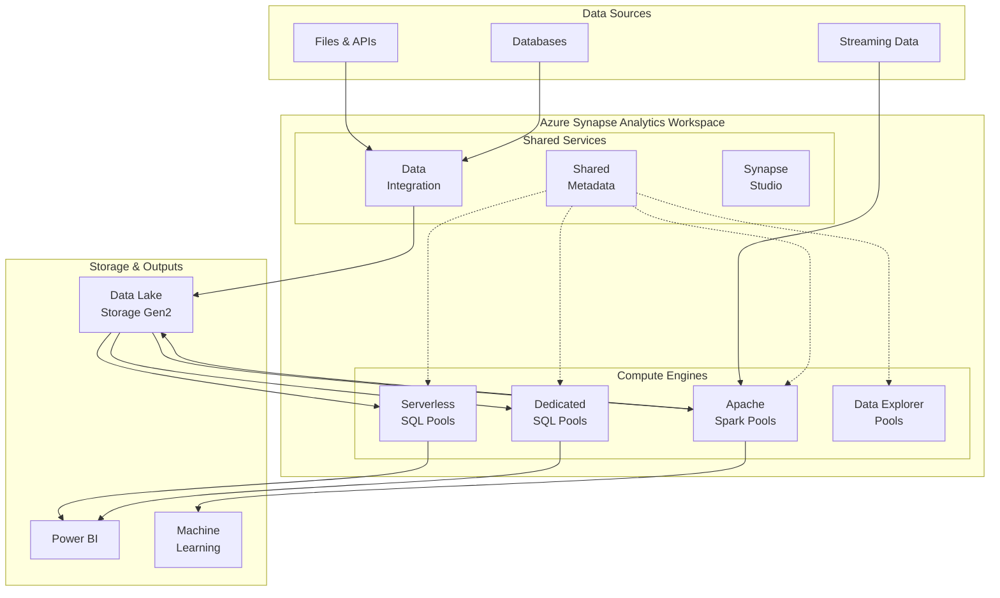
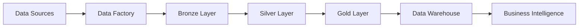
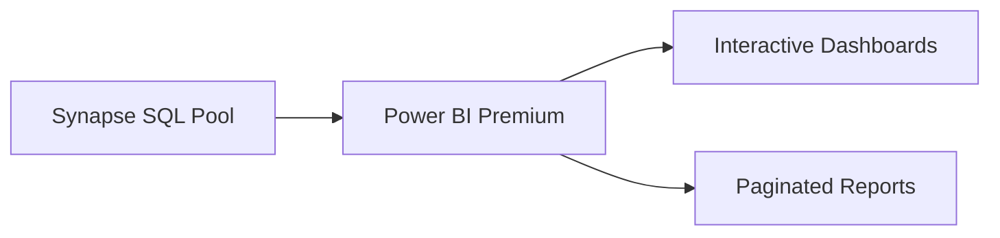
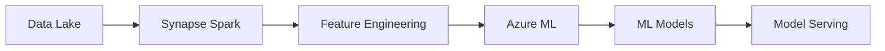

# 🎯 Azure Synapse Analytics

> **🏠 [Home](../../../../README.md)** | **📖 [Overview](../../../01-overview/README.md)** | **🛠️ [Services](../../README.md)** | **💾 [Analytics Compute](../README.md)** | **🎯 Azure Synapse**


Unified analytics service that combines data integration, data warehousing, and big data analytics in a single workspace.

---

## 🌟 Service Overview

Azure Synapse Analytics is Microsoft's unified analytics platform that brings together data integration, data warehousing, and analytics in a single service. It provides multiple compute engines optimized for different workloads, all sharing a common metadata store and security model.

### 🔥 Key Value Propositions
- **Unified Workspace**: Single environment for all analytics needs
- **Multiple Compute Engines**: SQL, Spark, and Data Explorer in one platform
- **Serverless & Dedicated Options**: Pay-per-query or reserved capacity models
- **Deep Azure Integration**: Native connectivity with Azure services
- **Enterprise Security**: Advanced security and compliance features

---

## 🏗️ Architecture Overview



---

## 🛠️ Core Components

### ⚡ [Serverless SQL Pools](sql-pools/serverless-sql/)


Query data directly in your data lake without infrastructure management.

**Key Features**:
- No infrastructure to manage
- Pay only for queries executed
- T-SQL support for data lake queries
- Automatic schema inference

**Best For**: Ad-hoc queries, data exploration, BI on data lake

**[📖 Detailed Guide →](sql-pools/serverless-sql/README.md)**

---

### 🏢 [Dedicated SQL Pools](sql-pools/dedicated-sql/)


Enterprise-scale data warehousing with predictable performance.

**Key Features**:
- Dedicated compute resources
- Massively parallel processing (MPP)
- Enterprise-grade performance
- Advanced security features

**Best For**: Enterprise data warehousing, consistent high-performance workloads

**[📖 Detailed Guide →](sql-pools/dedicated-sql/README.md)**

---

### 🔥 [Apache Spark Pools](spark-pools/)


Big data processing with Delta Lake and machine learning capabilities.

**Key Features**:
- Auto-scaling Spark clusters
- Native Delta Lake support
- Multi-language notebooks (Python, Scala, .NET, SQL)
- Integrated machine learning

**Components**:
- **[Delta Lakehouse Architecture](spark-pools/delta-lakehouse/)** - Modern lakehouse patterns
- **[Configuration & Tuning](spark-pools/configuration.md)** - Optimize Spark performance
- **[Performance Tuning](spark-pools/performance-tuning.md)** - Advanced optimization

**Best For**: Big data processing, data engineering, machine learning workflows

**[📖 Detailed Guide →](spark-pools/README.md)**

---

### 📊 [Data Explorer Pools](data-explorer-pools/)


Fast analytics on time-series and log data using KQL (Kusto Query Language).

**Key Features**:
- Sub-second query performance
- Time-series optimizations  
- Log analytics capabilities
- KQL query language

**Best For**: Time-series analytics, log analysis, IoT data processing

**[📖 Detailed Guide →](data-explorer-pools/README.md)**

---

### 🔗 [Shared Metadata](shared-metadata/)


Unified metadata catalog shared across all compute engines.

**Key Features**:
- Cross-engine table sharing
- Automatic schema discovery
- Data lineage tracking
- Security policy inheritance

**Best For**: Data governance, cross-engine analytics, metadata management

**[📖 Detailed Guide →](shared-metadata/README.md)**

---

## 🎯 Common Use Cases

### 🏢 Enterprise Data Warehousing
Transform your organization with modern data warehousing capabilities.

**Architecture**: Dedicated SQL Pools + Data Lake Storage
**Pattern**: [Hub and Spoke Model](../../../03-architecture-patterns/batch-architectures/hub-spoke-model.md)



### 🔬 Advanced Analytics & Data Science
Enable data science teams with unified analytics platform.

**Architecture**: Spark Pools + Machine Learning + Delta Lake
**Pattern**: [Medallion Architecture](../../../03-architecture-patterns/batch-architectures/medallion-architecture.md)

### 🔍 Self-Service Analytics
Empower business users with self-service data exploration.

**Architecture**: Serverless SQL Pools + Power BI + Data Lake
**Pattern**: [Data Lake Analytics](../../../03-architecture-patterns/batch-architectures/data-lake-analytics.md)

### ⚡ Real-Time Analytics
Combine batch and streaming analytics in unified platform.

**Architecture**: Spark Pools + Stream Analytics + Delta Lake
**Pattern**: [Lambda Architecture](../../../03-architecture-patterns/streaming-architectures/lambda-architecture.md)

---

## 📊 Pricing Guide

### 💰 Cost Models

| Component | Pricing Model | Key Factors | Best For |
|-----------|---------------|-------------|----------|
| **Serverless SQL** | Pay-per-TB processed | Data scanned, query complexity | Ad-hoc analytics |
| **Dedicated SQL** | DWU hours | Performance level, uptime | Consistent workloads |
| **Spark Pools** | Node hours | Node size, execution time | Variable workloads |
| **Data Explorer** | Compute + markup | Cluster size, ingestion | Time-series analytics |

### 💡 Cost Optimization Tips

1. **Use Serverless for Exploration**: Start with serverless SQL for data discovery
2. **Auto-pause Spark Pools**: Enable auto-pause to avoid idle charges  
3. **Right-size Dedicated Pools**: Scale up/down based on demand
4. **Partition Data Effectively**: Reduce data scanned in queries
5. **Implement Data Lifecycle**: Move cold data to cheaper storage tiers

**[📖 Detailed Cost Guide →](../../../05-best-practices/cross-cutting-concerns/cost-optimization/README.md)**

---

## 🚀 Quick Start Guide

### 1️⃣ Create Synapse Workspace

```bash
# Create resource group
az group create --name rg-synapse-demo --location eastus

# Create storage account for data lake
az storage account create \
  --name synapsedemostorage \
  --resource-group rg-synapse-demo \
  --location eastus \
  --sku Standard_LRS \
  --enable-hierarchical-namespace true

# Create Synapse workspace
az synapse workspace create \
  --name synapse-demo-workspace \
  --resource-group rg-synapse-demo \
  --storage-account synapsedemostorage \
  --file-system synapsefilesystem \
  --sql-admin-login-user sqladmin \
  --sql-admin-login-password YourPassword123! \
  --location eastus
```

### 2️⃣ Query Data with Serverless SQL

```sql
-- Query CSV files directly from data lake
SELECT TOP 100 *
FROM OPENROWSET(
    BULK 'https://yourstorage.dfs.core.windows.net/data/sales/*.csv',
    FORMAT = 'CSV',
    PARSER_VERSION = '2.0',
    HEADER_ROW = TRUE
) AS [sales_data]
```

### 3️⃣ Process Data with Spark

```python
# Read data from data lake
df = spark.read.option("header", "true").csv("/data/sales/*.csv")

# Process and write as Delta table
df.write.format("delta").mode("overwrite").save("/delta/processed_sales")

# Create table for SQL access
spark.sql("CREATE TABLE sales USING DELTA LOCATION '/delta/processed_sales'")
```

### 4️⃣ Create Data Pipeline

1. Open **Synapse Studio**
2. Go to **Integrate** hub
3. Create **New Pipeline**
4. Add **Copy Data** activity
5. Configure source and destination
6. **Publish** and **Trigger** pipeline

---

## 🔧 Configuration & Management

### 🛡️ Security Configuration

**Key Security Features**:
- **Azure Active Directory Integration**: Single sign-on and RBAC
- **Data Encryption**: At rest and in transit
- **Network Security**: Private endpoints and firewalls
- **Column-Level Security**: Fine-grained data access control
- **Row-Level Security**: Context-based data filtering

**[📖 Security Guide →](../../../05-best-practices/cross-cutting-concerns/security/README.md)**

### ⚡ Performance Optimization

**Key Performance Features**:
- **Result Set Caching**: Cache query results for faster access
- **Materialized Views**: Pre-computed aggregations
- **Columnstore Indexes**: Optimized for analytical queries
- **Statistics**: Automatic and manual statistics management

**[📖 Performance Guide →](../../../05-best-practices/cross-cutting-concerns/performance/README.md)**

### 📊 Monitoring & Alerts

**Built-in Monitoring**:
- **Azure Monitor Integration**: Metrics and logs collection
- **Query Performance Insights**: SQL query analysis
- **Pipeline Monitoring**: Data integration tracking
- **Resource Utilization**: Compute and storage monitoring

**[📖 Monitoring Guide →](../../../09-monitoring/service-monitoring/synapse/README.md)**

---

## 🔗 Integration Patterns

### Power BI Integration
Direct connectivity for real-time dashboards and reports.



### Machine Learning Integration
Native integration with Azure Machine Learning for MLOps.



### Data Factory Integration
Built-in ETL/ELT pipelines for data movement and transformation.

**[📖 Integration Examples →](../../../04-implementation-guides/integration-scenarios/README.md)**

---

## 📚 Learning Resources

### 🎓 **Getting Started**
- [**Synapse Quick Start**](../../../tutorials/beginner/synapse-quickstart.md)
- [**SQL Pool Tutorial**](../../../tutorials/intermediate/sql-pool-tutorial.md)
- [**Spark Pool Tutorial**](../../../tutorials/intermediate/spark-pool-tutorial.md)

### 📖 **Deep Dive Guides**
- [**Architecture Patterns**](../../../03-architecture-patterns/README.md)
- [**Best Practices**](../../../05-best-practices/service-specific/synapse/README.md)
- [**Code Examples**](../../../06-code-examples/by-service/synapse/README.md)

### 🔧 **Advanced Topics**
- [**Custom Connectors**](../../../reference/synapse/custom-connectors.md)
- [**Performance Tuning**](../../../05-best-practices/cross-cutting-concerns/performance/synapse-optimization.md)
- [**Disaster Recovery**](../../../05-best-practices/operational-excellence/disaster-recovery.md)

---

## 🆘 Troubleshooting

### 🔍 Common Issues
- [**Query Performance Problems**](../../../07-troubleshooting/service-troubleshooting/synapse/query-performance.md)
- [**Connection Issues**](../../../07-troubleshooting/service-troubleshooting/synapse/connectivity.md)
- [**Resource Scaling Problems**](../../../07-troubleshooting/service-troubleshooting/synapse/scaling.md)

### 📞 Getting Help
- **Azure Support**: Official Microsoft support channels
- **Community Forums**: Stack Overflow, Microsoft Q&A
- **Documentation**: Microsoft Learn and official docs
- **GitHub Issues**: Report documentation or sample issues

**[📖 Troubleshooting Guide →](../../../07-troubleshooting/service-troubleshooting/synapse/README.md)**

---

*Last Updated: 2025-01-28*  
*Service Version: General Availability*  
*Documentation Status: Complete*