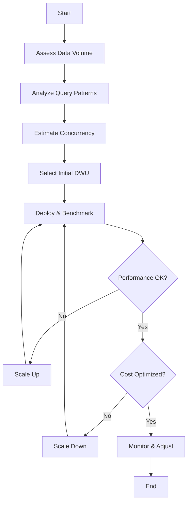

# 📐 Dedicated SQL Pool Sizing Guide

> __🏠 [Home](../../../../../README.md)__ | __🛠️ [Services](../../../README.md)__ | __📊 [Synapse](../README.md)__ | __📐 Sizing__


Comprehensive guide for sizing Azure Synapse Dedicated SQL Pools to optimize performance and cost.

---

## 🎯 Overview

Dedicated SQL Pool sizing is critical for achieving optimal query performance while managing costs effectively. This guide helps you select the right Data Warehouse Units (DWU) based on your workload characteristics.

---

## 📊 Understanding DWU (Data Warehouse Units)

DWU is a unit of compute capacity that combines CPU, memory, and I/O. Higher DWU levels provide more resources for query processing.

### DWU Tiers

| DWU Level | Compute Nodes | Distributions per Node | Memory (GB) | Best For |
|-----------|---------------|------------------------|-------------|----------|
| DW100c | 1 | 60 | 60 | Development, POC |
| DW200c | 1 | 60 | 120 | Small workloads |
| DW500c | 1 | 60 | 300 | Medium workloads |
| DW1000c | 2 | 30 | 600 | Production |
| DW2000c | 4 | 15 | 1,200 | Large enterprise |
| DW3000c | 6 | 10 | 1,800 | Large enterprise |
| DW5000c | 10 | 6 | 3,000 | Very large |
| DW6000c | 12 | 5 | 3,600 | Very large |
| DW7500c | 15 | 4 | 4,500 | Enterprise critical |
| DW10000c | 20 | 3 | 6,000 | Enterprise critical |
| DW15000c | 30 | 2 | 9,000 | Maximum scale |
| DW30000c | 60 | 1 | 18,000 | Maximum scale |

---

## 🔍 Sizing Factors

### 1. Data Volume

| Data Volume | Recommended Starting DWU |
|-------------|-------------------------|
| < 1 TB | DW100c - DW200c |
| 1 - 10 TB | DW500c - DW1000c |
| 10 - 50 TB | DW1000c - DW3000c |
| 50 - 100 TB | DW3000c - DW6000c |
| > 100 TB | DW6000c - DW30000c |

### 2. Query Complexity

```sql
-- Simple queries: Lower DWU sufficient
SELECT product_category, SUM(sales_amount)
FROM sales_fact
GROUP BY product_category;

-- Complex queries: Higher DWU needed
WITH ranked_sales AS (
    SELECT
        customer_id,
        product_id,
        sales_amount,
        ROW_NUMBER() OVER (PARTITION BY customer_id ORDER BY sales_date DESC) as rn
    FROM sales_fact sf
    JOIN customer_dim cd ON sf.customer_key = cd.customer_key
    JOIN product_dim pd ON sf.product_key = pd.product_key
    WHERE sales_date >= DATEADD(year, -1, GETDATE())
)
SELECT
    c.customer_segment,
    AVG(rs.sales_amount) as avg_recent_sale,
    COUNT(DISTINCT rs.customer_id) as active_customers
FROM ranked_sales rs
JOIN customer_dim c ON rs.customer_id = c.customer_id
WHERE rs.rn <= 10
GROUP BY c.customer_segment;
```

### 3. Concurrency Requirements

| Concurrent Users | Recommended Minimum DWU |
|------------------|------------------------|
| 1-4 | DW100c |
| 5-16 | DW500c |
| 17-32 | DW1000c |
| 33-48 | DW2000c |
| 49-128 | DW5000c+ |

---

## 📈 Performance Optimization

### Distribution Strategy

Choose the right distribution for your tables:

```sql
-- Hash distribution for large fact tables
CREATE TABLE [dbo].[sales_fact]
(
    [sales_key] BIGINT NOT NULL,
    [customer_key] INT NOT NULL,
    [product_key] INT NOT NULL,
    [sales_amount] DECIMAL(18,2)
)
WITH
(
    DISTRIBUTION = HASH([customer_key]),
    CLUSTERED COLUMNSTORE INDEX
);

-- Replicate small dimension tables
CREATE TABLE [dbo].[product_dim]
(
    [product_key] INT NOT NULL,
    [product_name] NVARCHAR(100),
    [category] NVARCHAR(50)
)
WITH
(
    DISTRIBUTION = REPLICATE,
    CLUSTERED COLUMNSTORE INDEX
);

-- Round robin for staging
CREATE TABLE [staging].[raw_data]
(
    [id] INT,
    [data] NVARCHAR(MAX)
)
WITH
(
    DISTRIBUTION = ROUND_ROBIN,
    HEAP
);
```

### Memory Optimization

```sql
-- Check memory grants
SELECT
    er.request_id,
    er.status,
    er.resource_class,
    er.importance,
    erp.min_memory_grant_percent,
    erp.max_memory_grant_percent
FROM sys.dm_pdw_exec_requests er
JOIN sys.dm_pdw_exec_requests_priority erp
    ON er.request_id = erp.request_id
WHERE er.status = 'Running';

-- Assign appropriate resource class
EXEC sp_addrolemember 'xlargerc', 'etl_user';
```

---

## 💰 Cost Optimization

### Auto-Pause Configuration

```sql
-- Configure auto-pause (Azure Portal or REST API)
-- Recommended for dev/test environments

-- Check pause status
SELECT
    [name],
    [state_desc],
    [create_date]
FROM sys.databases
WHERE name = 'your_dw_name';
```

### Scaling Best Practices

```powershell
# Scale up during business hours
Set-AzSynapseSqlPool `
    -ResourceGroupName "rg-analytics" `
    -WorkspaceName "synapse-workspace" `
    -Name "DedicatedPool" `
    -PerformanceLevel "DW1000c"

# Scale down after hours
Set-AzSynapseSqlPool `
    -ResourceGroupName "rg-analytics" `
    -WorkspaceName "synapse-workspace" `
    -Name "DedicatedPool" `
    -PerformanceLevel "DW200c"
```

### Cost Estimation

| DWU Level | Hourly Cost (Est.) | Monthly Cost (24/7) | Monthly Cost (8hrs/day) |
|-----------|-------------------|---------------------|------------------------|
| DW100c | ~$1.20 | ~$876 | ~$240 |
| DW500c | ~$6.00 | ~$4,380 | ~$1,200 |
| DW1000c | ~$12.00 | ~$8,760 | ~$2,400 |
| DW2000c | ~$24.00 | ~$17,520 | ~$4,800 |

*Prices are estimates and vary by region. Check Azure pricing calculator for current rates.*

---

## 🔧 Sizing Workflow



---

## 📊 Monitoring Queries

### Query Performance

```sql
-- Top resource-consuming queries
SELECT TOP 20
    request_id,
    submit_time,
    start_time,
    end_time,
    total_elapsed_time / 1000.0 as elapsed_seconds,
    command
FROM sys.dm_pdw_exec_requests
WHERE status = 'Completed'
    AND submit_time > DATEADD(day, -1, GETDATE())
ORDER BY total_elapsed_time DESC;

-- Data movement analysis
SELECT
    request_id,
    step_index,
    operation_type,
    distribution_type,
    location_type,
    status,
    total_elapsed_time
FROM sys.dm_pdw_request_steps
WHERE request_id = 'QID####'
ORDER BY step_index;
```

### Resource Utilization

```sql
-- Check current resource usage
SELECT
    compute_node_id,
    type,
    is_available,
    memory_usage_mb,
    tempdb_space_used_mb
FROM sys.dm_pdw_nodes_resource_governor_resource_pools_history_ex
WHERE snapshot_time > DATEADD(hour, -1, GETDATE());
```

---

## 📚 Related Documentation

- [Dedicated SQL Pool Overview](README.md)
- [Performance Optimization](../../../../05-best-practices/service-specific/synapse/dedicated-sql-best-practices.md)
- [Cost Management](../../../../05-best-practices/cross-cutting-concerns/cost-optimization/dedicated-sql-costs.md)
- [Troubleshooting](../../../../07-troubleshooting/service-troubleshooting/synapse/README.md)

---

*Last Updated: January 2025*
