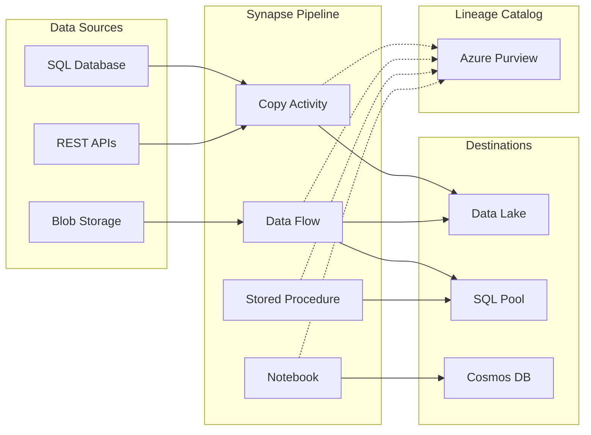

# 🔗 Pipeline Lineage Tracking

> __🏠 [Home](../../../../../README.md)__ | __🛠️ [Services](../../../README.md)__ | __📊 [Synapse](../README.md)__ | __🔗 Lineage Tracking__


Comprehensive guide for implementing data lineage tracking in Azure Synapse pipelines with Azure Purview integration.

---

## 🎯 Overview

Data lineage tracking provides visibility into how data flows through your analytics pipelines, enabling:

- **Impact Analysis**: Understand downstream effects of data changes
- **Root Cause Analysis**: Trace data quality issues to their source
- **Compliance**: Document data transformations for regulatory requirements
- **Trust**: Build confidence in data quality and accuracy

---

## 🏗️ Architecture



---

## 🔧 Setup and Configuration

### 1. Connect Synapse to Azure Purview

```json
// Synapse workspace ARM template snippet
{
    "type": "Microsoft.Synapse/workspaces",
    "apiVersion": "2021-06-01",
    "properties": {
        "purviewConfiguration": {
            "purviewResourceId": "/subscriptions/{sub-id}/resourceGroups/{rg}/providers/Microsoft.Purview/accounts/{purview-account}"
        }
    }
}
```

### 2. Configure Managed Identity Permissions

```powershell
# Grant Synapse MI access to Purview
$synapseObjectId = (Get-AzSynapseWorkspace -Name "synapse-workspace" -ResourceGroupName "rg-analytics").Identity.PrincipalId

# Add to Purview Data Curator role
New-AzRoleAssignment `
    -ObjectId $synapseObjectId `
    -RoleDefinitionName "Purview Data Curator" `
    -Scope "/subscriptions/{sub-id}/resourceGroups/{rg}/providers/Microsoft.Purview/accounts/{purview-account}"
```

### 3. Enable Lineage in Pipeline Activities

```json
// Copy Activity with lineage enabled
{
    "name": "CopyToDataLake",
    "type": "Copy",
    "inputs": [
        {
            "referenceName": "SourceDataset",
            "type": "DatasetReference"
        }
    ],
    "outputs": [
        {
            "referenceName": "SinkDataset",
            "type": "DatasetReference"
        }
    ],
    "typeProperties": {
        "source": {
            "type": "AzureSqlSource"
        },
        "sink": {
            "type": "ParquetSink"
        },
        "enableSkipIncompatibleRow": false
    },
    "policy": {
        "lineageEnabled": true
    }
}
```

---

## 📊 Lineage-Enabled Activities

### Supported Activities

| Activity Type | Lineage Support | Notes |
|---------------|-----------------|-------|
| Copy Activity | ✅ Full | Column-level lineage |
| Data Flow | ✅ Full | Transformation lineage |
| Stored Procedure | ⚠️ Partial | Requires manual mapping |
| Notebook | ⚠️ Partial | API-based capture |
| Lookup | ❌ Limited | Read-only operations |
| Get Metadata | ❌ None | No data movement |

### Data Flow Lineage

```json
// Data Flow with transformation lineage
{
    "name": "TransformCustomerData",
    "properties": {
        "type": "MappingDataFlow",
        "typeProperties": {
            "sources": [
                {
                    "dataset": {
                        "referenceName": "RawCustomers",
                        "type": "DatasetReference"
                    },
                    "name": "sourceCustomers"
                }
            ],
            "transformations": [
                {
                    "name": "FilterActiveCustomers",
                    "flowlet": {
                        "filterExpr": "status == 'active'"
                    }
                },
                {
                    "name": "DeriveFullName",
                    "derivedColumns": [
                        {
                            "name": "full_name",
                            "expression": "concat(first_name, ' ', last_name)"
                        }
                    ]
                }
            ],
            "sinks": [
                {
                    "dataset": {
                        "referenceName": "CuratedCustomers",
                        "type": "DatasetReference"
                    },
                    "name": "sinkCustomers"
                }
            ]
        }
    }
}
```

---

## 🔍 Custom Lineage Capture

### Notebook Lineage with Purview API

```python
from azure.identity import DefaultAzureCredential
from azure.purview.catalog import PurviewCatalogClient
import json

# Initialize Purview client
credential = DefaultAzureCredential()
client = PurviewCatalogClient(
    endpoint="https://{purview-account}.purview.azure.com",
    credential=credential
)

# Define lineage entity
lineage_entity = {
    "typeName": "spark_process",
    "attributes": {
        "qualifiedName": "synapse://workspace/notebook/transform_sales",
        "name": "Transform Sales Data",
        "owner": "data-engineering-team"
    },
    "relationshipAttributes": {
        "inputs": [
            {
                "typeName": "azure_datalake_gen2_path",
                "uniqueAttributes": {
                    "qualifiedName": "adls://storage/raw/sales/*.parquet"
                }
            }
        ],
        "outputs": [
            {
                "typeName": "azure_datalake_gen2_path",
                "uniqueAttributes": {
                    "qualifiedName": "adls://storage/curated/sales_transformed/*.parquet"
                }
            }
        ]
    }
}

# Push lineage to Purview
response = client.entity.create_or_update({"entity": lineage_entity})
print(f"Lineage captured: {response}")
```

### Column-Level Lineage

```python
# Column mapping for detailed lineage
column_lineage = {
    "typeName": "DataSet_DataSet_Columns",
    "attributes": {
        "fromColumns": [
            {"qualifiedName": "adls://raw/sales.parquet#amount"},
            {"qualifiedName": "adls://raw/sales.parquet#quantity"}
        ],
        "toColumns": [
            {"qualifiedName": "adls://curated/sales.parquet#total_value"}
        ],
        "expression": "amount * quantity"
    }
}
```

---

## 📈 Querying Lineage

### Purview REST API

```python
# Get upstream lineage (data sources)
upstream = client.lineage.get_lineage_graph(
    guid="{entity-guid}",
    direction="INPUT",
    depth=3
)

# Get downstream lineage (consumers)
downstream = client.lineage.get_lineage_graph(
    guid="{entity-guid}",
    direction="OUTPUT",
    depth=3
)

# Print lineage path
for node in upstream.get("guidEntityMap", {}).values():
    print(f"  {node['typeName']}: {node['attributes']['qualifiedName']}")
```

### SQL-Based Lineage Query

```sql
-- Query Synapse pipeline run metadata
SELECT
    pr.run_id,
    pr.pipeline_name,
    pr.status,
    ar.activity_name,
    ar.activity_type,
    ar.input,
    ar.output,
    pr.run_start,
    pr.run_end
FROM sys.dm_pdw_exec_pipeline_runs pr
JOIN sys.dm_pdw_exec_activity_runs ar
    ON pr.run_id = ar.pipeline_run_id
WHERE pr.run_start > DATEADD(day, -7, GETDATE())
ORDER BY pr.run_start DESC;
```

---

## 🛡️ Best Practices

### 1. Naming Conventions

```
# Consistent naming enables better lineage discovery
Datasets: {system}_{domain}_{entity}_{layer}
          erp_sales_orders_bronze

Pipelines: pl_{domain}_{action}_{frequency}
           pl_sales_transform_daily

Data Flows: df_{domain}_{transformation}
            df_sales_aggregation
```

### 2. Metadata Enrichment

```json
// Add business metadata to enhance lineage
{
    "annotations": [
        {
            "name": "business_owner",
            "value": "sales-analytics@company.com"
        },
        {
            "name": "data_classification",
            "value": "confidential"
        },
        {
            "name": "retention_policy",
            "value": "7-years"
        }
    ]
}
```

### 3. Lineage Validation

```python
# Validate lineage completeness
def validate_lineage(entity_guid):
    lineage = client.lineage.get_lineage_graph(
        guid=entity_guid,
        direction="BOTH",
        depth=5
    )

    issues = []

    # Check for orphan entities
    for guid, entity in lineage.get("guidEntityMap", {}).items():
        if entity.get("typeName") == "DataSet":
            relations = lineage.get("relations", [])
            has_upstream = any(r["toEntityId"] == guid for r in relations)
            has_downstream = any(r["fromEntityId"] == guid for r in relations)

            if not has_upstream and not has_downstream:
                issues.append(f"Orphan entity: {entity['attributes']['qualifiedName']}")

    return issues
```

---

## 🔗 Integration Points

### Azure Data Factory

```json
// ADF pipeline with Purview lineage
{
    "name": "ADFPipelineWithLineage",
    "properties": {
        "activities": [...],
        "annotations": [
            "lineageEnabled"
        ]
    }
}
```

### Databricks

```python
# Databricks lineage to Purview
from pyspark.sql import SparkSession
from databricks.feature_store import FeatureStoreClient

# Feature Store automatically tracks lineage
fs = FeatureStoreClient()
fs.create_training_set(
    df=features_df,
    feature_lookups=[...],
    label="target",
    exclude_columns=["id"]
)
```

---

## 📚 Related Documentation

- [Azure Purview Lineage](../../../data-governance/azure-purview/lineage.md)
- [Data Factory Pipelines](../../../orchestration-services/azure-data-factory/README.md)
- [Data Governance Best Practices](../../../../05-best-practices/cross-cutting-concerns/data-governance/README.md)
- [Compliance Requirements](../../../../reference/security-checklist/README.md)

---

*Last Updated: January 2025*
