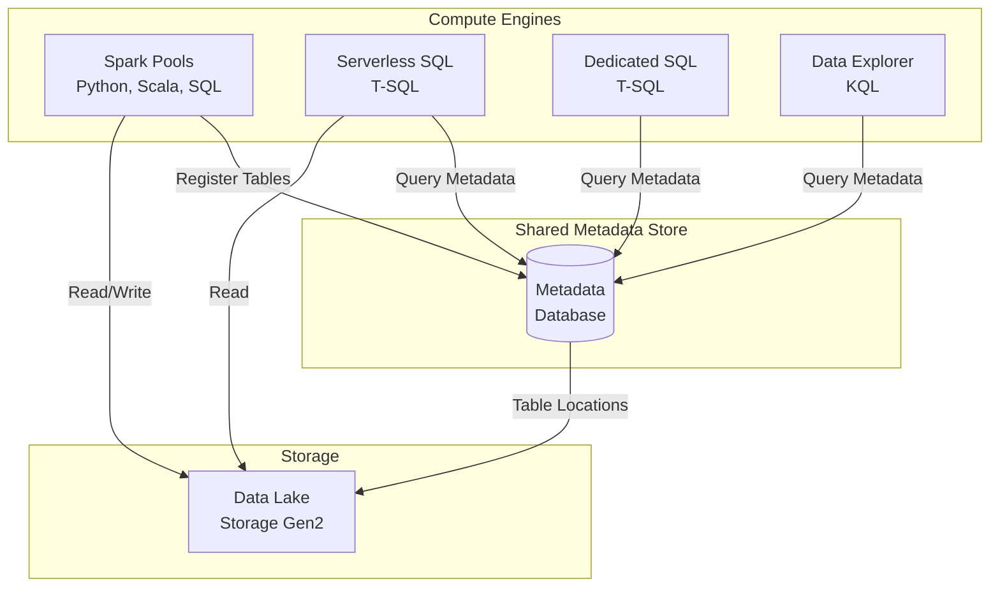

# 🔗 Shared Metadata Store - Azure Synapse Analytics

> __🏠 [Home](../../../../../README.md)__ | __📖 [Overview](../../../../01-overview/README.md)__ | __🛠️ [Services](../../../README.md)__ | __💾 [Analytics Compute](../../README.md)__ | __🎯 [Synapse](../README.md)__ | __🔗 Shared Metadata__


Unified metadata catalog that enables seamless table sharing across Spark, SQL, and Data Explorer engines in Azure Synapse Analytics.

---

## 🌟 Overview

The Shared Metadata Store in Azure Synapse Analytics provides a unified catalog that allows tables created in one compute engine (Spark, SQL, Data Explorer) to be automatically discovered and queried by other engines. This eliminates data silos and enables true polyglot analytics.

### 🔥 Key Benefits

- __Cross-Engine Discovery__: Tables automatically visible across all engines
- __Schema Synchronization__: Schema changes propagate automatically
- __Security Inheritance__: Access controls apply consistently
- __Data Lineage__: Track data flow across engines
- __Simplified Governance__: Single source of truth for metadata

---

## 🏗️ Architecture



---

## 🎯 Cross-Engine Table Sharing

### Create Table in Spark, Query in SQL

```python
# Create Delta table in Spark
df = spark.read.parquet("/data/sales/*.parquet")

df.write.format("delta") \
    .mode("overwrite") \
    .saveAsTable("sales.customer_orders")

# Table automatically visible in SQL pools
```

```sql
-- Query Spark-created table in Serverless SQL
SELECT
    customer_id,
    COUNT(*) as order_count,
    SUM(order_amount) as total_spent
FROM sales.customer_orders
WHERE order_date >= '2024-01-01'
GROUP BY customer_id
ORDER BY total_spent DESC;
```

---

### Metadata Synchronization Example

```python
# Spark: Create managed Delta table
spark.sql("""
    CREATE TABLE IF NOT EXISTS analytics.sales_summary (
        sale_date DATE,
        region STRING,
        product_category STRING,
        total_revenue DECIMAL(18,2),
        order_count INT
    )
    USING DELTA
    PARTITIONED BY (sale_date)
    LOCATION '/delta/sales_summary'
""")

# Insert data
spark.sql("""
    INSERT INTO analytics.sales_summary
    SELECT
        order_date as sale_date,
        region,
        product_category,
        SUM(amount) as total_revenue,
        COUNT(*) as order_count
    FROM sales.customer_orders
    GROUP BY order_date, region, product_category
""")
```

```sql
-- Serverless SQL: Table immediately available
SELECT TOP 10 *
FROM analytics.sales_summary
ORDER BY total_revenue DESC;

-- Check table metadata
SELECT
    TABLE_SCHEMA,
    TABLE_NAME,
    TABLE_TYPE
FROM INFORMATION_SCHEMA.TABLES
WHERE TABLE_NAME = 'sales_summary';
```

---

## 🔒 Unified Security

### Row-Level Security Across Engines

```python
# Define security policy in Spark
spark.sql("""
    CREATE OR REPLACE FUNCTION get_user_region()
    RETURNS STRING
    RETURN current_user()
""")

# Create secure view
spark.sql("""
    CREATE OR REPLACE VIEW sales.secure_customer_orders AS
    SELECT *
    FROM sales.customer_orders
    WHERE region = get_user_region()
""")
```

```sql
-- Same security applies in SQL
-- Users only see their region's data
SELECT * FROM sales.secure_customer_orders;
```

---

## 📊 Best Practices

### 1. Use Managed Tables for Shared Access

```python
# ✅ GOOD: Managed table (metadata tracked)
df.write.format("delta") \
    .mode("overwrite") \
    .saveAsTable("sales.managed_table")

# ❌ LESS IDEAL: External path (not in catalog)
df.write.format("delta") \
    .mode("overwrite") \
    .save("/delta/external_path")
```

### 2. Consistent Naming Conventions

```python
# Use database.table naming
spark.sql("CREATE DATABASE IF NOT EXISTS sales")
spark.sql("CREATE DATABASE IF NOT EXISTS analytics")
spark.sql("CREATE DATABASE IF NOT EXISTS ml_features")

# Organize by domain
# sales.customer_orders
# analytics.sales_summary
# ml_features.customer_features
```

### 3. Schema Evolution Management

```python
# Enable schema evolution for Delta tables
spark.conf.set("spark.databricks.delta.schema.autoMerge.enabled", "true")

# Add new columns safely
spark.sql("""
    ALTER TABLE sales.customer_orders
    ADD COLUMNS (
        customer_segment STRING COMMENT 'Customer tier: Gold, Silver, Bronze',
        lifetime_value DECIMAL(18,2) COMMENT 'Total customer value'
    )
""")

# Changes visible across all engines immediately
```

---

## 📚 Related Resources

### 🎓 __Implementation Guides__

- [__Delta Lake Metadata__](../spark-pools/delta-lakehouse/README.md)
- [__Security Best Practices__](../../../../05-best-practices/cross-cutting-concerns/security/metadata-security.md)
- [__Data Governance__](../../../../05-best-practices/cross-cutting-concerns/governance/metadata-governance.md)

---

*Last Updated: 2025-01-28*
*Feature: Shared Metadata Catalog*
*Documentation Status: Complete*
