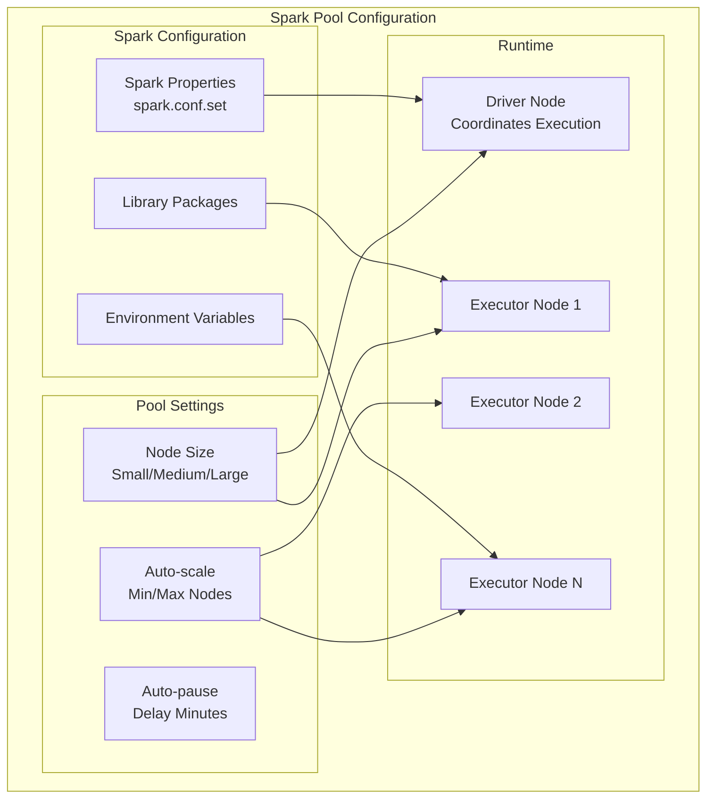

# ⚙️ Spark Pool Configuration - Azure Synapse Analytics

> __🏠 [Home](../../../../../README.md)__ | __📖 [Overview](../../../../01-overview/README.md)__ | __🛠️ [Services](../../../README.md)__ | __💾 [Analytics Compute](../../README.md)__ | __🎯 [Synapse](../README.md)__ | __🔥 [Spark Pools](README.md)__ | __⚙️ Configuration__


Comprehensive guide to configuring Azure Synapse Spark pools for optimal performance, including node sizing, auto-scaling, library management, and configuration properties.

---

## 🌟 Overview

Proper Spark pool configuration is critical for achieving optimal performance and cost-efficiency. This guide covers all aspects of Spark pool configuration, from basic node sizing to advanced Spark properties and custom library management.

---

## 🏗️ Spark Pool Architecture



---

## 🖥️ Node Size Configuration

### Available Node Sizes

| Node Size | vCores | Memory | Storage | Best For | Hourly Cost* |
|-----------|--------|--------|---------|----------|--------------|
| __Small__ | 4 | 32 GB | 64 GB | Development, small datasets | ~$0.20 |
| __Medium__ | 8 | 64 GB | 128 GB | General workloads | ~$0.40 |
| __Large__ | 16 | 128 GB | 256 GB | Large datasets, complex processing | ~$0.80 |
| __XLarge__ | 32 | 256 GB | 512 GB | Very large datasets, memory-intensive | ~$1.60 |
| __XXLarge__ | 64 | 432 GB | 1 TB | Extreme workloads | ~$3.20 |

*Costs are approximate and vary by region

### Choosing the Right Node Size

```python
# Decision framework for node sizing
def recommend_node_size(dataset_size_gb, transformation_complexity, budget_priority):
    """
    Recommend node size based on workload characteristics.
    """
    # Dataset size consideration
    if dataset_size_gb < 10:
        base_size = "Small"
    elif dataset_size_gb < 100:
        base_size = "Medium"
    elif dataset_size_gb < 1000:
        base_size = "Large"
    else:
        base_size = "XLarge"

    # Adjust for complexity
    if transformation_complexity == "high":
        size_map = {"Small": "Medium", "Medium": "Large", "Large": "XLarge"}
        base_size = size_map.get(base_size, "XXLarge")

    # Budget override
    if budget_priority == "cost-optimized" and base_size in ["XLarge", "XXLarge"]:
        return "Large", "Consider using more nodes with smaller size"

    return base_size, "Recommended based on workload"

# Example usage
size, note = recommend_node_size(
    dataset_size_gb=500,
    transformation_complexity="high",
    budget_priority="performance"
)
print(f"Recommended: {size} - {note}")
# Output: Recommended: XLarge - Recommended based on workload
```

---

## 📊 Auto-scaling Configuration

### Auto-scale Settings

```python
# Configure auto-scaling via Azure SDK
from azure.synapse.spark import SparkClient
from azure.identity import DefaultAzureCredential

credential = DefaultAzureCredential()
spark_client = SparkClient(credential=credential)

# Create Spark pool with auto-scaling
pool_config = {
    "name": "production-spark-pool",
    "nodeSize": "Medium",
    "nodeSizeFamily": "MemoryOptimized",
    "autoScale": {
        "enabled": True,
        "minNodeCount": 3,
        "maxNodeCount": 20
    },
    "autoPause": {
        "enabled": True,
        "delayInMinutes": 15
    },
    "sparkVersion": "3.3"
}

# Workload-specific auto-scale configurations
configs = {
    "development": {
        "minNodeCount": 3,
        "maxNodeCount": 5,
        "autoPauseMinutes": 5,
        "nodeSize": "Small"
    },
    "production_batch": {
        "minNodeCount": 5,
        "maxNodeCount": 30,
        "autoPauseMinutes": 30,
        "nodeSize": "Large"
    },
    "production_interactive": {
        "minNodeCount": 10,
        "maxNodeCount": 50,
        "autoPauseMinutes": 15,
        "nodeSize": "Medium"
    },
    "ml_training": {
        "minNodeCount": 5,
        "maxNodeCount": 40,
        "autoPauseMinutes": 60,
        "nodeSize": "XLarge"
    }
}
```

### Auto-scale Best Practices

```python
# Monitor auto-scaling behavior
def monitor_autoscale_efficiency(pool_name, lookback_days=7):
    """
    Analyze auto-scaling efficiency and cost.
    """
    import pandas as pd
    from datetime import datetime, timedelta

    # Query Spark pool metrics (pseudo-code)
    metrics = get_spark_pool_metrics(
        pool_name=pool_name,
        start_time=datetime.now() - timedelta(days=lookback_days)
    )

    df = pd.DataFrame(metrics)

    analysis = {
        "avg_nodes_running": df["node_count"].mean(),
        "max_nodes_used": df["node_count"].max(),
        "min_nodes_used": df["node_count"].min(),
        "scaling_events": len(df[df["node_count"].diff() != 0]),
        "total_node_hours": df["node_count"].sum() / 60,  # Convert minutes to hours
        "estimated_cost": df["node_count"].sum() / 60 * 0.40,  # $0.40/hour for Medium
        "utilization_pct": (df["node_count"].mean() / df["max_configured_nodes"].max()) * 100
    }

    # Recommendations
    if analysis["utilization_pct"] < 30:
        analysis["recommendation"] = "Consider lowering max nodes"
    elif analysis["utilization_pct"] > 80:
        analysis["recommendation"] = "Consider increasing max nodes"
    else:
        analysis["recommendation"] = "Configuration looks optimal"

    return analysis
```

---

## 📦 Library Management

### Installing Python Packages

#### Method 1: Workspace Packages (Recommended for All Pools)

```bash
# Upload requirements.txt to workspace packages
# File: requirements.txt
pandas==2.0.3
numpy==1.24.3
scikit-learn==1.3.0
xgboost==1.7.6
matplotlib==3.7.1
seaborn==0.12.2
```

Upload via Synapse Studio:
1. Go to **Manage** → **Workspace packages**
2. Upload requirements.txt
3. Apply to Spark pool(s)

#### Method 2: Session-level Packages (Notebook-specific)

```python
# Install packages for current session only
%%configure -f
{
    "conf": {
        "spark.pyspark.python": "/opt/conda/bin/python",
        "spark.pyspark.virtualenv.enabled": "true",
        "spark.pyspark.virtualenv.type": "conda",
        "spark.pyspark.virtualenv.requirements": [
            "numpy==1.24.3",
            "pandas==2.0.3",
            "scikit-learn==1.3.0"
        ]
    }
}

# Alternative: Use pip in notebook cell
%pip install transformers==4.30.0 --quiet

# Verify installation
import transformers
print(f"Transformers version: {transformers.__version__}")
```

#### Method 3: Custom Conda Environment

```yaml
# environment.yml
name: ml-environment
channels:
  - conda-forge
  - defaults
dependencies:
  - python=3.10
  - numpy=1.24.3
  - pandas=2.0.3
  - scikit-learn=1.3.0
  - pip
  - pip:
    - azure-storage-blob==12.17.0
    - azure-identity==1.13.0
```

Upload and attach to pool in Synapse Studio.

---

### Installing JAR Libraries (Scala/Java)

```scala
// Method 1: Upload JAR to workspace libraries
// In Synapse Studio: Manage → Workspace packages → Upload JAR

// Method 2: Maven coordinates in notebook
%%configure -f
{
    "conf": {
        "spark.jars.packages": "com.microsoft.azure:azure-eventhubs-spark_2.12:2.3.22,org.apache.spark:spark-sql-kafka-0-10_2.12:3.3.0"
    }
}

// Verify library loaded
import org.apache.spark.eventhubs._
println("EventHubs library loaded successfully")
```

---

## ⚙️ Spark Configuration Properties

### Essential Spark Configurations

```python
# Configure Spark session for optimal performance
from pyspark.sql import SparkSession

# Get current session
spark = SparkSession.builder.getOrCreate()

# Memory Management
spark.conf.set("spark.executor.memory", "8g")
spark.conf.set("spark.driver.memory", "8g")
spark.conf.set("spark.executor.memoryOverhead", "1g")
spark.conf.set("spark.driver.memoryOverhead", "1g")
spark.conf.set("spark.memory.fraction", "0.8")  # 80% heap for execution/storage
spark.conf.set("spark.memory.storageFraction", "0.3")  # 30% of above for storage

# Shuffle Configuration
spark.conf.set("spark.sql.shuffle.partitions", "200")  # Adjust based on data size
spark.conf.set("spark.shuffle.service.enabled", "true")
spark.conf.set("spark.shuffle.compress", "true")
spark.conf.set("spark.shuffle.spill.compress", "true")

# I/O Configuration
spark.conf.set("spark.sql.files.maxPartitionBytes", "134217728")  # 128 MB
spark.conf.set("spark.sql.adaptive.enabled", "true")
spark.conf.set("spark.sql.adaptive.coalescePartitions.enabled", "true")
spark.conf.set("spark.sql.adaptive.skewJoin.enabled", "true")

# Delta Lake Optimizations
spark.conf.set("spark.databricks.delta.optimizeWrite.enabled", "true")
spark.conf.set("spark.databricks.delta.autoCompact.enabled", "true")
spark.conf.set("spark.databricks.delta.properties.defaults.autoOptimize.optimizeWrite", "true")
spark.conf.set("spark.databricks.delta.properties.defaults.autoOptimize.autoCompact", "true")

# Caching
spark.conf.set("spark.sql.inMemoryColumnarStorage.compressed", "true")
spark.conf.set("spark.sql.inMemoryColumnarStorage.batchSize", "10000")

# Serialization
spark.conf.set("spark.serializer", "org.apache.spark.serializer.KryoSerializer")
spark.conf.set("spark.kryo.registrationRequired", "false")
```

### Workload-Specific Configurations

```python
# Configuration profiles for different workloads

# 1. ETL/Batch Processing (Large Data Volumes)
etl_config = {
    "spark.executor.cores": "4",
    "spark.executor.memory": "16g",
    "spark.executor.memoryOverhead": "2g",
    "spark.sql.shuffle.partitions": "400",
    "spark.sql.adaptive.enabled": "true",
    "spark.sql.adaptive.coalescePartitions.enabled": "true",
    "spark.sql.files.maxPartitionBytes": "268435456",  # 256 MB
    "spark.default.parallelism": "400"
}

# 2. Interactive Analytics (Fast Queries)
interactive_config = {
    "spark.executor.cores": "2",
    "spark.executor.memory": "8g",
    "spark.sql.shuffle.partitions": "100",
    "spark.sql.adaptive.enabled": "true",
    "spark.sql.adaptive.coalescePartitions.enabled": "true",
    "spark.sql.adaptive.coalescePartitions.minPartitionNum": "20",
    "spark.sql.autoBroadcastJoinThreshold": "104857600"  # 100 MB
}

# 3. Machine Learning (Memory-Intensive)
ml_config = {
    "spark.executor.cores": "8",
    "spark.executor.memory": "32g",
    "spark.executor.memoryOverhead": "4g",
    "spark.driver.memory": "16g",
    "spark.memory.fraction": "0.9",
    "spark.memory.storageFraction": "0.5",
    "spark.sql.execution.arrow.pyspark.enabled": "true",
    "spark.python.worker.memory": "2g"
}

# 4. Streaming Processing
streaming_config = {
    "spark.streaming.backpressure.enabled": "true",
    "spark.streaming.receiver.maxRate": "1000",
    "spark.streaming.kafka.maxRatePerPartition": "1000",
    "spark.streaming.stopGracefullyOnShutdown": "true",
    "spark.sql.streaming.checkpointLocation": "/checkpoints",
    "spark.sql.streaming.schemaInference": "true"
}

# Apply configuration profile
def apply_config_profile(profile_config):
    """Apply a configuration profile to current Spark session."""
    for key, value in profile_config.items():
        spark.conf.set(key, value)
    print(f"Applied {len(profile_config)} configuration properties")

# Example usage
apply_config_profile(etl_config)
```

---

## 🔧 Advanced Configuration

### Dynamic Resource Allocation

```python
# Enable dynamic allocation for variable workloads
spark.conf.set("spark.dynamicAllocation.enabled", "true")
spark.conf.set("spark.dynamicAllocation.minExecutors", "2")
spark.conf.set("spark.dynamicAllocation.maxExecutors", "100")
spark.conf.set("spark.dynamicAllocation.initialExecutors", "5")
spark.conf.set("spark.dynamicAllocation.executorIdleTimeout", "60s")
spark.conf.set("spark.dynamicAllocation.schedulerBacklogTimeout", "5s")
```

### Speculation Configuration

```python
# Enable speculative execution for fault tolerance
spark.conf.set("spark.speculation", "true")
spark.conf.set("spark.speculation.interval", "100ms")
spark.conf.set("spark.speculation.multiplier", "1.5")
spark.conf.set("spark.speculation.quantile", "0.75")
```

### Broadcast Variables

```python
# Optimize join performance with broadcast
spark.conf.set("spark.sql.autoBroadcastJoinThreshold", "104857600")  # 100 MB

# Manual broadcast for dimension tables
from pyspark.sql.functions import broadcast

large_fact = spark.read.format("delta").load("/data/fact_sales")
small_dim = spark.read.format("delta").load("/data/dim_product")

# Broadcast small dimension table
result = large_fact.join(
    broadcast(small_dim),
    large_fact.product_id == small_dim.product_id,
    "inner"
)
```

---

## 📊 Monitoring Configuration Health

```python
# Check current Spark configuration
def print_spark_config(category=None):
    """Print current Spark configuration."""
    all_conf = spark.sparkContext.getConf().getAll()

    if category:
        filtered_conf = [(k, v) for k, v in all_conf if category.lower() in k.lower()]
    else:
        filtered_conf = all_conf

    print(f"{'Configuration Key':<50} {'Value':<30}")
    print("=" * 80)
    for key, value in sorted(filtered_conf):
        print(f"{key:<50} {value:<30}")

# Example: View memory configuration
print_spark_config("memory")

# Example: View shuffle configuration
print_spark_config("shuffle")

# View all configuration
print_spark_config()
```

### Configuration Validation

```python
def validate_spark_config():
    """Validate Spark configuration for common issues."""
    issues = []

    # Check memory configuration
    executor_memory = spark.conf.get("spark.executor.memory", "4g")
    executor_cores = int(spark.conf.get("spark.executor.cores", "4"))
    overhead = spark.conf.get("spark.executor.memoryOverhead", "384m")

    # Parse memory values
    def parse_memory(mem_str):
        unit = mem_str[-1].lower()
        value = int(mem_str[:-1])
        multiplier = {"g": 1024, "m": 1, "k": 0.001}
        return value * multiplier.get(unit, 1)

    mem_mb = parse_memory(executor_memory)
    overhead_mb = parse_memory(overhead)

    # Validation rules
    if overhead_mb < mem_mb * 0.1:
        issues.append(f"Memory overhead ({overhead}) is less than 10% of executor memory ({executor_memory})")

    if executor_cores > 8:
        issues.append(f"Executor cores ({executor_cores}) is very high, consider reducing for better parallelism")

    shuffle_partitions = int(spark.conf.get("spark.sql.shuffle.partitions", "200"))
    if shuffle_partitions < 100:
        issues.append(f"Shuffle partitions ({shuffle_partitions}) may be too low for large datasets")

    # Check adaptive execution
    adaptive = spark.conf.get("spark.sql.adaptive.enabled", "false")
    if adaptive.lower() == "false":
        issues.append("Adaptive query execution is disabled - consider enabling for better performance")

    # Report results
    if issues:
        print("⚠️ Configuration Issues Found:")
        for issue in issues:
            print(f"  - {issue}")
    else:
        print("✅ Configuration looks good!")

    return issues

# Run validation
validate_spark_config()
```

---

## 🎯 Configuration Templates

### Template 1: Development Environment

```python
dev_config = """
%%configure -f
{
    "driverMemory": "4g",
    "executorMemory": "4g",
    "executorCores": 2,
    "numExecutors": 2,
    "conf": {
        "spark.sql.shuffle.partitions": "50",
        "spark.sql.adaptive.enabled": "true",
        "spark.dynamicAllocation.enabled": "false"
    }
}
"""
```

### Template 2: Production ETL

```python
production_etl_config = """
%%configure -f
{
    "driverMemory": "16g",
    "executorMemory": "16g",
    "executorCores": 4,
    "numExecutors": 10,
    "conf": {
        "spark.sql.shuffle.partitions": "400",
        "spark.sql.adaptive.enabled": "true",
        "spark.sql.adaptive.coalescePartitions.enabled": "true",
        "spark.databricks.delta.optimizeWrite.enabled": "true",
        "spark.databricks.delta.autoCompact.enabled": "true",
        "spark.dynamicAllocation.enabled": "true",
        "spark.dynamicAllocation.minExecutors": "5",
        "spark.dynamicAllocation.maxExecutors": "50"
    }
}
"""
```

### Template 3: Machine Learning

```python
ml_config = """
%%configure -f
{
    "driverMemory": "32g",
    "executorMemory": "32g",
    "executorCores": 8,
    "numExecutors": 5,
    "conf": {
        "spark.memory.fraction": "0.9",
        "spark.memory.storageFraction": "0.5",
        "spark.sql.execution.arrow.pyspark.enabled": "true",
        "spark.python.worker.memory": "4g",
        "spark.driver.maxResultSize": "8g"
    }
}
"""
```

---

## 📚 Related Resources

### 🎓 __Configuration Guides__

- [__Performance Tuning__](performance-tuning.md)
- [__Delta Lake Configuration__](delta-lakehouse/README.md)
- [__Best Practices__](../../../../05-best-practices/service-specific/synapse/spark-best-practices.md)

### 📖 __Reference Documentation__

- [__Spark Configuration Reference__](../../../../reference/spark-configuration.md)
- [__Azure Synapse Spark Documentation__](https://docs.microsoft.com/azure/synapse-analytics/spark/apache-spark-overview)

---

*Last Updated: 2025-01-28*
*Configuration Version: Spark 3.3*
*Documentation Status: Complete*
