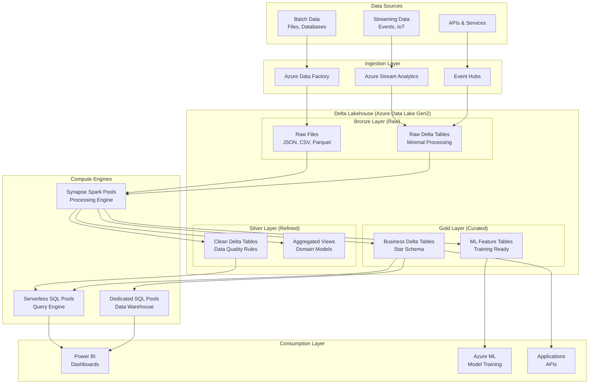

# 🏛️ Delta Lakehouse Architecture with Azure Synapse

> __🏠 [Home](../../../../../../README.md)__ | __📖 [Overview](../../../../../01-overview/README.md)__ | __🛠️ [Services](../../../../README.md)__ | __💾 [Analytics Compute](../../../README.md)__ | __🎯 [Synapse](../../README.md)__ | __🔥 Spark Pools__ | __🏛️ Delta Lakehouse__


Modern lakehouse architecture combining data lake flexibility with data warehouse ACID transactions and performance.

---

## 🌟 Architecture Overview

The Delta Lakehouse architecture combines the flexibility and cost-efficiency of a data lake with the data management and ACID transaction capabilities of a data warehouse. Azure Synapse Analytics provides native integration with Delta Lake format, enabling a modern and efficient lakehouse implementation.

### 🔥 Key Benefits

- __ACID Transactions__: Ensure data consistency across concurrent operations
- __Schema Enforcement & Evolution__: Maintain data quality while allowing schema changes
- __Time Travel__: Query historical versions of data for auditing and rollbacks
- __Unified Batch & Streaming__: Single architecture for all data processing needs
- __Performance Optimization__: Advanced optimization features for analytical workloads

---

## 🏗️ Core Architecture Components



---

## 📊 Medallion Architecture Pattern

The medallion architecture organizes your Delta Lake data into layers with increasing data quality and refinement:

### 🥉 Bronze Layer (Raw Data)


__Purpose__: Ingestion sink for all source data with minimal processing

```text
/bronze/
├── sales_system/
│   ├── orders/
│   │   ├── year=2024/month=01/day=15/
│   │   │   ├── part-00000.parquet
│   │   │   └── _delta_log/
│   │   └── year=2024/month=01/day=16/
│   └── customers/
└── marketing_system/
    └── campaigns/
```

__Characteristics__:

- Preserves original data format and content
- Minimal transformation, primarily ELT approach
- Schema-on-read strategy
- Full audit trail of data ingestion

__Example Implementation__:

```python
# Ingest raw data to Bronze layer
raw_df = spark.read.json("/landing/sales_data/*.json")

# Write to Bronze Delta table with metadata
bronze_df = raw_df \
    .withColumn("ingestion_timestamp", current_timestamp()) \
    .withColumn("source_file", input_file_name()) \
    .withColumn("processing_date", current_date())

bronze_df.write \
    .format("delta") \
    .mode("append") \
    .partitionBy("processing_date") \
    .save("/bronze/sales_system/orders")
```

### 🥈 Silver Layer (Refined Data)


__Purpose__: Cleansed and conformed data with applied data quality rules

```text
/silver/
├── sales/
│   ├── orders_cleaned/
│   │   ├── year=2024/month=01/
│   │   │   ├── part-00000.parquet
│   │   │   └── _delta_log/
│   │   └── _delta_log/
│   └── customers_standardized/
└── marketing/
    └── campaigns_normalized/
```

__Characteristics__:

- Standardized formats and resolved duplicates
- Common data quality rules applied
- Typically organized by domain or source system
- Business rules validation

__Example Implementation__:

```python
# Read from Bronze layer
bronze_df = spark.read.format("delta").load("/bronze/sales_system/orders")

# Apply data quality transformations
silver_df = bronze_df \
    .filter(col("order_amount") > 0) \
    .filter(col("customer_id").isNotNull()) \
    .withColumn("order_date", to_date(col("order_timestamp"))) \
    .withColumn("order_amount", round(col("order_amount"), 2)) \
    .dropDuplicates(["order_id"]) \
    .withColumn("last_updated", current_timestamp())

# Write to Silver Delta table
silver_df.write \
    .format("delta") \
    .mode("overwrite") \
    .option("overwriteSchema", "true") \
    .partitionBy("order_date") \
    .save("/silver/sales/orders_cleaned")
```

### 🥇 Gold Layer (Curated Data)


__Purpose__: Business-level aggregates optimized for analytics and reporting

```text
/gold/
├── sales_marts/
│   ├── daily_sales_summary/
│   ├── customer_lifetime_value/
│   └── product_performance/
├── ml_features/
│   ├── customer_features/
│   └── product_features/
└── reporting/
    ├── executive_dashboard/
    └── operational_metrics/
```

__Characteristics__:

- Business-level aggregates and metrics
- Dimensional models for reporting (star schema)
- Feature tables for machine learning
- Optimized for specific analytical use cases

__Example Implementation__:

```python
# Read from Silver layer
orders_df = spark.read.format("delta").load("/silver/sales/orders_cleaned")
customers_df = spark.read.format("delta").load("/silver/sales/customers_standardized")

# Create business aggregations
daily_sales = orders_df \
    .groupBy("order_date", "product_category") \
    .agg(
        sum("order_amount").alias("total_sales"),
        count("order_id").alias("order_count"),
        countDistinct("customer_id").alias("unique_customers")
    ) \
    .withColumn("avg_order_value", col("total_sales") / col("order_count"))

# Write to Gold Delta table
daily_sales.write \
    .format("delta") \
    .mode("overwrite") \
    .option("optimizeWrite", "true") \
    .option("autoCompact", "true") \
    .partitionBy("order_date") \
    .save("/gold/sales_marts/daily_sales_summary")
```

---

## ⚡ Performance Optimization

### 🚀 Delta Lake Optimizations

#### Data Skipping

Delta automatically maintains min/max statistics for efficient query pruning:

```python
# Enable data skipping with proper partitioning
df.write \
    .format("delta") \
    .partitionBy("year", "month") \
    .option("dataSkippingNumIndexedCols", "5") \
    .save("/delta/optimized_table")
```

#### Z-Ordering

Multi-dimensional clustering for improved filtering performance:

```sql
-- Optimize table layout for common query patterns
OPTIMIZE delta.`/gold/sales_marts/daily_sales_summary`
ZORDER BY (product_category, customer_segment)
```

#### Auto Compaction

Automatically optimize small files during writes:

```python
# Enable auto-optimization features
spark.conf.set("spark.databricks.delta.optimizeWrite.enabled", "true")
spark.conf.set("spark.databricks.delta.autoCompact.enabled", "true")

df.write \
    .format("delta") \
    .option("optimizeWrite", "true") \
    .option("autoCompact", "true") \
    .save("/delta/auto_optimized_table")
```

### 🔧 Spark Pool Optimization

#### Cluster Configuration

```python
# Configure Spark pools for Delta workloads
spark.conf.set("spark.sql.adaptive.enabled", "true")
spark.conf.set("spark.sql.adaptive.coalescePartitions.enabled", "true")
spark.conf.set("spark.sql.adaptive.skewJoin.enabled", "true")
spark.conf.set("spark.databricks.delta.cache.enabled", "true")
```

#### Memory Optimization

```python
# Optimize for large Delta table operations
spark.conf.set("spark.sql.files.maxPartitionBytes", "134217728")  # 128MB
spark.conf.set("spark.sql.adaptive.coalescePartitions.minPartitionNum", "1")
spark.conf.set("spark.sql.adaptive.coalescePartitions.initialPartitionNum", "200")
```

---

## 🔒 Security & Governance

### Data Access Control

#### Column-Level Security

```sql
-- Create secure view with column masking
CREATE VIEW gold.customer_summary_secure AS
SELECT 
    customer_id,
    CASE 
        WHEN is_member('analysts') THEN email 
        ELSE 'MASKED' 
    END as email,
    total_purchases,
    last_purchase_date
FROM gold.customer_summary
```

#### Row-Level Security

```python
# Implement row-level filtering based on user context
def apply_rls_filter(df, user_context):
    if user_context.get('role') == 'regional_manager':
        return df.filter(col('region') == user_context.get('region'))
    elif user_context.get('role') == 'analyst':
        return df.filter(col('department') == user_context.get('department'))
    else:
        return df
```

### Compliance & Auditing

#### Time Travel for Auditing

```sql
-- Query historical data for compliance
SELECT * FROM delta.`/gold/financial_data`
VERSION AS OF 10

-- Query data as of specific timestamp
SELECT * FROM delta.`/gold/financial_data`
TIMESTAMP AS OF '2024-01-01 00:00:00'
```

#### Data Lineage Tracking

```python
# Track data lineage with metadata
lineage_metadata = {
    "source_tables": ["/bronze/sales_system/orders"],
    "transformation_logic": "data_quality_rules_v2.py",
    "processing_timestamp": datetime.now(),
    "data_quality_score": 0.95
}

# Add lineage metadata to Delta table
df.write \
    .format("delta") \
    .option("userMetadata", json.dumps(lineage_metadata)) \
    .save("/silver/sales/orders_cleaned")
```

---

## 🔄 Streaming Integration

### Real-time Data Processing

```python
# Stream processing to Bronze layer
stream_df = spark.readStream \
    .format("eventhubs") \
    .option("eventhubs.connectionString", connection_string) \
    .load()

# Process and write to Bronze Delta table
bronze_stream = stream_df \
    .select(
        get_json_object(col("body").cast("string"), "$.order_id").alias("order_id"),
        get_json_object(col("body").cast("string"), "$.customer_id").alias("customer_id"),
        get_json_object(col("body").cast("string"), "$.amount").alias("amount"),
        current_timestamp().alias("ingestion_timestamp")
    )

bronze_stream.writeStream \
    .format("delta") \
    .outputMode("append") \
    .option("checkpointLocation", "/checkpoints/bronze_orders") \
    .start("/bronze/streaming/orders")
```

### Batch + Stream Unified Processing

```python
# Unified processing for batch and streaming data
def process_orders(source_df, target_path):
    processed_df = source_df \
        .filter(col("amount") > 0) \
        .withColumn("processing_timestamp", current_timestamp())
    
    return processed_df

# Use same logic for both batch and streaming
batch_df = spark.read.format("delta").load("/bronze/batch/orders")
processed_batch = process_orders(batch_df, "/silver/orders")

stream_df = spark.readStream.format("delta").load("/bronze/streaming/orders")
processed_stream = process_orders(stream_df, "/silver/orders")
```

---

## 🚀 Implementation Best Practices

### 1. Schema Design

```python
# Define schema with data quality constraints
from pyspark.sql.types import StructType, StructField, StringType, DoubleType, TimestampType

orders_schema = StructType([
    StructField("order_id", StringType(), nullable=False),
    StructField("customer_id", StringType(), nullable=False),
    StructField("order_amount", DoubleType(), nullable=False),
    StructField("order_timestamp", TimestampType(), nullable=False),
    StructField("product_category", StringType(), nullable=True)
])

# Enforce schema during writes
df.write \
    .format("delta") \
    .option("mergeSchema", "false") \
    .option("enforceSchema", "true") \
    .save("/silver/sales/orders")
```

### 2. Change Data Capture (CDC)

```python
# Implement CDC pattern with Delta merge
def upsert_data(source_df, target_path, key_columns):
    target_table = DeltaTable.forPath(spark, target_path)

    target_table.alias("target").merge(
        source_df.alias("source"),
        " AND ".join([f"target.{col} = source.{col}" for col in key_columns])
    ).whenMatchedUpdateAll() \
     .whenNotMatchedInsertAll() \
     .execute()

# Apply CDC updates
upsert_data(new_orders_df, "/silver/sales/orders", ["order_id"])
```

### 3. Data Quality Validation

```python
# Implement data quality checks
def validate_data_quality(df, table_name):
    quality_checks = {
        "row_count": df.count(),
        "null_count": df.select([count(when(col(c).isNull(), c)).alias(c) for c in df.columns]).collect()[0].asDict(),
        "duplicate_count": df.count() - df.dropDuplicates().count()
    }

    # Log quality metrics
    print(f"Data quality report for {table_name}: {quality_checks}")

    # Raise alerts if quality thresholds are exceeded
    if quality_checks["duplicate_count"] > 1000:
        raise ValueError(f"High duplicate count in {table_name}")

    return quality_checks

# Validate before writing to Silver
quality_report = validate_data_quality(silver_df, "orders_cleaned")
```

### 4. Lifecycle Management

```sql
-- Set retention policies for data lifecycle management
ALTER TABLE delta.`/bronze/sales_system/orders`
SET TBLPROPERTIES (
    'delta.logRetentionDuration' = 'interval 30 days',
    'delta.deletedFileRetentionDuration' = 'interval 7 days'
);

-- Archive old partitions
DELETE FROM delta.`/bronze/sales_system/orders`
WHERE processing_date < current_date() - interval 90 days;

-- Optimize and vacuum regularly
OPTIMIZE delta.`/bronze/sales_system/orders`;
VACUUM delta.`/bronze/sales_system/orders` RETAIN 7 HOURS;
```

---

## 📊 Monitoring & Observability

### Delta Table Health Monitoring

```python
# Monitor Delta table health metrics
def get_table_health(table_path):
    dt = DeltaTable.forPath(spark, table_path)
    history = dt.history()

    metrics = {
        "last_update": history.select("timestamp").first()["timestamp"],
        "version_count": history.count(),
        "file_count": spark.read.format("delta").load(table_path).rdd.getNumPartitions(),
        "total_size_bytes": spark.sql(f"DESCRIBE DETAIL delta.`{table_path}`").select("sizeInBytes").first()["sizeInBytes"]
    }

    return metrics

# Monitor all critical tables
critical_tables = [
    "/gold/sales_marts/daily_sales_summary",
    "/gold/customer_marts/customer_lifetime_value"
]

for table in critical_tables:
    health = get_table_health(table)
    print(f"Table {table} health: {health}")
```

### Performance Monitoring

```sql
-- Query Delta table statistics
DESCRIBE HISTORY delta.`/gold/sales_marts/daily_sales_summary`;

-- Analyze table performance
DESCRIBE DETAIL delta.`/gold/sales_marts/daily_sales_summary`;

-- Check optimization recommendations
ANALYZE TABLE delta.`/gold/sales_marts/daily_sales_summary` COMPUTE STATISTICS;
```

---

## 🔗 Integration Patterns

### Power BI Integration

```python
# Optimize Gold tables for Power BI consumption
gold_df.write \
    .format("delta") \
    .option("optimizeWrite", "true") \
    .option("autoCompact", "true") \
    .partitionBy("report_date") \
    .save("/gold/powerbi/sales_dashboard")

# Create SQL view for Power BI
spark.sql("""
    CREATE OR REPLACE VIEW powerbi.sales_summary AS
    SELECT
        report_date,
        product_category,
        SUM(total_sales) as total_sales,
        AVG(avg_order_value) as avg_order_value
    FROM delta.`/gold/powerbi/sales_dashboard`
    WHERE report_date >= current_date() - interval 90 days
    GROUP BY report_date, product_category
""")
```

### Machine Learning Integration

```python
# Prepare feature tables for ML
from pyspark.ml.feature import VectorAssembler, StandardScaler

# Create ML-ready features from Gold layer
features_df = spark.read.format("delta").load("/gold/ml_features/customer_features")

# Feature engineering pipeline
assembler = VectorAssembler(
    inputCols=["total_purchases", "avg_order_value", "days_since_last_purchase"],
    outputCol="features_raw"
)

scaler = StandardScaler(
    inputCol="features_raw",
    outputCol="features",
    withStd=True,
    withMean=True
)

# Save processed features for ML training
ml_ready_df = scaler.fit(assembler.transform(features_df)).transform(assembler.transform(features_df))

ml_ready_df.write \
    .format("delta") \
    .mode("overwrite") \
    .save("/gold/ml_ready/customer_features_scaled")
```

---

## 📚 Next Steps

### 🚀 Implementation Guides
- **Medallion Architecture Setup** - See [Batch Architectures](../../../../../03-architecture-patterns/batch-architectures/README.md)
- **Delta Lake Performance Tuning** - See [Best Practices](../../../../../05-best-practices/README.md)
- **Streaming Integration Patterns** - See [Hybrid Architectures](../../../../../03-architecture-patterns/hybrid-architectures/README.md)

### 📖 Advanced Topics
- [Schema Evolution Strategies](schema-evolution.md)
- [Multi-tenant Delta Architecture](multi-tenant-patterns.md)
- [Cross-Region Replication](cross-region-setup.md)

### 🔧 Operational Guides
- **Monitoring & Alerting** - See [Monitoring Guide](../../../../../09-monitoring/README.md)
- **Backup & Recovery** - See [Best Practices](../../../../../05-best-practices/README.md)
- **Cost Optimization** - See [Best Practices](../../../../../05-best-practices/README.md)

---

*Last Updated: 2025-01-28*
*Architecture Pattern: Medallion*
*Implementation Status: Production Ready*"
