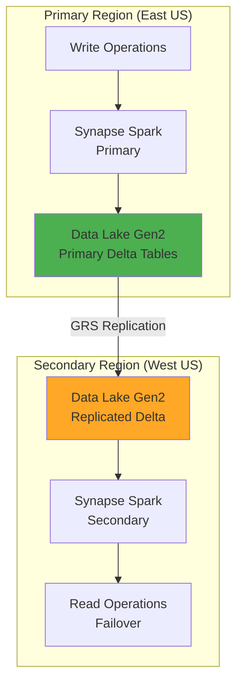
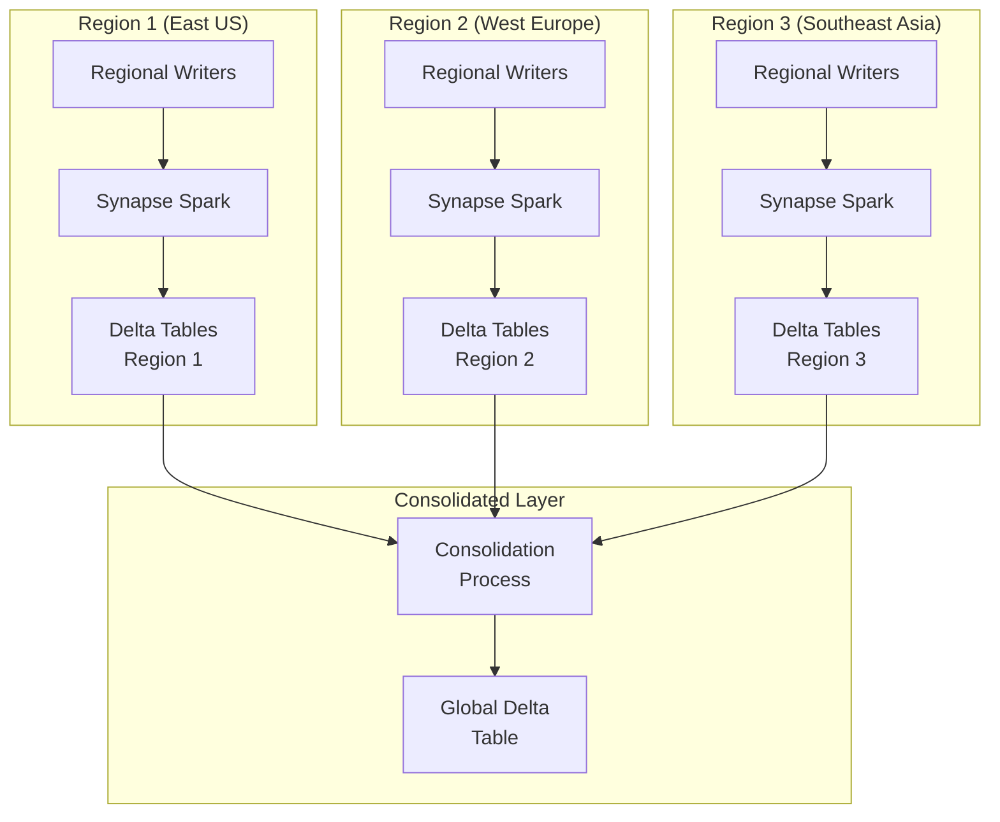
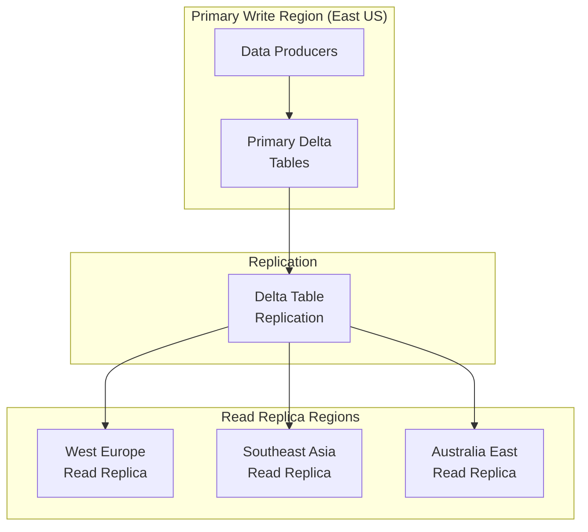

# 🌍 Cross-Region Delta Lake Setup - Azure Synapse Analytics

> __🏠 [Home](../../../../../../README.md)__ | __📖 [Overview](../../../../../01-overview/README.md)__ | __🛠️ [Services](../../../../README.md)__ | __💾 [Analytics Compute](../../../README.md)__ | __🎯 [Synapse](../../README.md)__ | __🔥 [Spark Pools](../README.md)__ | __🏛️ [Delta Lakehouse](README.md)__ | __🌍 Cross-Region__


Comprehensive guide to setting up Delta Lake across multiple Azure regions for disaster recovery, data residency, and global access patterns.

---

## 🌟 Overview

Cross-region Delta Lake deployments enable organizations to meet data residency requirements, provide low-latency access to global users, and implement disaster recovery strategies. This guide covers architecture patterns, replication strategies, and operational considerations for multi-region Delta Lake implementations.

### 🔥 Key Benefits

- __Data Residency Compliance__: Store data in specific geographic regions
- __Disaster Recovery__: Automatic failover between regions
- __Global Performance__: Low-latency access for distributed teams
- __High Availability__: 99.99% uptime with multi-region redundancy
- __Cost Optimization__: Store data in cost-effective regions

---

## 🏗️ Multi-Region Architecture Patterns

### Pattern 1: Primary-Secondary (Disaster Recovery)



__Implementation__:

```python
from pyspark.sql import SparkSession
from delta.tables import *

# Primary region configuration
PRIMARY_REGION = "eastus"
SECONDARY_REGION = "westus"

PRIMARY_STORAGE = "https://datalake-eastus.dfs.core.windows.net"
SECONDARY_STORAGE = "https://datalake-westus.dfs.core.windows.net"

# Write to primary region
spark = SparkSession.builder.getOrCreate()

df = spark.read.format("csv").option("header", "true").load("/source/data/*.csv")

# Write to primary Delta table
df.write.format("delta") \
    .mode("append") \
    .save(f"{PRIMARY_STORAGE}/delta/sales")

# Configure GRS (Geo-Redundant Storage) for automatic replication
# In Azure Portal or ARM template:
# storageAccount.properties.supportsHttpsTrafficOnly = true
# storageAccount.sku.name = "Standard_GRS"

# Read from secondary region (failover scenario)
def read_with_failover(table_path, primary_storage, secondary_storage):
    """
    Read from primary, fallback to secondary if unavailable.
    """
    try:
        # Try primary first
        df = spark.read.format("delta").load(f"{primary_storage}/{table_path}")
        print(f"Reading from primary: {primary_storage}")
        return df
    except Exception as e:
        print(f"Primary unavailable: {e}")
        # Fallback to secondary
        df = spark.read.format("delta").load(f"{secondary_storage}/{table_path}")
        print(f"Failover to secondary: {secondary_storage}")
        return df

# Usage
sales_df = read_with_failover("delta/sales", PRIMARY_STORAGE, SECONDARY_STORAGE)
```

---

### Pattern 2: Active-Active (Multi-Region Writes)



__Implementation__:

```python
# Regional write with partition by region
def write_regional_data(df, region_code):
    """
    Write data to regional Delta table with region identifier.
    """
    regional_df = df.withColumn("source_region", lit(region_code)) \
        .withColumn("ingestion_timestamp", current_timestamp())

    # Write to regional Delta table
    regional_path = f"abfss://data@datalake{region_code}.dfs.core.windows.net/delta/regional_sales"

    regional_df.write.format("delta") \
        .mode("append") \
        .partitionBy("source_region", "order_date") \
        .save(regional_path)

    print(f"Written to region: {region_code}")

# Write from different regions
write_regional_data(eastus_df, "eastus")
write_regional_data(westeu_df, "westeu")
write_regional_data(seasiadf, "seasia")

# Consolidation process (run centrally)
def consolidate_regional_tables():
    """
    Consolidate data from multiple regional tables into global table.
    """
    regions = ["eastus", "westeu", "seasia"]
    global_path = "abfss://data@datalakeglobal.dfs.core.windows.net/delta/global_sales"

    # Read from all regional tables
    regional_dfs = []
    for region in regions:
        regional_path = f"abfss://data@datalake{region}.dfs.core.windows.net/delta/regional_sales"
        try:
            df = spark.read.format("delta").load(regional_path)
            regional_dfs.append(df)
            print(f"Loaded data from {region}")
        except Exception as e:
            print(f"Failed to load from {region}: {e}")

    # Union all regional data
    if regional_dfs:
        global_df = regional_dfs[0]
        for df in regional_dfs[1:]:
            global_df = global_df.union(df)

        # Write to global Delta table (MERGE to handle duplicates)
        global_delta = DeltaTable.forPath(spark, global_path)

        global_delta.alias("target").merge(
            global_df.alias("source"),
            "target.transaction_id = source.transaction_id AND target.source_region = source.source_region"
        ).whenNotMatchedInsertAll().execute()

        print(f"Consolidated {global_df.count()} records to global table")

# Schedule consolidation (hourly/daily)
consolidate_regional_tables()
```

---

### Pattern 3: Read Replicas (Global Read Access)



__Implementation__:

```python
# Replicate Delta table to multiple regions using AzCopy
import subprocess
import os

def replicate_delta_table(source_path, target_regions):
    """
    Replicate Delta table to multiple read regions using AzCopy.

    Args:
        source_path: Source Delta table path
        target_regions: List of target storage accounts by region
    """
    # Get source SAS token (read access)
    source_sas = os.getenv("SOURCE_SAS_TOKEN")

    for region, target_path in target_regions.items():
        target_sas = os.getenv(f"{region.upper()}_SAS_TOKEN")

        # Construct AzCopy command
        azcopy_cmd = [
            "azcopy", "sync",
            f"{source_path}?{source_sas}",
            f"{target_path}?{target_sas}",
            "--recursive=true",
            "--delete-destination=true"  # Remove files deleted from source
        ]

        print(f"Replicating to {region}...")
        result = subprocess.run(azcopy_cmd, capture_output=True, text=True)

        if result.returncode == 0:
            print(f"✅ Successfully replicated to {region}")
        else:
            print(f"❌ Failed to replicate to {region}: {result.stderr}")

# Example usage
source = "https://datalakeprimary.dfs.core.windows.net/delta/sales"
replicas = {
    "westeu": "https://datalakewesteu.dfs.core.windows.net/delta/sales",
    "seasia": "https://datalakeseasia.dfs.core.windows.net/delta/sales",
    "auseast": "https://datalakeauseast.dfs.core.windows.net/delta/sales"
}

# Run replication (schedule via Azure Data Factory or Azure Automation)
replicate_delta_table(source, replicas)

# Read from nearest region
def get_regional_endpoint(user_region):
    """
    Return Delta table endpoint closest to user's region.
    """
    regional_endpoints = {
        "eastus": "https://datalakeprimary.dfs.core.windows.net/delta/sales",
        "westus": "https://datalakeprimary.dfs.core.windows.net/delta/sales",
        "westeu": "https://datalakewesteu.dfs.core.windows.net/delta/sales",
        "northeu": "https://datalakewesteu.dfs.core.windows.net/delta/sales",
        "seasia": "https://datalakeseasia.dfs.core.windows.net/delta/sales",
        "eastasia": "https://datalakeseasia.dfs.core.windows.net/delta/sales",
        "auseast": "https://datalakeauseast.dfs.core.windows.net/delta/sales"
    }

    return regional_endpoints.get(user_region, regional_endpoints["eastus"])

# Application reads from regional endpoint
user_location = "westeu"
endpoint = get_regional_endpoint(user_location)
sales_df = spark.read.format("delta").load(endpoint)
```

---

## 🔄 Delta Table Replication Strategies

### Strategy 1: Incremental Replication

```python
from delta.tables import DeltaTable
from datetime import datetime, timedelta

def replicate_delta_incremental(source_path, target_path, last_replicated_version=None):
    """
    Incrementally replicate Delta table changes.

    Args:
        source_path: Source Delta table path
        target_path: Target Delta table path
        last_replicated_version: Last replicated version number
    """
    source_delta = DeltaTable.forPath(spark, source_path)
    target_delta = DeltaTable.forPath(spark, target_path)

    # Get source table version
    source_history = source_delta.history().select("version").orderBy(col("version").desc()).first()
    current_version = source_history["version"]

    if last_replicated_version is None:
        # Full replication
        print("Performing full replication...")
        source_df = spark.read.format("delta").load(source_path)

        source_df.write.format("delta") \
            .mode("overwrite") \
            .save(target_path)

        return current_version

    # Incremental replication
    print(f"Replicating changes from version {last_replicated_version} to {current_version}")

    # Read changes since last replication
    changes_df = spark.read.format("delta") \
        .option("readChangeFeed", "true") \
        .option("startingVersion", last_replicated_version + 1) \
        .load(source_path)

    if changes_df.count() == 0:
        print("No changes to replicate")
        return current_version

    # Apply changes to target
    target_delta.alias("target").merge(
        changes_df.alias("source"),
        "target.id = source.id"  # Adjust merge key as needed
    ).whenMatchedUpdateAll() \
     .whenNotMatchedInsertAll() \
     .execute()

    print(f"Replicated {changes_df.count()} changes")
    return current_version

# Schedule incremental replication
last_version = None
while True:
    last_version = replicate_delta_incremental(
        source_path="abfss://primary@storage.dfs.core.windows.net/delta/sales",
        target_path="abfss://replica@storage.dfs.core.windows.net/delta/sales",
        last_replicated_version=last_version
    )
    time.sleep(300)  # Replicate every 5 minutes
```

---

### Strategy 2: Snapshot-Based Replication

```python
def replicate_delta_snapshot(source_path, target_path, snapshot_frequency="daily"):
    """
    Create point-in-time snapshots for cross-region replication.
    """
    from datetime import datetime

    # Create snapshot identifier
    snapshot_id = datetime.now().strftime("%Y%m%d_%H%M%S")
    snapshot_path = f"{target_path}/snapshots/{snapshot_id}"

    # Read source table
    source_df = spark.read.format("delta").load(source_path)

    # Write snapshot
    source_df.write.format("delta") \
        .mode("overwrite") \
        .save(snapshot_path)

    # Create symbolic link to latest snapshot
    spark.sql(f"""
        CREATE OR REPLACE TABLE sales_latest
        USING DELTA
        LOCATION '{snapshot_path}'
    """)

    print(f"Created snapshot: {snapshot_id}")

    # Cleanup old snapshots (keep last 7)
    cleanup_old_snapshots(target_path, keep_last=7)

def cleanup_old_snapshots(target_path, keep_last=7):
    """
    Remove snapshots older than retention period.
    """
    snapshots = dbutils.fs.ls(f"{target_path}/snapshots/")
    snapshot_dirs = sorted([s.path for s in snapshots], reverse=True)

    # Keep only last N snapshots
    for old_snapshot in snapshot_dirs[keep_last:]:
        dbutils.fs.rm(old_snapshot, recurse=True)
        print(f"Removed old snapshot: {old_snapshot}")
```

---

## 🔒 Cross-Region Security

### Managed Identity for Cross-Region Access

```python
from azure.identity import DefaultAzureCredential, ManagedIdentityCredential

# Use Managed Identity for authentication
credential = ManagedIdentityCredential()

# Configure Spark to use Managed Identity
spark.conf.set(
    f"fs.azure.account.auth.type.datalakewesteu.dfs.core.windows.net",
    "OAuth"
)
spark.conf.set(
    f"fs.azure.account.oauth.provider.type.datalakewesteu.dfs.core.windows.net",
    "org.apache.hadoop.fs.azurebfs.oauth2.MsiTokenProvider"
)

# Grant cross-region access via RBAC
# Azure CLI:
# az role assignment create \
#   --role "Storage Blob Data Contributor" \
#   --assignee <managed-identity-object-id> \
#   --scope /subscriptions/<sub-id>/resourceGroups/<rg>/providers/Microsoft.Storage/storageAccounts/datalakewesteu
```

### Private Endpoints for Secure Replication

```python
# Configure private endpoints for cross-region connectivity
# ARM Template excerpt:
private_endpoint_config = {
    "type": "Microsoft.Network/privateEndpoints",
    "apiVersion": "2021-05-01",
    "name": "pe-datalake-westeu",
    "location": "westeurope",
    "properties": {
        "privateLinkServiceConnections": [{
            "name": "datalake-connection",
            "properties": {
                "privateLinkServiceId": "/subscriptions/<sub>/resourceGroups/<rg>/providers/Microsoft.Storage/storageAccounts/datalakewesteu",
                "groupIds": ["dfs"]
            }
        }],
        "subnet": {
            "id": "/subscriptions/<sub>/resourceGroups/<rg>/providers/Microsoft.Network/virtualNetworks/vnet-westeu/subnets/data-subnet"
        }
    }
}
```

---

## 📊 Monitoring Cross-Region Replication

```python
def monitor_replication_lag(source_path, target_path):
    """
    Monitor replication lag between source and target Delta tables.
    """
    from datetime import datetime

    source_delta = DeltaTable.forPath(spark, source_path)
    target_delta = DeltaTable.forPath(spark, target_path)

    # Get latest versions
    source_history = source_delta.history(1).select("version", "timestamp").first()
    target_history = target_delta.history(1).select("version", "timestamp").first()

    source_version = source_history["version"]
    target_version = target_history["version"]

    version_lag = source_version - target_version

    source_time = source_history["timestamp"]
    target_time = target_history["timestamp"]

    time_lag_seconds = (source_time - target_time).total_seconds()

    metrics = {
        "source_version": source_version,
        "target_version": target_version,
        "version_lag": version_lag,
        "time_lag_seconds": time_lag_seconds,
        "time_lag_minutes": time_lag_seconds / 60,
        "status": "healthy" if time_lag_seconds < 600 else "lagging"  # Alert if > 10 min
    }

    print(f"Replication Status: {metrics['status']}")
    print(f"Version Lag: {version_lag} versions")
    print(f"Time Lag: {metrics['time_lag_minutes']:.2f} minutes")

    # Send alert if lagging
    if metrics["status"] == "lagging":
        send_alert(f"Replication lag detected: {metrics['time_lag_minutes']:.2f} minutes")

    return metrics

# Monitor replication health
monitor_replication_lag(
    source_path="abfss://primary@storage.dfs.core.windows.net/delta/sales",
    target_path="abfss://replica@storage.dfs.core.windows.net/delta/sales"
)
```

---

## 💰 Cost Optimization

### Regional Storage Pricing Strategy

```python
# Store data in cost-effective regions
# Example pricing (approximate):
# US East: $0.0184/GB/month
# US West: $0.0184/GB/month
# West Europe: $0.0200/GB/month
# Southeast Asia: $0.0230/GB/month

def calculate_regional_storage_cost(data_size_gb, regions):
    """
    Calculate storage costs across regions.
    """
    pricing = {
        "eastus": 0.0184,
        "westus": 0.0184,
        "westeu": 0.0200,
        "seasia": 0.0230,
        "auseast": 0.0210
    }

    total_cost = 0
    for region in regions:
        monthly_cost = data_size_gb * pricing.get(region, 0.02)
        total_cost += monthly_cost
        print(f"{region}: ${monthly_cost:.2f}/month")

    print(f"\nTotal monthly cost: ${total_cost:.2f}")
    return total_cost

# Example: 1 TB data in 3 regions
calculate_regional_storage_cost(1024, ["eastus", "westeu", "seasia"])
# Output:
# eastus: $18.84/month
# westeu: $20.48/month
# seasia: $23.55/month
# Total monthly cost: $62.87/month
```

---

## 📚 Related Resources

### 🎓 __Implementation Guides__

- [__Delta Lake Overview__](README.md)
- [__Multi-Tenant Patterns__](multi-tenant-patterns.md)
- [__Schema Evolution__](schema-evolution.md)

### 📖 __Architecture Patterns__

- [__Disaster Recovery__](../../../../../05-best-practices/operational-excellence/disaster-recovery.md)
- [__Global Data Distribution__](../../../../../03-architecture-patterns/hybrid-architectures/global-data-distribution.md)

---

*Last Updated: 2025-01-28*
*Pattern: Multi-Region Delta Lake*
*Documentation Status: Complete*
