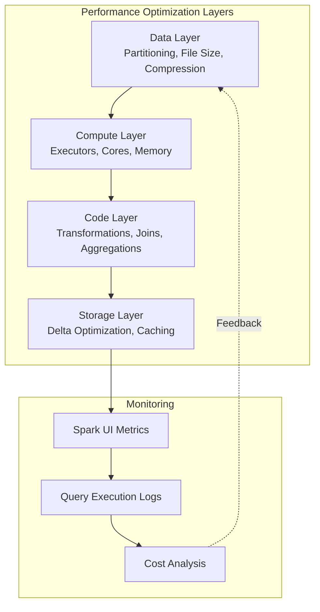

# ⚡ Spark Pool Performance Tuning - Azure Synapse Analytics

> __🏠 [Home](../../../../../README.md)__ | __📖 [Overview](../../../../01-overview/README.md)__ | __🛠️ [Services](../../../README.md)__ | __💾 [Analytics Compute](../../README.md)__ | __🎯 [Synapse](../README.md)__ | __🔥 [Spark Pools](README.md)__ | __⚡ Performance Tuning__


Advanced performance optimization techniques for Azure Synapse Spark pools, including partitioning strategies, caching, join optimization, and Delta Lake performance tuning.

---

## 🌟 Overview

Performance tuning is critical for cost-effective and efficient data processing at scale. This guide provides comprehensive strategies for optimizing Spark workloads in Azure Synapse, covering data partitioning, caching strategies, join optimization, and Delta Lake-specific optimizations.

---

## 📊 Performance Optimization Framework



---

## 🗂️ Data Partitioning Strategies

### Partition Sizing Best Practices

```python
from pyspark.sql import SparkSession
from pyspark.sql.functions import *

spark = SparkSession.builder.getOrCreate()

# Problem: Too many small partitions (inefficient)
# Each partition should be 100-200 MB for optimal performance

# Check current partition count
df = spark.read.format("delta").load("/data/sales")
print(f"Current partitions: {df.rdd.getNumPartitions()}")

# Optimal partitioning calculation
def calculate_optimal_partitions(data_size_mb, target_partition_size_mb=128):
    """
    Calculate optimal number of partitions based on data size.

    Args:
        data_size_mb: Total data size in MB
        target_partition_size_mb: Target size per partition (128 MB recommended)

    Returns:
        Optimal partition count
    """
    optimal_partitions = max(1, int(data_size_mb / target_partition_size_mb))

    # Adjust to be multiple of executor count for even distribution
    executor_cores = int(spark.conf.get("spark.executor.cores", "4"))
    num_executors = int(spark.conf.get("spark.executor.instances", "4"))
    total_cores = executor_cores * num_executors

    # Round to nearest multiple of total cores
    optimal_partitions = max(total_cores, (optimal_partitions // total_cores) * total_cores)

    return optimal_partitions

# Example: 10 GB dataset
optimal_parts = calculate_optimal_partitions(10 * 1024)  # 10 GB = 10,240 MB
print(f"Recommended partitions: {optimal_parts}")

# Repartition for optimal performance
df_optimized = df.repartition(optimal_parts)
```

---

### Partition Column Selection

```python
# ❌ BAD: Partitioning by high-cardinality column
df.write.format("delta") \
    .partitionBy("transaction_id") \  # Millions of unique values = too many files!
    .save("/data/transactions")

# ❌ BAD: Partitioning by low-cardinality column
df.write.format("delta") \
    .partitionBy("is_active") \  # Only 2 values = data skew!
    .save("/data/customers")

# ✅ GOOD: Partition by medium-cardinality columns used in filters
df.write.format("delta") \
    .partitionBy("year", "month", "day") \  # Date hierarchies work well
    .save("/data/events")

# ✅ GOOD: Partition by categorical business dimensions
df.write.format("delta") \
    .partitionBy("region", "product_category") \  # Business dimensions
    .save("/data/sales")

# Partition selection framework
def recommend_partition_columns(df, common_filters):
    """
    Recommend partition columns based on query patterns.

    Args:
        df: Spark DataFrame
        common_filters: List of columns frequently used in WHERE clauses

    Returns:
        Recommended partition columns
    """
    from pyspark.sql.functions import approx_count_distinct

    # Calculate cardinality for filter columns
    cardinality = {}
    for col in common_filters:
        count = df.select(approx_count_distinct(col)).collect()[0][0]
        cardinality[col] = count

    # Select columns with medium cardinality (10 - 10,000 unique values)
    recommended = [
        col for col, card in cardinality.items()
        if 10 <= card <= 10000
    ]

    # Prefer date columns for time-series data
    date_cols = [col for col in recommended if 'date' in col.lower() or 'time' in col.lower()]

    if date_cols:
        return date_cols[:2]  # Max 2 date-based partitions
    else:
        return recommended[:3]  # Max 3 partition columns

# Example usage
common_filters = ["order_date", "region", "product_category", "customer_id"]
recommended_parts = recommend_partition_columns(df, common_filters)
print(f"Recommended partition columns: {recommended_parts}")
```

---

## 💾 Caching Strategies

### When to Cache

```python
# Cache when:
# 1. DataFrame is used multiple times
# 2. DataFrame is result of expensive computation
# 3. Dataset fits in memory

# ❌ BAD: Caching data used only once
df_single_use = spark.read.parquet("/data/temp")
df_single_use.cache()  # Wasteful!
df_single_use.count()

# ✅ GOOD: Cache data used multiple times
df_multi_use = spark.read.format("delta").load("/data/customers")
df_multi_use.cache()

# Multiple operations on cached data
high_value = df_multi_use.filter(col("lifetime_value") > 10000).count()
by_segment = df_multi_use.groupBy("segment").count().collect()
top_customers = df_multi_use.orderBy(col("lifetime_value").desc()).limit(100).collect()

# Unpersist when done
df_multi_use.unpersist()
```

### Cache Storage Levels

```python
from pyspark import StorageLevel

# Different storage levels for different scenarios

# 1. MEMORY_ONLY (default) - fastest, but limited by memory
df.persist(StorageLevel.MEMORY_ONLY)

# 2. MEMORY_AND_DISK - spills to disk if memory full (recommended)
df.persist(StorageLevel.MEMORY_AND_DISK)

# 3. DISK_ONLY - when data doesn't fit in memory
large_df.persist(StorageLevel.DISK_ONLY)

# 4. MEMORY_ONLY_SER - serialized (uses less memory, slower access)
serialized_df.persist(StorageLevel.MEMORY_ONLY_SER)

# 5. OFF_HEAP - for large memory requirements (requires configuration)
huge_df.persist(StorageLevel.OFF_HEAP)

# Strategic caching example
def strategic_cache(df, estimated_size_gb, reuse_count):
    """
    Choose optimal cache strategy based on size and reuse.
    """
    available_memory_gb = 100  # Example: 100 GB available

    if reuse_count < 2:
        return df  # Don't cache if used less than twice

    if estimated_size_gb < available_memory_gb * 0.5:
        # Fits comfortably in memory
        return df.persist(StorageLevel.MEMORY_ONLY)
    elif estimated_size_gb < available_memory_gb:
        # Might fit, use memory + disk
        return df.persist(StorageLevel.MEMORY_AND_DISK)
    else:
        # Too large for memory, use disk
        return df.persist(StorageLevel.DISK_ONLY)

# Example
cached_df = strategic_cache(df, estimated_size_gb=50, reuse_count=5)
```

---

## 🔗 Join Optimization

### Broadcast Joins

```python
from pyspark.sql.functions import broadcast

# Scenario: Join large fact table with small dimension table

# ❌ SLOW: Shuffle join (both tables shuffled across network)
large_fact = spark.read.format("delta").load("/data/fact_sales")  # 1 TB
small_dim = spark.read.format("delta").load("/data/dim_product")  # 100 MB

slow_result = large_fact.join(
    small_dim,
    large_fact.product_id == small_dim.product_id,
    "inner"
)

# ✅ FAST: Broadcast join (small table copied to all executors)
fast_result = large_fact.join(
    broadcast(small_dim),  # Broadcast hint
    large_fact.product_id == small_dim.product_id,
    "inner"
)

# Configure broadcast threshold
spark.conf.set("spark.sql.autoBroadcastJoinThreshold", "104857600")  # 100 MB

# Adaptive broadcast at runtime
spark.conf.set("spark.sql.adaptive.enabled", "true")
spark.conf.set("spark.sql.adaptive.autoBroadcastJoinThreshold", "104857600")
```

### Sort-Merge Joins

```python
# For large-to-large table joins, ensure data is pre-sorted and co-located

# ❌ BAD: Unsorted, unpartitioned joins
sales = spark.read.format("delta").load("/data/sales")
customers = spark.read.format("delta").load("/data/customers")

slow_join = sales.join(customers, "customer_id", "inner")

# ✅ GOOD: Pre-sort and partition by join key
sales_sorted = spark.read.format("delta").load("/data/sales") \
    .repartition(200, "customer_id") \
    .sortWithinPartitions("customer_id")

customers_sorted = spark.read.format("delta").load("/data/customers") \
    .repartition(200, "customer_id") \
    .sortWithinPartitions("customer_id")

fast_join = sales_sorted.join(customers_sorted, "customer_id", "inner")

# Write with proper partitioning for future joins
sales.write.format("delta") \
    .partitionBy("customer_id") \  # Pre-partition by join key
    .save("/data/sales_partitioned")
```

### Skew Join Optimization

```python
# Handle data skew in joins using salting technique

from pyspark.sql.functions import rand, concat, lit, floor

# Detect skew
sales_counts = sales.groupBy("customer_id").count()
skewed_customers = sales_counts.filter(col("count") > 100000).collect()

if len(skewed_customers) > 0:
    # Apply salt to skewed keys
    num_salts = 10

    # Add salt to large table
    sales_salted = sales.withColumn(
        "salt",
        (floor(rand() * num_salts)).cast("int")
    ).withColumn(
        "customer_id_salted",
        concat(col("customer_id"), lit("_"), col("salt"))
    )

    # Replicate small table with all salt values
    salt_values = spark.range(0, num_salts).select(col("id").alias("salt"))
    customers_replicated = customers.crossJoin(salt_values) \
        .withColumn(
            "customer_id_salted",
            concat(col("customer_id"), lit("_"), col("salt"))
        )

    # Join on salted keys
    result = sales_salted.join(
        customers_replicated,
        "customer_id_salted",
        "inner"
    ).drop("salt", "customer_id_salted")
```

---

## 🚀 Delta Lake Performance Tuning

### Z-Ordering (Multi-dimensional Clustering)

```python
from delta.tables import *

# Z-Order optimizes file layout for multiple filter columns
deltaTable = DeltaTable.forPath(spark, "/data/sales")

# ❌ WITHOUT Z-Order: Random file layout
# Query reads many files even with filters

# ✅ WITH Z-Order: Co-located data for common filters
deltaTable.optimize().executeZOrderBy("region", "product_category", "customer_segment")

# When to Z-Order:
# - After initial data load
# - After significant data changes (>20%)
# - On columns frequently used in WHERE clauses
# - On columns with medium-to-high cardinality

# Z-Order scheduling example
def should_zorder(table_path, last_zorder_time, change_percentage):
    """
    Determine if table should be Z-Ordered.
    """
    from datetime import datetime, timedelta

    # Z-Order if:
    # 1. Never Z-Ordered before
    if last_zorder_time is None:
        return True

    # 2. More than 7 days since last Z-Order
    if datetime.now() - last_zorder_time > timedelta(days=7):
        return True

    # 3. More than 20% data changed
    if change_percentage > 20:
        return True

    return False

# Example
if should_zorder("/data/sales", last_zorder_time=None, change_percentage=25):
    deltaTable.optimize().executeZOrderBy("region", "product_category")
```

### Optimize Write

```python
# Enable optimized writes for better file sizing
spark.conf.set("spark.databricks.delta.optimizeWrite.enabled", "true")
spark.conf.set("spark.databricks.delta.autoCompact.enabled", "true")

# Write data with automatic optimization
df.write.format("delta") \
    .mode("append") \
    .option("optimizeWrite", "true") \
    .option("autoCompact", "true") \
    .save("/data/sales")

# Set table properties for automatic optimization
spark.sql("""
    ALTER TABLE sales SET TBLPROPERTIES (
        'delta.autoOptimize.optimizeWrite' = 'true',
        'delta.autoOptimize.autoCompact' = 'true',
        'delta.targetFileSize' = '134217728'  -- 128 MB
    )
""")
```

### Vacuum and Retention

```python
from delta.tables import *

# Remove old files to improve metadata operations
deltaTable = DeltaTable.forPath(spark, "/data/sales")

# Default retention: 7 days
deltaTable.vacuum()

# Custom retention period
deltaTable.vacuum(168)  # 7 days = 168 hours

# Aggressive vacuum (use with caution!)
spark.conf.set("spark.databricks.delta.retentionDurationCheck.enabled", "false")
deltaTable.vacuum(0)  # Dangerous! Can break time travel
spark.conf.set("spark.databricks.delta.retentionDurationCheck.enabled", "true")

# Vacuum scheduling
def vacuum_if_needed(table_path, file_count_threshold=10000):
    """
    Vacuum table if too many files exist.
    """
    # Count files in table directory
    file_count = len(dbutils.fs.ls(table_path))

    if file_count > file_count_threshold:
        print(f"Vacuuming {table_path} ({file_count} files)")
        DeltaTable.forPath(spark, table_path).vacuum()
    else:
        print(f"Skipping vacuum ({file_count} files)")
```

---

## 📈 Adaptive Query Execution (AQE)

```python
# Enable AQE for automatic query optimization at runtime
spark.conf.set("spark.sql.adaptive.enabled", "true")
spark.conf.set("spark.sql.adaptive.coalescePartitions.enabled", "true")
spark.conf.set("spark.sql.adaptive.skewJoin.enabled", "true")
spark.conf.set("spark.sql.adaptive.localShuffleReader.enabled", "true")

# Configure AQE thresholds
spark.conf.set("spark.sql.adaptive.advisoryPartitionSizeInBytes", "134217728")  # 128 MB
spark.conf.set("spark.sql.adaptive.coalescePartitions.minPartitionNum", "1")
spark.conf.set("spark.sql.adaptive.skewJoin.skewedPartitionFactor", "5")
spark.conf.set("spark.sql.adaptive.skewJoin.skewedPartitionThresholdInBytes", "268435456")  # 256 MB

# AQE will automatically:
# 1. Coalesce small partitions after shuffle
# 2. Optimize skewed joins
# 3. Convert sort-merge joins to broadcast joins dynamically
# 4. Enable local shuffle reader optimization

# Example query benefiting from AQE
large_df = spark.read.format("delta").load("/data/large_table")
result = large_df.groupBy("category").count()
# AQE reduces shuffle partitions from 200 to optimal number
```

---

## 🎯 Query Performance Patterns

### Predicate Pushdown

```python
# ✅ GOOD: Filter early (predicate pushdown)
filtered_df = spark.read.format("delta").load("/data/sales") \
    .filter(col("order_date") >= "2024-01-01") \
    .filter(col("region") == "North")

# Filter pushed down to file reading = fewer files read

# ❌ BAD: Filter after expensive operations
all_data = spark.read.format("delta").load("/data/sales")
expensive_agg = all_data.groupBy("customer_id").agg(sum("amount"))
filtered = expensive_agg.filter(col("sum(amount)") > 1000)
```

### Column Pruning

```python
# ✅ GOOD: Select only needed columns
sales_summary = spark.read.format("delta").load("/data/sales") \
    .select("customer_id", "order_date", "amount") \
    .groupBy("customer_id").agg(sum("amount"))

# ❌ BAD: Select all columns
sales_all = spark.read.format("delta").load("/data/sales")  # Reads all columns!
sales_summary = sales_all.groupBy("customer_id").agg(sum("amount"))
```

### Avoid collect() on Large Datasets

```python
# ❌ BAD: Collect large dataset to driver
large_result = sales.groupBy("customer_id").count()
all_customers = large_result.collect()  # OOM on driver!

# ✅ GOOD: Write to storage or process in chunks
large_result.write.format("delta").save("/output/customer_counts")

# Or use iterators for large results
iterator = large_result.toLocalIterator()
for row in iterator:
    process_row(row)  # Process one row at a time
```

---

## 📊 Performance Monitoring

### Spark UI Analysis

```python
# Key metrics to monitor in Spark UI:
# 1. Stage timeline - identify long-running stages
# 2. Task metrics - look for data skew
# 3. Shuffle read/write - minimize shuffle operations
# 4. GC time - should be < 10% of task time

# Programmatic access to Spark UI metrics
def get_query_metrics(query_execution_id):
    """
    Get detailed metrics for a query.
    """
    metrics = {
        "total_tasks": 0,
        "failed_tasks": 0,
        "shuffle_read_mb": 0,
        "shuffle_write_mb": 0,
        "input_mb": 0,
        "output_mb": 0,
        "duration_ms": 0
    }

    # Access via Spark UI REST API or History Server
    # Returns performance metrics for analysis
    return metrics
```

---

## 📚 Related Resources

### 🎓 __Performance Guides__

- [__Spark Configuration__](configuration.md)
- [__Delta Lake Optimization__](delta-lakehouse/README.md)
- [__Best Practices__](../../../../05-best-practices/service-specific/synapse/spark-performance.md)

---

*Last Updated: 2025-01-28*
*Spark Version: 3.3*
*Documentation Status: Complete*
