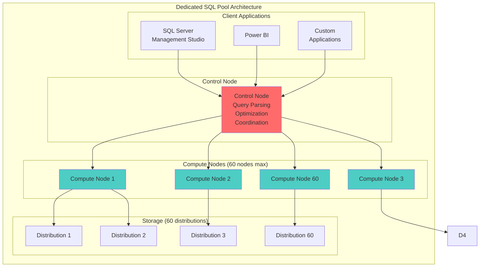

# 🏢 Dedicated SQL Pool - Azure Synapse Analytics

> __🏠 [Home](../../../../../../README.md)__ | __📖 [Overview](../../../../../01-overview/README.md)__ | __🛠️ [Services](../../../../README.md)__ | __💾 [Analytics Compute](../../../README.md)__ | __🎯 [Synapse](../../README.md)__ | __🗄️ [SQL Pools](../README.md)__ | __🏢 Dedicated SQL__


Enterprise-scale massively parallel processing (MPP) data warehouse with predictable performance and dedicated compute resources.

---

## 🌟 Overview

Dedicated SQL Pool (formerly SQL Data Warehouse) is a fully managed, enterprise-grade data warehousing solution that uses massively parallel processing (MPP) architecture to run complex queries quickly across petabytes of data. It provides dedicated compute resources with predictable performance for mission-critical analytics workloads.

### 🔥 Key Features

- __MPP Architecture__: Distributed query processing across 60 compute nodes
- __DWU Scaling__: Scale performance from DW100c to DW30000c
- __Workload Management__: Resource classes and workload groups for query prioritization
- __Advanced Indexing__: Columnstore indexes for extreme compression and performance
- __Materialized Views__: Pre-computed aggregations for instant query responses
- __Result Set Caching__: Automatic caching of query results
- __Pause & Resume__: Stop compute charges when not in use
- __Backup & Restore__: Automated backups with point-in-time restore

---

## 🏗️ MPP Architecture



### How MPP Works

1. __Query Submission__: Client submits query to Control Node
2. __Query Optimization__: Control Node optimizes and creates distributed execution plan
3. __Query Distribution__: Plan distributed to Compute Nodes
4. __Parallel Execution__: Each Compute Node processes its data distributions
5. __Result Aggregation__: Control Node aggregates results from all nodes
6. __Return Results__: Final results returned to client

---

## ⚡ Data Warehouse Units (DWU)

### Understanding DWUs

DWUs represent a bundled measure of compute, memory, and I/O resources. Higher DWU levels provide:

- More compute nodes (up to 60)
- More memory per node
- Higher query concurrency
- Better query performance

### DWU Scaling Levels

| DWU Level | Compute Nodes | Total Memory | Max Concurrency | Typical Use Case |
|-----------|---------------|--------------|-----------------|------------------|
| DW100c | 1 | 60 GB | 4 | Development, testing |
| DW500c | 5 | 300 GB | 20 | Small production workloads |
| DW1000c | 10 | 600 GB | 32 | Medium workloads |
| DW2000c | 20 | 1.2 TB | 48 | Large workloads |
| DW3000c | 30 | 1.8 TB | 64 | Very large workloads |
| DW6000c | 60 | 3.6 TB | 128 | Mission-critical, massive scale |

### Scaling Operations

```sql
-- Check current service level
SELECT
    DATABASEPROPERTYEX(DB_NAME(), 'ServiceObjective') AS current_service_level,
    DATABASEPROPERTYEX(DB_NAME(), 'Status') AS database_status;

-- Scale up for heavy processing
ALTER DATABASE YourDedicatedSQLPool
MODIFY (SERVICE_OBJECTIVE = 'DW2000c');

-- Scale down to save costs
ALTER DATABASE YourDedicatedSQLPool
MODIFY (SERVICE_OBJECTIVE = 'DW500c');

-- Pause to eliminate compute charges
ALTER DATABASE YourDedicatedSQLPool PAUSE;

-- Resume when needed
ALTER DATABASE YourDedicatedSQLPool RESUME;
```

---

## 📊 Table Distribution Strategies

### 1. Hash Distribution (Best for Large Fact Tables)


Distributes rows across compute nodes based on hash of distribution column.

```sql
CREATE TABLE fact_sales
WITH
(
    DISTRIBUTION = HASH([customer_id]),
    CLUSTERED COLUMNSTORE INDEX
)
AS
SELECT
    sales_id,
    customer_id,
    product_id,
    order_date,
    quantity,
    amount
FROM staging.raw_sales;
```

__Best Practices__:
- Choose high-cardinality column (millions of unique values)
- Avoid frequently updated columns
- Prefer columns used in JOIN clauses
- Ensure even data distribution (avoid data skew)

__Good Distribution Keys__:
- Customer ID in sales fact table
- User ID in activity fact table
- Transaction ID in financial fact table

__Bad Distribution Keys__:
- Boolean flags (low cardinality)
- Date columns (can cause skew)
- Frequently updated columns

---

### 2. Round Robin Distribution (Default)


Evenly distributes rows across all distributions randomly.

```sql
CREATE TABLE staging_orders
WITH
(
    DISTRIBUTION = ROUND_ROBIN,
    HEAP
)
AS
SELECT * FROM external_orders;
```

__Best For__:
- Staging tables
- Temporary tables
- Tables without clear distribution key
- Fast data loading

__Limitations__:
- Requires data movement for JOINs
- Not optimal for query performance
- Best for loading, not querying

---

### 3. Replicated Distribution (Best for Small Dimension Tables)


Full copy of table cached on each compute node.

```sql
CREATE TABLE dim_product
WITH
(
    DISTRIBUTION = REPLICATE,
    CLUSTERED COLUMNSTORE INDEX
)
AS
SELECT
    product_id,
    product_name,
    category,
    subcategory,
    brand,
    price
FROM staging.products;
```

__Best For__:
- Small dimension tables (< 2 GB)
- Frequently joined tables
- Eliminating data movement in queries

__Benefits__:
- No data movement during JOINs
- Improved query performance
- Better for small, read-heavy tables

__When to Avoid__:
- Large tables (> 2 GB)
- Frequently updated tables
- Tables with heavy writes

---

## 🗂️ Indexing Strategies

### 1. Clustered Columnstore Index (Default, Recommended)


Stores data in columnar format with extreme compression.

```sql
CREATE TABLE fact_large_sales
WITH
(
    DISTRIBUTION = HASH(customer_id),
    CLUSTERED COLUMNSTORE INDEX
)
AS
SELECT * FROM staging.sales;

-- Rebuild index to improve compression
ALTER INDEX ALL ON fact_large_sales REBUILD;

-- Monitor columnstore health
SELECT
    object_name(object_id) AS table_name,
    row_group_id,
    state_description,
    total_rows,
    deleted_rows,
    size_in_bytes
FROM sys.dm_pdw_nodes_db_column_store_row_group_physical_stats
WHERE object_id = OBJECT_ID('fact_large_sales')
ORDER BY row_group_id;
```

__Benefits__:
- 10x compression on average
- Excellent for analytical queries
- Batch mode execution
- Best for large tables (> 60 million rows)

__Best Practices__:
- Load in batches of 102,400+ rows
- Rebuild regularly to eliminate fragmentation
- Monitor row group health

---

### 2. Heap (No Index)


No index, fastest for loading data.

```sql
CREATE TABLE staging_temp
WITH
(
    DISTRIBUTION = ROUND_ROBIN,
    HEAP
)
AS SELECT * FROM source_data;
```

__Best For__:
- Staging tables
- One-time load tables
- Tables accessed once and deleted

---

### 3. Clustered Index


Traditional B-tree index on specified columns.

```sql
CREATE TABLE dim_date
WITH
(
    DISTRIBUTION = REPLICATE,
    CLUSTERED INDEX (date_key)
)
AS SELECT * FROM staging.dates;
```

__Best For__:
- Small dimension tables
- Queries with specific WHERE clauses
- Point lookups

---

## 🔧 Workload Management

### Resource Classes

Resource classes control memory and concurrency for queries.

| Resource Class | Memory % | Max Concurrency (DW1000c) | Use Case |
|----------------|----------|---------------------------|----------|
| staticrc10 | 3% | 32 | Small queries, high concurrency |
| staticrc20 | 6% | 32 | Light queries |
| staticrc30 | 10% | 32 | Medium queries |
| staticrc40 | 23% | 16 | Heavy queries |
| staticrc50 | 30% | 8 | Very heavy queries |
| staticrc60 | 47% | 4 | Massive queries |
| staticrc70 | 70% | 2 | Extreme queries |
| staticrc80 | 80% | 1 | Single massive query |

```sql
-- Create user and assign resource class
CREATE USER DataLoader WITHOUT LOGIN;
EXEC sp_addrolemember 'staticrc40', 'DataLoader';

-- Execute query as specific user
EXECUTE AS USER = 'DataLoader';
-- Your heavy query here
REVERT;

-- Check resource class assignments
SELECT
    r.name AS role_name,
    m.name AS member_name
FROM sys.database_role_members AS rm
JOIN sys.database_principals AS r ON rm.role_principal_id = r.principal_id
JOIN sys.database_principals AS m ON rm.member_principal_id = m.principal_id
WHERE r.name LIKE 'staticrc%'
ORDER BY r.name, m.name;
```

---

### Workload Groups (Advanced)

```sql
-- Create workload classifier
CREATE WORKLOAD CLASSIFIER ETL_Classifier
WITH
(
    WORKLOAD_GROUP = 'DataLoads',
    MEMBERNAME = 'DataLoader',
    IMPORTANCE = HIGH
);

-- Create workload group
CREATE WORKLOAD GROUP DataLoads
WITH
(
    MIN_PERCENTAGE_RESOURCE = 20,
    MAX_PERCENTAGE_RESOURCE = 60,
    REQUEST_MIN_RESOURCE_GRANT_PERCENT = 3,
    REQUEST_MAX_RESOURCE_GRANT_PERCENT = 10
);

-- Monitor workload groups
SELECT
    r.group_name,
    r.request_id,
    r.status,
    r.importance,
    r.total_elapsed_time,
    r.command
FROM sys.dm_pdw_exec_requests r
WHERE r.resource_class IS NOT NULL
ORDER BY r.submit_time DESC;
```

---

## 📈 Performance Optimization

### Materialized Views

Pre-computed aggregations for instant query responses.

```sql
-- Create materialized view
CREATE MATERIALIZED VIEW sales_summary_mv
WITH (DISTRIBUTION = HASH(customer_id))
AS
SELECT
    customer_id,
    product_category,
    YEAR(order_date) AS order_year,
    MONTH(order_date) AS order_month,
    COUNT(*) AS order_count,
    SUM(order_amount) AS total_revenue,
    AVG(order_amount) AS avg_order_value
FROM fact_sales
GROUP BY
    customer_id,
    product_category,
    YEAR(order_date),
    MONTH(order_date);

-- Query automatically uses materialized view
SELECT
    product_category,
    SUM(total_revenue) AS revenue
FROM fact_sales
WHERE YEAR(order_date) = 2024
GROUP BY product_category;
-- Optimizer redirects to sales_summary_mv

-- Monitor materialized view freshness
SELECT
    name,
    create_date,
    modify_date
FROM sys.views
WHERE is_materialized = 1;
```

---

### Result Set Caching

```sql
-- Enable result set caching at database level
ALTER DATABASE YourDedicatedSQLPool
SET RESULT_SET_CACHING ON;

-- Enable for specific session
SET RESULT_SET_CACHING ON;

-- Disable for specific query
SELECT * FROM fact_sales
OPTION (LABEL = 'NO_CACHE');

-- Check if query used cache
SELECT
    request_id,
    command,
    result_cache_hit,
    total_elapsed_time
FROM sys.dm_pdw_exec_requests
WHERE result_cache_hit = 1
ORDER BY submit_time DESC;
```

---

### Statistics Management

```sql
-- Create statistics on distribution column
CREATE STATISTICS stat_customer_id
ON fact_sales (customer_id)
WITH FULLSCAN;

-- Create statistics on filter columns
CREATE STATISTICS stat_order_date
ON fact_sales (order_date)
WITH FULLSCAN;

-- Update all statistics
UPDATE STATISTICS fact_sales;

-- Check statistics freshness
SELECT
    sm.name AS schema_name,
    tb.name AS table_name,
    st.name AS stats_name,
    STATS_DATE(st.object_id, st.stats_id) AS last_updated
FROM sys.stats st
JOIN sys.tables tb ON st.object_id = tb.object_id
JOIN sys.schemas sm ON tb.schema_id = sm.schema_id
WHERE STATS_DATE(st.object_id, st.stats_id) < DATEADD(DAY, -7, GETDATE())
ORDER BY last_updated;
```

---

## 🚀 Data Loading Best Practices

### Method 1: COPY Command (Fastest, Recommended)

```sql
-- Load from Azure Data Lake Storage
COPY INTO staging.orders
FROM 'https://storage.blob.core.windows.net/data/orders/*.parquet'
WITH
(
    FILE_TYPE = 'PARQUET',
    CREDENTIAL = (IDENTITY = 'Shared Access Signature', SECRET = 'your_sas_token'),
    COMPRESSION = 'SNAPPY',
    MAXERRORS = 10000,
    ERRORFILE = 'https://storage.blob.core.windows.net/errors/'
);

-- Load CSV with transformations
COPY INTO staging.sales
(
    order_id 1,
    customer_id 2,
    order_date 3 DATE_FORMAT 'YYYY-MM-DD',
    amount 4 DEFAULT 0.00
)
FROM 'https://storage.blob.core.windows.net/data/sales/*.csv'
WITH
(
    FILE_TYPE = 'CSV',
    FIELDTERMINATOR = ',',
    FIELDQUOTE = '"',
    ROWTERMINATOR = '\n',
    ENCODING = 'UTF8',
    FIRSTROW = 2
);
```

---

### Method 2: PolyBase External Tables

```sql
-- Create external data source
CREATE EXTERNAL DATA SOURCE AzureDataLakeSource
WITH
(
    TYPE = HADOOP,
    LOCATION = 'abfss://container@storage.dfs.core.windows.net',
    CREDENTIAL = AzureStorageCredential
);

-- Create external file format
CREATE EXTERNAL FILE FORMAT ParquetFormat
WITH
(
    FORMAT_TYPE = PARQUET,
    DATA_COMPRESSION = 'org.apache.hadoop.io.compress.SnappyCodec'
);

-- Create external table
CREATE EXTERNAL TABLE ext_sales
(
    order_id VARCHAR(50),
    customer_id VARCHAR(50),
    order_date DATE,
    amount DECIMAL(18,2)
)
WITH
(
    LOCATION = '/sales/',
    DATA_SOURCE = AzureDataLakeSource,
    FILE_FORMAT = ParquetFormat
);

-- Load data
CREATE TABLE fact_sales
WITH
(
    DISTRIBUTION = HASH(customer_id),
    CLUSTERED COLUMNSTORE INDEX
)
AS
SELECT * FROM ext_sales;
```

---

## 📊 Monitoring & Troubleshooting

### Query Performance Monitoring

```sql
-- View active queries
SELECT
    request_id,
    session_id,
    status,
    command,
    submit_time,
    start_time,
    total_elapsed_time,
    resource_class,
    importance
FROM sys.dm_pdw_exec_requests
WHERE status NOT IN ('Completed', 'Failed', 'Cancelled')
ORDER BY total_elapsed_time DESC;

-- Kill long-running query
KILL 'QID12345';

-- View query steps
SELECT
    request_id,
    step_index,
    operation_type,
    location_type,
    status,
    total_elapsed_time,
    row_count
FROM sys.dm_pdw_request_steps
WHERE request_id = 'QID12345'
ORDER BY step_index;

-- Check data movement
SELECT
    request_id,
    step_index,
    operation_type,
    distribution_type,
    location_type,
    total_elapsed_time,
    row_count,
    estimated_rows
FROM sys.dm_pdw_sql_requests
WHERE request_id = 'QID12345'
ORDER BY step_index;
```

---

### Storage and Space Management

```sql
-- Check table sizes
SELECT
    s.name AS schema_name,
    t.name AS table_name,
    SUM(p.rows) AS row_count,
    SUM(a.total_pages) * 8 / 1024 / 1024 AS size_gb
FROM sys.tables t
JOIN sys.schemas s ON t.schema_id = s.schema_id
JOIN sys.indexes i ON t.object_id = i.object_id
JOIN sys.partitions p ON i.object_id = p.object_id AND i.index_id = p.index_id
JOIN sys.allocation_units a ON p.partition_id = a.container_id
GROUP BY s.name, t.name
ORDER BY size_gb DESC;

-- Check distribution skew
SELECT
    distribution_id,
    COUNT(*) AS row_count
FROM fact_sales
GROUP BY distribution_id
ORDER BY row_count DESC;
```

---

## 💰 Cost Optimization

### 1. Pause During Off-Hours

```sql
-- Use Azure Automation or Logic Apps to schedule pause/resume
-- Example: Pause at 6 PM
ALTER DATABASE YourDedicatedSQLPool PAUSE;

-- Resume at 8 AM
ALTER DATABASE YourDedicatedSQLPool RESUME;

-- Savings: ~14 hours/day × 30 days = 420 hours/month saved
```

---

### 2. Right-Size DWU Level

```sql
-- Monitor query performance at different DWU levels
-- Scale down for development/testing
ALTER DATABASE YourDedicatedSQLPool
MODIFY (SERVICE_OBJECTIVE = 'DW500c');  -- Development

-- Scale up for production workloads
ALTER DATABASE YourDedicatedSQLPool
MODIFY (SERVICE_OBJECTIVE = 'DW2000c');  -- Production peak hours

-- Scale down during off-peak
ALTER DATABASE YourDedicatedSQLPool
MODIFY (SERVICE_OBJECTIVE = 'DW1000c');  -- Production off-peak
```

---

### 3. Optimize Data Loading

```sql
-- Use COPY instead of INSERT for bulk loads (10x faster)
-- Use columnstore compression (10x less storage)
-- Load in batches of 100K+ rows for optimal compression
-- Clean up staging tables regularly
DROP TABLE IF EXISTS staging.temp_data;
```

---

## 📚 Related Resources

### 🎓 __Tutorials & Guides__

- [__Dedicated SQL Pool Best Practices__](../../../../../05-best-practices/service-specific/synapse/dedicated-sql-best-practices.md)
- [__Performance Tuning Guide__](../../../../../05-best-practices/cross-cutting-concerns/performance/dedicated-sql-optimization.md)
- [__Data Warehouse Patterns__](../../../../../03-architecture-patterns/batch-architectures/data-warehouse-patterns.md)

### 📖 __Code Examples__

- [__Dedicated SQL Examples__](../../../../../06-code-examples/by-service/synapse/dedicated-sql-examples.md)
- [__Data Loading Patterns__](../../../../../06-code-examples/by-service/synapse/data-loading-patterns.md)
- [__Query Optimization Examples__](../../../../../06-code-examples/by-service/synapse/query-optimization.md)

### 🔧 __Operational Guides__

- [__Cost Management__](../../../../../05-best-practices/cross-cutting-concerns/cost-optimization/dedicated-sql-costs.md)
- [__Security Configuration__](../../../../../05-best-practices/cross-cutting-concerns/security/dedicated-sql-security.md)
- [__Monitoring & Alerting__](../../../../../09-monitoring/service-monitoring/synapse/dedicated-monitoring.md)

---

*Last Updated: 2025-01-28*
*Service Tier: Dedicated*
*Documentation Status: Complete*
