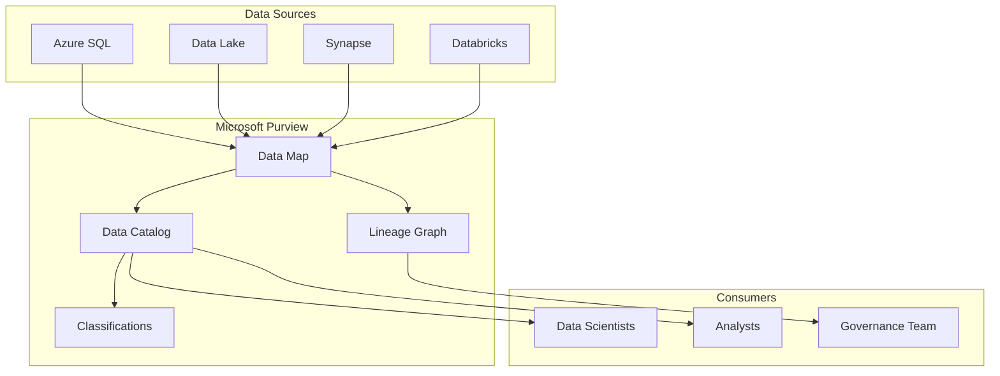

# 🔍 Azure Purview

> __🏠 [Home](../../../../README.md)__ | __🛠️ [Services](../../README.md)__ | __🔐 [Data Governance](../README.md)__ | __🔍 Purview__


Unified data governance solution for discovering, classifying, and managing data across your enterprise.

---

## 🎯 Overview

Azure Purview (now Microsoft Purview) provides comprehensive data governance capabilities including:

- **Data Catalog**: Centralized metadata repository
- **Data Map**: Visual representation of your data estate
- **Data Lineage**: Track data flow from source to consumption
- **Data Classification**: Automatic sensitive data detection
- **Access Policies**: Centralized data access management

---

## 📚 Documentation

| Topic | Description |
|-------|-------------|
| [Data Lineage](lineage.md) | End-to-end lineage tracking |
| [Classification Guide](classifications.md) | Sensitive data detection |
| [Integration Setup](integration.md) | Connect data sources |

---

## 🏗️ Architecture



---

## 🚀 Quick Start

### 1. Register a Data Source

```python
from azure.purview.scanning import PurviewScanningClient
from azure.identity import DefaultAzureCredential

client = PurviewScanningClient(
    endpoint="https://purview-account.purview.azure.com",
    credential=DefaultAzureCredential()
)

# Register Data Lake
source = {
    "kind": "AdlsGen2",
    "properties": {
        "endpoint": "https://datalake.dfs.core.windows.net/"
    }
}

client.data_sources.create_or_update("datalake", source)
```

### 2. Create a Scan

```python
scan = {
    "kind": "AdlsGen2Msi",
    "properties": {
        "scanRulesetName": "AdlsGen2",
        "scanRulesetType": "System"
    }
}

client.scans.create_or_update("datalake", "scan-001", scan)
client.scan_result.run_scan("datalake", "scan-001")
```

---

## 🔗 Related Documentation

- [Pipeline Lineage](../../analytics-compute/azure-synapse/pipelines/lineage-tracking.md)
- [Data Governance Best Practices](../../../05-best-practices/cross-cutting-concerns/data-governance/README.md)
- [Security Patterns](../../../03-architecture-patterns/governance-patterns/README.md)

---

*Last Updated: January 2025*
