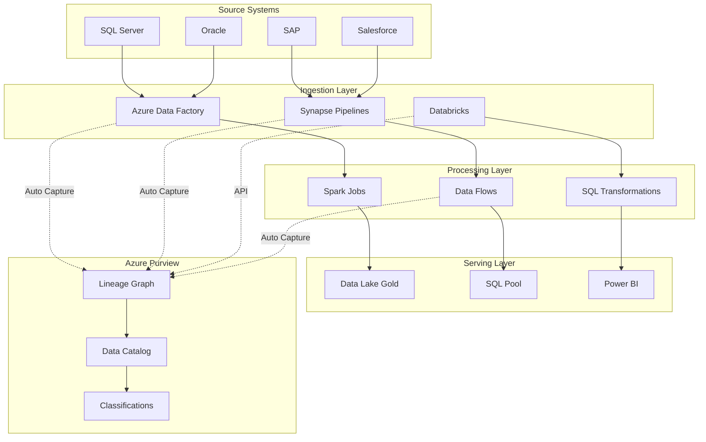

# 🔗 Azure Purview Data Lineage

> __🏠 [Home](../../../../README.md)__ | __🛠️ [Services](../../README.md)__ | __🔐 Data Governance__ | __🔗 Lineage__


Comprehensive guide to implementing and managing data lineage with Azure Purview (now Microsoft Purview).

---

## 🎯 Overview

Azure Purview provides automated data lineage capture across your entire data estate, enabling you to:

- **Trace data flow** from source to consumption
- **Understand impact** of changes to data assets
- **Meet compliance** requirements with auditable data trails
- **Build trust** through transparent data transformations

---

## 🏗️ Lineage Architecture



---

## 🔧 Setup and Configuration

### 1. Create Purview Account

```bicep
// Bicep template for Purview account
resource purviewAccount 'Microsoft.Purview/accounts@2021-07-01' = {
  name: 'purview-${environment}'
  location: resourceGroup().location
  identity: {
    type: 'SystemAssigned'
  }
  properties: {
    publicNetworkAccess: 'Enabled'
    managedResourceGroupName: 'rg-purview-managed'
  }
}

// Output for integration
output purviewAccountName string = purviewAccount.name
output purviewEndpoint string = purviewAccount.properties.endpoints.catalog
```

### 2. Configure Managed Identity Permissions

```powershell
# Get Purview Managed Identity
$purviewMI = (Get-AzPurviewAccount -Name "purview-prod" -ResourceGroupName "rg-governance").Identity.PrincipalId

# Grant access to Data Lake
New-AzRoleAssignment `
    -ObjectId $purviewMI `
    -RoleDefinitionName "Storage Blob Data Reader" `
    -Scope "/subscriptions/{sub}/resourceGroups/{rg}/providers/Microsoft.Storage/storageAccounts/{storage}"

# Grant access to Synapse
New-AzRoleAssignment `
    -ObjectId $purviewMI `
    -RoleDefinitionName "Reader" `
    -Scope "/subscriptions/{sub}/resourceGroups/{rg}/providers/Microsoft.Synapse/workspaces/{synapse}"

# Grant access to SQL Database
New-AzRoleAssignment `
    -ObjectId $purviewMI `
    -RoleDefinitionName "SQL DB Contributor" `
    -Scope "/subscriptions/{sub}/resourceGroups/{rg}/providers/Microsoft.Sql/servers/{server}"
```

### 3. Register Data Sources

```python
from azure.identity import DefaultAzureCredential
from azure.purview.scanning import PurviewScanningClient
from azure.purview.administration.account import PurviewAccountClient

credential = DefaultAzureCredential()
scanning_client = PurviewScanningClient(
    endpoint="https://purview-prod.purview.azure.com",
    credential=credential
)

# Register Azure Data Lake Gen2
adls_source = {
    "kind": "AdlsGen2",
    "properties": {
        "endpoint": "https://datalake.dfs.core.windows.net/",
        "resourceGroup": "rg-analytics",
        "subscriptionId": "{subscription-id}",
        "location": "eastus",
        "resourceName": "datalake"
    }
}

scanning_client.data_sources.create_or_update(
    data_source_name="datalake-analytics",
    body=adls_source
)
```

---

## 📊 Lineage Capture Methods

### Automatic Lineage

Sources with automatic lineage capture:

| Service | Lineage Type | Configuration |
|---------|-------------|---------------|
| Azure Data Factory | Full | Connect workspace |
| Synapse Pipelines | Full | Connect workspace |
| Power BI | Full | Connect workspace |
| Azure SQL Database | Schema | Scan & register |
| Data Lake Gen2 | Asset | Scan & register |
| Cosmos DB | Asset | Scan & register |

### Manual/API Lineage

For custom processes, use the Atlas API:

```python
from azure.purview.catalog import PurviewCatalogClient

catalog_client = PurviewCatalogClient(
    endpoint="https://purview-prod.purview.azure.com",
    credential=credential
)

# Create custom lineage process
process_entity = {
    "typeName": "Process",
    "attributes": {
        "qualifiedName": "custom://etl/daily_aggregation",
        "name": "Daily Sales Aggregation",
        "description": "Aggregates raw sales data by day",
        "owner": "data-engineering@company.com"
    },
    "relationshipAttributes": {
        "inputs": [
            {
                "typeName": "azure_datalake_gen2_path",
                "uniqueAttributes": {
                    "qualifiedName": "https://datalake.dfs.core.windows.net/bronze/sales/"
                }
            }
        ],
        "outputs": [
            {
                "typeName": "azure_datalake_gen2_path",
                "uniqueAttributes": {
                    "qualifiedName": "https://datalake.dfs.core.windows.net/gold/sales_daily/"
                }
            }
        ]
    }
}

result = catalog_client.entity.create_or_update({"entity": process_entity})
print(f"Created lineage entity: {result['guidAssignments']}")
```

---

## 🔍 Querying Lineage

### Get Full Lineage Graph

```python
# Get complete lineage for an entity
def get_full_lineage(entity_guid, direction="BOTH", depth=10):
    lineage = catalog_client.lineage.get_lineage_graph(
        guid=entity_guid,
        direction=direction,
        depth=depth
    )

    entities = lineage.get("guidEntityMap", {})
    relations = lineage.get("relations", [])

    print(f"Found {len(entities)} entities and {len(relations)} relationships")

    for relation in relations:
        from_entity = entities.get(relation["fromEntityId"], {})
        to_entity = entities.get(relation["toEntityId"], {})

        from_name = from_entity.get("attributes", {}).get("name", "Unknown")
        to_name = to_entity.get("attributes", {}).get("name", "Unknown")

        print(f"  {from_name} --> {to_name}")

    return lineage

# Example usage
lineage = get_full_lineage("{entity-guid}")
```

### Search Lineage by Asset

```python
# Find lineage for a specific data asset
def find_asset_lineage(qualified_name):
    # Search for the entity
    search_results = catalog_client.discovery.query(
        search_request={
            "keywords": qualified_name,
            "filter": {
                "and": [
                    {"entityType": "azure_datalake_gen2_path"}
                ]
            }
        }
    )

    if search_results.get("value"):
        entity_id = search_results["value"][0]["id"]
        return get_full_lineage(entity_id)

    return None

# Find lineage for gold layer sales data
lineage = find_asset_lineage("https://datalake.dfs.core.windows.net/gold/sales/")
```

---

## 📈 Column-Level Lineage

### Configure Column Lineage

```python
# Column-level lineage entity
column_lineage = {
    "typeName": "column_lineage_process",
    "attributes": {
        "qualifiedName": "column://transform/customer_full_name",
        "name": "Derive Customer Full Name"
    },
    "relationshipAttributes": {
        "inputs": [
            {
                "typeName": "column",
                "uniqueAttributes": {
                    "qualifiedName": "azure://datalake/customers#first_name"
                }
            },
            {
                "typeName": "column",
                "uniqueAttributes": {
                    "qualifiedName": "azure://datalake/customers#last_name"
                }
            }
        ],
        "outputs": [
            {
                "typeName": "column",
                "uniqueAttributes": {
                    "qualifiedName": "azure://datalake/customers_gold#full_name"
                }
            }
        ]
    }
}

catalog_client.entity.create_or_update({"entity": column_lineage})
```

### Query Column Lineage

```python
# Get column-level lineage
def get_column_lineage(table_qualified_name, column_name):
    column_qn = f"{table_qualified_name}#{column_name}"

    # Search for column entity
    search = catalog_client.discovery.query({
        "keywords": column_qn,
        "filter": {"entityType": "column"}
    })

    if search.get("value"):
        column_guid = search["value"][0]["id"]
        return get_full_lineage(column_guid)

    return None
```

---

## 🛡️ Best Practices

### 1. Lineage Completeness

```python
# Validate lineage coverage
def audit_lineage_coverage(collection_name):
    # Get all assets in collection
    assets = catalog_client.discovery.query({
        "filter": {
            "collectionId": collection_name
        },
        "limit": 1000
    })

    coverage_report = {
        "total_assets": 0,
        "with_lineage": 0,
        "without_lineage": [],
        "coverage_percent": 0
    }

    for asset in assets.get("value", []):
        coverage_report["total_assets"] += 1

        lineage = catalog_client.lineage.get_lineage_graph(
            guid=asset["id"],
            direction="BOTH",
            depth=1
        )

        if lineage.get("relations"):
            coverage_report["with_lineage"] += 1
        else:
            coverage_report["without_lineage"].append(
                asset.get("qualifiedName")
            )

    if coverage_report["total_assets"] > 0:
        coverage_report["coverage_percent"] = (
            coverage_report["with_lineage"] /
            coverage_report["total_assets"] * 100
        )

    return coverage_report
```

### 2. Lineage Refresh Strategy

| Data Freshness | Scan Frequency | Lineage Update |
|---------------|----------------|----------------|
| Real-time | Continuous | Event-driven |
| Daily | Daily | After ETL completion |
| Weekly | Weekly | Weekend batch |
| Monthly | Monthly | End of month |

### 3. Lineage Metadata Standards

```json
{
    "lineageStandards": {
        "processNaming": "{source}_{action}_{target}",
        "requiredAttributes": [
            "owner",
            "description",
            "dataClassification",
            "retentionPolicy"
        ],
        "tagConventions": {
            "pii": "Contains personally identifiable information",
            "financial": "Contains financial data",
            "external": "Data from external sources"
        }
    }
}
```

---

## 🔗 Integration with Other Services

### Power BI Integration

```powershell
# Connect Power BI workspace to Purview
Set-PowerBIWorkspace `
    -Id "{workspace-id}" `
    -PurviewAccountName "purview-prod"
```

### Synapse Integration

```json
// Synapse workspace configuration
{
    "properties": {
        "purviewConfiguration": {
            "purviewResourceId": "/subscriptions/{sub}/resourceGroups/{rg}/providers/Microsoft.Purview/accounts/purview-prod"
        }
    }
}
```

### Databricks Integration

```python
# Push Databricks lineage to Purview
from databricks.sdk import WorkspaceClient
from azure.purview.catalog import PurviewCatalogClient

# After Spark job completion
def push_databricks_lineage(job_run_id):
    # Get job metadata from Databricks
    ws = WorkspaceClient()
    run = ws.jobs.get_run(job_run_id)

    # Create Purview lineage entity
    lineage = {
        "typeName": "databricks_notebook_process",
        "attributes": {
            "qualifiedName": f"databricks://{run.notebook_path}",
            "name": run.run_name,
            "executionTime": run.end_time - run.start_time
        }
    }

    catalog_client.entity.create_or_update({"entity": lineage})
```

---

## 📚 Related Documentation

- [Pipeline Lineage Tracking](../../analytics-compute/azure-synapse/pipelines/lineage-tracking.md)
- [Data Governance Best Practices](../../../05-best-practices/cross-cutting-concerns/data-governance/README.md)
- [Compliance Guide](../../../reference/security-checklist/README.md)
- [Data Catalog Setup](./README.md)

---

*Last Updated: January 2025*
