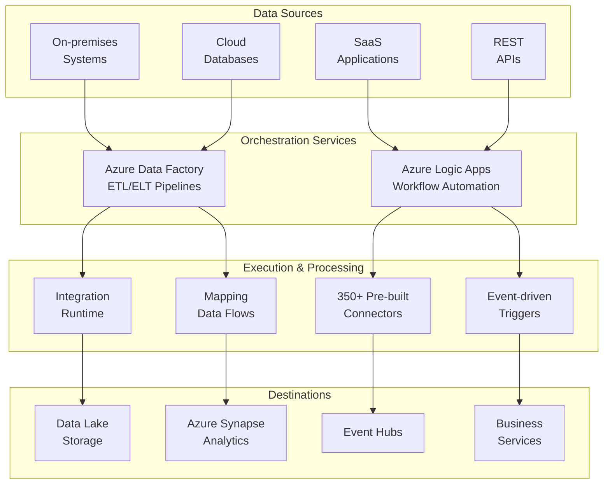
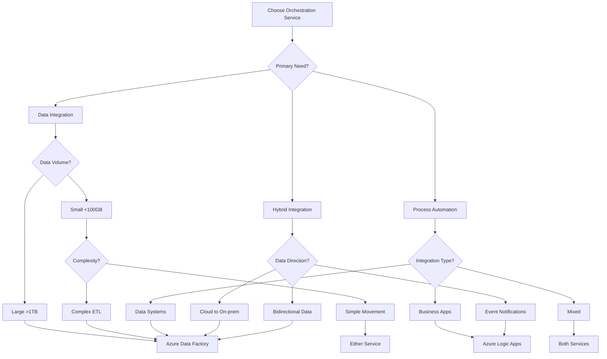
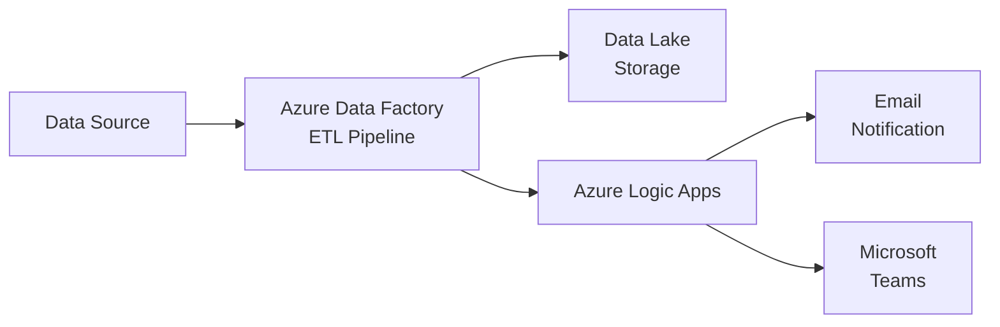
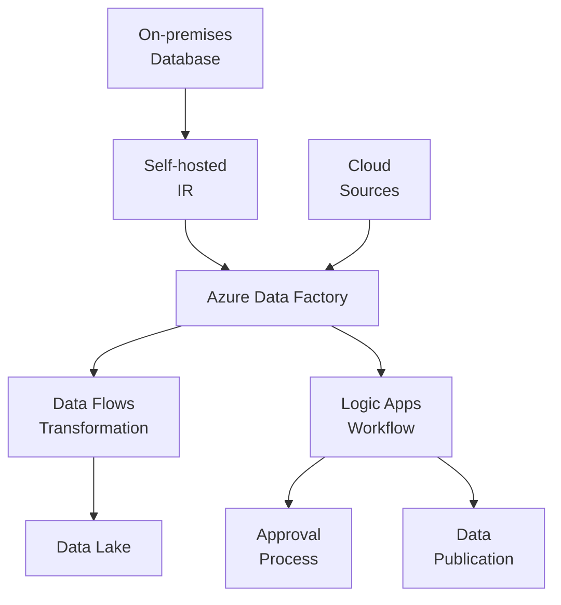

# 🔧 Orchestration Services

> __🏠 [Home](../../../README.md)__ | __📖 [Overview](../../01-overview/README.md)__ | __🛠️ Services__ | __🔧 Orchestration Services__

Data integration, workflow automation, and pipeline orchestration services for building scalable data solutions.

---

## 🎯 Service Overview

Orchestration services provide the coordination layer for data integration, transformation workflows, and business process automation. These services enable building complex data pipelines, automating workflows, and integrating diverse systems across cloud and on-premises environments.

---

## 🚀 Service Cards

### 🏗️ Azure Data Factory

__Cloud-based data integration service for creating, scheduling, and orchestrating ETL/ELT data pipelines at scale.__

#### 🔥 Key Strengths

- __Code-free ETL__: Visual pipeline designer with drag-and-drop interface
- __90+ Native Connectors__: Built-in connectivity to popular data sources
- __Serverless Data Flows__: Apache Spark-powered transformations without infrastructure management
- __Hybrid Integration__: Seamless connectivity between on-premises and cloud data sources
- __Enterprise CI/CD__: Native integration with Azure DevOps and GitHub

#### 📊 Core Components

- __[Pipeline Patterns](azure-data-factory/pipeline-patterns.md)__ - Common orchestration patterns and best practices
- __[Data Flows](azure-data-factory/data-flows/README.md)__ - Visual data transformation design
- __[Integration Runtime](azure-data-factory/integration-runtime/README.md)__ - Compute infrastructure for data movement
- __[CI/CD Pipelines](azure-data-factory/ci-cd-pipelines.md)__ - Deployment automation and version control

#### 🎯 Best For

- Large-scale data integration and ETL/ELT pipelines
- Data warehouse loading and transformation
- Hybrid data movement (cloud and on-premises)
- Scheduled batch processing workflows
- Data migration projects

#### 💰 Pricing Model

- __Pipeline Orchestration__: Per activity run
- __Data Flow Execution__: Per vCore-hour (Apache Spark compute)
- __Data Movement__: Per Data Integration Unit (DIU) hour
- __Integration Runtime__: Per hour for self-hosted IR

__[📖 Full Documentation →](azure-data-factory/README.md)__

---

### ⚡ Azure Logic Apps

__Serverless workflow automation service for building event-driven integrations and business process automation.__

#### 🔥 Key Strengths

- __Visual Workflow Designer__: Intuitive drag-and-drop interface for building workflows
- __350+ Pre-built Connectors__: Ready-to-use integrations with popular services
- __Event-driven Architecture__: Trigger-based execution with multiple event sources
- __B2B Integration__: Native support for EDI, AS2, and X12 protocols
- __Serverless Execution__: Pay-per-execution with automatic scaling

#### 📊 Core Capabilities

- __[Workflow Automation](azure-logic-apps/workflow-automation.md)__ - Building automated business workflows
- __Built-in Connectors__: Office 365, Dynamics 365, Salesforce, SAP, and more
- __Custom Connectors__: Create connectors for any REST API
- __Integration Account__: B2B/EDI trading partner management

#### 🎯 Best For

- Business process automation
- System-to-system integration
- Event-driven workflows and alerting
- API orchestration and composition
- Lightweight ETL scenarios
- B2B/EDI integrations

#### 💰 Pricing Model

- __Consumption Plan__: Pay-per-execution (action runs)
- __Standard Plan__: Fixed monthly cost with unlimited executions
- __Integration Account__: Separate pricing for B2B features

__[📖 Full Documentation →](azure-logic-apps/README.md)__

---

## 📊 Service Comparison

### Feature Matrix

| Feature | Azure Data Factory | Azure Logic Apps |
|---------|-------------------|------------------|
| __Primary Use Case__ | Data integration & ETL | Workflow automation & integration |
| __Design Interface__ | ✅ Visual pipeline designer | ✅ Visual workflow designer |
| __Code Support__ | ✅ JSON, Python, .NET | ⚠️ JSON definitions only |
| __Data Transformation__ | ✅ Advanced (Data Flows) | ⚠️ Basic transformations |
| __Connectors__ | 90+ data-focused | 350+ service-focused |
| __Scheduling__ | ✅ Advanced scheduling | ✅ Event-driven triggers |
| __Hybrid Connectivity__ | ✅ Self-hosted IR | ⚠️ On-premises gateway |
| __Batch Processing__ | ✅ Optimized for batch | ⚠️ Limited batch support |
| __Real-time Processing__ | ⚠️ Limited | ✅ Event-driven |
| __B2B/EDI Support__ | ❌ No | ✅ Integration Account |
| __CI/CD Integration__ | ✅ Native support | ✅ ARM templates |
| __Monitoring__ | ✅ Azure Monitor integration | ✅ Azure Monitor integration |
| __Cost Model__ | Activity-based | Execution-based |
| __Learning Curve__ | 🟡 Moderate | 🟢 Easy |

### Use Case Recommendations

#### 📊 Data Warehousing & Analytics

__Primary__: Azure Data Factory

- Optimized for large-scale data movement
- Advanced transformation capabilities with Data Flows
- Integration with Azure Synapse Analytics
- Efficient batch processing and scheduling

#### 🔄 Business Process Automation

__Primary__: Azure Logic Apps

- Event-driven workflow execution
- Rich connector ecosystem for business applications
- Easy-to-use visual designer
- Rapid development and deployment

#### 🔀 Hybrid Data Integration

__Primary__: Azure Data Factory

- Self-hosted Integration Runtime for on-premises connectivity
- Optimized for large data volumes
- Secure data movement with managed identities
- Support for various data formats and protocols

#### 🌐 API Orchestration & Composition

__Primary__: Azure Logic Apps

- Easy API chaining and orchestration
- Built-in error handling and retry logic
- Native authentication with OAuth and certificates
- Quick integration with external services

#### 🏢 Enterprise Integration Patterns

__Both Services__: Complementary usage

- ADF for data-heavy workflows and transformations
- Logic Apps for event routing and business logic
- Combined for end-to-end integration scenarios

---

## 🎯 Selection Decision Tree

## 🚀 Getting Started Paths

### 🆕 New to Orchestration Services

1. __Start with__: Azure Logic Apps for simple automation
2. __Why__: Easier learning curve, visual designer, quick results
3. __Next Steps__: Progress to Data Factory for data-intensive workloads
4. __Resources__: [Logic Apps Quick Start](azure-logic-apps/README.md#quick-start-guide)

### 📊 Data Engineering Focus

1. __Start with__: Azure Data Factory fundamentals
2. __Why__: Purpose-built for data integration and ETL
3. __Next Steps__: Learn Data Flows and Integration Runtime
4. __Resources__: [ADF Pipeline Patterns](azure-data-factory/pipeline-patterns.md)

### 🏢 Enterprise Integration

1. __Start with__: Architecture planning for both services
2. __Recommended__: Use both services in complementary patterns
3. __Next Steps__: Implement hybrid connectivity and CI/CD
4. __Resources__: [Integration Runtime Setup](azure-data-factory/integration-runtime/README.md)

### 🔄 Hybrid Cloud Integration

1. __Start with__: Self-hosted Integration Runtime setup
2. __Why__: Secure connectivity to on-premises data sources
3. __Next Steps__: Design incremental data movement patterns
4. __Resources__: [Integration Runtime Guide](azure-data-factory/integration-runtime/README.md)

---

## 📚 Integration Patterns

### Pattern 1: Data Pipeline with Event Notification

__Use Case__: Run data pipeline and notify stakeholders upon completion

- ADF handles data transformation and loading
- Logic Apps triggered on pipeline completion
- Notifications sent to relevant teams

### Pattern 2: Event-Driven Data Processing

__Use Case__: Process data based on business events

- Logic Apps receives external events
- Triggers ADF pipeline for data processing
- Results loaded into data warehouse

### Pattern 3: Hybrid ETL with Orchestration

__Use Case__: Complex hybrid data integration with approvals

- ADF moves and transforms data from multiple sources
- Logic Apps handles approval workflows
- Coordinated data publication process

---

## 🛠️ Common Implementation Scenarios

### Scenario 1: Daily Data Warehouse Refresh

__Services__: Azure Data Factory + Azure Synapse Analytics

1. Schedule daily pipeline execution
2. Extract data from source systems
3. Transform using Data Flows
4. Load into dedicated SQL pool
5. Refresh Power BI datasets

__[Implementation Guide →](azure-data-factory/pipeline-patterns.md)__

### Scenario 2: Real-time Order Processing

__Services__: Azure Logic Apps + Azure Functions + Cosmos DB

1. Receive order via HTTP trigger
2. Validate order details
3. Update inventory in Cosmos DB
4. Send confirmation email
5. Trigger fulfillment workflow

__[Implementation Guide →](azure-logic-apps/workflow-automation.md#business-process-automation)__

### Scenario 3: File-based Integration

__Services__: Azure Data Factory + Blob Storage + Event Grid

1. Monitor blob storage for new files
2. Trigger ADF pipeline on file arrival
3. Validate and transform file data
4. Load into destination system
5. Archive processed files

__[Implementation Guide →](azure-data-factory/pipeline-patterns.md)__

### Scenario 4: Multi-System Synchronization

__Services__: Azure Logic Apps + Custom Connectors

1. Detect changes in source system
2. Transform data for target system
3. Update multiple downstream systems
4. Handle conflicts and errors
5. Log synchronization status

__[Implementation Guide →](azure-logic-apps/workflow-automation.md#system-integration-patterns)__

---

## 🔒 Security & Governance

### Azure Data Factory Security

- __Managed Identity__: Authentication without credentials
- __Private Endpoints__: Secure connectivity to data sources
- __Data Encryption__: At-rest and in-transit encryption
- __Role-based Access Control__: Fine-grained permissions
- __Azure Key Vault Integration__: Centralized secrets management

### Azure Logic Apps Security

- __Managed Identity__: Authenticate to Azure resources
- __API Connection Security__: OAuth and certificate authentication
- __Network Isolation__: Integration Service Environment (ISE)
- __Secure Parameters__: Protected workflow parameters
- __Compliance__: SOC, ISO, HIPAA, and other certifications

### Monitoring & Auditing

- __Azure Monitor__: Centralized logging and metrics
- __Azure Log Analytics__: Query and analyze logs
- __Alerts__: Proactive monitoring and notifications
- __Diagnostic Settings__: Comprehensive audit trails
- __Application Insights__: Performance monitoring

---

## 📊 Cost Optimization Best Practices

### Azure Data Factory

1. __Use Data Flows sparingly__: Reserve for complex transformations
2. __Optimize DIU usage__: Tune Data Integration Units for performance
3. __Batch operations__: Combine multiple activities where possible
4. __Schedule wisely__: Avoid unnecessary pipeline runs
5. __Monitor costs__: Use Cost Management for tracking

### Azure Logic Apps

1. __Choose right plan__: Consumption vs Standard based on volume
2. __Optimize connector usage__: Minimize expensive connector calls
3. __Use built-in actions__: Prefer built-in over premium connectors
4. __Implement caching__: Reduce redundant API calls
5. __Batch processing__: Process multiple items in single run

---

## 📚 Additional Resources

### 🎓 Learning Resources

- [Azure Data Factory Documentation](https://learn.microsoft.com/azure/data-factory/)
- [Azure Logic Apps Documentation](https://learn.microsoft.com/azure/logic-apps/)
- [Integration Architecture Patterns](../../03-architecture-patterns/README.md)

### 🔧 Implementation Guides

- [CI/CD for Data Factory](azure-data-factory/ci-cd-pipelines.md)
- [Workflow Automation Patterns](azure-logic-apps/workflow-automation.md)
- [Hybrid Integration Setup](azure-data-factory/integration-runtime/README.md)

### 📊 Reference Implementations

- [ETL Pipeline Examples](../../code-examples/integration/azure-data-factory.md)
- [Logic Apps Connectors Guide](../../code-examples/integration-guide.md)
- [Best Practices Guide](../../best-practices/pipeline-optimization.md)

---

## 💬 Quick Reference

### When to Use Azure Data Factory

- ✅ Large-scale data integration (>100GB)
- ✅ Complex ETL/ELT transformations
- ✅ Data warehouse loading
- ✅ Batch processing workflows
- ✅ Hybrid cloud/on-premises integration
- ✅ Scheduled data pipelines

### When to Use Azure Logic Apps

- ✅ Business process automation
- ✅ Event-driven workflows
- ✅ System-to-system integration
- ✅ API orchestration
- ✅ Lightweight data movement (<100GB)
- ✅ B2B/EDI integrations
- ✅ Real-time notifications and alerts

### When to Use Both

- ✅ End-to-end integration scenarios
- ✅ Data pipelines with business workflows
- ✅ Complex orchestration requirements
- ✅ Hybrid batch and real-time processing
- ✅ Enterprise integration platforms

---

*Last Updated: 2025-01-28*
*Services Covered: 2*
*Documentation Status: Complete*
