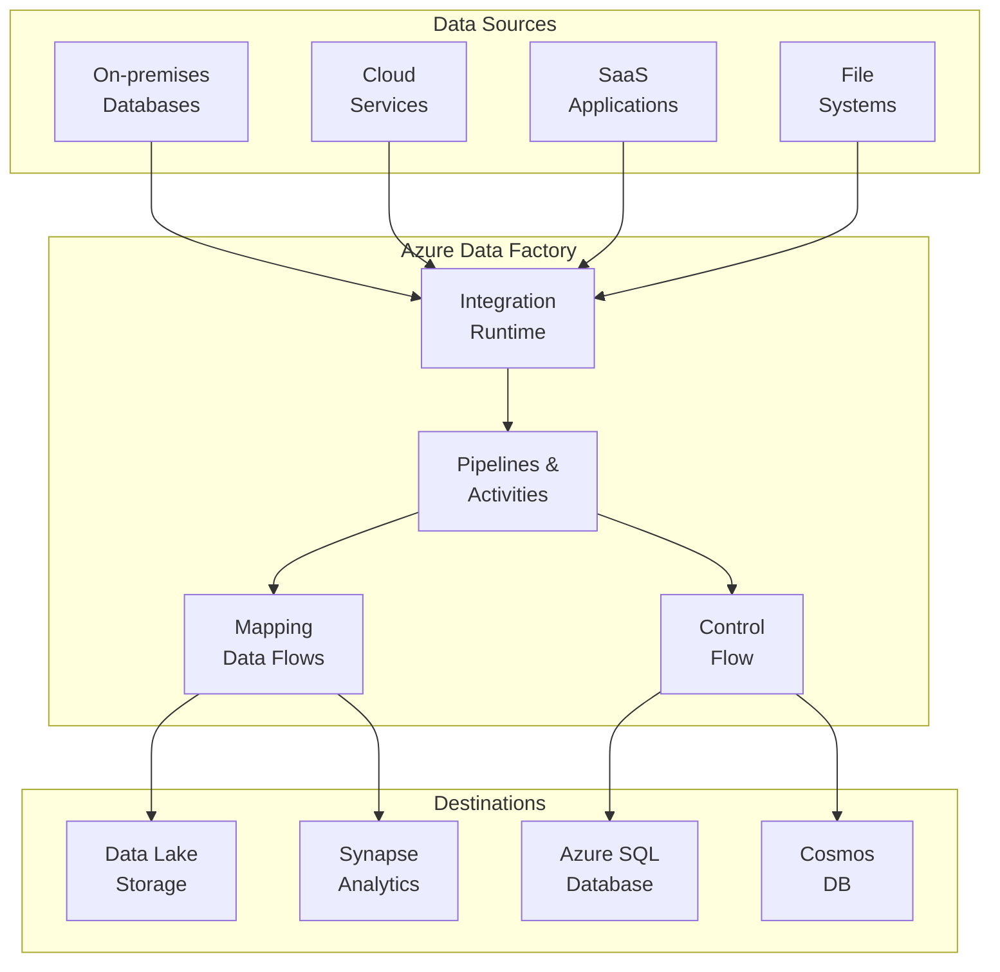
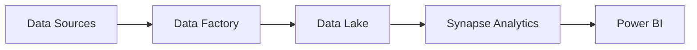

# 🏗️ Azure Data Factory

> __🏠 [Home](../../../../README.md)__ | __📖 [Overview](../../../01-overview/README.md)__ | __🛠️ [Services](../../README.md)__ | __🔧 Orchestration Services__ | __🏗️ Azure Data Factory__


Cloud-based data integration service for creating, scheduling, and orchestrating ETL/ELT data pipelines at scale.

---

## 🌟 Service Overview

Azure Data Factory (ADF) is a fully managed, serverless data integration service that enables you to create data-driven workflows for orchestrating data movement and transformation at scale. It provides a code-free UI for intuitive authoring and a comprehensive platform for complex hybrid ETL, ELT, and data integration projects.

### 🔥 Key Value Propositions

- __Code-free ETL__: Visual pipeline designer with drag-and-drop interface
- __90+ Connectors__: Built-in connectors for cloud and on-premises data sources
- __Serverless Compute__: Auto-scaling data flows powered by Apache Spark
- __Hybrid Integration__: Seamlessly connect on-premises and cloud data sources
- __Enterprise-grade__: CI/CD support, monitoring, and security features

---

## 🏗️ Architecture Overview



---

## 🛠️ Core Components

### 📊 Pipelines & Activities

__What__: Logical grouping of activities that perform a data workflow task.

__Key Features__:

- __Copy Activity__: Move data between sources and destinations
- __Data Flow Activity__: Transform data using visual data flows
- __Stored Procedure Activity__: Execute stored procedures
- __Notebook Activity__: Run Databricks notebooks
- __Web Activity__: Call custom REST endpoints

__Use Cases__:

- Data ingestion from multiple sources
- ETL/ELT pipeline orchestration
- Data migration and synchronization

---

### 🔄 [Mapping Data Flows](data-flows/README.md)


Visual data transformation at scale without writing code.

__Key Features__:

- __Visual Designer__: Drag-and-drop transformation logic
- __Spark Execution__: Auto-scaled Spark clusters for processing
- __70+ Transformations__: Join, aggregate, derive, filter, and more
- __Debug Mode__: Interactive data preview during development

__Best For__: Complex data transformations, data quality, aggregations

__[📖 Detailed Guide →](data-flows/README.md)__

---

### 🔗 [Integration Runtime](integration-runtime/README.md)


Compute infrastructure for data integration across different network environments.

__Types__:

- __Azure IR__: Cloud data sources and services
- __Self-hosted IR__: On-premises and private network sources
- __Azure-SSIS IR__: Lift-and-shift SSIS packages

__Key Features__:

- Hybrid connectivity
- High availability
- Network security
- Resource sharing

__[📖 Detailed Guide →](integration-runtime/README.md)__

---

### 🔀 [Pipeline Patterns](pipeline-patterns.md)

Common pipeline design patterns for different scenarios.

__Patterns Covered__:

- __Copy Pattern__: Simple data movement
- __Parent-Child Pattern__: Pipeline orchestration
- __Iterative Pattern__: Loop over datasets
- __Conditional Pattern__: Branching logic
- __Dependency Pattern__: Activity chaining

__[📖 View Patterns →](pipeline-patterns.md)__

---

### 🚀 [CI/CD for Data Factory](ci-cd-pipelines.md)

Enterprise DevOps practices for data pipelines.

__Capabilities__:

- __Git Integration__: Azure DevOps or GitHub
- __ARM Templates__: Infrastructure as code
- __Environment Promotion__: Dev → Test → Prod
- __Automated Testing__: Pipeline validation

__[📖 CI/CD Guide →](ci-cd-pipelines.md)__

---

## 🎯 Common Use Cases

### 📥 Data Ingestion

Ingest data from various sources into your data lake or warehouse.

__Architecture__: Source Systems → ADF → Data Lake/Synapse
__Pattern__: [Incremental Copy Pattern](pipeline-patterns.md#incremental-copy)

```json
{
  "name": "IncrementalCopyPipeline",
  "properties": {
    "activities": [
      {
        "name": "CopyFromSQL",
        "type": "Copy",
        "inputs": [
          {
            "referenceName": "SqlSource",
            "type": "DatasetReference"
          }
        ],
        "outputs": [
          {
            "referenceName": "DataLakeSink",
            "type": "DatasetReference"
          }
        ],
        "typeProperties": {
          "source": {
            "type": "SqlSource",
            "sqlReaderQuery": "SELECT * FROM Orders WHERE ModifiedDate > '@{pipeline().parameters.watermark}'"
          },
          "sink": {
            "type": "ParquetSink"
          }
        }
      }
    ]
  }
}
```

### 🔄 ETL/ELT Workflows

Transform and load data for analytics workloads.

__Architecture__: Sources → ADF Data Flows → Data Warehouse
__Pattern__: [Medallion Architecture](../../../03-architecture-patterns/batch-architectures/medallion-architecture.md)

### 🏢 Enterprise Data Integration

Hybrid cloud and on-premises data integration.

__Architecture__: On-premises → Self-hosted IR → Cloud Services
__Pattern__: [Hybrid Integration](integration-runtime/README.md#self-hosted-ir)

### 🔁 Real-time Data Sync

Near real-time data synchronization across systems.

__Architecture__: Source DB → ADF → Target DB
__Pattern__: [Change Data Capture](pipeline-patterns.md#cdc-pattern)

---

## 📊 Pricing Guide

### 💰 Cost Components

| Component | Pricing Model | Unit | Typical Cost |
|-----------|---------------|------|--------------|
| __Pipeline Orchestration__ | Per activity run | 1,000 runs | $1.00 |
| __Data Movement__ | Per DIU hour | DIU-hour | $0.25 |
| __Data Flow (General Purpose)__ | Per vCore hour | vCore-hour | $0.274 |
| __Data Flow (Memory Optimized)__ | Per vCore hour | vCore-hour | $0.548 |
| __Self-hosted IR__ | Per node hour | Node-hour | Free |
| __Azure-SSIS IR__ | Per node hour | Node-hour | Varies by size |

### 💡 Cost Optimization Tips

1. __Use Auto-pause for Data Flows__: Set TTL to minimize idle compute costs
2. __Right-size DIUs__: Start with default (4 DIUs) and adjust based on performance
3. __Batch Operations__: Group multiple activities in single pipeline execution
4. __Self-hosted IR__: Use existing on-premises compute to reduce costs
5. __Schedule Optimization__: Run pipelines during off-peak hours when possible
6. __Incremental Loading__: Use watermarks to process only changed data

__💵 Example Monthly Cost__:

```text
Scenario: Daily ETL pipeline processing 100GB of data

Pipeline Runs:       30 runs/month × $1/1000 = $0.03
Data Movement:       100GB × 30 days × 0.5 DIU-hours × $0.25 = $375
Data Flow:           2 hours × 30 days × 16 vCores × $0.274 = $262.08

Total: ~$637/month
```

__[📖 Detailed Pricing Guide →](https://azure.microsoft.com/en-us/pricing/details/data-factory/)__

---

## 🚀 Quick Start Guide

### 1️⃣ Create Data Factory

```bash
# Create resource group
az group create --name rg-adf-demo --location eastus

# Create data factory
az datafactory create \
  --resource-group rg-adf-demo \
  --factory-name adf-demo-factory \
  --location eastus
```

### 2️⃣ Create Linked Services

```json
{
  "name": "AzureSqlDatabase1",
  "type": "Microsoft.DataFactory/factories/linkedservices",
  "properties": {
    "type": "AzureSqlDatabase",
    "typeProperties": {
      "connectionString": "Server=tcp:myserver.database.windows.net,1433;Database=mydb;User ID=myuser;Password=********;Trusted_Connection=False;Encrypt=True;Connection Timeout=30"
    }
  }
}
```

### 3️⃣ Create Pipeline with Copy Activity

```json
{
  "name": "CopyPipeline",
  "properties": {
    "activities": [
      {
        "name": "CopyData",
        "type": "Copy",
        "inputs": [
          {
            "referenceName": "SourceDataset",
            "type": "DatasetReference"
          }
        ],
        "outputs": [
          {
            "referenceName": "SinkDataset",
            "type": "DatasetReference"
          }
        ],
        "typeProperties": {
          "source": {
            "type": "SqlSource"
          },
          "sink": {
            "type": "BlobSink"
          }
        }
      }
    ]
  }
}
```

### 4️⃣ Trigger Pipeline

```bash
# Manual trigger
az datafactory pipeline create-run \
  --resource-group rg-adf-demo \
  --factory-name adf-demo-factory \
  --pipeline-name CopyPipeline

# Create schedule trigger
az datafactory trigger create \
  --resource-group rg-adf-demo \
  --factory-name adf-demo-factory \
  --trigger-name DailyTrigger \
  --properties @trigger.json
```

---

## 🔧 Configuration & Management

### 🛡️ Security Configuration

__Key Security Features__:

- __Managed Identity__: Azure AD integration for passwordless authentication
- __Azure Key Vault__: Centralized secrets management
- __Private Endpoints__: Secure network connectivity
- __Customer-Managed Keys__: Encryption with your own keys
- __IP Filtering__: Restrict access by IP address

```json
{
  "name": "AzureKeyVaultLinkedService",
  "type": "Microsoft.DataFactory/factories/linkedservices",
  "properties": {
    "type": "AzureKeyVault",
    "typeProperties": {
      "baseUrl": "https://myvault.vault.azure.net/"
    }
  }
}
```

__[📖 Security Best Practices →](../../../best-practices/security.md)__

### ⚡ Performance Optimization

__Key Performance Features__:

- __Parallel Copy__: Partition data for parallel processing
- __Data Integration Units (DIU)__: Scale copy activity performance
- __Data Flow Cluster Sizing__: Optimize Spark cluster configuration
- __Compression__: Enable compression for data transfer
- __Staging__: Use staged copy for better performance

```json
{
  "typeProperties": {
    "source": {
      "type": "SqlSource",
      "partitionOption": "PhysicalPartitionsOfTable"
    },
    "sink": {
      "type": "ParquetSink"
    },
    "enableStaging": true,
    "stagingSettings": {
      "linkedServiceName": {
        "referenceName": "AzureBlobStorage",
        "type": "LinkedServiceReference"
      }
    },
    "dataIntegrationUnits": 32
  }
}
```

__[📖 Performance Tuning Guide →](../../../best-practices/performance-optimization.md)__

### 📊 Monitoring & Alerts

__Built-in Monitoring__:

- __Pipeline Runs__: Track execution status and duration
- __Activity Runs__: Detailed activity-level metrics
- __Trigger Runs__: Monitor scheduled executions
- __Integration Runtime__: Resource utilization metrics
- __Data Flow Debug__: Interactive debugging sessions

__Azure Monitor Integration__:

```json
{
  "diagnosticSettings": {
    "logs": [
      {
        "category": "PipelineRuns",
        "enabled": true
      },
      {
        "category": "ActivityRuns",
        "enabled": true
      }
    ],
    "metrics": [
      {
        "category": "AllMetrics",
        "enabled": true
      }
    ]
  }
}
```

__[📖 Monitoring Guide →](../../../monitoring/README.md)__

---

## 🔗 Integration Patterns

### Synapse Analytics Integration

Direct integration with Azure Synapse for analytics workflows.



### Databricks Integration

Execute Databricks notebooks from ADF pipelines.

```json
{
  "name": "RunDatabricksNotebook",
  "type": "DatabricksNotebook",
  "typeProperties": {
    "notebookPath": "/Users/myuser/MyNotebook",
    "baseParameters": {
      "input": "value"
    }
  },
  "linkedServiceName": {
    "referenceName": "AzureDatabricks",
    "type": "LinkedServiceReference"
  }
}
```

### Event-driven Pipelines

Trigger pipelines based on storage events.

```json
{
  "name": "BlobEventTrigger",
  "type": "BlobEventsTrigger",
  "properties": {
    "events": [
      "Microsoft.Storage.BlobCreated"
    ],
    "scope": "/subscriptions/{subscription}/resourceGroups/{rg}/providers/Microsoft.Storage/storageAccounts/{storage}",
    "blobPathBeginsWith": "/container/folder/",
    "blobPathEndsWith": ".csv"
  }
}
```

__[📖 Integration Examples →](../../../code-examples/integration-guide.md)__

---

## 🎓 Learning Resources

### 🚀 __Getting Started__

- [__ADF Quick Start Tutorial__](../../../tutorials/README.md)
- [__Copy Activity Guide__](../../../code-examples/README.md)
- [__Pipeline Development Basics__](pipeline-patterns.md)

### 📖 __Deep Dive Guides__

- [__Data Flows Mastery__](data-flows/README.md)
- [__Integration Runtime Setup__](integration-runtime/README.md)
- [__CI/CD for Data Pipelines__](ci-cd-pipelines.md)

### 🔧 __Advanced Topics__

- [__Custom Activities__](https://docs.microsoft.com/azure/data-factory/transform-data-using-dotnet-custom-activity)
- [__SSIS Package Migration__](integration-runtime/README.md#azure-ssis-ir)
- [__Global Parameters__](https://docs.microsoft.com/azure/data-factory/author-global-parameters)

---

## 🆘 Troubleshooting

### 🔍 Common Issues

#### Copy Activity Failures

__Problem__: Copy activity fails with timeout errors

__Solution__:
- Increase DIUs for large data volumes
- Enable parallel copy with partitioning
- Check network connectivity between source and sink

#### Self-hosted IR Connectivity

__Problem__: Self-hosted IR cannot connect to cloud services

__Solution__:
- Verify firewall rules allow outbound connections
- Check proxy configuration if applicable
- Ensure IR has internet access for Azure service endpoints

#### Data Flow Performance

__Problem__: Data flows run slower than expected

__Solution__:
- Increase compute cluster size
- Enable partition optimization
- Review transformation logic for bottlenecks
- Use data flow debug to profile performance

### 📞 Getting Help

- __Azure Support__: Official Microsoft support channels
- __Community Forums__: Stack Overflow, Microsoft Q&A
- __Documentation__: [Microsoft Learn](https://docs.microsoft.com/azure/data-factory/)
- __GitHub__: [Azure Data Factory Feedback](https://feedback.azure.com/forums/270578-data-factory)

__[📖 Troubleshooting Guide →](../../../troubleshooting/README.md)__

---

## 📋 Related Resources

### 🔗 __Service Documentation__

- [Azure Synapse Analytics](../../analytics-compute/azure-synapse/README.md)
- [Azure Databricks](../../analytics-compute/azure-databricks/README.md)
- [Data Lake Storage Gen2](../../storage-services/azure-data-lake-gen2/README.md)

### 📊 __Architecture Patterns__

- [Medallion Architecture](../../../03-architecture-patterns/batch-architectures/medallion-architecture.md)
- [Hub and Spoke Model](../../../03-architecture-patterns/batch-architectures/hub-spoke-model.md)
- [Lambda Architecture](../../../03-architecture-patterns/streaming-architectures/lambda-architecture.md)

### 💻 __Code Examples__

- [ADF Pipeline Samples](../../../code-examples/README.md)
- [Integration Scenarios](../../../code-examples/integration-guide.md)

---

*Last Updated: 2025-01-28*
*Service Version: V2 (Current)*
*Documentation Status: Complete*
