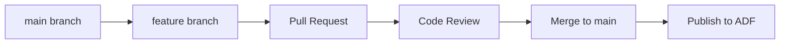

# 🚀 CI/CD for Azure Data Factory

> __🏠 [Home](../../../../README.md)__ | __📖 [Overview](../../../01-overview/README.md)__ | __🛠️ [Services](../../README.md)__ | __🔧 [Orchestration](../README.md)__ | __🏗️ [ADF](README.md)__ | __🚀 CI/CD__


Implement enterprise-grade CI/CD practices for Azure Data Factory pipelines using Git integration, ARM templates, and automated deployments.

---

## 🎯 Overview

CI/CD for Azure Data Factory enables version control, automated testing, and consistent deployment of data pipelines across environments. This guide covers setup, best practices, and common patterns for implementing production-ready DevOps workflows.

---

## 📋 Table of Contents

- [Git Integration](#-git-integration)
- [ARM Template Generation](#-arm-template-generation)
- [Environment Configuration](#-environment-configuration)
- [Azure DevOps Integration](#-azure-devops-integration)
- [GitHub Actions Integration](#-github-actions-integration)
- [Best Practices](#-best-practices)

---

## 🔗 Git Integration

### Supported Git Providers

Azure Data Factory supports:

- **Azure DevOps Git** (Azure Repos)
- **GitHub** (GitHub repositories)

### Setup Git Integration

#### 1. Configure Git Repository

```bash
# Azure DevOps
az datafactory configure-factory-repo \
  --factory-name MyDataFactory \
  --resource-group MyResourceGroup \
  --factory-vsts-configuration \
    accountName="MyOrganization" \
    projectName="MyProject" \
    repositoryName="MyRepo" \
    collaborationBranch="main" \
    rootFolder="/dataFactory"

# GitHub
az datafactory configure-factory-repo \
  --factory-name MyDataFactory \
  --resource-group MyResourceGroup \
  --factory-git-hub-configuration \
    accountName="MyGitHubOrg" \
    repositoryName="MyRepo" \
    collaborationBranch="main" \
    rootFolder="/dataFactory"
```

#### 2. Repository Structure

```text
dataFactory/
├── factory/
│   └── MyDataFactory.json           # Factory configuration
├── pipeline/
│   ├── IngestPipeline.json
│   ├── TransformPipeline.json
│   └── LoadPipeline.json
├── dataset/
│   ├── SourceDataset.json
│   └── SinkDataset.json
├── linkedService/
│   ├── AzureSqlDatabase.json
│   └── AzureBlobStorage.json
├── dataflow/
│   └── TransformFlow.json
├── trigger/
│   └── DailyTrigger.json
└── integrationRuntime/
    └── SelfHostedIR.json
```

### Branching Strategy

#### Feature Branch Workflow



#### Recommended Branch Structure

```text
main                    # Production-ready code
├── develop            # Integration branch
├── feature/*          # Feature development
├── hotfix/*           # Production fixes
└── release/*          # Release preparation
```

### Collaboration Branch Configuration

The collaboration branch (typically `main`) is the branch that:
- ADF Studio uses for live development
- Triggers ARM template generation
- Reflects the current "published" state

__Key Concepts:__

- **Working branch**: Where developers make changes
- **Collaboration branch**: Where changes are merged and published
- **Publish branch**: Auto-generated ARM templates (adf_publish)

---

## 📦 ARM Template Generation

### Automatic ARM Template Creation

When you click **Publish** in ADF Studio:

1. ADF validates all resources
2. Generates ARM templates
3. Commits to `adf_publish` branch
4. Updates live Data Factory

### ARM Template Structure

```text
adf_publish/
├── MyDataFactory/
│   ├── ARMTemplateForFactory.json              # Main template
│   ├── ARMTemplateParametersForFactory.json    # Parameters
│   └── linkedTemplates/
│       ├── ArmTemplate_0.json                  # Chunked resources
│       └── ArmTemplate_1.json
```

### Sample ARM Template

__ARMTemplateForFactory.json:__

```json
{
  "$schema": "http://schema.management.azure.com/schemas/2015-01-01/deploymentTemplate.json#",
  "contentVersion": "1.0.0.0",
  "parameters": {
    "factoryName": {
      "type": "string",
      "metadata": "Data Factory name"
    },
    "AzureSqlDatabase_connectionString": {
      "type": "secureString",
      "metadata": "Secure string for 'connectionString' of 'AzureSqlDatabase'"
    },
    "AzureBlobStorage_sasUri": {
      "type": "secureString"
    }
  },
  "variables": {
    "factoryId": "[concat('Microsoft.DataFactory/factories/', parameters('factoryName'))]"
  },
  "resources": [
    {
      "name": "[concat(parameters('factoryName'), '/IngestPipeline')]",
      "type": "Microsoft.DataFactory/factories/pipelines",
      "apiVersion": "2018-06-01",
      "properties": {
        "activities": [
          {
            "name": "CopyData",
            "type": "Copy"
          }
        ]
      }
    }
  ]
}
```

__ARMTemplateParametersForFactory.json:__

```json
{
  "$schema": "https://schema.management.azure.com/schemas/2015-01-01/deploymentParameters.json#",
  "contentVersion": "1.0.0.0",
  "parameters": {
    "factoryName": {
      "value": "MyDataFactory"
    },
    "AzureSqlDatabase_connectionString": {
      "value": ""
    },
    "AzureBlobStorage_sasUri": {
      "value": ""
    }
  }
}
```

---

## ⚙️ Environment Configuration

### Environment-Specific Parameters

Create parameter files for each environment:

__parameters-dev.json:__

```json
{
  "$schema": "https://schema.management.azure.com/schemas/2015-01-01/deploymentParameters.json#",
  "contentVersion": "1.0.0.0",
  "parameters": {
    "factoryName": {
      "value": "adf-dev-001"
    },
    "AzureSqlDatabase_connectionString": {
      "value": "Server=dev-sql.database.windows.net;Database=devdb"
    },
    "AzureBlobStorage_sasUri": {
      "value": "https://devsa.blob.core.windows.net/"
    }
  }
}
```

__parameters-prod.json:__

```json
{
  "$schema": "https://schema.management.azure.com/schemas/2015-01-01/deploymentParameters.json#",
  "contentVersion": "1.0.0.0",
  "parameters": {
    "factoryName": {
      "value": "adf-prod-001"
    },
    "AzureSqlDatabase_connectionString": {
      "value": "Server=prod-sql.database.windows.net;Database=proddb"
    },
    "AzureBlobStorage_sasUri": {
      "value": "https://prodsa.blob.core.windows.net/"
    }
  }
}
```

### Using Azure Key Vault for Secrets

__Instead of storing secrets in parameters:__

```json
{
  "parameters": {
    "AzureSqlDatabase_connectionString": {
      "reference": {
        "keyVault": {
          "id": "/subscriptions/{subscription}/resourceGroups/{rg}/providers/Microsoft.KeyVault/vaults/{vault}"
        },
        "secretName": "sql-connection-string"
      }
    }
  }
}
```

---

## 🔷 Azure DevOps Integration

### Pipeline YAML Configuration

__azure-pipelines.yml:__

```yaml
trigger:
  branches:
    include:
      - main
  paths:
    include:
      - dataFactory/*

pool:
  vmImage: 'ubuntu-latest'

variables:
  - group: ADF-Variables  # Variable group in Azure DevOps

stages:
  - stage: Build
    displayName: 'Build and Validate'
    jobs:
      - job: Validate
        displayName: 'Validate ARM Templates'
        steps:
          - task: AzurePowerShell@5
            displayName: 'Validate ARM Template'
            inputs:
              azureSubscription: 'Azure-Service-Connection'
              ScriptType: 'InlineScript'
              Inline: |
                $templateFile = "$(Build.Repository.LocalPath)/adf_publish/ARMTemplateForFactory.json"
                $parameterFile = "$(Build.Repository.LocalPath)/parameters-dev.json"

                Test-AzResourceGroupDeployment `
                  -ResourceGroupName $(resourceGroupName) `
                  -TemplateFile $templateFile `
                  -TemplateParameterFile $parameterFile
              azurePowerShellVersion: 'LatestVersion'

  - stage: DeployDev
    displayName: 'Deploy to Development'
    dependsOn: Build
    condition: succeeded()
    jobs:
      - deployment: DeployADFDev
        displayName: 'Deploy ADF to Dev'
        environment: 'Development'
        strategy:
          runOnce:
            deploy:
              steps:
                - task: AzureResourceManagerTemplateDeployment@3
                  displayName: 'Deploy ADF Resources'
                  inputs:
                    deploymentScope: 'Resource Group'
                    azureResourceManagerConnection: 'Azure-Service-Connection'
                    subscriptionId: $(subscriptionId)
                    action: 'Create Or Update Resource Group'
                    resourceGroupName: $(resourceGroupName)
                    location: 'East US'
                    templateLocation: 'Linked artifact'
                    csmFile: '$(Pipeline.Workspace)/adf_publish/ARMTemplateForFactory.json'
                    csmParametersFile: '$(Pipeline.Workspace)/parameters-dev.json'
                    overrideParameters: '-factoryName "adf-dev-001"'
                    deploymentMode: 'Incremental'

                - task: AzurePowerShell@5
                  displayName: 'Start Triggers'
                  inputs:
                    azureSubscription: 'Azure-Service-Connection'
                    ScriptType: 'InlineScript'
                    Inline: |
                      $triggers = Get-AzDataFactoryV2Trigger `
                        -ResourceGroupName $(resourceGroupName) `
                        -DataFactoryName "adf-dev-001"

                      foreach ($trigger in $triggers) {
                        Start-AzDataFactoryV2Trigger `
                          -ResourceGroupName $(resourceGroupName) `
                          -DataFactoryName "adf-dev-001" `
                          -Name $trigger.Name `
                          -Force
                      }
                    azurePowerShellVersion: 'LatestVersion'

  - stage: DeployProd
    displayName: 'Deploy to Production'
    dependsOn: DeployDev
    condition: succeeded()
    jobs:
      - deployment: DeployADFProd
        displayName: 'Deploy ADF to Production'
        environment: 'Production'
        strategy:
          runOnce:
            preDeploy:
              steps:
                - task: AzurePowerShell@5
                  displayName: 'Stop Triggers'
                  inputs:
                    azureSubscription: 'Azure-Service-Connection'
                    ScriptType: 'InlineScript'
                    Inline: |
                      $triggers = Get-AzDataFactoryV2Trigger `
                        -ResourceGroupName $(resourceGroupName) `
                        -DataFactoryName "adf-prod-001"

                      foreach ($trigger in $triggers) {
                        Stop-AzDataFactoryV2Trigger `
                          -ResourceGroupName $(resourceGroupName) `
                          -DataFactoryName "adf-prod-001" `
                          -Name $trigger.Name `
                          -Force
                      }
                    azurePowerShellVersion: 'LatestVersion'

            deploy:
              steps:
                - task: AzureResourceManagerTemplateDeployment@3
                  displayName: 'Deploy ADF Resources'
                  inputs:
                    deploymentScope: 'Resource Group'
                    azureResourceManagerConnection: 'Azure-Service-Connection'
                    subscriptionId: $(subscriptionId)
                    action: 'Create Or Update Resource Group'
                    resourceGroupName: $(resourceGroupName)
                    location: 'East US'
                    templateLocation: 'Linked artifact'
                    csmFile: '$(Pipeline.Workspace)/adf_publish/ARMTemplateForFactory.json'
                    csmParametersFile: '$(Pipeline.Workspace)/parameters-prod.json'
                    overrideParameters: '-factoryName "adf-prod-001"'
                    deploymentMode: 'Incremental'

            postDeployment:
              steps:
                - task: AzurePowerShell@5
                  displayName: 'Start Triggers'
                  inputs:
                    azureSubscription: 'Azure-Service-Connection'
                    ScriptType: 'InlineScript'
                    Inline: |
                      $triggers = Get-AzDataFactoryV2Trigger `
                        -ResourceGroupName $(resourceGroupName) `
                        -DataFactoryName "adf-prod-001"

                      foreach ($trigger in $triggers) {
                        Start-AzDataFactoryV2Trigger `
                          -ResourceGroupName $(resourceGroupName) `
                          -DataFactoryName "adf-prod-001" `
                          -Name $trigger.Name `
                          -Force
                      }
                    azurePowerShellVersion: 'LatestVersion'
```

### Variable Groups

Create a variable group in Azure DevOps:

```text
Name: ADF-Variables
Variables:
  - subscriptionId: "xxxxxxxx-xxxx-xxxx-xxxx-xxxxxxxxxxxx"
  - resourceGroupName: "rg-adf-prod"
  - dataFactoryName: "adf-prod-001"
```

---

## 🐙 GitHub Actions Integration

### Workflow Configuration

__.github/workflows/adf-deploy.yml:__

```yaml
name: Deploy Azure Data Factory

on:
  push:
    branches:
      - main
    paths:
      - 'dataFactory/**'
  workflow_dispatch:

env:
  AZURE_SUBSCRIPTION_ID: ${{ secrets.AZURE_SUBSCRIPTION_ID }}
  RESOURCE_GROUP: 'rg-adf-prod'

jobs:
  build:
    runs-on: ubuntu-latest
    steps:
      - name: Checkout code
        uses: actions/checkout@v3

      - name: Setup Node.js
        uses: actions/setup-node@v3
        with:
          node-version: '16'

      - name: Install ADF Utilities
        run: npm install -g @microsoft/azure-data-factory-utilities

      - name: Validate ADF
        run: |
          npm run build validate ${{ github.workspace }}/dataFactory /subscriptions/${{ env.AZURE_SUBSCRIPTION_ID }}/resourceGroups/${{ env.RESOURCE_GROUP }}/providers/Microsoft.DataFactory/factories/adf-prod-001

      - name: Upload artifacts
        uses: actions/upload-artifact@v3
        with:
          name: adf-artifacts
          path: adf_publish/

  deploy-dev:
    needs: build
    runs-on: ubuntu-latest
    environment: Development
    steps:
      - name: Download artifacts
        uses: actions/download-artifact@v3
        with:
          name: adf-artifacts

      - name: Azure Login
        uses: azure/login@v1
        with:
          creds: ${{ secrets.AZURE_CREDENTIALS }}

      - name: Deploy to Dev
        uses: azure/arm-deploy@v1
        with:
          subscriptionId: ${{ env.AZURE_SUBSCRIPTION_ID }}
          resourceGroupName: ${{ env.RESOURCE_GROUP }}
          template: ./ARMTemplateForFactory.json
          parameters: ./parameters-dev.json
          deploymentMode: Incremental

  deploy-prod:
    needs: deploy-dev
    runs-on: ubuntu-latest
    environment: Production
    steps:
      - name: Download artifacts
        uses: actions/download-artifact@v3
        with:
          name: adf-artifacts

      - name: Azure Login
        uses: azure/login@v1
        with:
          creds: ${{ secrets.AZURE_CREDENTIALS }}

      - name: Stop ADF Triggers
        uses: azure/CLI@v1
        with:
          inlineScript: |
            az datafactory trigger list \
              --resource-group ${{ env.RESOURCE_GROUP }} \
              --factory-name adf-prod-001 \
              --query "[].name" -o tsv | \
            xargs -I {} az datafactory trigger stop \
              --resource-group ${{ env.RESOURCE_GROUP }} \
              --factory-name adf-prod-001 \
              --name {}

      - name: Deploy to Production
        uses: azure/arm-deploy@v1
        with:
          subscriptionId: ${{ env.AZURE_SUBSCRIPTION_ID }}
          resourceGroupName: ${{ env.RESOURCE_GROUP }}
          template: ./ARMTemplateForFactory.json
          parameters: ./parameters-prod.json
          deploymentMode: Incremental

      - name: Start ADF Triggers
        uses: azure/CLI@v1
        with:
          inlineScript: |
            az datafactory trigger list \
              --resource-group ${{ env.RESOURCE_GROUP }} \
              --factory-name adf-prod-001 \
              --query "[].name" -o tsv | \
            xargs -I {} az datafactory trigger start \
              --resource-group ${{ env.RESOURCE_GROUP }} \
              --factory-name adf-prod-001 \
              --name {}
```

### GitHub Secrets Configuration

Required secrets:

```text
AZURE_SUBSCRIPTION_ID: Your Azure subscription ID
AZURE_CREDENTIALS: Service principal JSON
  {
    "clientId": "<GUID>",
    "clientSecret": "<STRING>",
    "subscriptionId": "<GUID>",
    "tenantId": "<GUID>"
  }
```

---

## ✅ Best Practices

### 1. Source Control Best Practices

- ✅ **Use feature branches** for development
- ✅ **Require pull requests** for main branch
- ✅ **Enable branch policies** (code reviews, build validation)
- ✅ **Keep collaboration branch clean** (only merge tested code)
- ❌ **Don't commit secrets** to Git repositories

### 2. Parameterization Best Practices

- ✅ **Parameterize environment-specific values** (connection strings, endpoints)
- ✅ **Use Azure Key Vault** for sensitive data
- ✅ **Create separate parameter files** for each environment
- ✅ **Document all parameters** in README files
- ❌ **Don't hardcode values** in pipelines

### 3. Deployment Best Practices

- ✅ **Stop triggers before deployment** to prevent race conditions
- ✅ **Use incremental deployment mode** to preserve existing resources
- ✅ **Validate templates** before deployment
- ✅ **Deploy to non-prod first** (dev → staging → production)
- ✅ **Implement rollback procedures** for failed deployments

### 4. Testing Best Practices

```powershell
# Pre-deployment validation script
# Test-ADFDeployment.ps1

param(
    [string]$ResourceGroupName,
    [string]$TemplateFile,
    [string]$ParameterFile
)

Write-Host "Validating ARM template..."
$validation = Test-AzResourceGroupDeployment `
    -ResourceGroupName $ResourceGroupName `
    -TemplateFile $TemplateFile `
    -TemplateParameterFile $ParameterFile

if ($validation) {
    Write-Error "Validation failed:"
    $validation | ForEach-Object { Write-Error $_.Message }
    exit 1
} else {
    Write-Host "✓ Validation succeeded"
}

# Test connectivity to linked services
Write-Host "Testing linked service connections..."
# Add connectivity tests here

Write-Host "✓ All tests passed"
```

### 5. Monitoring Best Practices

- ✅ **Enable diagnostic logs** for all environments
- ✅ **Set up alerts** for deployment failures
- ✅ **Track deployment metrics** (success rate, duration)
- ✅ **Implement deployment notifications** (email, Teams, Slack)

### 6. Documentation Best Practices

Create a **DEPLOYMENT.md** file:

```markdown
# ADF Deployment Guide

## Prerequisites
- Azure subscription with Contributor access
- Service Principal with appropriate permissions
- Azure DevOps or GitHub repository access

## Environments
- **Development**: adf-dev-001
- **Staging**: adf-staging-001
- **Production**: adf-prod-001

## Deployment Process
1. Create feature branch
2. Make changes in ADF Studio
3. Create pull request
4. Review and merge to main
5. Publish in ADF Studio (dev)
6. Automated deployment to staging/production

## Rollback Procedure
1. Identify last working commit
2. Revert changes in Git
3. Redeploy using CI/CD pipeline
```

---

## 🔧 Troubleshooting

### Common Issues

#### Issue: ARM Template Validation Fails

```bash
# Check template syntax
az deployment group validate \
  --resource-group MyResourceGroup \
  --template-file ARMTemplateForFactory.json \
  --parameters @parameters-dev.json
```

#### Issue: Triggers Don't Stop

```powershell
# Force stop all triggers
$triggers = Get-AzDataFactoryV2Trigger `
  -ResourceGroupName "rg-adf-prod" `
  -DataFactoryName "adf-prod-001"

foreach ($trigger in $triggers) {
  if ($trigger.RuntimeState -eq "Started") {
    Stop-AzDataFactoryV2Trigger `
      -ResourceGroupName "rg-adf-prod" `
      -DataFactoryName "adf-prod-001" `
      -Name $trigger.Name `
      -Force
    Write-Host "Stopped trigger: $($trigger.Name)"
  }
}
```

#### Issue: Deployment Succeeds but Pipelines Don't Update

- Verify you're deploying from the correct `adf_publish` branch
- Check that parameter values match target environment
- Ensure deployment mode is set to `Incremental`

---

## 📊 Deployment Checklist

- [ ] Git integration configured
- [ ] Branching strategy defined
- [ ] Parameter files created for all environments
- [ ] Secrets stored in Azure Key Vault
- [ ] CI/CD pipeline configured
- [ ] Build validation enabled
- [ ] Deployment approvals configured
- [ ] Trigger start/stop scripts tested
- [ ] Rollback procedure documented
- [ ] Monitoring and alerts configured

---

## 🔗 Related Resources

- [Azure Data Factory Documentation](https://docs.microsoft.com/azure/data-factory/)
- [ARM Template Reference](https://docs.microsoft.com/azure/templates/microsoft.datafactory/factories)
- [Azure DevOps Documentation](https://docs.microsoft.com/azure/devops/)
- [GitHub Actions Documentation](https://docs.github.com/actions)

---

*Last Updated: 2025-01-28*
*CI/CD Platforms: Azure DevOps, GitHub Actions*
*Deployment Methods: ARM Templates, Azure CLI*
