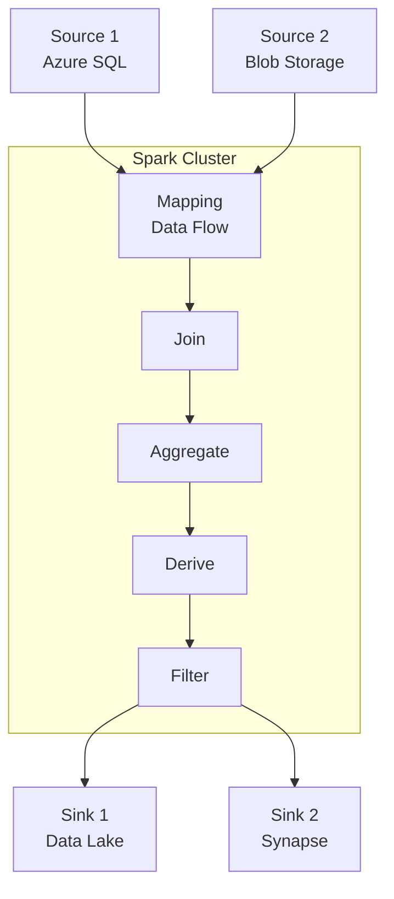

# 🌊 Mapping Data Flows

> __🏠 [Home](../../../../../README.md)__ | __📖 [Overview](../../../../01-overview/README.md)__ | __🛠️ [Services](../../../README.md)__ | __🔧 [Orchestration](../../README.md)__ | __🏗️ [ADF](../README.md)__ | __🌊 Data Flows__


Visual data transformation at scale powered by Apache Spark, enabling code-free ETL with 70+ transformations.

---

## 🎯 Overview

Mapping Data Flows in Azure Data Factory provide a visual, code-free environment for designing and executing complex data transformations at scale. Built on Apache Spark, data flows automatically handle cluster provisioning, optimization, and execution.

### 🔥 Key Benefits

- __Code-Free Design__: Visual drag-and-drop transformation logic
- __Spark-Powered__: Auto-scaled Apache Spark clusters
- __70+ Transformations__: Comprehensive transformation library
- __Debug Mode__: Interactive data preview and testing
- __Auto-Optimization__: Spark code optimization handled automatically

---

## 🏗️ Architecture



---

## 🛠️ Core Components

### 📥 Source Transformations

Define input data sources for the data flow.

```json
{
  "name": "SourceSQLDatabase",
  "type": "source",
  "dataset": {
    "referenceName": "AzureSqlTable",
    "type": "DatasetReference"
  },
  "options": {
    "isolationLevel": "READ_UNCOMMITTED",
    "query": "SELECT OrderID, CustomerID, OrderDate, TotalAmount FROM Orders WHERE OrderDate >= '2024-01-01'"
  }
}
```

__Supported Sources:__

- Azure SQL Database
- Azure Data Lake Storage Gen2
- Azure Blob Storage
- Azure Cosmos DB
- Azure Synapse Analytics
- Parquet, CSV, JSON, Avro, ORC files

### 🔄 Transformation Types

#### 1. Select Transformation

Select, rename, and reorder columns.

```json
{
  "name": "SelectColumns",
  "type": "select",
  "columns": [
    {
      "name": "OrderID",
      "mapColumn": "order_id"
    },
    {
      "name": "CustomerID",
      "mapColumn": "customer_id"
    },
    {
      "name": "OrderDate",
      "mapColumn": "order_date"
    },
    {
      "name": "TotalAmount",
      "mapColumn": "total_amount"
    }
  ]
}
```

#### 2. Filter Transformation

Filter rows based on conditions.

```json
{
  "name": "FilterHighValue",
  "type": "filter",
  "expression": "TotalAmount > 1000 && OrderDate >= toDate('2024-01-01')"
}
```

#### 3. Derived Column

Create new columns or modify existing ones using expressions.

```json
{
  "name": "DeriveColumns",
  "type": "derivedColumn",
  "columns": [
    {
      "name": "OrderYear",
      "expression": "year(OrderDate)"
    },
    {
      "name": "OrderMonth",
      "expression": "month(OrderDate)"
    },
    {
      "name": "TaxAmount",
      "expression": "TotalAmount * 0.08"
    },
    {
      "name": "GrandTotal",
      "expression": "TotalAmount + TaxAmount"
    }
  ]
}
```

#### 4. Aggregate Transformation

Group data and perform aggregations.

```json
{
  "name": "AggregateSales",
  "type": "aggregate",
  "groupBy": [
    {
      "name": "CustomerID"
    },
    {
      "name": "OrderYear"
    }
  ],
  "aggregates": [
    {
      "name": "TotalOrders",
      "expression": "count()"
    },
    {
      "name": "TotalRevenue",
      "expression": "sum(TotalAmount)"
    },
    {
      "name": "AvgOrderValue",
      "expression": "avg(TotalAmount)"
    },
    {
      "name": "MaxOrderValue",
      "expression": "max(TotalAmount)"
    }
  ]
}
```

#### 5. Join Transformation

Combine data from multiple streams.

```json
{
  "name": "JoinCustomers",
  "type": "join",
  "leftStream": "Orders",
  "rightStream": "Customers",
  "joinType": "inner",
  "joinCondition": "Orders@CustomerID == Customers@CustomerID"
}
```

__Join Types:__

- Inner Join
- Left Outer Join
- Right Outer Join
- Full Outer Join
- Cross Join

#### 6. Lookup Transformation

Enrich data with reference data (similar to left outer join but optimized for small reference tables).

```json
{
  "name": "LookupProduct",
  "type": "lookup",
  "primaryStream": "OrderDetails",
  "lookupStream": "Products",
  "condition": "OrderDetails@ProductID == Products@ProductID",
  "multiple": false
}
```

#### 7. Conditional Split

Route rows to different streams based on conditions.

```json
{
  "name": "SplitByRegion",
  "type": "conditionalSplit",
  "conditions": [
    {
      "name": "NorthAmerica",
      "expression": "Region == 'NA'"
    },
    {
      "name": "Europe",
      "expression": "Region == 'EU'"
    },
    {
      "name": "Asia",
      "expression": "Region == 'APAC'"
    }
  ],
  "defaultStream": "OtherRegions"
}
```

#### 8. Union Transformation

Combine multiple streams with similar schemas.

```json
{
  "name": "UnionSalesData",
  "type": "union",
  "streams": [
    "Sales2023",
    "Sales2024",
    "Sales2025"
  ]
}
```

#### 9. Window Transformation

Perform calculations across a set of rows (ranking, running totals, etc.).

```json
{
  "name": "RankCustomers",
  "type": "window",
  "over": {
    "partitionBy": [
      {
        "name": "Region"
      }
    ],
    "orderBy": [
      {
        "name": "TotalRevenue",
        "order": "descending"
      }
    ]
  },
  "windowColumns": [
    {
      "name": "CustomerRank",
      "expression": "rank()"
    },
    {
      "name": "RunningTotal",
      "expression": "sum(TotalRevenue)"
    }
  ]
}
```

#### 10. Pivot/Unpivot Transformations

__Pivot__: Transform rows to columns.

```json
{
  "name": "PivotSales",
  "type": "pivot",
  "groupBy": [
    {
      "name": "ProductID"
    }
  ],
  "pivotKey": "OrderMonth",
  "aggregation": [
    {
      "name": "MonthlySales",
      "expression": "sum(TotalAmount)"
    }
  ]
}
```

__Unpivot__: Transform columns to rows.

```json
{
  "name": "UnpivotMonths",
  "type": "unpivot",
  "unpivotColumns": [
    "Jan", "Feb", "Mar", "Apr", "May", "Jun",
    "Jul", "Aug", "Sep", "Oct", "Nov", "Dec"
  ],
  "unpivotKeyColumn": "Month",
  "unpivotValueColumn": "SalesAmount"
}
```

### 📤 Sink Transformations

Define output destinations for transformed data.

```json
{
  "name": "SinkToDataLake",
  "type": "sink",
  "dataset": {
    "referenceName": "DataLakeParquet",
    "type": "DatasetReference"
  },
  "options": {
    "format": "parquet",
    "compressionType": "snappy",
    "partitionBy": [
      "OrderYear",
      "OrderMonth"
    ],
    "truncate": false,
    "skipDuplicateMapInputs": true,
    "skipDuplicateMapOutputs": true
  }
}
```

---

## 🎨 Data Flow Expression Language

### Common Functions

#### String Functions

```javascript
// Concatenation
concat(FirstName, ' ', LastName)

// Substring
substring(ProductName, 1, 10)

// Replace
replace(PhoneNumber, '-', '')

// Trim
trim(CustomerName)

// Upper/Lower case
upper(Email)
lower(ProductCode)
```

#### Date Functions

```javascript
// Current date/time
currentDate()
currentTimestamp()

// Date parts
year(OrderDate)
month(OrderDate)
dayOfMonth(OrderDate)

// Date arithmetic
addDays(OrderDate, 30)
addMonths(OrderDate, 1)

// Date formatting
toString(OrderDate, 'yyyy-MM-dd')
```

#### Numeric Functions

```javascript
// Rounding
round(Price, 2)
floor(Quantity)
ceiling(Amount)

// Absolute value
abs(Variance)

// Min/Max
greatest(Value1, Value2, Value3)
least(Value1, Value2, Value3)
```

#### Conditional Functions

```javascript
// IF condition
iif(TotalAmount > 1000, 'High Value', 'Standard')

// CASE statement
case(
  Region == 'NA', 'North America',
  Region == 'EU', 'Europe',
  Region == 'APAC', 'Asia Pacific',
  'Other'
)

// Null handling
coalesce(MiddleName, '')
isNull(OptionalField)
```

#### Aggregate Functions

```javascript
// In aggregate transformation
count()
sum(Amount)
avg(Price)
min(OrderDate)
max(Quantity)
first(CustomerName)
last(OrderID)
```

---

## 🚀 Quick Start Example

### End-to-End Data Flow

__Scenario__: Transform sales data by joining with customer information, calculating metrics, and loading to data lake.

```json
{
  "name": "SalesTransformationFlow",
  "type": "MappingDataFlow",
  "typeProperties": {
    "sources": [
      {
        "name": "OrdersSource",
        "dataset": {
          "referenceName": "OrdersTable",
          "type": "DatasetReference"
        }
      },
      {
        "name": "CustomersSource",
        "dataset": {
          "referenceName": "CustomersTable",
          "type": "DatasetReference"
        }
      }
    ],
    "transformations": [
      {
        "name": "FilterRecentOrders",
        "type": "filter",
        "input": "OrdersSource",
        "expression": "OrderDate >= toDate('2024-01-01')"
      },
      {
        "name": "JoinCustomers",
        "type": "join",
        "leftInput": "FilterRecentOrders",
        "rightInput": "CustomersSource",
        "joinType": "inner",
        "condition": "OrdersSource@CustomerID == CustomersSource@CustomerID"
      },
      {
        "name": "DeriveMetrics",
        "type": "derivedColumn",
        "input": "JoinCustomers",
        "columns": [
          {
            "name": "OrderYear",
            "expression": "year(OrderDate)"
          },
          {
            "name": "OrderMonth",
            "expression": "month(OrderDate)"
          },
          {
            "name": "CustomerTier",
            "expression": "case(TotalAmount > 10000, 'Platinum', TotalAmount > 5000, 'Gold', TotalAmount > 1000, 'Silver', 'Bronze')"
          }
        ]
      },
      {
        "name": "AggregateByCustomer",
        "type": "aggregate",
        "input": "DeriveMetrics",
        "groupBy": [
          "CustomerID",
          "CustomerName",
          "OrderYear",
          "OrderMonth"
        ],
        "aggregates": [
          {
            "name": "TotalOrders",
            "expression": "count()"
          },
          {
            "name": "TotalRevenue",
            "expression": "sum(TotalAmount)"
          },
          {
            "name": "AvgOrderValue",
            "expression": "avg(TotalAmount)"
          }
        ]
      }
    ],
    "sinks": [
      {
        "name": "WriteToDataLake",
        "input": "AggregateByCustomer",
        "dataset": {
          "referenceName": "DataLakeParquet",
          "type": "DatasetReference"
        },
        "options": {
          "format": "parquet",
          "partitionBy": [
            "OrderYear",
            "OrderMonth"
          ]
        }
      }
    ]
  }
}
```

---

## ⚙️ Configuration & Optimization

### Integration Runtime Configuration

```json
{
  "name": "DataFlowIR",
  "properties": {
    "type": "Managed",
    "typeProperties": {
      "computeType": "General",
      "coreCount": 8,
      "timeToLive": 10
    },
    "dataFlowProperties": {
      "cleanup": true,
      "customProperties": [
        {
          "name": "spark.executor.memory",
          "value": "4g"
        }
      ]
    }
  }
}
```

### Compute Types

| Compute Type | vCores | Memory | Best For |
|--------------|--------|---------|----------|
| __General Purpose__ | 8-272 | 32-1088 GB | Balanced workloads |
| __Memory Optimized__ | 8-272 | 64-2176 GB | Large datasets, complex joins |
| __Compute Optimized__ | 8-272 | 16-544 GB | CPU-intensive transformations |

### Performance Optimization Tips

#### 1. Partitioning Strategy

```json
{
  "name": "OptimizedSource",
  "type": "source",
  "options": {
    "partitionOption": "PhysicalPartitionsOfTable",
    "partitionColumnName": "OrderDate"
  }
}
```

#### 2. Broadcast Joins for Small Tables

```json
{
  "name": "BroadcastJoin",
  "type": "join",
  "broadcast": "right",
  "hint": "BROADCAST"
}
```

#### 3. Enable Staging for Large Datasets

```json
{
  "name": "StagedSink",
  "type": "sink",
  "options": {
    "staging": {
      "linkedServiceName": {
        "referenceName": "AzureBlobStorage",
        "type": "LinkedServiceReference"
      },
      "path": "staging/dataflow"
    }
  }
}
```

#### 4. Cache Transformations

Cache frequently accessed transformations to improve performance.

```json
{
  "name": "CachedLookup",
  "type": "cache",
  "input": "ProductMaster"
}
```

---

## 🐛 Debug Mode

### Enabling Debug Mode

```bash
# Via Azure CLI
az datafactory data-flow debug-session create \
  --resource-group MyResourceGroup \
  --factory-name MyDataFactory \
  --integration-runtime MyDataFlowIR
```

### Debug Features

- **Data Preview**: View sample data at each transformation
- **Column Statistics**: Analyze data distribution and quality
- **Expression Builder**: Test expressions interactively
- **Performance Metrics**: Monitor execution time per transformation

### Debug Configuration

```json
{
  "debugSettings": {
    "datasetParameters": {
      "SourceDataset": {
        "tableName": "OrdersDebug"
      }
    },
    "parameters": {
      "StartDate": "2024-01-01",
      "EndDate": "2024-12-31"
    },
    "rowLimit": 1000
  }
}
```

---

## 💰 Cost Optimization

### Pricing Model

```text
Cost = vCore-hours × Price per vCore-hour

General Purpose: $0.274/vCore-hour
Memory Optimized: $0.548/vCore-hour
```

### Optimization Strategies

1. **Right-size Clusters**: Start with minimum required vCores
2. **Use TTL**: Set Time-to-Live to minimize idle cluster time
3. **Debug Efficiently**: Use row limits in debug mode
4. **Partition Wisely**: Avoid over-partitioning small datasets
5. **Monitor Usage**: Track vCore-hour consumption

__Example Cost Calculation:__

```text
Data Flow Configuration:
- Compute Type: General Purpose
- vCores: 16
- Execution Time: 30 minutes
- TTL: 10 minutes (cluster stays warm)

Cost = 16 vCores × 0.67 hours × $0.274 = $2.94 per run

Daily Runs: 10
Monthly Cost: $2.94 × 10 × 30 = $882
```

---

## 🔗 Integration Patterns

### Execute Data Flow from Pipeline

```json
{
  "name": "RunDataFlow",
  "type": "ExecuteDataFlow",
  "typeProperties": {
    "dataFlow": {
      "referenceName": "SalesTransformationFlow",
      "type": "DataFlowReference"
    },
    "integrationRuntime": {
      "referenceName": "DataFlowIR",
      "type": "IntegrationRuntimeReference"
    },
    "compute": {
      "coreCount": 8,
      "computeType": "General"
    },
    "traceLevel": "Fine"
  }
}
```

---

## 🆘 Troubleshooting

### Common Issues

#### Out of Memory Errors

```text
Solution:
1. Increase cluster size (more vCores)
2. Switch to Memory Optimized compute
3. Optimize transformations (reduce data volume early)
4. Use partitioning strategically
```

#### Slow Performance

```text
Solution:
1. Check partition distribution
2. Use broadcast joins for small tables
3. Enable caching for repeated lookups
4. Review transformation order
5. Monitor Spark UI metrics
```

#### Data Preview Not Working

```text
Solution:
1. Verify debug session is active
2. Check data source connectivity
3. Reduce row limit in debug settings
4. Review error messages in debug output
```

---

## 📚 Related Resources

- [ADF Main Documentation](../README.md)
- [Pipeline Patterns](../pipeline-patterns.md)
- [Integration Runtime](../integration-runtime/README.md)
- [Expression Language Reference](https://docs.microsoft.com/azure/data-factory/control-flow-expression-language-functions)

---

*Last Updated: 2025-01-28*
*Transformation Count: 70+*
*Supported Formats: Parquet, CSV, JSON, Avro, ORC*
