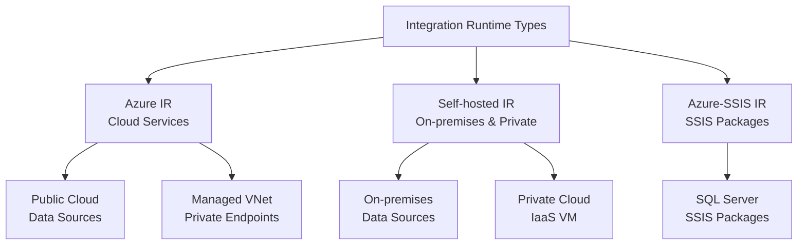
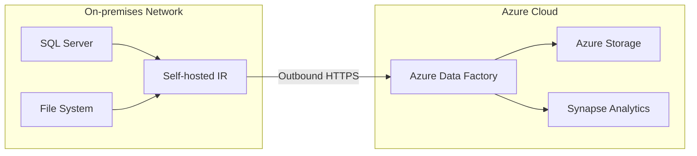
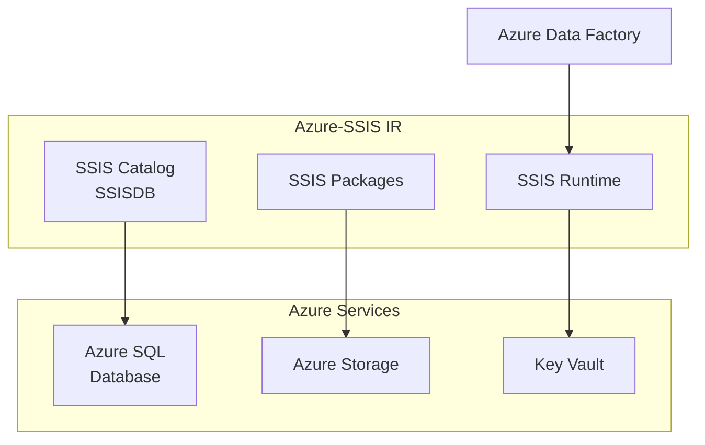
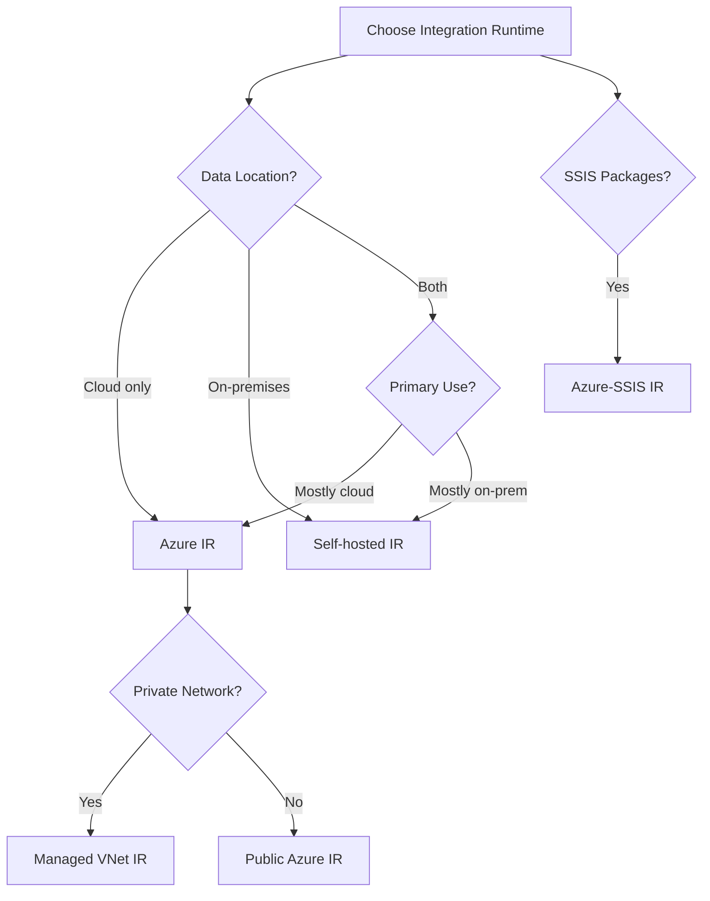

# 🔗 Integration Runtime

> __🏠 [Home](../../../../../README.md)__ | __📖 [Overview](../../../../01-overview/README.md)__ | __🛠️ [Services](../../../README.md)__ | __🔧 [Orchestration](../../README.md)__ | __🏗️ [ADF](../README.md)__ | __🔗 Integration Runtime__


Compute infrastructure that Azure Data Factory uses to provide data integration capabilities across different network environments.

---

## 🎯 Overview

Integration Runtime (IR) is the bridge between activities and linked services in Azure Data Factory. It provides the compute environment for executing data movement, transformation, and dispatch of activities.

### 🔥 Key Capabilities

- **Hybrid Connectivity**: Connect cloud and on-premises data sources
- **Network Isolation**: Private network and VNet integration
- **SSIS Package Execution**: Lift-and-shift SSIS workloads
- **High Availability**: Auto-failover and load balancing
- **Resource Sharing**: Share IR across multiple data factories

---

## 📊 Integration Runtime Types



---

## ☁️ Azure Integration Runtime

### Overview

Fully managed, serverless compute for cloud data integration.

### Capabilities

- ✅ **Data Movement**: Copy between cloud data stores
- ✅ **Activity Dispatch**: Execute activities in cloud
- ✅ **Data Flows**: Execute mapping data flows
- ✅ **External Activities**: Call Azure Databricks, HDInsight, etc.

### Configuration

#### Auto-Resolve Azure IR

Default IR created automatically with each Data Factory.

```json
{
  "name": "AutoResolveIntegrationRuntime",
  "properties": {
    "type": "Managed",
    "typeProperties": {
      "computeType": "General",
      "dataFlowProperties": {
        "computeType": "General",
        "coreCount": 8,
        "timeToLive": 10
      }
    }
  }
}
```

#### Custom Azure IR

Create region-specific or custom configurations.

```json
{
  "name": "AzureIR-EastUS",
  "properties": {
    "type": "Managed",
    "typeProperties": {
      "location": "East US",
      "computeType": "General",
      "timeToLive": 5,
      "dataFlowProperties": {
        "computeType": "MemoryOptimized",
        "coreCount": 16
      }
    }
  }
}
```

### Managed Virtual Network

Isolate data flows in a managed VNet with private endpoints.

```json
{
  "name": "AzureIR-ManagedVNet",
  "properties": {
    "type": "Managed",
    "typeProperties": {
      "managedVirtualNetwork": {
        "referenceName": "default",
        "type": "ManagedVirtualNetworkReference"
      }
    },
    "managedPrivateEndpoints": [
      {
        "name": "PrivateEndpoint-SQL",
        "privateLinkResourceId": "/subscriptions/{sub}/resourceGroups/{rg}/providers/Microsoft.Sql/servers/{server}",
        "groupId": "sqlServer"
      }
    ]
  }
}
```

### Azure IR Use Cases

| Use Case | Configuration | Best For |
|----------|--------------|----------|
| **Cloud-to-Cloud Copy** | Auto-Resolve IR | Azure SQL → Blob Storage |
| **Data Flows** | Custom IR with specific cores | Complex transformations |
| **Private Cloud** | Managed VNet IR | Private endpoint connectivity |
| **Multi-Region** | Region-specific IR | Data residency requirements |

---

## 🏢 Self-hosted Integration Runtime

### Overview

Customer-managed IR installed on-premises or in a private network for hybrid scenarios.

### Architecture



### Installation

#### 1. Download and Install

```powershell
# Download installer
Invoke-WebRequest -Uri "https://aka.ms/AzureDFMSI" -OutFile "IntegrationRuntime.msi"

# Install silently
msiexec /i IntegrationRuntime.msi /quiet /norestart

# Register with authentication key
cd "C:\Program Files\Microsoft Integration Runtime\5.0\Shared"
.\dmgcmd.exe -Key "IR@12345-AuthenticationKey-67890"
```

#### 2. Create in Azure Portal

```bash
# Create self-hosted IR
az datafactory integration-runtime self-hosted create \
  --factory-name MyDataFactory \
  --resource-group MyResourceGroup \
  --name OnPremisesIR \
  --description "Self-hosted IR for on-premises SQL Server"

# Get authentication key
az datafactory integration-runtime list-auth-key \
  --factory-name MyDataFactory \
  --resource-group MyResourceGroup \
  --integration-runtime-name OnPremisesIR
```

### Configuration

#### High Availability Setup

Install IR on multiple nodes for failover.

```powershell
# Primary node
.\dmgcmd.exe -Key "IR@12345-AuthenticationKey-67890"

# Secondary node (use same key)
.\dmgcmd.exe -Key "IR@12345-AuthenticationKey-67890"

# Verify nodes
az datafactory integration-runtime get-status \
  --factory-name MyDataFactory \
  --resource-group MyResourceGroup \
  --name OnPremisesIR
```

#### Resource Optimization

```json
{
  "name": "OnPremisesIR",
  "properties": {
    "type": "SelfHosted",
    "typeProperties": {
      "linkedInfo": {
        "resourceId": "/subscriptions/{sub}/resourceGroups/{rg}/providers/Microsoft.DataFactory/factories/{factory}/integrationRuntimes/OnPremisesIR"
      }
    }
  },
  "computeProperties": {
    "numberOfConcurrentJobs": 4,
    "maxParallelExecutionsPerNode": 8,
    "nodeSize": "Standard"
  }
}
```

### Network Requirements

#### Outbound Connections Required

| Service | Port | Protocol | Description |
|---------|------|----------|-------------|
| **Azure Data Factory** | 443 | HTTPS | Service communication |
| **Azure Service Bus** | 443 | HTTPS | Metadata operations |
| **Azure Storage** | 443 | HTTPS | Data movement |
| **Download Center** | 443 | HTTPS | Updates |

#### Firewall Configuration

```powershell
# Open required outbound ports
New-NetFirewallRule -DisplayName "ADF HTTPS" `
  -Direction Outbound `
  -Protocol TCP `
  -LocalPort 443 `
  -Action Allow

# For private link scenarios
New-NetFirewallRule -DisplayName "ADF Private Link" `
  -Direction Outbound `
  -Protocol TCP `
  -LocalPort 443 `
  -RemoteAddress "10.0.0.0/8" `
  -Action Allow
```

### Self-hosted IR Use Cases

| Use Case | Configuration | Best For |
|----------|--------------|----------|
| **On-premises SQL** | Single node | Small data volumes |
| **High Availability** | Multi-node | Production workloads |
| **Private Cloud** | VNet integration | IaaS VMs |
| **Shared IR** | Linked IR | Multi-factory scenarios |

---

## 🗄️ Azure-SSIS Integration Runtime

### Overview

Managed service for lifting and shifting SQL Server Integration Services (SSIS) packages to Azure.

### Architecture



### Provisioning

```json
{
  "name": "SSIS-IR",
  "properties": {
    "type": "Managed",
    "typeProperties": {
      "location": "East US",
      "nodeSize": "Standard_D2_v3",
      "numberOfNodes": 2,
      "maxParallelExecutionsPerNode": 2,
      "catalogInfo": {
        "catalogServerEndpoint": "myserver.database.windows.net",
        "catalogAdminUserName": "ssisadmin",
        "catalogAdminPassword": {
          "type": "SecureString",
          "value": "********"
        },
        "catalogPricingTier": "S1"
      },
      "edition": "Standard",
      "licenseType": "LicenseIncluded"
    }
  }
}
```

### Node Sizes

| Node Size | vCPUs | Memory | Max Parallel | Best For |
|-----------|-------|--------|--------------|----------|
| **Standard_D2_v3** | 2 | 8 GB | 2 | Development |
| **Standard_D4_v3** | 4 | 16 GB | 4 | Small production |
| **Standard_D8_v3** | 8 | 32 GB | 8 | Medium workloads |
| **Standard_D16_v3** | 16 | 64 GB | 16 | Large workloads |
| **Standard_E4_v3** | 4 | 32 GB | 4 | Memory-intensive |

### Execute SSIS Package

```json
{
  "name": "ExecuteSSISPackage",
  "type": "ExecuteSSISPackage",
  "typeProperties": {
    "packageLocation": {
      "packagePath": "SSISDB/MyFolder/MyProject/MyPackage.dtsx",
      "type": "SSISDB"
    },
    "runtime": "x64",
    "loggingLevel": "Basic",
    "environmentPath": "SSISDB/MyFolder/MyEnvironment",
    "propertyOverrides": {
      "\\Package.Variables[User::SourcePath].Value": "/data/source",
      "\\Package.Variables[User::DestPath].Value": "/data/dest"
    }
  },
  "linkedServiceName": {
    "referenceName": "SSIS-IR",
    "type": "IntegrationRuntimeReference"
  }
}
```

### Cost Optimization

```text
Azure-SSIS IR Pricing:
- Node Hours: Based on node size and count
- License: License Included or Base Price (BYOL)

Example:
- Node Size: Standard_D4_v3
- Nodes: 2
- Hours: 8 hours/day, 22 days/month
- Cost: 2 nodes × 8 hours × 22 days × $0.355/hour = $125.28/month

Optimization:
1. Use auto-shutdown when not in use
2. Right-size nodes based on workload
3. Use BYOL if you have licenses
4. Schedule start/stop with triggers
```

---

## 🔧 IR Management & Operations

### Monitoring

#### Azure Portal

1. Navigate to Data Factory → Manage → Integration Runtimes
2. View status, metrics, and logs
3. Check node health and version

#### Azure CLI

```bash
# Get IR status
az datafactory integration-runtime get-status \
  --factory-name MyDataFactory \
  --resource-group MyResourceGroup \
  --name OnPremisesIR

# List all IRs
az datafactory integration-runtime list \
  --factory-name MyDataFactory \
  --resource-group MyResourceGroup

# Monitor metrics
az monitor metrics list \
  --resource "/subscriptions/{sub}/resourceGroups/{rg}/providers/Microsoft.DataFactory/factories/{factory}/integrationRuntimes/{ir}" \
  --metric "IntegrationRuntimeAvailableMemory"
```

### Maintenance

#### Update Self-hosted IR

```powershell
# Enable auto-update
.\dmgcmd.exe -EnableAutoUpdate

# Manually trigger update
.\dmgcmd.exe -Update

# Check version
.\dmgcmd.exe -Version
```

#### Scale Azure-SSIS IR

```bash
# Scale out (add nodes)
az datafactory integration-runtime update \
  --factory-name MyDataFactory \
  --resource-group MyResourceGroup \
  --name SSIS-IR \
  --set typeProperties.numberOfNodes=4

# Scale up (change node size)
az datafactory integration-runtime update \
  --factory-name MyDataFactory \
  --resource-group MyResourceGroup \
  --name SSIS-IR \
  --set typeProperties.nodeSize="Standard_D8_v3"
```

### Security

#### Credential Encryption

Self-hosted IR encrypts credentials locally.

```powershell
# Export encryption certificate
.\dmgcmd.exe -ExportCert "C:\Certs\IR-Cert.cer"

# Import on new node
.\dmgcmd.exe -ImportCert "C:\Certs\IR-Cert.cer" "CertPassword"
```

#### Private Endpoints

```json
{
  "name": "PrivateEndpoint-AzureSQL",
  "properties": {
    "privateLinkResourceId": "/subscriptions/{sub}/resourceGroups/{rg}/providers/Microsoft.Sql/servers/{server}",
    "groupId": "sqlServer",
    "fqdns": [
      "myserver.database.windows.net"
    ]
  }
}
```

---

## 📊 IR Selection Guide

### Decision Tree



### Comparison Matrix

| Feature | Azure IR | Self-hosted IR | Azure-SSIS IR |
|---------|----------|----------------|---------------|
| **Cloud Data Sources** | ✅ Yes | ✅ Yes | ✅ Yes |
| **On-premises Sources** | ❌ No | ✅ Yes | ✅ Yes |
| **Data Flows** | ✅ Yes | ❌ No | ❌ No |
| **SSIS Packages** | ❌ No | ❌ No | ✅ Yes |
| **Managed VNet** | ✅ Yes | ❌ No | ✅ Yes |
| **High Availability** | ✅ Built-in | ✅ Multi-node | ✅ Multi-node |
| **Cost Model** | Pay-per-use | VM cost | Node-hours |
| **Management** | Serverless | Self-managed | Managed |

---

## 🆘 Troubleshooting

### Common Issues

#### Self-hosted IR Cannot Connect

```powershell
# Check connectivity
Test-NetConnection -ComputerName adf.azure.com -Port 443

# Verify service is running
Get-Service -Name DIAHostService

# Check logs
Get-EventLog -LogName Application -Source "DIAHostService" -Newest 10
```

#### High Latency in Data Copy

```text
Solution:
1. Increase DIUs for Azure IR
2. Add more nodes to self-hosted IR
3. Check network bandwidth
4. Enable parallel copy
5. Use staging for large datasets
```

#### Azure-SSIS IR Fails to Start

```text
Common Causes:
1. SSISDB connection issues
2. VNet configuration errors
3. Insufficient quota
4. License validation failures

Solutions:
1. Verify SQL Server connectivity
2. Check NSG and firewall rules
3. Request quota increase
4. Validate license type setting
```

---

## 🔗 Related Resources

- [ADF Main Documentation](../README.md)
- [Pipeline Patterns](../pipeline-patterns.md)
- [Data Flows](../data-flows/README.md)
- [CI/CD Pipelines](../ci-cd-pipelines.md)

---

*Last Updated: 2025-01-28*
*IR Types: Azure, Self-hosted, Azure-SSIS*
*Deployment Modes: Cloud, Hybrid, SSIS Migration*
