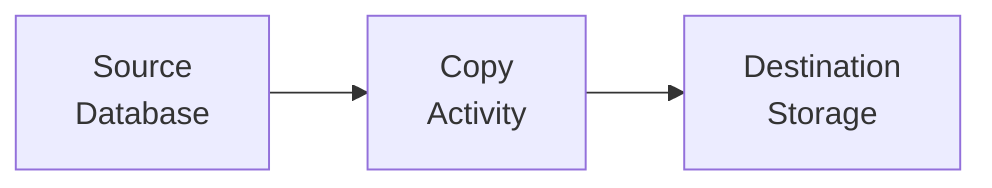
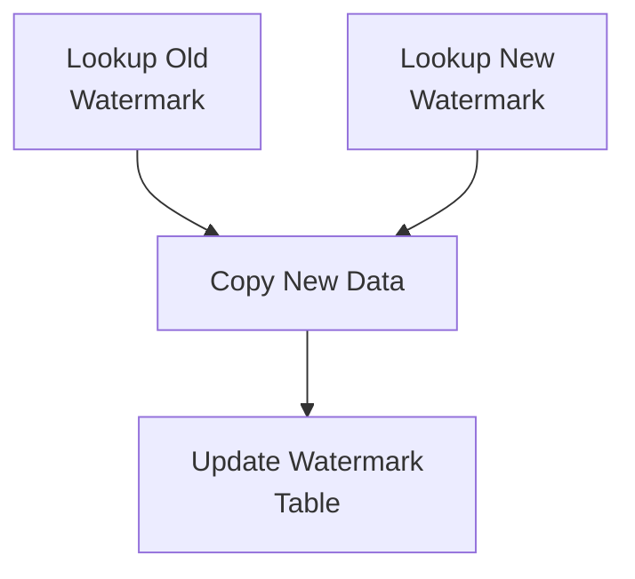
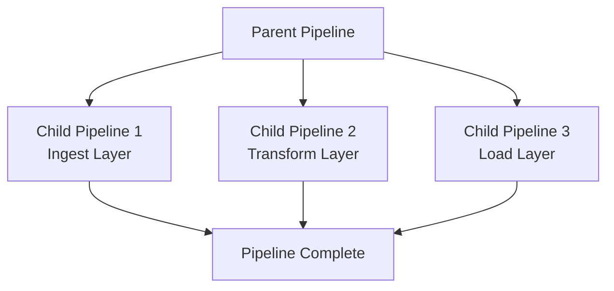
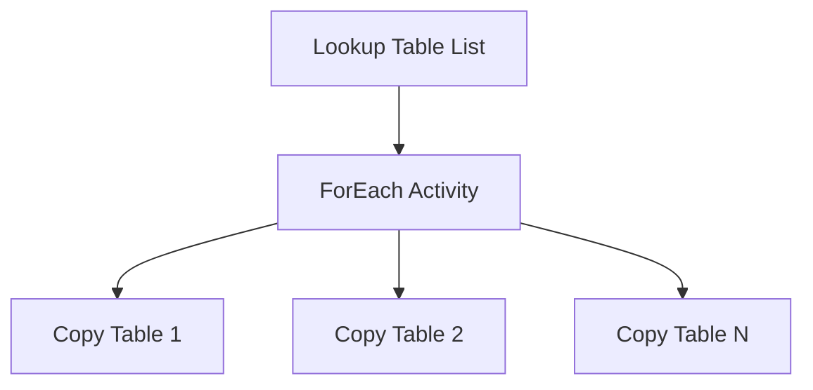
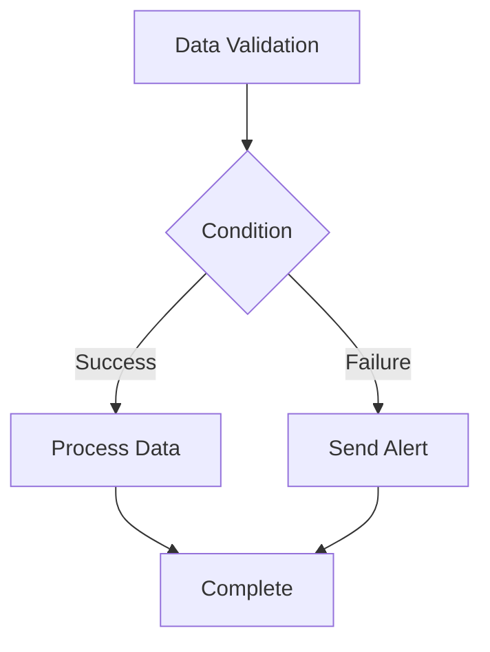
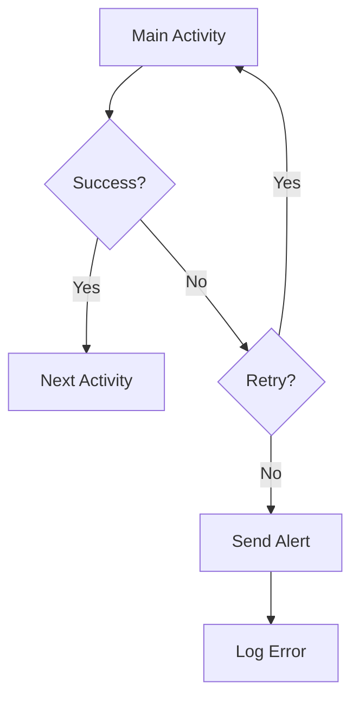
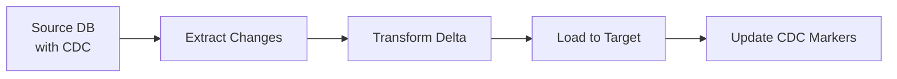
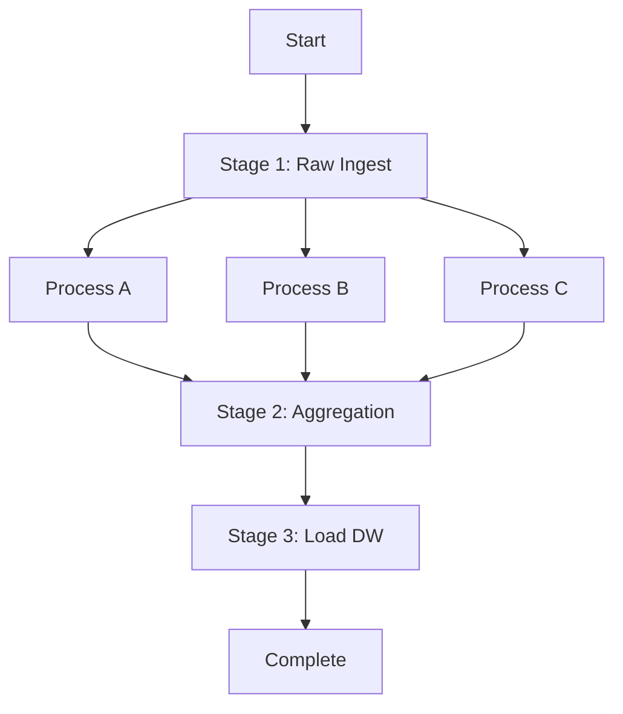

# 🔀 Azure Data Factory Pipeline Patterns

> __🏠 [Home](../../../../README.md)__ | __📖 [Overview](../../../01-overview/README.md)__ | __🛠️ [Services](../../README.md)__ | __🔧 [Orchestration](../README.md)__ | __🏗️ [ADF](README.md)__ | __🔀 Pipeline Patterns__


Common pipeline design patterns and best practices for Azure Data Factory implementations.

---

## 🎯 Overview

This guide covers proven pipeline patterns for various data integration scenarios. These patterns represent production-tested approaches for building robust, scalable, and maintainable data pipelines.

---

## 📋 Table of Contents

- [Basic Copy Pattern](#basic-copy-pattern)
- [Incremental Copy Pattern](#incremental-copy-pattern)
- [Parent-Child Pattern](#parent-child-pattern)
- [Iterative Pattern](#iterative-pattern)
- [Conditional Branching Pattern](#conditional-branching-pattern)
- [Error Handling Pattern](#error-handling-pattern)
- [CDC Pattern](#cdc-pattern-change-data-capture)
- [Orchestration Pattern](#orchestration-pattern)

---

## 📦 Basic Copy Pattern

### Use Case

Simple data movement from source to destination without transformation.

### When to Use

- Initial data loads
- Backup and archive operations
- Data replication across regions

### Architecture



### Implementation

```json
{
  "name": "BasicCopyPipeline",
  "properties": {
    "activities": [
      {
        "name": "CopyFromSQLToBlob",
        "type": "Copy",
        "inputs": [
          {
            "referenceName": "SqlSourceDataset",
            "type": "DatasetReference"
          }
        ],
        "outputs": [
          {
            "referenceName": "BlobSinkDataset",
            "type": "DatasetReference"
          }
        ],
        "typeProperties": {
          "source": {
            "type": "SqlSource",
            "queryTimeout": "02:00:00"
          },
          "sink": {
            "type": "BlobSink",
            "writeBatchSize": 10000
          },
          "enableStaging": false,
          "dataIntegrationUnits": 4
        }
      }
    ]
  }
}
```

### Best Practices

- Enable parallel copy for large datasets
- Use appropriate Data Integration Units (DIUs)
- Consider staged copy for complex scenarios
- Monitor copy performance metrics

---

## 🔄 Incremental Copy Pattern

### Use Case

Copy only new or modified data since the last pipeline run using watermarks.

### When to Use

- Daily/hourly data synchronization
- Change tracking without CDC infrastructure
- Cost optimization by processing only deltas

### Architecture



### Implementation

```json
{
  "name": "IncrementalCopyPipeline",
  "properties": {
    "activities": [
      {
        "name": "LookupOldWatermark",
        "type": "Lookup",
        "typeProperties": {
          "source": {
            "type": "SqlSource",
            "sqlReaderQuery": "SELECT WatermarkValue FROM watermarktable WHERE TableName = 'Orders'"
          }
        }
      },
      {
        "name": "LookupNewWatermark",
        "type": "Lookup",
        "typeProperties": {
          "source": {
            "type": "SqlSource",
            "sqlReaderQuery": "SELECT MAX(ModifiedDate) as NewWatermark FROM Orders"
          }
        }
      },
      {
        "name": "IncrementalCopy",
        "type": "Copy",
        "dependsOn": [
          {
            "activity": "LookupOldWatermark",
            "dependencyConditions": ["Succeeded"]
          },
          {
            "activity": "LookupNewWatermark",
            "dependencyConditions": ["Succeeded"]
          }
        ],
        "typeProperties": {
          "source": {
            "type": "SqlSource",
            "sqlReaderQuery": "SELECT * FROM Orders WHERE ModifiedDate > '@{activity('LookupOldWatermark').output.firstRow.WatermarkValue}' AND ModifiedDate <= '@{activity('LookupNewWatermark').output.firstRow.NewWatermark}'"
          },
          "sink": {
            "type": "ParquetSink"
          }
        }
      },
      {
        "name": "UpdateWatermark",
        "type": "SqlServerStoredProcedure",
        "dependsOn": [
          {
            "activity": "IncrementalCopy",
            "dependencyConditions": ["Succeeded"]
          }
        ],
        "typeProperties": {
          "storedProcedureName": "usp_write_watermark",
          "storedProcedureParameters": {
            "LastModifiedtime": {
              "value": "@{activity('LookupNewWatermark').output.firstRow.NewWatermark}",
              "type": "DateTime"
            },
            "TableName": {
              "value": "Orders",
              "type": "String"
            }
          }
        }
      }
    ]
  }
}
```

### Watermark Table Schema

```sql
CREATE TABLE watermarktable (
    TableName VARCHAR(255) PRIMARY KEY,
    WatermarkValue DATETIME NOT NULL
);

-- Stored procedure to update watermark
CREATE PROCEDURE usp_write_watermark
    @LastModifiedtime DATETIME,
    @TableName VARCHAR(255)
AS
BEGIN
    UPDATE watermarktable
    SET WatermarkValue = @LastModifiedtime
    WHERE TableName = @TableName;
END;
```

### Best Practices

- Use indexed columns for watermark queries
- Handle timezone conversions properly
- Implement watermark recovery for failed runs
- Monitor watermark drift

---

## 👨‍👩‍👧‍👦 Parent-Child Pattern

### Use Case

Orchestrate multiple child pipelines from a parent pipeline for modular design.

### When to Use

- Complex ETL workflows with multiple stages
- Reusable pipeline components
- Parallel execution of independent tasks

### Architecture



### Implementation

__Parent Pipeline:__

```json
{
  "name": "ParentOrchestrationPipeline",
  "properties": {
    "activities": [
      {
        "name": "InvokeIngestPipeline",
        "type": "ExecutePipeline",
        "typeProperties": {
          "pipeline": {
            "referenceName": "ChildIngestPipeline",
            "type": "PipelineReference"
          },
          "waitOnCompletion": true,
          "parameters": {
            "sourceTable": "Orders",
            "targetFolder": "raw/orders"
          }
        }
      },
      {
        "name": "InvokeTransformPipeline",
        "type": "ExecutePipeline",
        "dependsOn": [
          {
            "activity": "InvokeIngestPipeline",
            "dependencyConditions": ["Succeeded"]
          }
        ],
        "typeProperties": {
          "pipeline": {
            "referenceName": "ChildTransformPipeline",
            "type": "PipelineReference"
          },
          "waitOnCompletion": true,
          "parameters": {
            "inputFolder": "raw/orders",
            "outputFolder": "processed/orders"
          }
        }
      },
      {
        "name": "InvokeLoadPipeline",
        "type": "ExecutePipeline",
        "dependsOn": [
          {
            "activity": "InvokeTransformPipeline",
            "dependencyConditions": ["Succeeded"]
          }
        ],
        "typeProperties": {
          "pipeline": {
            "referenceName": "ChildLoadPipeline",
            "type": "PipelineReference"
          },
          "waitOnCompletion": true
        }
      }
    ]
  }
}
```

### Best Practices

- Keep child pipelines focused on single responsibility
- Pass parameters for reusability
- Implement proper error handling in each child
- Use `waitOnCompletion: false` for parallel execution

---

## 🔁 Iterative Pattern

### Use Case

Loop over a collection of items (tables, files, folders) and process each.

### When to Use

- Process multiple tables with same logic
- Batch file processing
- Multi-tenant data processing

### Architecture



### Implementation

```json
{
  "name": "IterativeMultiTableCopy",
  "properties": {
    "activities": [
      {
        "name": "LookupTableList",
        "type": "Lookup",
        "typeProperties": {
          "source": {
            "type": "SqlSource",
            "sqlReaderQuery": "SELECT TableName FROM TableList WHERE IsActive = 1"
          },
          "dataset": {
            "referenceName": "ControlTableDataset",
            "type": "DatasetReference"
          },
          "firstRowOnly": false
        }
      },
      {
        "name": "ForEachTable",
        "type": "ForEach",
        "dependsOn": [
          {
            "activity": "LookupTableList",
            "dependencyConditions": ["Succeeded"]
          }
        ],
        "typeProperties": {
          "items": {
            "value": "@activity('LookupTableList').output.value",
            "type": "Expression"
          },
          "isSequential": false,
          "batchCount": 4,
          "activities": [
            {
              "name": "CopyTable",
              "type": "Copy",
              "typeProperties": {
                "source": {
                  "type": "SqlSource",
                  "sqlReaderQuery": "SELECT * FROM @{item().TableName}"
                },
                "sink": {
                  "type": "ParquetSink"
                }
              }
            }
          ]
        }
      }
    ]
  }
}
```

### Control Table Schema

```sql
CREATE TABLE TableList (
    TableName VARCHAR(255) PRIMARY KEY,
    IsActive BIT NOT NULL DEFAULT 1,
    Priority INT DEFAULT 0,
    LastProcessedDate DATETIME
);

INSERT INTO TableList (TableName, IsActive, Priority)
VALUES
    ('Orders', 1, 1),
    ('Customers', 1, 2),
    ('Products', 1, 3);
```

### Best Practices

- Set appropriate `batchCount` for parallel processing
- Use `isSequential: true` when order matters
- Implement retry logic for failed iterations
- Monitor individual iteration performance

---

## ⚖️ Conditional Branching Pattern

### Use Case

Execute different logic based on runtime conditions or data validation results.

### When to Use

- Data quality checks before processing
- Environment-specific logic (dev/prod)
- Dynamic routing based on business rules

### Architecture



### Implementation

```json
{
  "name": "ConditionalProcessingPipeline",
  "properties": {
    "activities": [
      {
        "name": "ValidateSourceData",
        "type": "Lookup",
        "typeProperties": {
          "source": {
            "type": "SqlSource",
            "sqlReaderQuery": "SELECT COUNT(*) as RowCount FROM SourceTable WHERE LoadDate = '@{utcnow()}'"
          }
        }
      },
      {
        "name": "CheckRowCount",
        "type": "IfCondition",
        "dependsOn": [
          {
            "activity": "ValidateSourceData",
            "dependencyConditions": ["Succeeded"]
          }
        ],
        "typeProperties": {
          "expression": {
            "value": "@greater(activity('ValidateSourceData').output.firstRow.RowCount, 0)",
            "type": "Expression"
          },
          "ifTrueActivities": [
            {
              "name": "ProcessData",
              "type": "Copy",
              "typeProperties": {
                "source": {
                  "type": "SqlSource"
                },
                "sink": {
                  "type": "ParquetSink"
                }
              }
            }
          ],
          "ifFalseActivities": [
            {
              "name": "SendNoDataAlert",
              "type": "WebActivity",
              "typeProperties": {
                "url": "https://your-webhook-url.com/alert",
                "method": "POST",
                "body": {
                  "message": "No data found for processing"
                }
              }
            }
          ]
        }
      }
    ]
  }
}
```

### Best Practices

- Keep condition expressions simple and readable
- Implement logging for both branches
- Consider using Switch activity for multiple conditions
- Handle null/empty values properly

---

## 🛡️ Error Handling Pattern

### Use Case

Implement robust error handling with retries, alerts, and recovery mechanisms.

### When to Use

- Production pipelines requiring high reliability
- Long-running processes
- Mission-critical data workflows

### Architecture



### Implementation

```json
{
  "name": "ErrorHandlingPipeline",
  "properties": {
    "activities": [
      {
        "name": "CopyWithRetry",
        "type": "Copy",
        "policy": {
          "timeout": "7.00:00:00",
          "retry": 3,
          "retryIntervalInSeconds": 300,
          "secureOutput": false,
          "secureInput": false
        },
        "typeProperties": {
          "source": {
            "type": "SqlSource"
          },
          "sink": {
            "type": "BlobSink"
          }
        }
      },
      {
        "name": "ErrorNotification",
        "type": "WebActivity",
        "dependsOn": [
          {
            "activity": "CopyWithRetry",
            "dependencyConditions": ["Failed"]
          }
        ],
        "typeProperties": {
          "url": "https://prod-27.eastus.logic.azure.com/workflows/abc123",
          "method": "POST",
          "headers": {
            "Content-Type": "application/json"
          },
          "body": {
            "pipelineName": "@{pipeline().Pipeline}",
            "errorMessage": "@{activity('CopyWithRetry').output.errors[0].Message}",
            "runId": "@{pipeline().RunId}",
            "timestamp": "@{utcnow()}"
          }
        }
      },
      {
        "name": "LogError",
        "type": "SqlServerStoredProcedure",
        "dependsOn": [
          {
            "activity": "CopyWithRetry",
            "dependencyConditions": ["Failed"]
          }
        ],
        "typeProperties": {
          "storedProcedureName": "usp_LogPipelineError",
          "storedProcedureParameters": {
            "PipelineName": "@{pipeline().Pipeline}",
            "ActivityName": "CopyWithRetry",
            "ErrorMessage": "@{activity('CopyWithRetry').output.errors[0].Message}",
            "RunId": "@{pipeline().RunId}"
          }
        }
      }
    ]
  }
}
```

### Error Logging Table

```sql
CREATE TABLE PipelineErrorLog (
    ErrorId INT IDENTITY(1,1) PRIMARY KEY,
    PipelineName VARCHAR(255),
    ActivityName VARCHAR(255),
    ErrorMessage NVARCHAR(MAX),
    RunId VARCHAR(255),
    ErrorTimestamp DATETIME DEFAULT GETDATE()
);

CREATE PROCEDURE usp_LogPipelineError
    @PipelineName VARCHAR(255),
    @ActivityName VARCHAR(255),
    @ErrorMessage NVARCHAR(MAX),
    @RunId VARCHAR(255)
AS
BEGIN
    INSERT INTO PipelineErrorLog (PipelineName, ActivityName, ErrorMessage, RunId)
    VALUES (@PipelineName, @ActivityName, @ErrorMessage, @RunId);
END;
```

### Best Practices

- Set appropriate retry counts and intervals
- Implement centralized error logging
- Send alerts to monitoring systems
- Include context in error messages

---

## 🔄 CDC Pattern (Change Data Capture)

### Use Case

Capture and process only changed data using database CDC features.

### When to Use

- Real-time or near-real-time data synchronization
- Audit trail requirements
- Minimizing source system load

### Architecture



### Implementation

```json
{
  "name": "CDCPipeline",
  "properties": {
    "activities": [
      {
        "name": "GetChangeData",
        "type": "Copy",
        "typeProperties": {
          "source": {
            "type": "SqlSource",
            "sqlReaderStoredProcedureName": "cdc.fn_cdc_get_all_changes_dbo_Orders",
            "storedProcedureParameters": {
              "from_lsn": {
                "value": "@{activity('GetLastLSN').output.firstRow.LastLSN}",
                "type": "Binary"
              },
              "to_lsn": {
                "value": "sys.fn_cdc_get_max_lsn()",
                "type": "Expression"
              },
              "row_filter_option": {
                "value": "all update old",
                "type": "String"
              }
            }
          },
          "sink": {
            "type": "ParquetSink",
            "storeSettings": {
              "type": "AzureBlobFSWriteSettings",
              "copyBehavior": "PreserveHierarchy"
            }
          }
        }
      },
      {
        "name": "ProcessChanges",
        "type": "DatabricksNotebook",
        "dependsOn": [
          {
            "activity": "GetChangeData",
            "dependencyConditions": ["Succeeded"]
          }
        ],
        "typeProperties": {
          "notebookPath": "/notebooks/ProcessCDCChanges",
          "baseParameters": {
            "inputPath": "@{activity('GetChangeData').output.effectiveIntegrationRuntime}",
            "operation": "merge"
          }
        }
      }
    ]
  }
}
```

### Enable CDC on SQL Server

```sql
-- Enable CDC on database
EXEC sys.sp_cdc_enable_db;

-- Enable CDC on table
EXEC sys.sp_cdc_enable_table
    @source_schema = N'dbo',
    @source_name = N'Orders',
    @role_name = NULL,
    @supports_net_changes = 1;

-- Query CDC changes
DECLARE @from_lsn BINARY(10), @to_lsn BINARY(10);
SET @from_lsn = sys.fn_cdc_get_min_lsn('dbo_Orders');
SET @to_lsn = sys.fn_cdc_get_max_lsn();

SELECT * FROM cdc.fn_cdc_get_all_changes_dbo_Orders(@from_lsn, @to_lsn, 'all');
```

### Best Practices

- Monitor CDC log space usage
- Implement LSN tracking for recovery
- Handle schema changes properly
- Clean up old CDC data regularly

---

## 🎭 Orchestration Pattern

### Use Case

Complex multi-stage workflows with dependencies, parallel execution, and checkpointing.

### When to Use

- Enterprise data warehousing
- Multi-layer data lake architectures
- Complex business logic requirements

### Architecture



### Implementation

```json
{
  "name": "MedallionArchitectureOrchestration",
  "properties": {
    "parameters": {
      "ProcessDate": {
        "type": "string",
        "defaultValue": "@utcnow('yyyy-MM-dd')"
      }
    },
    "activities": [
      {
        "name": "IngestBronzeLayer",
        "type": "ExecutePipeline",
        "typeProperties": {
          "pipeline": {
            "referenceName": "BronzeLayerPipeline"
          },
          "parameters": {
            "processDate": "@pipeline().parameters.ProcessDate"
          }
        }
      },
      {
        "name": "ProcessSilverLayer",
        "type": "ExecutePipeline",
        "dependsOn": [
          {
            "activity": "IngestBronzeLayer",
            "dependencyConditions": ["Succeeded"]
          }
        ],
        "typeProperties": {
          "pipeline": {
            "referenceName": "SilverLayerPipeline"
          },
          "waitOnCompletion": true
        }
      },
      {
        "name": "ProcessGoldDimensions",
        "type": "ExecutePipeline",
        "dependsOn": [
          {
            "activity": "ProcessSilverLayer",
            "dependencyConditions": ["Succeeded"]
          }
        ],
        "typeProperties": {
          "pipeline": {
            "referenceName": "GoldDimensionsPipeline"
          },
          "waitOnCompletion": false
        }
      },
      {
        "name": "ProcessGoldFacts",
        "type": "ExecutePipeline",
        "dependsOn": [
          {
            "activity": "ProcessGoldDimensions",
            "dependencyConditions": ["Succeeded"]
          }
        ],
        "typeProperties": {
          "pipeline": {
            "referenceName": "GoldFactsPipeline"
          }
        }
      }
    ]
  }
}
```

### Best Practices

- Implement checkpointing for long-running processes
- Use metadata-driven patterns for scalability
- Enable parallel execution where possible
- Implement comprehensive logging and monitoring

---

## 📊 Pattern Selection Guide

| Pattern | Complexity | Use Case | Performance | Maintenance |
|---------|------------|----------|-------------|-------------|
| __Basic Copy__ | ⭐ Low | Simple data movement | ⚡ Fast | ✅ Easy |
| __Incremental Copy__ | ⭐⭐ Medium | Delta loads | ⚡⚡ Good | ✅ Medium |
| __Parent-Child__ | ⭐⭐⭐ High | Modular workflows | ⚡⚡ Good | ✅✅ Good |
| __Iterative__ | ⭐⭐ Medium | Multi-table processing | ⚡⚡ Good | ✅ Easy |
| __Conditional__ | ⭐⭐ Medium | Dynamic logic | ⚡⚡ Good | ✅ Medium |
| __Error Handling__ | ⭐⭐ Medium | Production reliability | ⚡⚡ Good | ✅✅ Good |
| __CDC__ | ⭐⭐⭐ High | Real-time sync | ⚡⚡⚡ Excellent | ⭐⭐ Complex |
| __Orchestration__ | ⭐⭐⭐⭐ Very High | Enterprise workflows | ⚡⚡ Varies | ⭐⭐⭐ Complex |

---

## 🔗 Related Resources

- [Data Flows Guide](data-flows/README.md)
- [Integration Runtime](integration-runtime/README.md)
- [CI/CD for Pipelines](ci-cd-pipelines.md)
- [Best Practices](../../../best-practices/README.md)

---

*Last Updated: 2025-01-28*
*Patterns Documented: 8*
*Complexity Levels: Basic to Advanced*
