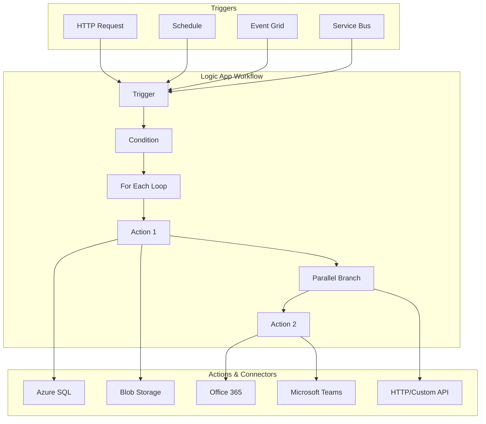

# ⚡ Azure Logic Apps

> __🏠 [Home](../../../../README.md)__ | __📖 [Overview](../../../01-overview/README.md)__ | __🛠️ [Services](../../README.md)__ | __🔧 Orchestration Services__ | __⚡ Azure Logic Apps__


Serverless workflow automation service for integrating apps, data, services, and systems across enterprises and organizations.

---

## 🌟 Service Overview

Azure Logic Apps is a cloud-based platform for creating and running automated workflows with minimal code. It provides a visual designer to model and automate processes as a series of steps known as a workflow, with 300+ pre-built connectors for popular services.

### 🔥 Key Value Propositions

- __Visual Designer__: Drag-and-drop workflow creation
- __300+ Connectors__: Pre-built connectors for popular services
- __Serverless__: No infrastructure management required
- __Enterprise Integration__: B2B scenarios with EDI and AS2
- __Event-driven__: Trigger-based workflow execution
- __Scalable__: Automatic scaling based on demand

---

## 🏗️ Architecture Overview



---

## 🛠️ Core Components

### 🔔 Triggers

Start your workflow when a specific event occurs.

#### Common Trigger Types

| Trigger Type | Description | Use Case |
|-------------|-------------|----------|
| **HTTP Request** | When HTTP request received | Webhook, REST API |
| **Recurrence** | On a schedule | Daily reports, cleanup |
| **Event Grid** | Azure service events | Blob created, VM started |
| **Service Bus** | Message in queue/topic | Async processing |
| **SharePoint** | Item created/modified | Document workflows |
| **Outlook** | New email arrives | Email automation |

#### Recurrence Trigger Example

```json
{
  "type": "Recurrence",
  "recurrence": {
    "frequency": "Day",
    "interval": 1,
    "schedule": {
      "hours": [9],
      "minutes": [0]
    },
    "timeZone": "Eastern Standard Time"
  }
}
```

#### HTTP Request Trigger Example

```json
{
  "type": "Request",
  "kind": "Http",
  "inputs": {
    "schema": {
      "type": "object",
      "properties": {
        "customerName": {
          "type": "string"
        },
        "orderAmount": {
          "type": "number"
        },
        "orderDate": {
          "type": "string"
        }
      }
    }
  }
}
```

---

### 🎬 Actions

Perform operations in your workflow.

#### Built-in Actions

- **Compose**: Create JSON objects
- **Parse JSON**: Extract data from JSON
- **Initialize Variable**: Create workflow variables
- **Condition**: If-then-else logic
- **Switch**: Multi-branch conditionals
- **For Each**: Loop over arrays
- **Until**: Loop until condition met
- **HTTP**: Call REST APIs
- **Response**: Return HTTP response

#### Managed Connector Actions

```text
Data & Storage:
- Azure SQL Database
- Azure Blob Storage
- Azure Cosmos DB
- Azure Data Lake
- SharePoint

Communication:
- Office 365 Outlook
- Microsoft Teams
- SendGrid
- Twilio

Business Apps:
- Salesforce
- Dynamics 365
- SAP
- ServiceNow

Integration:
- Azure Service Bus
- Azure Event Grid
- Azure Functions
- Azure Data Factory
```

---

### 🔄 Control Flow Actions

#### Condition Action

```json
{
  "type": "If",
  "expression": {
    "and": [
      {
        "greater": [
          "@triggerBody()?['orderAmount']",
          1000
        ]
      }
    ]
  },
  "actions": {
    "SendApprovalEmail": {
      "type": "ApiConnection",
      "inputs": {
        "host": {
          "connection": {
            "name": "@parameters('$connections')['office365']['connectionId']"
          }
        },
        "method": "post",
        "path": "/v2/Mail"
      }
    }
  },
  "else": {
    "actions": {
      "AutoApprove": {
        "type": "Compose",
        "inputs": {
          "status": "Approved",
          "approver": "Auto"
        }
      }
    }
  }
}
```

#### For Each Loop

```json
{
  "type": "Foreach",
  "foreach": "@triggerBody()?['orders']",
  "actions": {
    "ProcessOrder": {
      "type": "ApiConnection",
      "inputs": {
        "host": {
          "connection": {
            "name": "@parameters('$connections')['sql']['connectionId']"
          }
        },
        "method": "post",
        "path": "/datasets/default/tables/Orders/items",
        "body": {
          "OrderID": "@items('ProcessOrder')?['id']",
          "CustomerName": "@items('ProcessOrder')?['customer']",
          "Amount": "@items('ProcessOrder')?['amount']"
        }
      }
    }
  }
}
```

---

## 📋 Common Workflow Patterns

### Pattern 1: HTTP to Database

**Scenario**: Receive HTTP request and insert data into SQL Database.

```json
{
  "definition": {
    "$schema": "https://schema.management.azure.com/providers/Microsoft.Logic/schemas/2016-06-01/workflowdefinition.json#",
    "triggers": {
      "manual": {
        "type": "Request",
        "kind": "Http",
        "inputs": {
          "schema": {
            "type": "object",
            "properties": {
              "customerName": {"type": "string"},
              "email": {"type": "string"},
              "orderAmount": {"type": "number"}
            }
          }
        }
      }
    },
    "actions": {
      "Insert_Row": {
        "type": "ApiConnection",
        "inputs": {
          "host": {
            "connection": {
              "name": "@parameters('$connections')['sql']['connectionId']"
            }
          },
          "method": "post",
          "path": "/datasets/default/tables/Customers/items",
          "body": {
            "Name": "@triggerBody()?['customerName']",
            "Email": "@triggerBody()?['email']",
            "OrderAmount": "@triggerBody()?['orderAmount']",
            "CreatedDate": "@utcNow()"
          }
        },
        "runAfter": {}
      },
      "Response": {
        "type": "Response",
        "kind": "Http",
        "inputs": {
          "statusCode": 200,
          "body": {
            "message": "Customer created successfully",
            "customerId": "@body('Insert_Row')?['Id']"
          }
        },
        "runAfter": {
          "Insert_Row": ["Succeeded"]
        }
      }
    }
  }
}
```

### Pattern 2: Schedule-based Data Processing

**Scenario**: Daily scheduled job to process files and send notifications.

```json
{
  "definition": {
    "triggers": {
      "Recurrence": {
        "type": "Recurrence",
        "recurrence": {
          "frequency": "Day",
          "interval": 1,
          "schedule": {
            "hours": [6],
            "minutes": [0]
          }
        }
      }
    },
    "actions": {
      "List_Blobs": {
        "type": "ApiConnection",
        "inputs": {
          "host": {
            "connection": {
              "name": "@parameters('$connections')['azureblob']['connectionId']"
            }
          },
          "method": "get",
          "path": "/datasets/default/foldersV2/unprocessed"
        }
      },
      "For_Each_File": {
        "type": "Foreach",
        "foreach": "@body('List_Blobs')?['value']",
        "actions": {
          "Get_Blob_Content": {
            "type": "ApiConnection",
            "inputs": {
              "host": {
                "connection": {
                  "name": "@parameters('$connections')['azureblob']['connectionId']"
                }
              },
              "method": "get",
              "path": "/datasets/default/files/@{encodeURIComponent(items('For_Each_File')?['Id'])}/content"
            }
          },
          "Process_Data": {
            "type": "Function",
            "inputs": {
              "function": {
                "id": "/subscriptions/{sub}/resourceGroups/{rg}/providers/Microsoft.Web/sites/{functionapp}/functions/ProcessData"
              },
              "body": "@body('Get_Blob_Content')"
            },
            "runAfter": {
              "Get_Blob_Content": ["Succeeded"]
            }
          },
          "Move_to_Processed": {
            "type": "ApiConnection",
            "inputs": {
              "host": {
                "connection": {
                  "name": "@parameters('$connections')['azureblob']['connectionId']"
                }
              },
              "method": "post",
              "path": "/datasets/default/copyFile",
              "queries": {
                "source": "@items('For_Each_File')?['Path']",
                "destination": "/processed/@{items('For_Each_File')?['Name']}"
              }
            },
            "runAfter": {
              "Process_Data": ["Succeeded"]
            }
          }
        },
        "runAfter": {
          "List_Blobs": ["Succeeded"]
        }
      },
      "Send_Summary_Email": {
        "type": "ApiConnection",
        "inputs": {
          "host": {
            "connection": {
              "name": "@parameters('$connections')['office365']['connectionId']"
            }
          },
          "method": "post",
          "path": "/v2/Mail",
          "body": {
            "To": "admin@company.com",
            "Subject": "Daily Processing Complete",
            "Body": "<p>Processed @{length(body('List_Blobs')?['value'])} files</p>"
          }
        },
        "runAfter": {
          "For_Each_File": ["Succeeded"]
        }
      }
    }
  }
}
```

### Pattern 3: Event-driven Integration

**Scenario**: React to Azure Event Grid events and perform actions.

```json
{
  "definition": {
    "triggers": {
      "When_a_resource_event_occurs": {
        "type": "ApiConnectionWebhook",
        "inputs": {
          "host": {
            "connection": {
              "name": "@parameters('$connections')['azureeventgrid']['connectionId']"
            }
          },
          "body": {
            "properties": {
              "topic": "/subscriptions/{sub}/resourceGroups/{rg}",
              "destination": {
                "endpointType": "webhook",
                "properties": {
                  "endpointUrl": "@{listCallbackUrl()}"
                }
              },
              "filter": {
                "includedEventTypes": [
                  "Microsoft.Storage.BlobCreated"
                ]
              }
            }
          }
        }
      }
    },
    "actions": {
      "Parse_Event": {
        "type": "ParseJson",
        "inputs": {
          "content": "@triggerBody()",
          "schema": {
            "type": "object",
            "properties": {
              "data": {
                "type": "object",
                "properties": {
                  "url": {"type": "string"},
                  "contentType": {"type": "string"}
                }
              }
            }
          }
        }
      },
      "Send_Teams_Notification": {
        "type": "ApiConnection",
        "inputs": {
          "host": {
            "connection": {
              "name": "@parameters('$connections')['teams']['connectionId']"
            }
          },
          "method": "post",
          "path": "/v3/teams/conversations/messages",
          "body": {
            "rootMessage": {
              "body": {
                "content": "New file uploaded: @{body('Parse_Event')?['data']?['url']}"
              }
            }
          }
        },
        "runAfter": {
          "Parse_Event": ["Succeeded"]
        }
      }
    }
  }
}
```

---

## 🚀 Quick Start Guide

### 1️⃣ Create Logic App (Consumption)

```bash
# Create resource group
az group create --name rg-logicapp-demo --location eastus

# Create logic app
az logicapp create \
  --resource-group rg-logicapp-demo \
  --name logicapp-demo \
  --definition @workflow.json
```

### 2️⃣ Create Logic App (Standard)

```bash
# Create storage account (required for Standard)
az storage account create \
  --name logicappstorage001 \
  --resource-group rg-logicapp-demo \
  --location eastus \
  --sku Standard_LRS

# Create App Service plan
az appservice plan create \
  --name asp-logicapp-demo \
  --resource-group rg-logicapp-demo \
  --location eastus \
  --sku WS1

# Create Logic App (Standard)
az logicapp create \
  --resource-group rg-logicapp-demo \
  --name logicapp-standard-demo \
  --storage-account logicappstorage001 \
  --plan asp-logicapp-demo
```

### 3️⃣ Deploy Workflow Definition

```bash
# Deploy via ARM template
az deployment group create \
  --resource-group rg-logicapp-demo \
  --template-file logicapp-template.json \
  --parameters @logicapp-parameters.json
```

---

## 📊 Consumption vs Standard

### Comparison Matrix

| Feature | Consumption | Standard |
|---------|-------------|----------|
| **Hosting** | Multi-tenant | Single-tenant or App Service |
| **Pricing** | Per execution | Fixed (App Service Plan) |
| **Local Development** | ❌ No | ✅ Yes (VS Code) |
| **VNet Integration** | ❌ No | ✅ Yes |
| **Stateful Workflows** | ✅ Yes | ✅ Yes |
| **Stateless Workflows** | ❌ No | ✅ Yes |
| **Multiple Workflows** | 1 per Logic App | Many per Logic App |
| **Best For** | Low-volume, event-driven | High-volume, enterprise |

### When to Use Each

**Consumption (Multi-tenant):**
- ✅ Infrequent workflows
- ✅ Event-driven scenarios
- ✅ Prototyping and development
- ✅ Pay-per-execution preferred

**Standard (Single-tenant):**
- ✅ High-volume scenarios
- ✅ VNet integration required
- ✅ Predictable costs needed
- ✅ Local development workflow

---

## 💰 Pricing Guide

### Consumption Plan Pricing

```text
Action Executions:
- Standard Connector: $0.000125 per action
- Enterprise Connector: $0.001 per action
- Built-in Actions: Free

Example Monthly Cost (10,000 runs):
- 5 built-in actions: Free
- 3 standard connectors: 30,000 × $0.000125 = $3.75
- Total: ~$3.75/month
```

### Standard Plan Pricing

```text
Based on App Service Plan:
- WS1: ~$209/month (1 vCPU, 3.5 GB RAM)
- WS2: ~$418/month (2 vCPU, 7 GB RAM)
- WS3: ~$836/month (4 vCPU, 14 GB RAM)

Includes:
- Unlimited workflow executions
- VNet integration
- Multiple workflows per app
```

---

## 🔧 Integration Scenarios

### With Azure Data Factory

Trigger Logic App from ADF pipeline for notifications.

```json
{
  "name": "TriggerLogicApp",
  "type": "WebActivity",
  "typeProperties": {
    "url": "https://prod-27.eastus.logic.azure.com/workflows/abc123/triggers/manual/paths/invoke",
    "method": "POST",
    "headers": {
      "Content-Type": "application/json"
    },
    "body": {
      "pipelineName": "@{pipeline().Pipeline}",
      "status": "@{activity('CopyData').output.status}",
      "rowsCopied": "@{activity('CopyData').output.rowsCopied}"
    }
  }
}
```

### With Azure Functions

Call Azure Function from Logic App.

```json
{
  "type": "Function",
  "inputs": {
    "function": {
      "id": "/subscriptions/{sub}/resourceGroups/{rg}/providers/Microsoft.Web/sites/{functionapp}/functions/ProcessOrder"
    },
    "method": "POST",
    "body": {
      "orderId": "@triggerBody()?['orderId']",
      "amount": "@triggerBody()?['amount']"
    }
  }
}
```

### With Event Grid

Subscribe to Event Grid topics.

```json
{
  "type": "ApiConnectionWebhook",
  "inputs": {
    "host": {
      "connection": {
        "name": "@parameters('$connections')['azureeventgrid']['connectionId']"
      }
    },
    "body": {
      "properties": {
        "topic": "/subscriptions/{sub}/resourceGroups/{rg}/providers/Microsoft.EventGrid/topics/MyTopic",
        "filter": {
          "includedEventTypes": ["OrderCreated", "OrderUpdated"]
        }
      }
    }
  }
}
```

---

## 🔗 Related Resources

- [__Azure Data Factory__](../azure-data-factory/README.md)
- [__Workflow Automation Patterns__](workflow-automation.md)
- [__Architecture Patterns__](../../../03-architecture-patterns/README.md)

---

*Last Updated: 2025-01-28*
*Connectors: 300+*
*Deployment Models: Consumption, Standard*
