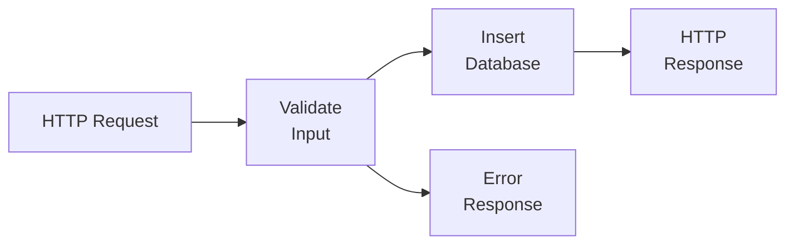
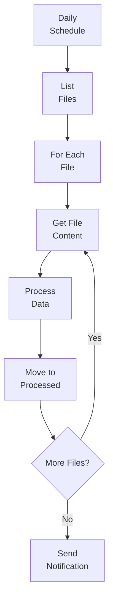
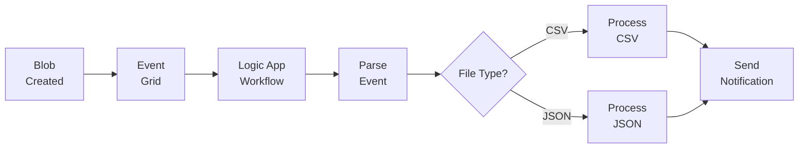
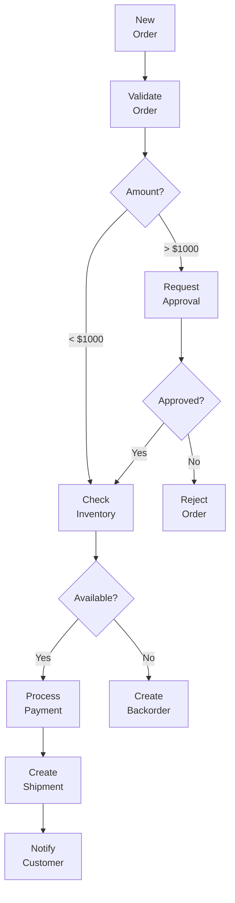

# 🔄 Workflow Automation with Azure Logic Apps

> __🏠 [Home](../../../../README.md)__ | __📖 [Overview](../../../01-overview/README.md)__ | __🛠️ [Services](../../README.md)__ | __🔧 [Orchestration](../README.md)__ | __⚡ [Logic Apps](README.md)__ | __🔄 Workflow Automation__


Comprehensive guide to building automated workflows with Azure Logic Apps, covering common patterns, best practices, and enterprise integration scenarios.

---

## 🎯 Overview

This guide provides practical patterns and examples for implementing workflow automation using Azure Logic Apps. Each pattern includes architecture diagrams, code examples, and best practices for production deployment.

---

## 📋 Table of Contents

- [Common Workflow Patterns](#-common-workflow-patterns)
- [Business Process Automation](#-business-process-automation)
- [System Integration Patterns](#-system-integration-patterns)
- [Data Processing Workflows](#-data-processing-workflows)
- [Error Handling & Retry Patterns](#-error-handling--retry-patterns)
- [Best Practices](#-best-practices)

---

## 🔄 Common Workflow Patterns

### Pattern 1: HTTP Request to Database

**Scenario**: Receive HTTP request and insert data into SQL Database with validation and response.

**Architecture**:



**Implementation**:

```json
{
  "definition": {
    "$schema": "https://schema.management.azure.com/providers/Microsoft.Logic/schemas/2016-06-01/workflowdefinition.json#",
    "contentVersion": "1.0.0.0",
    "parameters": {
      "$connections": {
        "defaultValue": {},
        "type": "Object"
      }
    },
    "triggers": {
      "manual": {
        "type": "Request",
        "kind": "Http",
        "inputs": {
          "schema": {
            "type": "object",
            "properties": {
              "customerName": {"type": "string"},
              "email": {"type": "string"},
              "orderAmount": {"type": "number"},
              "productId": {"type": "string"}
            },
            "required": ["customerName", "email", "orderAmount"]
          }
        }
      }
    },
    "actions": {
      "Validate_Email": {
        "type": "Compose",
        "inputs": "@contains(triggerBody()?['email'], '@')",
        "runAfter": {}
      },
      "Check_Validation": {
        "type": "If",
        "expression": {
          "and": [
            {
              "equals": [
                "@outputs('Validate_Email')",
                true
              ]
            },
            {
              "greater": [
                "@triggerBody()?['orderAmount']",
                0
              ]
            }
          ]
        },
        "actions": {
          "Insert_Customer": {
            "type": "ApiConnection",
            "inputs": {
              "host": {
                "connection": {
                  "name": "@parameters('$connections')['sql']['connectionId']"
                }
              },
              "method": "post",
              "path": "/v2/datasets/@{encodeURIComponent('default')}/tables/@{encodeURIComponent('Customers')}/items",
              "body": {
                "Name": "@triggerBody()?['customerName']",
                "Email": "@triggerBody()?['email']",
                "OrderAmount": "@triggerBody()?['orderAmount']",
                "ProductID": "@triggerBody()?['productId']",
                "CreatedDate": "@utcNow()",
                "Status": "Pending"
              }
            },
            "runAfter": {}
          },
          "Success_Response": {
            "type": "Response",
            "kind": "Http",
            "inputs": {
              "statusCode": 201,
              "headers": {
                "Content-Type": "application/json"
              },
              "body": {
                "status": "success",
                "message": "Customer order created successfully",
                "customerId": "@body('Insert_Customer')?['Id']",
                "timestamp": "@utcNow()"
              }
            },
            "runAfter": {
              "Insert_Customer": ["Succeeded"]
            }
          }
        },
        "else": {
          "actions": {
            "Error_Response": {
              "type": "Response",
              "kind": "Http",
              "inputs": {
                "statusCode": 400,
                "headers": {
                  "Content-Type": "application/json"
                },
                "body": {
                  "status": "error",
                  "message": "Validation failed. Check email format and order amount.",
                  "timestamp": "@utcNow()"
                }
              }
            }
          }
        },
        "runAfter": {
          "Validate_Email": ["Succeeded"]
        }
      }
    }
  }
}
```

**Best Practices**:

- Always validate input data before processing
- Use proper HTTP status codes (200, 201, 400, 500)
- Include timestamps in responses for audit trails
- Handle both success and error paths explicitly

---

### Pattern 2: Schedule-based Data Processing

**Scenario**: Daily scheduled job to process files from blob storage, transform data, and send summary notifications.

**Architecture**:



**Implementation**:

```json
{
  "definition": {
    "triggers": {
      "Recurrence": {
        "type": "Recurrence",
        "recurrence": {
          "frequency": "Day",
          "interval": 1,
          "schedule": {
            "hours": [6],
            "minutes": [0]
          },
          "timeZone": "Eastern Standard Time"
        }
      }
    },
    "actions": {
      "Initialize_ProcessedCount": {
        "type": "InitializeVariable",
        "inputs": {
          "variables": [
            {
              "name": "ProcessedCount",
              "type": "Integer",
              "value": 0
            }
          ]
        },
        "runAfter": {}
      },
      "Initialize_ErrorCount": {
        "type": "InitializeVariable",
        "inputs": {
          "variables": [
            {
              "name": "ErrorCount",
              "type": "Integer",
              "value": 0
            }
          ]
        },
        "runAfter": {
          "Initialize_ProcessedCount": ["Succeeded"]
        }
      },
      "List_Blobs": {
        "type": "ApiConnection",
        "inputs": {
          "host": {
            "connection": {
              "name": "@parameters('$connections')['azureblob']['connectionId']"
            }
          },
          "method": "get",
          "path": "/v2/datasets/@{encodeURIComponent('AccountNameFromSettings')}/foldersV2/@{encodeURIComponent('incoming')}",
          "queries": {
            "useFlatListing": true
          }
        },
        "runAfter": {
          "Initialize_ErrorCount": ["Succeeded"]
        }
      },
      "For_Each_File": {
        "type": "Foreach",
        "foreach": "@body('List_Blobs')?['value']",
        "actions": {
          "Get_Blob_Content": {
            "type": "ApiConnection",
            "inputs": {
              "host": {
                "connection": {
                  "name": "@parameters('$connections')['azureblob']['connectionId']"
                }
              },
              "method": "get",
              "path": "/v2/datasets/@{encodeURIComponent('AccountNameFromSettings')}/files/@{encodeURIComponent(items('For_Each_File')?['Id'])}/content"
            },
            "runAfter": {}
          },
          "Parse_JSON": {
            "type": "ParseJson",
            "inputs": {
              "content": "@body('Get_Blob_Content')",
              "schema": {
                "type": "object",
                "properties": {
                  "records": {
                    "type": "array",
                    "items": {
                      "type": "object",
                      "properties": {
                        "id": {"type": "string"},
                        "name": {"type": "string"},
                        "value": {"type": "number"}
                      }
                    }
                  }
                }
              }
            },
            "runAfter": {
              "Get_Blob_Content": ["Succeeded"]
            }
          },
          "Process_Data_Function": {
            "type": "Function",
            "inputs": {
              "function": {
                "id": "/subscriptions/{sub}/resourceGroups/{rg}/providers/Microsoft.Web/sites/{functionapp}/functions/ProcessData"
              },
              "method": "POST",
              "body": "@body('Parse_JSON')"
            },
            "runAfter": {
              "Parse_JSON": ["Succeeded"]
            }
          },
          "Move_to_Processed": {
            "type": "ApiConnection",
            "inputs": {
              "host": {
                "connection": {
                  "name": "@parameters('$connections')['azureblob']['connectionId']"
                }
              },
              "method": "post",
              "path": "/v2/datasets/@{encodeURIComponent('AccountNameFromSettings')}/copyFile",
              "queries": {
                "source": "@items('For_Each_File')?['Path']",
                "destination": "/processed/@{utcNow('yyyy-MM-dd')}/@{items('For_Each_File')?['Name']}",
                "overwrite": true
              }
            },
            "runAfter": {
              "Process_Data_Function": ["Succeeded"]
            }
          },
          "Delete_Source_File": {
            "type": "ApiConnection",
            "inputs": {
              "host": {
                "connection": {
                  "name": "@parameters('$connections')['azureblob']['connectionId']"
                }
              },
              "method": "delete",
              "path": "/v2/datasets/@{encodeURIComponent('AccountNameFromSettings')}/files/@{encodeURIComponent(items('For_Each_File')?['Id'])}"
            },
            "runAfter": {
              "Move_to_Processed": ["Succeeded"]
            }
          },
          "Increment_ProcessedCount": {
            "type": "IncrementVariable",
            "inputs": {
              "name": "ProcessedCount",
              "value": 1
            },
            "runAfter": {
              "Delete_Source_File": ["Succeeded"]
            }
          }
        },
        "runAfter": {
          "List_Blobs": ["Succeeded"]
        },
        "runtimeConfiguration": {
          "concurrency": {
            "repetitions": 5
          }
        }
      },
      "Send_Summary_Email": {
        "type": "ApiConnection",
        "inputs": {
          "host": {
            "connection": {
              "name": "@parameters('$connections')['office365']['connectionId']"
            }
          },
          "method": "post",
          "path": "/v2/Mail",
          "body": {
            "To": "admin@company.com",
            "Subject": "Daily Processing Summary - @{utcNow('yyyy-MM-dd')}",
            "Body": "<html><body><h2>Processing Complete</h2><ul><li>Files Processed: @{variables('ProcessedCount')}</li><li>Errors: @{variables('ErrorCount')}</li><li>Completion Time: @{utcNow()}</li></ul></body></html>",
            "Importance": "Normal"
          }
        },
        "runAfter": {
          "For_Each_File": ["Succeeded", "Failed"]
        }
      }
    }
  }
}
```

**Best Practices**:

- Use variables to track processing metrics
- Configure concurrency for parallel file processing
- Implement proper file archival strategy
- Send comprehensive summary notifications
- Handle both success and failure scenarios

---

### Pattern 3: Event-driven Integration

**Scenario**: React to Azure Event Grid events from blob storage and trigger downstream processing.

**Architecture**:



**Implementation**:

```json
{
  "definition": {
    "triggers": {
      "When_a_resource_event_occurs": {
        "type": "ApiConnectionWebhook",
        "inputs": {
          "host": {
            "connection": {
              "name": "@parameters('$connections')['azureeventgrid']['connectionId']"
            }
          },
          "body": {
            "properties": {
              "topic": "/subscriptions/{sub}/resourceGroups/{rg}/providers/Microsoft.Storage/storageAccounts/{storage}",
              "destination": {
                "endpointType": "webhook",
                "properties": {
                  "endpointUrl": "@{listCallbackUrl()}"
                }
              },
              "filter": {
                "includedEventTypes": [
                  "Microsoft.Storage.BlobCreated"
                ],
                "subjectBeginsWith": "/blobServices/default/containers/incoming/",
                "subjectEndsWith": ""
              }
            }
          }
        }
      }
    },
    "actions": {
      "Parse_Event": {
        "type": "ParseJson",
        "inputs": {
          "content": "@triggerBody()",
          "schema": {
            "type": "object",
            "properties": {
              "topic": {"type": "string"},
              "subject": {"type": "string"},
              "eventType": {"type": "string"},
              "eventTime": {"type": "string"},
              "id": {"type": "string"},
              "data": {
                "type": "object",
                "properties": {
                  "api": {"type": "string"},
                  "clientRequestId": {"type": "string"},
                  "requestId": {"type": "string"},
                  "eTag": {"type": "string"},
                  "contentType": {"type": "string"},
                  "contentLength": {"type": "integer"},
                  "blobType": {"type": "string"},
                  "url": {"type": "string"},
                  "sequencer": {"type": "string"},
                  "storageDiagnostics": {"type": "object"}
                }
              }
            }
          }
        },
        "runAfter": {}
      },
      "Get_File_Extension": {
        "type": "Compose",
        "inputs": "@last(split(body('Parse_Event')?['data']?['url'], '.'))",
        "runAfter": {
          "Parse_Event": ["Succeeded"]
        }
      },
      "Switch_File_Type": {
        "type": "Switch",
        "expression": "@outputs('Get_File_Extension')",
        "cases": {
          "CSV": {
            "case": "csv",
            "actions": {
              "Process_CSV_File": {
                "type": "Function",
                "inputs": {
                  "function": {
                    "id": "/subscriptions/{sub}/resourceGroups/{rg}/providers/Microsoft.Web/sites/{functionapp}/functions/ProcessCSV"
                  },
                  "method": "POST",
                  "body": {
                    "blobUrl": "@body('Parse_Event')?['data']?['url']",
                    "contentType": "text/csv"
                  }
                }
              },
              "Log_CSV_Processing": {
                "type": "ApiConnection",
                "inputs": {
                  "host": {
                    "connection": {
                      "name": "@parameters('$connections')['azureloganalytics']['connectionId']"
                    }
                  },
                  "method": "post",
                  "path": "/api/logs",
                  "body": {
                    "EventType": "CSVProcessed",
                    "BlobUrl": "@body('Parse_Event')?['data']?['url']",
                    "Timestamp": "@utcNow()"
                  }
                },
                "runAfter": {
                  "Process_CSV_File": ["Succeeded"]
                }
              }
            }
          },
          "JSON": {
            "case": "json",
            "actions": {
              "Process_JSON_File": {
                "type": "Function",
                "inputs": {
                  "function": {
                    "id": "/subscriptions/{sub}/resourceGroups/{rg}/providers/Microsoft.Web/sites/{functionapp}/functions/ProcessJSON"
                  },
                  "method": "POST",
                  "body": {
                    "blobUrl": "@body('Parse_Event')?['data']?['url']",
                    "contentType": "application/json"
                  }
                }
              },
              "Log_JSON_Processing": {
                "type": "ApiConnection",
                "inputs": {
                  "host": {
                    "connection": {
                      "name": "@parameters('$connections')['azureloganalytics']['connectionId']"
                    }
                  },
                  "method": "post",
                  "path": "/api/logs",
                  "body": {
                    "EventType": "JSONProcessed",
                    "BlobUrl": "@body('Parse_Event')?['data']?['url']",
                    "Timestamp": "@utcNow()"
                  }
                },
                "runAfter": {
                  "Process_JSON_File": ["Succeeded"]
                }
              }
            }
          }
        },
        "default": {
          "actions": {
            "Unsupported_File_Type": {
              "type": "ApiConnection",
              "inputs": {
                "host": {
                  "connection": {
                    "name": "@parameters('$connections')['office365']['connectionId']"
                  }
                },
                "method": "post",
                "path": "/v2/Mail",
                "body": {
                  "To": "support@company.com",
                  "Subject": "Unsupported File Type Detected",
                  "Body": "<p>File URL: @{body('Parse_Event')?['data']?['url']}</p><p>Extension: @{outputs('Get_File_Extension')}</p>",
                  "Importance": "High"
                }
              }
            }
          }
        },
        "runAfter": {
          "Get_File_Extension": ["Succeeded"]
        }
      },
      "Send_Teams_Notification": {
        "type": "ApiConnection",
        "inputs": {
          "host": {
            "connection": {
              "name": "@parameters('$connections')['teams']['connectionId']"
            }
          },
          "method": "post",
          "path": "/v1.0/teams/@{encodeURIComponent('team-id')}/channels/@{encodeURIComponent('channel-id')}/messages",
          "body": {
            "body": {
              "contentType": "html",
              "content": "<p><strong>New File Processed</strong></p><p>File: @{body('Parse_Event')?['data']?['url']}</p><p>Type: @{outputs('Get_File_Extension')}</p><p>Time: @{utcNow()}</p>"
            }
          }
        },
        "runAfter": {
          "Switch_File_Type": ["Succeeded"]
        }
      }
    }
  }
}
```

**Best Practices**:

- Use Event Grid for efficient event-driven architectures
- Parse event schema for type safety
- Implement switch/case for different file types
- Log all processing activities
- Send notifications on completion and errors

---

## 💼 Business Process Automation

### Order Processing Workflow

**Scenario**: Automated order processing with approval, inventory check, and fulfillment.

**Architecture**:



**Implementation**:

```json
{
  "definition": {
    "triggers": {
      "When_order_received": {
        "type": "Request",
        "kind": "Http",
        "inputs": {
          "schema": {
            "type": "object",
            "properties": {
              "orderId": {"type": "string"},
              "customerId": {"type": "string"},
              "items": {
                "type": "array",
                "items": {
                  "type": "object",
                  "properties": {
                    "productId": {"type": "string"},
                    "quantity": {"type": "integer"},
                    "price": {"type": "number"}
                  }
                }
              },
              "totalAmount": {"type": "number"},
              "shippingAddress": {"type": "object"}
            }
          }
        }
      }
    },
    "actions": {
      "Calculate_Total": {
        "type": "Compose",
        "inputs": "@triggerBody()?['totalAmount']",
        "runAfter": {}
      },
      "Check_Amount_Threshold": {
        "type": "If",
        "expression": {
          "and": [
            {
              "greater": [
                "@outputs('Calculate_Total')",
                1000
              ]
            }
          ]
        },
        "actions": {
          "Send_Approval_Request": {
            "type": "ApiConnection",
            "inputs": {
              "host": {
                "connection": {
                  "name": "@parameters('$connections')['approvals']['connectionId']"
                }
              },
              "method": "post",
              "path": "/approvals",
              "body": {
                "title": "Order Approval Required",
                "assignedTo": "manager@company.com",
                "details": "Order ID: @{triggerBody()?['orderId']}\nAmount: $@{outputs('Calculate_Total')}\nCustomer: @{triggerBody()?['customerId']}",
                "itemLink": "https://portal.company.com/orders/@{triggerBody()?['orderId']}",
                "itemLinkDescription": "View Order Details"
              }
            },
            "runAfter": {}
          },
          "Wait_for_Approval": {
            "type": "ApiConnection",
            "inputs": {
              "host": {
                "connection": {
                  "name": "@parameters('$connections')['approvals']['connectionId']"
                }
              },
              "method": "get",
              "path": "/approvals/@{body('Send_Approval_Request')?['name']}"
            },
            "runAfter": {
              "Send_Approval_Request": ["Succeeded"]
            }
          },
          "Check_Approval_Status": {
            "type": "If",
            "expression": {
              "and": [
                {
                  "equals": [
                    "@body('Wait_for_Approval')?['response']",
                    "Approve"
                  ]
                }
              ]
            },
            "actions": {
              "Proceed_to_Inventory": {
                "type": "Compose",
                "inputs": "Approved"
              }
            },
            "else": {
              "actions": {
                "Reject_Order": {
                  "type": "ApiConnection",
                  "inputs": {
                    "host": {
                      "connection": {
                        "name": "@parameters('$connections')['sql']['connectionId']"
                      }
                    },
                    "method": "patch",
                    "path": "/v2/datasets/@{encodeURIComponent('default')}/tables/@{encodeURIComponent('Orders')}/items/@{encodeURIComponent(triggerBody()?['orderId'])}",
                    "body": {
                      "Status": "Rejected",
                      "RejectionReason": "@body('Wait_for_Approval')?['comments']",
                      "UpdatedDate": "@utcNow()"
                    }
                  }
                },
                "Notify_Customer_Rejection": {
                  "type": "ApiConnection",
                  "inputs": {
                    "host": {
                      "connection": {
                        "name": "@parameters('$connections')['sendgrid']['connectionId']"
                      }
                    },
                    "method": "post",
                    "path": "/v3/mail/send",
                    "body": {
                      "personalizations": [
                        {
                          "to": [
                            {
                              "email": "@{triggerBody()?['customerEmail']}"
                            }
                          ],
                          "subject": "Order @{triggerBody()?['orderId']} - Not Approved"
                        }
                      ],
                      "from": {
                        "email": "orders@company.com"
                      },
                      "content": [
                        {
                          "type": "text/html",
                          "value": "<p>Your order has not been approved.</p><p>Reason: @{body('Wait_for_Approval')?['comments']}</p>"
                        }
                      ]
                    }
                  },
                  "runAfter": {
                    "Reject_Order": ["Succeeded"]
                  }
                },
                "Terminate_Rejected": {
                  "type": "Terminate",
                  "inputs": {
                    "runStatus": "Cancelled"
                  },
                  "runAfter": {
                    "Notify_Customer_Rejection": ["Succeeded"]
                  }
                }
              }
            },
            "runAfter": {
              "Wait_for_Approval": ["Succeeded"]
            }
          }
        },
        "runAfter": {
          "Calculate_Total": ["Succeeded"]
        }
      },
      "Check_Inventory": {
        "type": "ApiConnection",
        "inputs": {
          "host": {
            "connection": {
              "name": "@parameters('$connections')['sql']['connectionId']"
            }
          },
          "method": "post",
          "path": "/v2/datasets/@{encodeURIComponent('default')}/query/sql",
          "body": {
            "query": "SELECT ProductID, AvailableQuantity FROM Inventory WHERE ProductID IN (@{join(map(triggerBody()?['items'], 'productId'), ',')})"
          }
        },
        "runAfter": {
          "Check_Amount_Threshold": ["Succeeded", "Skipped"]
        }
      },
      "Process_Payment": {
        "type": "Http",
        "inputs": {
          "method": "POST",
          "uri": "https://payment-gateway.company.com/api/process",
          "headers": {
            "Content-Type": "application/json",
            "Authorization": "Bearer @{parameters('PaymentGatewayToken')}"
          },
          "body": {
            "orderId": "@triggerBody()?['orderId']",
            "amount": "@outputs('Calculate_Total')",
            "currency": "USD",
            "paymentMethod": "@triggerBody()?['paymentMethod']"
          }
        },
        "runAfter": {
          "Check_Inventory": ["Succeeded"]
        }
      },
      "Create_Shipment": {
        "type": "ApiConnection",
        "inputs": {
          "host": {
            "connection": {
              "name": "@parameters('$connections')['sql']['connectionId']"
            }
          },
          "method": "post",
          "path": "/v2/datasets/@{encodeURIComponent('default')}/tables/@{encodeURIComponent('Shipments')}/items",
          "body": {
            "OrderID": "@triggerBody()?['orderId']",
            "CustomerID": "@triggerBody()?['customerId']",
            "ShippingAddress": "@string(triggerBody()?['shippingAddress'])",
            "Status": "Pending",
            "CreatedDate": "@utcNow()"
          }
        },
        "runAfter": {
          "Process_Payment": ["Succeeded"]
        }
      },
      "Notify_Customer_Success": {
        "type": "ApiConnection",
        "inputs": {
          "host": {
            "connection": {
              "name": "@parameters('$connections')['sendgrid']['connectionId']"
            }
          },
          "method": "post",
          "path": "/v3/mail/send",
          "body": {
            "personalizations": [
              {
                "to": [
                  {
                    "email": "@{triggerBody()?['customerEmail']}"
                  }
                ],
                "subject": "Order @{triggerBody()?['orderId']} - Confirmed"
              }
            ],
            "from": {
              "email": "orders@company.com"
            },
            "content": [
              {
                "type": "text/html",
                "value": "<h2>Order Confirmed!</h2><p>Your order has been confirmed and will ship soon.</p><p>Order ID: @{triggerBody()?['orderId']}</p><p>Total: $@{outputs('Calculate_Total')}</p><p>Tracking: @{body('Create_Shipment')?['TrackingNumber']}</p>"
              }
            ]
          }
        },
        "runAfter": {
          "Create_Shipment": ["Succeeded"]
        }
      },
      "Success_Response": {
        "type": "Response",
        "kind": "Http",
        "inputs": {
          "statusCode": 200,
          "body": {
            "status": "success",
            "orderId": "@triggerBody()?['orderId']",
            "message": "Order processed successfully",
            "shipmentId": "@body('Create_Shipment')?['Id']"
          }
        },
        "runAfter": {
          "Notify_Customer_Success": ["Succeeded"]
        }
      }
    }
  }
}
```

---

## 🔄 System Integration Patterns

### Multi-System Synchronization

**Scenario**: Synchronize customer data across CRM, ERP, and marketing platforms.

**ARM Template**:

```json
{
  "$schema": "https://schema.management.azure.com/schemas/2019-04-01/deploymentTemplate.json#",
  "contentVersion": "1.0.0.0",
  "parameters": {
    "logicAppName": {
      "type": "string",
      "defaultValue": "CustomerSyncWorkflow"
    },
    "location": {
      "type": "string",
      "defaultValue": "[resourceGroup().location]"
    }
  },
  "resources": [
    {
      "type": "Microsoft.Logic/workflows",
      "apiVersion": "2019-05-01",
      "name": "[parameters('logicAppName')]",
      "location": "[parameters('location')]",
      "properties": {
        "state": "Enabled",
        "definition": {
          "$schema": "https://schema.management.azure.com/providers/Microsoft.Logic/schemas/2016-06-01/workflowdefinition.json#",
          "contentVersion": "1.0.0.0",
          "parameters": {},
          "triggers": {
            "Recurrence": {
              "recurrence": {
                "frequency": "Hour",
                "interval": 1
              },
              "type": "Recurrence"
            }
          },
          "actions": {
            "Get_Changed_Customers_from_CRM": {
              "type": "ApiConnection",
              "inputs": {
                "host": {
                  "connection": {
                    "name": "@parameters('$connections')['dynamics365']['connectionId']"
                  }
                },
                "method": "get",
                "path": "/api/data/v9.0/accounts",
                "queries": {
                  "$filter": "modifiedon gt @{addHours(utcNow(), -1)}"
                }
              },
              "runAfter": {}
            },
            "For_Each_Customer": {
              "type": "Foreach",
              "foreach": "@body('Get_Changed_Customers_from_CRM')?['value']",
              "actions": {
                "Update_ERP_System": {
                  "type": "Http",
                  "inputs": {
                    "method": "PUT",
                    "uri": "https://erp.company.com/api/customers/@{items('For_Each_Customer')?['accountid']}",
                    "headers": {
                      "Content-Type": "application/json"
                    },
                    "body": {
                      "customerId": "@items('For_Each_Customer')?['accountid']",
                      "name": "@items('For_Each_Customer')?['name']",
                      "email": "@items('For_Each_Customer')?['emailaddress1']",
                      "phone": "@items('For_Each_Customer')?['telephone1']"
                    }
                  }
                },
                "Update_Marketing_Platform": {
                  "type": "ApiConnection",
                  "inputs": {
                    "host": {
                      "connection": {
                        "name": "@parameters('$connections')['salesforce']['connectionId']"
                      }
                    },
                    "method": "patch",
                    "path": "/v2/datasets/default/tables/@{encodeURIComponent('Contact')}/items/@{encodeURIComponent(items('For_Each_Customer')?['accountid'])}",
                    "body": {
                      "FirstName": "@items('For_Each_Customer')?['firstname']",
                      "LastName": "@items('For_Each_Customer')?['lastname']",
                      "Email": "@items('For_Each_Customer')?['emailaddress1']",
                      "Phone": "@items('For_Each_Customer')?['telephone1']"
                    }
                  },
                  "runAfter": {
                    "Update_ERP_System": ["Succeeded"]
                  }
                }
              },
              "runAfter": {
                "Get_Changed_Customers_from_CRM": ["Succeeded"]
              }
            }
          }
        }
      }
    }
  ]
}
```

---

## ⚠️ Error Handling & Retry Patterns

### Retry Configuration

Configure automatic retries for transient failures:

```json
{
  "actions": {
    "HTTP_Call_with_Retry": {
      "type": "Http",
      "inputs": {
        "method": "POST",
        "uri": "https://api.external.com/endpoint",
        "body": {}
      },
      "retryPolicy": {
        "type": "exponential",
        "count": 4,
        "interval": "PT10S",
        "maximumInterval": "PT1H",
        "minimumInterval": "PT5S"
      }
    }
  }
}
```

### Scope and Error Handling

Use scopes to group actions and handle errors:

```json
{
  "actions": {
    "Try_Scope": {
      "type": "Scope",
      "actions": {
        "Primary_Action": {
          "type": "Http",
          "inputs": {
            "method": "POST",
            "uri": "https://primary-api.com/endpoint"
          }
        },
        "Secondary_Action": {
          "type": "ApiConnection",
          "inputs": {},
          "runAfter": {
            "Primary_Action": ["Succeeded"]
          }
        }
      }
    },
    "Catch_Scope": {
      "type": "Scope",
      "actions": {
        "Log_Error": {
          "type": "ApiConnection",
          "inputs": {
            "host": {
              "connection": {
                "name": "@parameters('$connections')['azureloganalytics']['connectionId']"
              }
            },
            "method": "post",
            "path": "/api/logs",
            "body": {
              "ErrorMessage": "@result('Try_Scope')[0]['error']['message']",
              "ErrorCode": "@result('Try_Scope')[0]['error']['code']",
              "Timestamp": "@utcNow()"
            }
          }
        },
        "Send_Alert": {
          "type": "ApiConnection",
          "inputs": {
            "host": {
              "connection": {
                "name": "@parameters('$connections')['office365']['connectionId']"
              }
            },
            "method": "post",
            "path": "/v2/Mail",
            "body": {
              "To": "support@company.com",
              "Subject": "Workflow Error Alert",
              "Body": "<p>Error occurred in workflow</p><p>Details: @{result('Try_Scope')[0]['error']}</p>"
            }
          },
          "runAfter": {
            "Log_Error": ["Succeeded"]
          }
        }
      },
      "runAfter": {
        "Try_Scope": ["Failed", "TimedOut", "Skipped"]
      }
    }
  }
}
```

---

## 💡 Best Practices

### 1. Use Managed Identities

Authenticate to Azure resources without storing credentials:

```json
{
  "type": "Microsoft.Logic/workflows",
  "identity": {
    "type": "SystemAssigned"
  },
  "properties": {
    "definition": {
      "actions": {
        "Get_Secret_from_KeyVault": {
          "type": "ApiConnection",
          "inputs": {
            "host": {
              "connection": {
                "name": "@parameters('$connections')['keyvault']['connectionId']"
              }
            },
            "method": "get",
            "path": "/secrets/@{encodeURIComponent('MySecret')}/value"
          }
        }
      }
    }
  }
}
```

### 2. Implement Idempotency

Ensure workflows can be safely retried:

```json
{
  "actions": {
    "Check_if_Already_Processed": {
      "type": "ApiConnection",
      "inputs": {
        "host": {
          "connection": {
            "name": "@parameters('$connections')['sql']['connectionId']"
          }
        },
        "method": "post",
        "path": "/v2/datasets/@{encodeURIComponent('default')}/query/sql",
        "body": {
          "query": "SELECT COUNT(*) as Count FROM ProcessedOrders WHERE OrderID = '@{triggerBody()?['orderId']}'"
        }
      }
    },
    "Process_if_New": {
      "type": "If",
      "expression": {
        "and": [
          {
            "equals": [
              "@body('Check_if_Already_Processed')?['ResultSets']?['Table1']?[0]?['Count']",
              0
            ]
          }
        ]
      },
      "actions": {
        "Process_Order": {
          "type": "ApiConnection",
          "inputs": {}
        }
      }
    }
  }
}
```

### 3. Use Variables for State Management

Track workflow state with variables:

```json
{
  "actions": {
    "Initialize_Status": {
      "type": "InitializeVariable",
      "inputs": {
        "variables": [
          {
            "name": "ProcessingStatus",
            "type": "String",
            "value": "InProgress"
          }
        ]
      }
    },
    "Update_Status": {
      "type": "SetVariable",
      "inputs": {
        "name": "ProcessingStatus",
        "value": "Completed"
      },
      "runAfter": {
        "Process_Data": ["Succeeded"]
      }
    }
  }
}
```

### 4. Implement Proper Logging

Log key events for troubleshooting:

```json
{
  "actions": {
    "Log_Workflow_Start": {
      "type": "ApiConnection",
      "inputs": {
        "host": {
          "connection": {
            "name": "@parameters('$connections')['azureloganalytics']['connectionId']"
          }
        },
        "method": "post",
        "path": "/api/logs",
        "body": {
          "EventType": "WorkflowStarted",
          "WorkflowName": "@workflow().name",
          "RunId": "@workflow().run.name",
          "Timestamp": "@utcNow()"
        }
      }
    }
  }
}
```

### 5. Optimize for Performance

Configure concurrency and batching:

```json
{
  "actions": {
    "For_Each_with_Concurrency": {
      "type": "Foreach",
      "foreach": "@body('Get_Items')",
      "actions": {
        "Process_Item": {
          "type": "Http",
          "inputs": {}
        }
      },
      "runtimeConfiguration": {
        "concurrency": {
          "repetitions": 20
        }
      }
    }
  }
}
```

---

## 📚 Additional Resources

### Related Documentation

- [Azure Logic Apps Overview](README.md)
- [Azure Data Factory Integration](../azure-data-factory/README.md)
- [Architecture Patterns](../../../03-architecture-patterns/README.md)

### Microsoft Learn

- [Logic Apps Documentation](https://learn.microsoft.com/azure/logic-apps/)
- [Workflow Definition Language](https://learn.microsoft.com/azure/logic-apps/logic-apps-workflow-definition-language)
- [Connectors Reference](https://learn.microsoft.com/connectors/)

---

*Last Updated: 2025-01-28*
*Pattern Count: 10+*
*Documentation Status: Complete*
