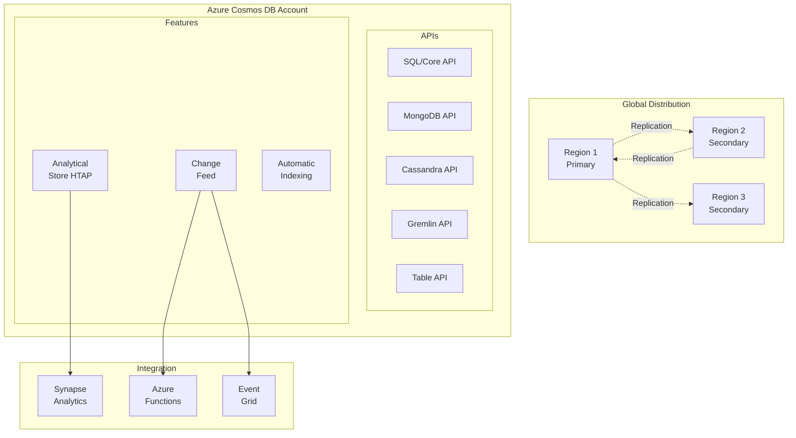

# 🌌 Azure Cosmos DB

> __🏠 [Home](../../../../README.md)__ | __📖 [Overview](../../../01-overview/README.md)__ | __🛠️ [Services](../../README.md)__ | __🗃️ Storage Services__ | __🌌 Cosmos DB__


Azure Cosmos DB is a globally distributed, multi-model NoSQL database service that offers turnkey global distribution, elastic scaling, and comprehensive SLAs for throughput, latency, availability, and consistency.

---

## 🌟 Service Overview

Azure Cosmos DB provides a globally distributed, horizontally scalable database platform with multiple APIs, allowing you to build modern applications with guaranteed low latency and high availability across any number of Azure regions worldwide.

### 🔥 Key Value Propositions

- __Global Distribution__: Multi-region writes and reads with automatic failover
- __Multiple APIs__: SQL, MongoDB, Cassandra, Gremlin, Table support
- __Guaranteed SLAs__: 99.999% availability, < 10ms latency at P99
- __Elastic Scaling__: Automatic and manual throughput scaling
- __HTAP Capabilities__: Transactional and analytical workloads on same data

---

## 🏗️ Architecture Overview



---

## 🛠️ Core Components

### 📊 [API Selection Guide](api-selection.md)


Choose the right API for your application needs.

__Available APIs__:

| API | Best For | Use Case |
|-----|----------|----------|
| __SQL (Core)__ | New applications, JSON documents | Modern apps, IoT, retail |
| __MongoDB__ | MongoDB migrations | Existing MongoDB apps |
| __Cassandra__ | Cassandra migrations | High-scale writes, time-series |
| __Gremlin__ | Graph databases | Social networks, recommendations |
| __Table__ | Azure Table Storage migration | Key-value scenarios |

__[📖 Detailed Guide →](api-selection.md)__

---

### 🔀 [Partitioning Strategies](partitioning-strategies.md)


Design partition keys for optimal performance and scale.

__Key Concepts__:

- Logical partitions (max 20 GB per partition key)
- Physical partitions (managed by Cosmos DB)
- Partition key selection best practices
- Cross-partition vs. single-partition queries

__[📖 Detailed Guide →](partitioning-strategies.md)__

---

### 🔄 [Change Feed](change-feed.md)


Capture and process data changes in real-time.

__Capabilities__:

- Real-time change data capture
- Event-driven architectures
- Data synchronization
- Audit logging and compliance

__[📖 Detailed Guide →](change-feed.md)__

---

### 📈 [Analytical Store (HTAP)](analytical-store.md)


Run analytics on operational data without impacting transactions.

__Features__:

- Column-oriented storage for analytics
- No ETL required
- Auto-sync with transactional store
- Synapse Analytics integration

__[📖 Detailed Guide →](analytical-store.md)__

---

## 🎯 Common Use Cases

### 🛒 E-commerce & Retail

__Requirements__: Global availability, low latency, flexible schema

```json
{
  "id": "order-12345",
  "customerId": "cust-67890",
  "items": [
    {"productId": "prod-111", "quantity": 2, "price": 29.99},
    {"productId": "prod-222", "quantity": 1, "price": 49.99}
  ],
  "total": 109.97,
  "orderDate": "2024-01-15T10:30:00Z",
  "status": "shipped",
  "shippingAddress": {
    "street": "123 Main St",
    "city": "Seattle",
    "country": "USA"
  }
}
```

### 🎮 Gaming Leaderboards

__Requirements__: High write throughput, global distribution, low latency

```csharp
// Cassandra API - Time-series player scores
CREATE TABLE player_scores (
    player_id UUID,
    game_id UUID,
    score INT,
    timestamp TIMESTAMP,
    PRIMARY KEY ((game_id), score, player_id)
) WITH CLUSTERING ORDER BY (score DESC, player_id ASC);
```

### 🌐 IoT Data Ingestion

__Requirements__: Massive scale writes, time-series data, real-time analytics

```python
# MongoDB API - IoT device telemetry
from pymongo import MongoClient

client = MongoClient("mongodb://<cosmos-account>.mongo.cosmos.azure.com:10255/?ssl=true")
db = client['iot-database']
telemetry = db['device-telemetry']

# Insert device reading
telemetry.insert_one({
    "deviceId": "sensor-001",
    "timestamp": datetime.utcnow(),
    "temperature": 72.5,
    "humidity": 45.2,
    "location": {"lat": 47.6062, "lon": -122.3321}
})
```

---

## 📊 Pricing Guide

### 💰 Pricing Models

| Model | Best For | Billing Unit |
|-------|----------|--------------|
| __Provisioned Throughput__ | Predictable workloads | RU/s per hour |
| __Autoscale__ | Variable workloads | Actual RU/s used |
| __Serverless__ | Sporadic workloads | RU/s consumed |

### Request Units (RU) Basics

```python
# Example RU consumption
Operations = {
    "Point read (1KB)": 1,           # Single document by ID
    "Point write (1KB)": 5,          # Insert document
    "Query (1KB result)": 2-10,      # Depends on complexity
    "Cross-partition query": "High", # Avoid when possible
}

# Calculate daily RUs for workload
reads_per_day = 100_000
writes_per_day = 50_000

total_ru_per_day = (reads_per_day * 1) + (writes_per_day * 5)
# = 350,000 RU/day

# Convert to RU/s (divide by seconds in day)
ru_per_second = total_ru_per_day / 86_400
# ≈ 4 RU/s required
```

---

## 🚀 Quick Start Guide

### 1️⃣ Create Cosmos DB Account

```bash
# Create Cosmos DB account with SQL API
az cosmosdb create \
  --name mycosmosaccount \
  --resource-group myresourcegroup \
  --locations regionName=eastus failoverPriority=0 isZoneRedundant=False \
  --locations regionName=westus failoverPriority=1 isZoneRedundant=False \
  --enable-automatic-failover \
  --default-consistency-level Session

# Create database
az cosmosdb sql database create \
  --account-name mycosmosaccount \
  --resource-group myresourcegroup \
  --name ecommerce-db

# Create container with partition key
az cosmosdb sql container create \
  --account-name mycosmosaccount \
  --resource-group myresourcegroup \
  --database-name ecommerce-db \
  --name orders \
  --partition-key-path "/customerId" \
  --throughput 400
```

### 2️⃣ Connect with Python SDK

```python
from azure.cosmos import CosmosClient, PartitionKey
from azure.identity import DefaultAzureCredential

# Initialize client
credential = DefaultAzureCredential()
client = CosmosClient(
    url="https://mycosmosaccount.documents.azure.com:443/",
    credential=credential
)

# Get database and container
database = client.get_database_client("ecommerce-db")
container = database.get_container_client("orders")

# Create item
order = {
    "id": "order-001",
    "customerId": "cust-123",
    "items": [{"productId": "prod-456", "quantity": 2}],
    "total": 59.98
}

container.create_item(body=order)

# Read item
retrieved_order = container.read_item(
    item="order-001",
    partition_key="cust-123"
)

# Query items
query = "SELECT * FROM c WHERE c.customerId = @customerId"
parameters = [{"name": "@customerId", "value": "cust-123"}]

for item in container.query_items(query=query, parameters=parameters):
    print(item)
```

### 3️⃣ Use Change Feed

```python
from azure.cosmos import CosmosClient
from datetime import datetime

# Monitor changes
def process_changes(changes):
    for change in changes:
        print(f"Changed document: {change['id']}")
        # Process change (e.g., send to Event Hub)

# Start change feed processor
container.query_items_change_feed(
    start_time=datetime.utcnow(),
    is_start_from_beginning=True
)
```

---

## 🔧 Configuration & Management

### 🛡️ Security Best Practices

```python
# Use Azure AD authentication (recommended)
from azure.cosmos import CosmosClient
from azure.identity import DefaultAzureCredential

credential = DefaultAzureCredential()
client = CosmosClient(url="<cosmos-url>", credential=credential)

# Configure firewall rules
from azure.mgmt.cosmosdb import CosmosDBManagementClient

cosmosdb_client = CosmosDBManagementClient(credential, subscription_id)

# Update network rules
cosmosdb_client.database_accounts.begin_update(
    resource_group_name="myresourcegroup",
    account_name="mycosmosaccount",
    update_parameters={
        "properties": {
            "ipRules": [{"ipAddressOrRange": "203.0.113.0/24"}],
            "isVirtualNetworkFilterEnabled": True,
            "virtualNetworkRules": [
                {
                    "id": "/subscriptions/<sub>/resourceGroups/<rg>/providers/Microsoft.Network/virtualNetworks/<vnet>/subnets/<subnet>"
                }
            ]
        }
    }
)
```

---

## 📚 Learning Resources

### 🎓 __Getting Started__

- [__Cosmos DB Quick Start__](../../../tutorials/beginner/cosmosdb-quickstart.md)
- [__API Selection Guide__](api-selection.md)
- [__Partitioning Tutorial__](partitioning-strategies.md)

### 📖 __Deep Dive Guides__

- [__Change Feed Patterns__](change-feed.md)
- [__Analytical Store__](analytical-store.md)
- [__Global Distribution__](../../../reference/cosmosdb/global-distribution.md)

---

## 🆘 Troubleshooting

### 🔍 Common Issues

- [__High RU Consumption__](../../../07-troubleshooting/service-troubleshooting/cosmosdb/ru-optimization.md)
- [__Partition Key Issues__](../../../07-troubleshooting/service-troubleshooting/cosmosdb/partitioning.md)
- [__Query Performance__](../../../07-troubleshooting/service-troubleshooting/cosmosdb/query-performance.md)

---

*Last Updated: 2025-01-28*
*Service Version: General Availability*
*Documentation Status: Complete*
