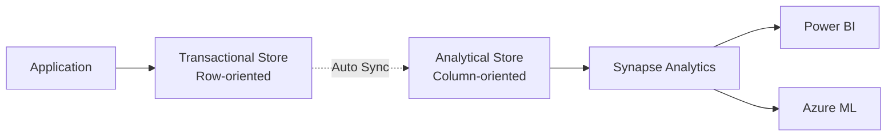

# 📈 Analytical Store (HTAP) in Azure Cosmos DB

> __🏠 [Home](../../../../README.md)__ | __📖 [Overview](../../../01-overview/README.md)__ | __🛠️ [Services](../../README.md)__ | __🗃️ Storage Services__ | __🌌 [Cosmos DB](README.md)__ | __📈 Analytical Store__


Run analytics on operational data without impacting transactional workloads using Azure Cosmos DB Analytical Store with Synapse Link.

---

## 🎯 Overview

Analytical Store is a column-oriented store that auto-syncs with the transactional store, enabling HTAP (Hybrid Transactional/Analytical Processing) scenarios.

### Benefits

- __No ETL Required__: Automatic sync from transactional to analytical store
- __No RU Impact__: Analytics don't consume RUs
- __Near Real-time__: Auto-sync within 2-5 minutes
- __Column Store__: Optimized for analytical queries

---

## 🏗️ Architecture



---

## 🚀 Enable Analytical Store

```bash
# Enable Synapse Link on account
az cosmosdb update \
  --name mycosmosaccount \
  --resource-group myresourcegroup \
  --enable-analytical-storage true

# Create container with analytical store
az cosmosdb sql container create \
  --account-name mycosmosaccount \
  --resource-group myresourcegroup \
  --database-name ecommerce \
  --name orders \
  --partition-key-path "/customerId" \
  --analytical-storage-ttl -1
```

### Query with Synapse Spark

```python
# Synapse Spark notebook
df = spark.read\
    .format("cosmos.olap")\
    .option("spark.synapse.linkedService", "CosmosDBLinkedService")\
    .option("spark.cosmos.container", "orders")\
    .load()

# Run analytics
df.createOrReplaceTempView("orders")
result = spark.sql("""
    SELECT customerId, COUNT(*) as order_count, SUM(total) as total_spent
    FROM orders
    GROUP BY customerId
    ORDER BY total_spent DESC
    LIMIT 100
""")

result.show()
```

### Query with Synapse SQL

```sql
-- Synapse serverless SQL pool
SELECT
    customerId,
    COUNT(*) as order_count,
    SUM(total) as total_revenue
FROM OPENROWSET(
    PROVIDER = 'CosmosDB',
    CONNECTION = '<connection-string>',
    OBJECT = 'orders',
    SERVER_CREDENTIAL = 'CosmosDBCredential'
) AS orders
GROUP BY customerId
ORDER BY total_revenue DESC;
```

---

## 🔗 Related Resources

- [Cosmos DB Overview](README.md)
- [Change Feed](change-feed.md)
- [Partitioning Strategies](partitioning-strategies.md)

---

*Last Updated: 2025-01-28*
