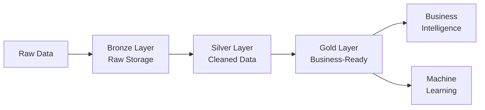

# 🏞️ Azure Data Lake Storage Gen2

> __🏠 [Home](../../../../README.md)__ | __📖 [Overview](../../../01-overview/README.md)__ | __🛠️ [Services](../../README.md)__ | __🗃️ Storage Services__ | __🏞️ ADLS Gen2__


Azure Data Lake Storage Gen2 is a highly scalable and secure data lake solution built on Azure Blob Storage with hierarchical namespace capabilities, optimized for big data analytics workloads.

---

## 🌟 Service Overview

Azure Data Lake Storage Gen2 (ADLS Gen2) converges the capabilities of Azure Data Lake Storage Gen1 with Azure Blob Storage. It provides a hierarchical file system while maintaining the scalability, security, and cost-effectiveness of Azure Blob Storage, making it the ideal foundation for enterprise data lakes.

### 🔥 Key Value Propositions

- __Hierarchical Namespace__: File and directory-level operations for performance and organization
- __Multi-Protocol Access__: Supports both Blob and Data Lake File System (DFS) APIs
- __Fine-Grained Security__: POSIX-compliant ACLs and Azure RBAC integration
- __Cost-Effective__: Same pricing as Blob Storage with added capabilities
- __Massive Scale__: Petabyte-scale storage with high throughput

---

## 🏗️ Architecture Overview

```mermaid
graph TB
    subgraph "Data Ingestion"
        Sources[Data Sources]
        ADF[Data Factory]
        Spark[Spark/Databricks]
        SDK[Azure SDKs]
    end

    subgraph "ADLS Gen2 Storage Account"
        subgraph "Hierarchical Namespace"
            Root[Root Container]
            Bronze[/bronze]
            Silver[/silver]
            Gold[/gold]
        end

        subgraph "Security Layers"
            RBAC[Azure RBAC]
            ACL[POSIX ACLs]
            SAS[Shared Access<br/>Signatures]
            Firewall[Network<br/>Security]
        end

        subgraph "Data Access Tiers"
            Hot[Hot Tier]
            Cool[Cool Tier]
            Archive[Archive Tier]
        end
    end

    subgraph "Analytics & Consumption"
        Synapse[Synapse Analytics]
        Databricks[Databricks]
        PowerBI[Power BI]
        AzureML[Azure ML]
    end

    Sources --> ADF
    ADF --> Root
    Spark --> Root
    SDK --> Root

    Root --> Bronze
    Bronze --> Silver
    Silver --> Gold

    RBAC -.-> Root
    ACL -.-> Root

    Gold --> Synapse
    Gold --> Databricks
    Gold --> PowerBI
    Gold --> AzureML
```

---

## 🛠️ Core Features

### 🌳 [Hierarchical Namespace](hierarchical-namespace.md)


True file system semantics with directory operations and atomic rename.

__Key Capabilities__:

- Directory-level operations (rename, delete, move)
- Atomic operations for ACID transactions
- Improved performance for big data workloads
- Better organization with folder hierarchies

__Best For__: Big data analytics, data lake implementations, file-based workloads

__[📖 Detailed Guide →](hierarchical-namespace.md)__

---

### 🔐 [Access Control](access-control.md)


Multi-layered security with RBAC, ACLs, and encryption.

__Security Features__:

- Azure RBAC for management operations
- POSIX ACLs for file/directory permissions
- Shared Access Signatures (SAS) for delegated access
- Azure AD integration for identity management

__Best For__: Enterprise security requirements, multi-tenant scenarios, fine-grained access

__[📖 Detailed Guide →](access-control.md)__

---

### ♻️ [Data Lifecycle Management](data-lifecycle.md)


Automated tiering and lifecycle policies for cost optimization.

__Lifecycle Features__:

- Rule-based tier transitions (Hot → Cool → Archive)
- Automated deletion of old data
- Last access time-based policies
- Blob snapshots and versions management

__Best For__: Long-term data retention, cost optimization, compliance requirements

__[📖 Detailed Guide →](data-lifecycle.md)__

---

### ⚡ [Performance Optimization](performance-optimization.md)


Techniques and best practices for maximizing performance.

__Optimization Areas__:

- Partitioning strategies
- File size optimization
- Parallel processing patterns
- Network throughput tuning

__Best For__: High-throughput workloads, large-scale processing, performance-critical applications

__[📖 Detailed Guide →](performance-optimization.md)__

---

## 🎯 Common Use Cases

### 🏗️ Modern Data Lake Architecture

Implement medallion architecture for enterprise data lakes.

__Architecture__: Bronze → Silver → Gold data zones
__Pattern__: [Medallion Architecture](../../../03-architecture-patterns/batch-architectures/medallion-architecture.md)



### 📊 Big Data Analytics

Foundation for Spark, Synapse, and Databricks workloads.

__Architecture__: ADLS Gen2 + Compute Engines
__Pattern__: [Data Lake Analytics](../../../03-architecture-patterns/batch-architectures/data-lake-analytics.md)

### 🔄 Hybrid Data Integration

Connect on-premises and cloud data sources.

__Architecture__: Data Factory + Private Link + ADLS Gen2
__Pattern__: [Hybrid Integration](../../../03-architecture-patterns/integration-patterns/hybrid-connectivity.md)

### 📦 Data Archival & Compliance

Long-term retention with cost-effective archival.

__Architecture__: Lifecycle Policies + Archive Tier
__Pattern__: [Data Retention Strategy](../../../05-best-practices/cross-cutting-concerns/data-governance/retention-policies.md)

---

## 📊 Pricing Guide

### 💰 Cost Components

| Component | Pricing Model | Key Factors | Optimization Tips |
|-----------|---------------|-------------|-------------------|
| __Storage__ | Per GB/month | Tier (Hot/Cool/Archive) | Use lifecycle policies |
| __Operations__ | Per 10,000 operations | Operation type | Batch operations |
| __Data Transfer__ | Per GB | Egress region | Use local processing |
| __Metadata__ | Included | - | No additional cost |

### 💡 Storage Tiers Comparison

| Tier | Use Case | Storage Cost | Access Cost | Minimum Duration |
|------|----------|--------------|-------------|------------------|
| __Hot__ | Frequently accessed data | Highest | Lowest | None |
| __Cool__ | Infrequently accessed (30+ days) | Lower | Higher | 30 days |
| __Archive__ | Rarely accessed (180+ days) | Lowest | Highest | 180 days |

### 🎯 Cost Optimization Strategies

1. __Implement Lifecycle Policies__: Auto-transition data to cooler tiers
2. __Optimize File Sizes__: Larger files reduce operation costs
3. __Use Local Redundancy__: LRS vs GRS based on requirements
4. __Monitor Access Patterns__: Identify candidates for tier changes
5. __Leverage Reserved Capacity__: Commit to 1-3 years for discounts

__[📖 Detailed Cost Guide →](../../../05-best-practices/cross-cutting-concerns/cost-optimization/storage-optimization.md)__

---

## 🚀 Quick Start Guide

### 1️⃣ Create Storage Account with Hierarchical Namespace

```bash
# Create resource group
az group create --name rg-datalake-demo --location eastus

# Create ADLS Gen2 storage account
az storage account create \
  --name adlsgen2demo \
  --resource-group rg-datalake-demo \
  --location eastus \
  --sku Standard_LRS \
  --kind StorageV2 \
  --enable-hierarchical-namespace true

# Create container (file system)
az storage fs create \
  --name datalake \
  --account-name adlsgen2demo
```

### 2️⃣ Create Directory Structure

```bash
# Create medallion architecture folders
az storage fs directory create --name bronze --file-system datalake --account-name adlsgen2demo
az storage fs directory create --name silver --file-system datalake --account-name adlsgen2demo
az storage fs directory create --name gold --file-system datalake --account-name adlsgen2demo
```

### 3️⃣ Set Access Control Lists (ACLs)

```bash
# Assign permissions to a user
az storage fs access set \
  --acl "user:user@domain.com:rwx" \
  --path bronze \
  --file-system datalake \
  --account-name adlsgen2demo

# Set default ACL for new items
az storage fs access set \
  --acl "default:user:user@domain.com:rwx" \
  --path bronze \
  --file-system datalake \
  --account-name adlsgen2demo
```

### 4️⃣ Upload Data with Python SDK

```python
from azure.storage.filedatalake import DataLakeServiceClient
from azure.identity import DefaultAzureCredential

# Initialize client
credential = DefaultAzureCredential()
service_client = DataLakeServiceClient(
    account_url="https://adlsgen2demo.dfs.core.windows.net",
    credential=credential
)

# Get file system client
file_system_client = service_client.get_file_system_client("datalake")

# Upload file
file_client = file_system_client.get_file_client("bronze/sales/data.csv")
with open("local_data.csv", "rb") as data:
    file_client.upload_data(data, overwrite=True)

print("File uploaded successfully!")
```

### 5️⃣ Query Data with Synapse Serverless SQL

```sql
-- Create external data source
CREATE EXTERNAL DATA SOURCE DataLake
WITH (
    LOCATION = 'https://adlsgen2demo.dfs.core.windows.net/datalake'
);

-- Query CSV files
SELECT TOP 100 *
FROM OPENROWSET(
    BULK 'bronze/sales/*.csv',
    DATA_SOURCE = 'DataLake',
    FORMAT = 'CSV',
    PARSER_VERSION = '2.0',
    HEADER_ROW = TRUE
) AS sales_data;
```

---

## 🔧 Configuration & Management

### 🛡️ Security Best Practices

__Recommended Security Configuration__:

1. __Enable Azure AD Authentication__: Use managed identities
2. __Implement Network Security__: Private endpoints and firewalls
3. __Use Customer-Managed Keys__: For encryption at rest
4. __Enable Soft Delete__: Protect against accidental deletion
5. __Configure Access Logging__: Monitor all access patterns

```python
# Example: Configure firewall rules
from azure.mgmt.storage import StorageManagementClient

# Update network rules
storage_client.storage_accounts.update(
    resource_group_name="rg-datalake",
    account_name="adlsgen2demo",
    parameters={
        "properties": {
            "networkAcls": {
                "defaultAction": "Deny",
                "ipRules": [{"value": "203.0.113.0/24"}],
                "virtualNetworkRules": [],
                "bypass": "AzureServices"
            }
        }
    }
)
```

__[📖 Security Guide →](../../../05-best-practices/cross-cutting-concerns/security/storage-security.md)__

### ⚡ Performance Tuning

__Key Performance Factors__:

- __File Size__: Optimal range is 256MB - 1GB
- __Partitioning__: Use partition columns for filtering
- __Parallel Operations__: Leverage multi-threading for uploads/downloads
- __Network Proximity__: Co-locate compute and storage

```python
# Example: Parallel file upload
from concurrent.futures import ThreadPoolExecutor
import os

def upload_file(file_path, destination_path):
    file_client = file_system_client.get_file_client(destination_path)
    with open(file_path, "rb") as data:
        file_client.upload_data(data, overwrite=True)
    return f"Uploaded {file_path}"

# Upload multiple files in parallel
files = ["file1.csv", "file2.csv", "file3.csv"]
with ThreadPoolExecutor(max_workers=10) as executor:
    results = executor.map(
        lambda f: upload_file(f, f"bronze/{os.path.basename(f)}"),
        files
    )
    for result in results:
        print(result)
```

__[📖 Performance Guide →](performance-optimization.md)__

### 📊 Monitoring & Diagnostics

__Key Metrics to Monitor__:

- __Availability__: Storage account uptime
- __Latency__: End-to-end and server latency
- __Transactions__: Success rate and error types
- __Capacity__: Used capacity and growth trends

```python
# Example: Query metrics with Azure Monitor
from azure.mgmt.monitor import MonitorManagementClient

monitor_client = MonitorManagementClient(credential, subscription_id)

metrics = monitor_client.metrics.list(
    resource_uri=f"/subscriptions/{subscription_id}/resourceGroups/rg-datalake/providers/Microsoft.Storage/storageAccounts/adlsgen2demo",
    timespan="PT1H",
    interval="PT5M",
    metricnames="Transactions,Availability,SuccessE2ELatency",
    aggregation="Average"
)

for metric in metrics.value:
    print(f"{metric.name.value}: {metric.timeseries[0].data}")
```

__[📖 Monitoring Guide →](../../../09-monitoring/service-monitoring/storage/README.md)__

---

## 🔗 Integration Patterns

### Azure Synapse Analytics Integration

Direct integration for serverless and dedicated SQL pools.

```sql
-- Create external table in Synapse
CREATE EXTERNAL TABLE SalesData (
    SaleID INT,
    Product NVARCHAR(100),
    Amount DECIMAL(10,2),
    SaleDate DATE
)
WITH (
    LOCATION = 'gold/sales/',
    DATA_SOURCE = DataLake,
    FILE_FORMAT = ParquetFormat
);

-- Query external data
SELECT Product, SUM(Amount) as TotalSales
FROM SalesData
WHERE SaleDate >= '2024-01-01'
GROUP BY Product;
```

### Azure Databricks Integration

Mount ADLS Gen2 for Spark processing.

```python
# Mount ADLS Gen2 in Databricks
configs = {
    "fs.azure.account.auth.type": "OAuth",
    "fs.azure.account.oauth.provider.type": "org.apache.hadoop.fs.azurebfs.oauth2.ClientCredsTokenProvider",
    "fs.azure.account.oauth2.client.id": "<client-id>",
    "fs.azure.account.oauth2.client.secret": "<client-secret>",
    "fs.azure.account.oauth2.client.endpoint": "https://login.microsoftonline.com/<tenant-id>/oauth2/token"
}

dbutils.fs.mount(
    source="abfss://datalake@adlsgen2demo.dfs.core.windows.net/",
    mount_point="/mnt/datalake",
    extra_configs=configs
)

# Read data using Spark
df = spark.read.format("delta").load("/mnt/datalake/gold/sales")
df.show()
```

### Azure Data Factory Integration

Build ETL pipelines with ADLS Gen2 as source and sink.

```json
{
    "name": "CopyToDataLake",
    "type": "Copy",
    "inputs": [{
        "referenceName": "SourceDataset",
        "type": "DatasetReference"
    }],
    "outputs": [{
        "referenceName": "ADLSGen2Dataset",
        "type": "DatasetReference"
    }],
    "typeProperties": {
        "source": {
            "type": "SqlServerSource"
        },
        "sink": {
            "type": "ParquetSink",
            "storeSettings": {
                "type": "AzureBlobFSWriteSettings",
                "copyBehavior": "PreserveHierarchy"
            }
        }
    }
}
```

__[📖 Integration Examples →](../../../04-implementation-guides/integration-scenarios/README.md)__

---

## 📚 Learning Resources

### 🎓 __Getting Started__

- [__ADLS Gen2 Quick Start__](../../../tutorials/beginner/adls-gen2-quickstart.md)
- [__Hierarchical Namespace Tutorial__](hierarchical-namespace.md)
- [__Security Configuration Guide__](access-control.md)

### 📖 __Deep Dive Guides__

- [__Architecture Patterns__](../../../03-architecture-patterns/README.md)
- [__Best Practices__](../../../05-best-practices/service-specific/storage/README.md)
- [__Code Examples__](../../../06-code-examples/by-service/storage/README.md)

### 🔧 __Advanced Topics__

- [__Multi-Region Replication__](../../../reference/storage/geo-replication.md)
- [__Custom Domain Configuration__](../../../reference/storage/custom-domains.md)
- [__Disaster Recovery__](../../../05-best-practices/operational-excellence/disaster-recovery.md)

---

## 🆘 Troubleshooting

### 🔍 Common Issues

- [__Connection & Access Issues__](../../../07-troubleshooting/service-troubleshooting/storage/connectivity.md)
- [__Performance Problems__](../../../07-troubleshooting/service-troubleshooting/storage/performance.md)
- [__ACL Configuration Errors__](../../../07-troubleshooting/service-troubleshooting/storage/permissions.md)

### 📞 Getting Help

- __Azure Support__: Create support ticket in Azure Portal
- __Community Forums__: Microsoft Q&A, Stack Overflow
- __Documentation__: Microsoft Learn official docs
- __GitHub__: Azure SDK issues and samples

__[📖 Troubleshooting Guide →](../../../07-troubleshooting/service-troubleshooting/storage/README.md)__

---

## 🔗 Related Resources

### __Microsoft Documentation__

- [ADLS Gen2 Official Docs](https://learn.microsoft.com/azure/storage/blobs/data-lake-storage-introduction)
- [Best Practices for Data Lake](https://learn.microsoft.com/azure/storage/blobs/data-lake-storage-best-practices)
- [Security Hardening Guide](https://learn.microsoft.com/azure/storage/blobs/security-recommendations)

### __Architecture Guidance__

- [Cloud Adoption Framework - Data Lake](https://learn.microsoft.com/azure/cloud-adoption-framework/scenarios/data-management/)
- [Azure Architecture Center - Analytics](https://learn.microsoft.com/azure/architecture/solution-ideas/articles/advanced-analytics-on-big-data)

---

*Last Updated: 2025-01-28*
*Service Version: General Availability*
*Documentation Status: Complete*
