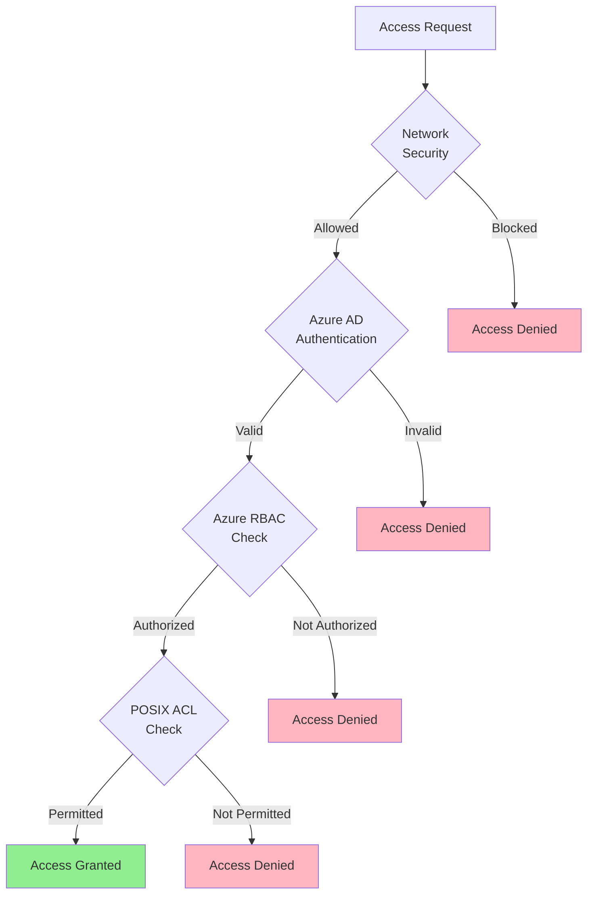

# 🔐 Access Control in ADLS Gen2

> __🏠 [Home](../../../../README.md)__ | __📖 [Overview](../../../01-overview/README.md)__ | __🛠️ [Services](../../README.md)__ | __🗃️ Storage Services__ | __🏞️ [ADLS Gen2](README.md)__ | __🔐 Access Control__


ADLS Gen2 provides multiple layers of security controls including Azure RBAC, POSIX-compliant ACLs, and Shared Access Signatures, enabling fine-grained access management for enterprise data lakes.

---

## 🎯 Access Control Overview

ADLS Gen2 implements a defense-in-depth security model with multiple authorization mechanisms that work together to provide comprehensive access control.

### 🔑 Security Layers



---

## 🛡️ Azure Role-Based Access Control (RBAC)

### Built-in Roles for Storage

| Role | Permissions | Use Case |
|------|------------|----------|
| __Storage Blob Data Owner__ | Full access including ACL management | Data lake administrators |
| __Storage Blob Data Contributor__ | Read, write, delete blobs | Data engineers, ETL processes |
| __Storage Blob Data Reader__ | Read blobs and list containers | Analytics users, BI tools |
| __Reader__ | View storage account properties | Monitoring, auditing |

### Assigning RBAC Roles

#### Using Azure CLI

```bash
# Assign Storage Blob Data Contributor to a user
az role assignment create \
  --role "Storage Blob Data Contributor" \
  --assignee user@domain.com \
  --scope "/subscriptions/<subscription-id>/resourceGroups/<resource-group>/providers/Microsoft.Storage/storageAccounts/<storage-account>"

# Assign at container level
az role assignment create \
  --role "Storage Blob Data Reader" \
  --assignee service-principal-id \
  --scope "/subscriptions/<subscription-id>/resourceGroups/<resource-group>/providers/Microsoft.Storage/storageAccounts/<storage-account>/blobServices/default/containers/datalake"

# List role assignments
az role assignment list \
  --scope "/subscriptions/<subscription-id>/resourceGroups/<resource-group>/providers/Microsoft.Storage/storageAccounts/<storage-account>" \
  --output table
```

#### Using PowerShell

```powershell
# Assign role to a group
New-AzRoleAssignment `
  -ObjectId <group-object-id> `
  -RoleDefinitionName "Storage Blob Data Contributor" `
  -Scope "/subscriptions/<subscription-id>/resourceGroups/<resource-group>/providers/Microsoft.Storage/storageAccounts/<storage-account>"

# Remove role assignment
Remove-AzRoleAssignment `
  -ObjectId <user-object-id> `
  -RoleDefinitionName "Storage Blob Data Reader" `
  -Scope "/subscriptions/<subscription-id>/resourceGroups/<resource-group>/providers/Microsoft.Storage/storageAccounts/<storage-account>"
```

#### Using Python SDK

```python
from azure.mgmt.authorization import AuthorizationManagementClient
from azure.identity import DefaultAzureCredential
import uuid

credential = DefaultAzureCredential()
auth_client = AuthorizationManagementClient(
    credential=credential,
    subscription_id="<subscription-id>"
)

# Define scope
scope = "/subscriptions/<subscription-id>/resourceGroups/<resource-group>/providers/Microsoft.Storage/storageAccounts/<storage-account>"

# Get role definition ID for Storage Blob Data Contributor
role_name = "Storage Blob Data Contributor"
role_definitions = auth_client.role_definitions.list(scope)
role_definition_id = next(
    (role.id for role in role_definitions if role.role_name == role_name),
    None
)

# Create role assignment
role_assignment = auth_client.role_assignments.create(
    scope=scope,
    role_assignment_name=str(uuid.uuid4()),
    parameters={
        "role_definition_id": role_definition_id,
        "principal_id": "<user-or-service-principal-object-id>"
    }
)

print(f"Role assigned: {role_assignment.id}")
```

---

## 🔒 POSIX Access Control Lists (ACLs)

### ACL Types

ADLS Gen2 supports two types of ACLs:

1. __Access ACLs__: Control access to specific objects
2. __Default ACLs__: Template for new child objects in a directory

### ACL Permissions

| Permission | Symbol | Files | Directories |
|-----------|--------|-------|------------|
| __Read__ | `r` | Read file contents | List directory contents |
| __Write__ | `w` | Modify file | Create/delete items in directory |
| __Execute__ | `x` | Execute file | Traverse directory |

### ACL Entry Format

```text
[scope:][type]:[id]:[permissions]

Examples:
user::rwx              # Owning user
user:john@contoso.com:r-x    # Specific user
group::r--             # Owning group
group:analysts:r-x     # Specific group
other::---             # Others
mask::r-x              # Effective permissions mask
```

### Setting ACLs

#### Using Azure CLI

```bash
# Set ACL on a directory
az storage fs access set \
  --acl "user::rwx,group::r-x,other::---,user:john@contoso.com:rwx" \
  --path bronze/sales \
  --file-system datalake \
  --account-name mystorageaccount

# Set default ACL (inherited by new items)
az storage fs access set \
  --acl "default:user::rwx,default:group::r-x,default:other::---" \
  --path bronze/sales \
  --file-system datalake \
  --account-name mystorageaccount

# Update ACL (modify specific entry)
az storage fs access update \
  --acl "user:jane@contoso.com:r-x" \
  --path bronze/sales \
  --file-system datalake \
  --account-name mystorageaccount

# Remove ACL entry
az storage fs access remove \
  --acl "user:john@contoso.com" \
  --path bronze/sales \
  --file-system datalake \
  --account-name mystorageaccount

# View current ACLs
az storage fs access show \
  --path bronze/sales \
  --file-system datalake \
  --account-name mystorageaccount
```

#### Using Python SDK

```python
from azure.storage.filedatalake import DataLakeServiceClient
from azure.identity import DefaultAzureCredential

credential = DefaultAzureCredential()
service_client = DataLakeServiceClient(
    account_url="https://mystorageaccount.dfs.core.windows.net",
    credential=credential
)

file_system_client = service_client.get_file_system_client("datalake")
directory_client = file_system_client.get_directory_client("bronze/sales")

# Set access ACL
acl = "user::rwx,group::r-x,other::---,user:john@contoso.com:rwx"
directory_client.set_access_control(acl=acl)

# Set default ACL
default_acl = "default:user::rwx,default:group::r-x,default:other::---"
directory_client.set_access_control(acl=default_acl)

# Get current ACL
acl_props = directory_client.get_access_control()
print(f"Owner: {acl_props['owner']}")
print(f"Group: {acl_props['group']}")
print(f"Permissions: {acl_props['permissions']}")
print(f"ACL: {acl_props['acl']}")

# Update ACL - add user
current_acl = acl_props['acl']
new_acl = f"{current_acl},user:jane@contoso.com:r-x"
directory_client.set_access_control(acl=new_acl)

# Recursive ACL update
directory_client.set_access_control_recursive(acl="user:john@contoso.com:rwx")
```

#### Using .NET SDK

```csharp
using Azure.Storage.Files.DataLake;
using Azure.Storage.Files.DataLake.Models;
using Azure.Identity;

var credential = new DefaultAzureCredential();
var serviceClient = new DataLakeServiceClient(
    new Uri("https://mystorageaccount.dfs.core.windows.net"),
    credential
);

var fileSystemClient = serviceClient.GetFileSystemClient("datalake");
var directoryClient = fileSystemClient.GetDirectoryClient("bronze/sales");

// Set access ACL
var acl = "user::rwx,group::r-x,other::---,user:john@contoso.com:rwx";
await directoryClient.SetAccessControlListAsync(
    PathAccessControlItem.ParseAccessControlList(acl)
);

// Set default ACL
var defaultAcl = "default:user::rwx,default:group::r-x,default:other::---";
await directoryClient.SetAccessControlListAsync(
    PathAccessControlItem.ParseAccessControlList(defaultAcl)
);

// Get current ACL
var accessControl = await directoryClient.GetAccessControlAsync();
Console.WriteLine($"Owner: {accessControl.Value.Owner}");
Console.WriteLine($"Group: {accessControl.Value.Group}");
Console.WriteLine($"Permissions: {accessControl.Value.Permissions}");

foreach (var aclItem in accessControl.Value.AccessControlList)
{
    Console.WriteLine($"ACL Entry: {aclItem}");
}
```

---

## 🔑 Shared Access Signatures (SAS)

### SAS Token Types

1. __User Delegation SAS__: Secured with Azure AD credentials (recommended)
2. __Account SAS__: Secured with storage account key
3. __Service SAS__: Limited to specific services

### Generating SAS Tokens

#### User Delegation SAS (Recommended)

```python
from azure.storage.filedatalake import DataLakeServiceClient, generate_file_sas
from azure.storage.filedatalake import FileSasPermissions
from azure.identity import DefaultAzureCredential
from datetime import datetime, timedelta

credential = DefaultAzureCredential()
service_client = DataLakeServiceClient(
    account_url="https://mystorageaccount.dfs.core.windows.net",
    credential=credential
)

# Get user delegation key
user_delegation_key = service_client.get_user_delegation_key(
    key_start_time=datetime.utcnow(),
    key_expiry_time=datetime.utcnow() + timedelta(hours=1)
)

# Generate SAS token for a file
file_system_client = service_client.get_file_system_client("datalake")
file_client = file_system_client.get_file_client("gold/sales/report.csv")

sas_token = generate_file_sas(
    account_name="mystorageaccount",
    file_system_name="datalake",
    directory_name="gold/sales",
    file_name="report.csv",
    user_delegation_key=user_delegation_key,
    permission=FileSasPermissions(read=True),
    expiry=datetime.utcnow() + timedelta(hours=1)
)

# Construct full URL with SAS
file_url_with_sas = f"{file_client.url}?{sas_token}"
print(f"File URL with SAS: {file_url_with_sas}")
```

#### Account SAS

```python
from azure.storage.blob import generate_account_sas, ResourceTypes, AccountSasPermissions

# Generate account-level SAS
account_sas_token = generate_account_sas(
    account_name="mystorageaccount",
    account_key="<account-key>",
    resource_types=ResourceTypes(service=True, container=True, object=True),
    permission=AccountSasPermissions(read=True, list=True),
    expiry=datetime.utcnow() + timedelta(hours=1)
)

# Use SAS token
sas_url = f"https://mystorageaccount.blob.core.windows.net/?{account_sas_token}"
```

### SAS Best Practices

```python
def create_limited_sas(
    file_path: str,
    permissions: str = "r",
    duration_hours: int = 1,
    ip_range: str = None
) -> str:
    """Create a limited-scope SAS token with best practices."""
    from azure.storage.filedatalake import DataLakeServiceClient, generate_file_sas
    from azure.storage.filedatalake import FileSasPermissions
    from azure.identity import DefaultAzureCredential
    from datetime import datetime, timedelta

    credential = DefaultAzureCredential()
    service_client = DataLakeServiceClient(
        account_url="https://mystorageaccount.dfs.core.windows.net",
        credential=credential
    )

    # Get user delegation key (more secure than account key)
    start_time = datetime.utcnow()
    expiry_time = start_time + timedelta(hours=duration_hours)

    user_delegation_key = service_client.get_user_delegation_key(
        key_start_time=start_time,
        key_expiry_time=expiry_time
    )

    # Parse file path
    parts = file_path.split("/", 1)
    file_system_name = parts[0]
    file_path_in_fs = parts[1] if len(parts) > 1 else ""

    # Set permissions
    sas_permissions = FileSasPermissions(
        read="r" in permissions,
        write="w" in permissions,
        delete="d" in permissions
    )

    # Generate SAS token
    sas_token = generate_file_sas(
        account_name="mystorageaccount",
        file_system_name=file_system_name,
        file_name=file_path_in_fs,
        user_delegation_key=user_delegation_key,
        permission=sas_permissions,
        expiry=expiry_time,
        start=start_time,
        ip=ip_range  # Restrict to specific IP range
    )

    return sas_token

# Usage
sas_token = create_limited_sas(
    file_path="datalake/gold/sales/report.csv",
    permissions="r",
    duration_hours=2,
    ip_range="203.0.113.0/24"  # Restrict to specific network
)
```

---

## 🏢 Common Access Control Patterns

### Multi-tenant Data Isolation

```python
def setup_tenant_isolation(tenant_id: str):
    """Set up isolated access for a tenant."""
    from azure.storage.filedatalake import DataLakeServiceClient
    from azure.identity import DefaultAzureCredential

    credential = DefaultAzureCredential()
    service_client = DataLakeServiceClient(
        account_url="https://mystorageaccount.dfs.core.windows.net",
        credential=credential
    )

    file_system_client = service_client.get_file_system_client("multi-tenant")

    # Create tenant directory
    tenant_dir = file_system_client.get_directory_client(f"tenant-{tenant_id}")
    tenant_dir.create_directory()

    # Set ACLs - only tenant's service principal can access
    acl = f"user::rwx,group::---,other::---,user:tenant-{tenant_id}@app:rwx"
    tenant_dir.set_access_control(acl=acl)

    # Set default ACL for inheritance
    default_acl = f"default:user::rwx,default:group::---,default:other::---,default:user:tenant-{tenant_id}@app:rwx"
    tenant_dir.set_access_control(acl=default_acl)

    # Create standard subdirectories with inherited permissions
    for subdir in ["raw", "processed", "analytics"]:
        sub_directory = tenant_dir.get_sub_directory_client(subdir)
        sub_directory.create_directory()

    print(f"Tenant {tenant_id} isolation configured")

# Usage
setup_tenant_isolation("ABC123")
```

### Role-based Directory Access

```python
def configure_role_based_access():
    """Configure access based on organizational roles."""
    from azure.storage.filedatalake import DataLakeServiceClient
    from azure.identity import DefaultAzureCredential

    credential = DefaultAzureCredential()
    service_client = DataLakeServiceClient(
        account_url="https://mystorageaccount.dfs.core.windows.net",
        credential=credential
    )

    file_system_client = service_client.get_file_system_client("datalake")

    # Bronze layer - Data Engineers have write access
    bronze_dir = file_system_client.get_directory_client("bronze")
    bronze_acl = "user::rwx,group:data-engineers@contoso.com:rwx,group:analysts@contoso.com:r-x,other::---"
    bronze_dir.set_access_control(acl=bronze_acl)

    # Silver layer - Data Engineers write, Analysts read
    silver_dir = file_system_client.get_directory_client("silver")
    silver_acl = "user::rwx,group:data-engineers@contoso.com:rwx,group:analysts@contoso.com:r-x,other::---"
    silver_dir.set_access_control(acl=silver_acl)

    # Gold layer - Analysts read, restricted write
    gold_dir = file_system_client.get_directory_client("gold")
    gold_acl = "user::rwx,group:data-engineers@contoso.com:rwx,group:analysts@contoso.com:r-x,group:executives@contoso.com:r-x,other::---"
    gold_dir.set_access_control(acl=gold_acl)

    print("Role-based access configured")

# Usage
configure_role_based_access()
```

---

## 🔍 Monitoring Access

### Audit Logging

```python
def enable_diagnostic_logging():
    """Enable diagnostic logging for access monitoring."""
    from azure.mgmt.monitor import MonitorManagementClient
    from azure.mgmt.monitor.models import DiagnosticSettingsResource, LogSettings
    from azure.identity import DefaultAzureCredential

    credential = DefaultAzureCredential()
    monitor_client = MonitorManagementClient(
        credential=credential,
        subscription_id="<subscription-id>"
    )

    storage_account_id = "/subscriptions/<subscription-id>/resourceGroups/<resource-group>/providers/Microsoft.Storage/storageAccounts/<storage-account>"

    # Configure diagnostic settings
    diagnostic_settings = DiagnosticSettingsResource(
        logs=[
            LogSettings(
                category="StorageRead",
                enabled=True,
                retention_policy={"enabled": True, "days": 90}
            ),
            LogSettings(
                category="StorageWrite",
                enabled=True,
                retention_policy={"enabled": True, "days": 90}
            ),
            LogSettings(
                category="StorageDelete",
                enabled=True,
                retention_policy={"enabled": True, "days": 90}
            )
        ],
        workspace_id="/subscriptions/<subscription-id>/resourceGroups/<resource-group>/providers/Microsoft.OperationalInsights/workspaces/<workspace>"
    )

    monitor_client.diagnostic_settings.create_or_update(
        resource_uri=storage_account_id,
        name="AccessAuditLogs",
        parameters=diagnostic_settings
    )

    print("Diagnostic logging enabled")
```

---

## 💡 Best Practices

### ✅ Security Best Practices

1. __Use Azure AD Authentication__: Prefer Azure AD over shared keys
2. __Apply Principle of Least Privilege__: Grant minimal required permissions
3. __Use User Delegation SAS__: More secure than account key SAS
4. __Implement Network Security__: Use private endpoints and firewalls
5. __Enable Audit Logging__: Monitor all access activities
6. __Rotate Keys Regularly__: If using account keys, rotate frequently
7. __Use Default ACLs__: Ensure new objects inherit proper permissions

### ❌ Security Anti-patterns

1. __Sharing Account Keys__: Never share storage account keys
2. __Overly Permissive ACLs__: Avoid `other::rwx` permissions
3. __Long-lived SAS Tokens__: Keep expiration times short
4. __Public Access__: Never enable anonymous public access for data lakes
5. __Ignoring Audit Logs__: Review access logs regularly

---

## 🔗 Related Resources

- [Hierarchical Namespace Overview](hierarchical-namespace.md)
- [Performance Optimization](performance-optimization.md)
- [Data Lifecycle Management](data-lifecycle.md)
- [Security Best Practices](../../../05-best-practices/cross-cutting-concerns/security/storage-security.md)

---

*Last Updated: 2025-01-28*
*Documentation Status: Complete*
